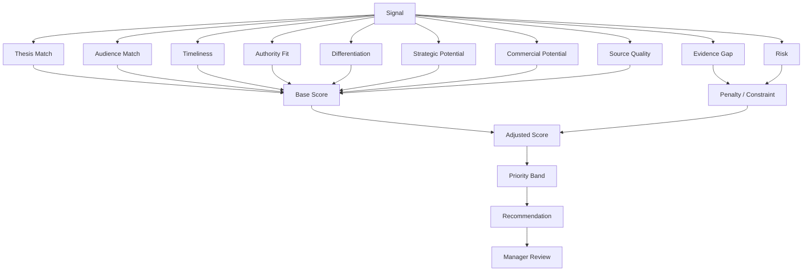
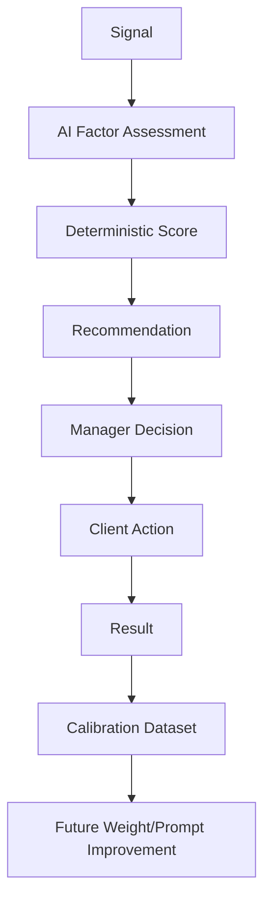
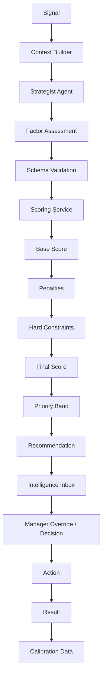

# POSTURA — FASE 12
## Documento 12 de 16 — Sistema de Scoring, Priorización y Recomendaciones Estratégicas

**Código:** POSTURA-F12-D12  
**Versión:** 1.0  
**Estado:** Especificación funcional, algorítmica y operativa para implementación  
**Tipo de documento:** Scoring, Ranking, Explainability, Recomendaciones, Calibration y Manager Override  
**Proyecto:** Postura — Positioning Intelligence & Management System  
**Formato:** Markdown  
**Ámbito:** MVP web-first + Electron, Firebase, OpenAI/Claude, Intelligence Inbox, Manager + Cliente

---

# 1. Propósito del documento

Este documento define cómo Postura evaluará, priorizará y recomendará acciones a partir de Signals.

El objetivo no es producir un número decorativo.

El objetivo es responder:

> ¿Qué tan útil es esta Signal para avanzar una Tesis de Posicionamiento concreta, para una audiencia concreta, en este momento, con la evidencia y autoridad realmente disponibles?

El sistema debe convertir una gran cantidad de información potencial en una lista pequeña de decisiones estratégicas.

---

# 2. Principio rector

Postura no debe priorizar una Signal porque:

```text
es viral
es nueva
aparece en muchos medios
tiene muchas menciones
```

sino porque existe una combinación suficiente de:

```text
ALINEACIÓN CON TESIS
+
RELEVANCIA PARA AUDIENCIA
+
MOMENTO
+
AUTORIDAD DEL CLIENTE
+
CAPACIDAD DE DIFERENCIACIÓN
+
POTENCIAL ESTRATÉGICO
+
CALIDAD DE FUENTE
-
RIESGO
```

---

# 3. Resultado esperado del Scoring

Cada análisis estratégico deberá producir como mínimo:

```text
Overall Score
Priority Band
Factor Scores
Risk Level
Evidence Status
Why It Matters
Recommended Action
Alternative Action
Warnings
Human Review Requirement
```

---

# 4. Arquitectura del scoring



---

# 5. Naturaleza híbrida del sistema

El scoring combinará:

```text
REGLAS DETERMINÍSTICAS
+
ANÁLISIS LLM
+
DECISIÓN HUMANA
```

No será:

```text
LLM inventa un número
```

---

# 6. Escala normalizada

Cada factor tendrá un valor interno entre:

```text
0.0 y 1.0
```

La UI podrá mostrar:

```text
0–100
```

---

# 7. Factores principales

El modelo MVP utilizará ocho factores positivos principales:

| Código | Factor | Peso inicial |
|---|---|---:|
| SC-01 | Thesis Match | 25% |
| SC-02 | Audience Match | 20% |
| SC-03 | Timeliness | 15% |
| SC-04 | Authority Fit | 15% |
| SC-05 | Differentiation | 10% |
| SC-06 | Strategic Potential | 7.5% |
| SC-07 | Commercial Potential | 2.5% |
| SC-08 | Source Quality | 5% |
|  | **Total base** | **100%** |

Los pesos son configurables y deberán calibrarse con el piloto.

---

# 8. Fórmula base

```text
BaseScore =
(ThesisMatch × 0.25)
+
(AudienceMatch × 0.20)
+
(Timeliness × 0.15)
+
(AuthorityFit × 0.15)
+
(Differentiation × 0.10)
+
(StrategicPotential × 0.075)
+
(CommercialPotential × 0.025)
+
(SourceQuality × 0.05)
```

Después:

```text
BaseScore100 = BaseScore × 100
```

---

# 9. Penalizaciones

El Score final deberá poder reducirse por:

```text
Risk Penalty
Evidence Gap Penalty
Staleness Penalty
Conflict Penalty
```

No todas se aplican siempre.

---

# 10. Fórmula ajustada

Conceptualmente:

```text
AdjustedScore =
BaseScore100
- RiskPenalty
- EvidenceGapPenalty
- StalenessPenalty
- ConflictPenalty
```

Luego:

```text
FinalScore = clamp(AdjustedScore, 0, 100)
```

---

# 11. No falsa precisión

Aunque el sistema calcule:

```text
87.43
```

la UI puede mostrar:

```text
87
```

El número no representa una verdad científica.

Representa una estimación estratégica estructurada.

---

# 12. SC-01 — Thesis Match

Peso inicial:

```text
25%
```

Pregunta:

> ¿Qué tan directamente conecta esta Signal con la Tesis activa?

---

# 13. Thesis Match — guía

```text
0.0 → no relacionada
0.25 → relación tangencial
0.50 → relación parcial
0.75 → claramente relacionada
1.0 → directamente central
```

---

# 14. Ejemplo

Tesis:

```text
AI Governance for Enterprise Legal Teams
```

Signal:

```text
Nueva obligación sobre governance de modelos empresariales
```

Resultado:

```text
Thesis Match ≈ 0.95
```

---

# 15. Signal tangencial

Signal:

```text
Nuevo teléfono con funciones de IA
```

Resultado posible:

```text
0.10–0.25
```

aunque sea tendencia global.

---

# 16. Regla

Thesis Match es el factor individual de mayor peso.

---

# 17. SC-02 — Audience Match

Peso:

```text
20%
```

Pregunta:

> ¿A la audiencia objetivo de la Tesis le importa realmente esta Signal?

---

# 18. Audience Match levels

```text
0.0 → audiencia no relacionada
0.25 → interés indirecto
0.50 → interés moderado
0.75 → interés claro
1.0 → afecta directamente a la audiencia
```

---

# 19. Audience directness

Una Signal que afecta decisiones de:

```text
General Counsel
```

tendrá más peso para una Tesis dirigida a General Counsel que una Signal popular entre consumidores generales.

---

# 20. Audience Match no es popularity

Important.

---

# 21. SC-03 — Timeliness

Peso:

```text
15%
```

Pregunta:

> ¿Existe una razón estratégica para actuar ahora?

---

# 22. Timeliness inputs

Puede considerar:

```text
publishedAt
capturedAt
deadlineAt
event date
regulatory effective date
trend acceleration
campaign timing
```

---

# 23. Timeliness levels

```text
1.0 → acción inmediata aporta ventaja
0.75 → ventana activa
0.50 → relevante pero no urgente
0.25 → mayormente evergreen
0.0 → fuera de ventana / obsoleta
```

---

# 24. Evergreen exception

Una Source antigua puede recibir Timeliness razonable si sigue siendo central para una investigación.

---

# 25. Deadline boost

Una oportunidad con deadline cercano puede elevar Timeliness.

Pero:

```text
deadline cercano ≠ relevancia estratégica alta
```

---

# 26. SC-04 — Authority Fit

Peso:

```text
15%
```

Pregunta:

> ¿El Cliente tiene legitimidad real para intervenir en este tema?

---

# 27. Authority Fit inputs

```text
confirmed expertise
Evidence Vault
career
publications
projects
certifications
prior content
current role
```

---

# 28. Authority levels

```text
1.0 → experiencia fuerte y demostrable
0.75 → experiencia clara
0.50 → conocimiento relacionado
0.25 → interés / autoridad en construcción
0.0 → sin base suficiente
```

---

# 29. Critical rule

Un tema puede tener:

```text
Thesis Match = HIGH
```

pero:

```text
Authority Fit = LOW
```

Esto debe reducir el Score y generar Evidence Gap.

---

# 30. SC-05 — Differentiation

Peso:

```text
10%
```

Pregunta:

> ¿Puede el Cliente aportar algo que no sea una repetición genérica?

---

# 31. Sources of differentiation

```text
unique experience
cross-domain knowledge
unusual market perspective
specific project experience
contrarian but defensible view
practical implementation knowledge
jurisdictional knowledge
```

---

# 32. Differentiation low

Cuando la única salida posible es:

```text
"Esta noticia es importante y la IA está cambiando el mundo."
```

---

# 33. Differentiation high

Cuando puede decir:

```text
"Las empresas están tratando esto como un problema de compliance,
pero el verdadero riesgo operativo aparece antes,
en la definición de quién tiene autoridad sobre el modelo."
```

respaldado por experiencia y evidencia.

---

# 34. SC-06 — Strategic Potential

Peso:

```text
7.5%
```

Pregunta:

> ¿Puede esta Signal generar un activo de autoridad u oportunidad relevante?

---

# 35. Strategic outcomes

```text
thought leadership
media relevance
speaking
research
networking
authority asset
industry participation
professional credibility
```

---

# 36. SC-07 — Commercial Potential

Peso inicial:

```text
2.5%
```

Pregunta:

> ¿Puede esta Signal contribuir razonablemente a una oportunidad comercial coherente con la Tesis?

---

# 37. Low weight by design

Postura no debe convertir todo en venta.

El posicionamiento requiere autoridad antes de presión comercial.

---

# 38. Commercial signals

Ejemplos:

```text
new compliance obligation
new market need
company adoption problem
industry pain point
new legal risk
```

---

# 39. No lead hallucination

El modelo no puede afirmar:

```text
"this will generate clients"
```

Puede indicar:

```text
"commercial relevance appears moderate/high because..."
```

---

# 40. SC-08 — Source Quality

Peso:

```text
5%
```

Pregunta:

> ¿Qué tan útil y confiable es la Source para sostener el análisis?

---

# 41. Source Quality inputs

```text
Source trustLevel
primary vs secondary
source specificity
document completeness
traceability
publication date
```

---

# 42. Initial mapping

```text
HIGH → 1.0
MEDIUM → 0.7
UNASSESSED → 0.5
LOW → 0.25
```

El Strategy Agent puede ajustar dentro de límites.

---

# 43. Source Quality cap

Una Source LOW no necesariamente destruye la Signal.

Puede convertirse en:

```text
RESEARCH_REQUIRED
```

---

# 44. Evidence Gap

Evidence Gap representa diferencia entre:

```text
lo que el Cliente necesitaría poder sostener
```

y:

```text
lo que su Evidence Vault realmente respalda
```

---

# 45. Evidence Gap levels

```text
NONE
MINOR
MODERATE
MAJOR
CRITICAL
```

---

# 46. Evidence Gap Penalty

Propuesta inicial:

```text
NONE → 0
MINOR → 2
MODERATE → 7
MAJOR → 15
CRITICAL → 30
```

---

# 47. Critical Evidence Gap

Puede forzar:

```text
RESEARCH_REQUIRED
```

o:

```text
NO_ACTION
```

aunque Base Score sea alto.

---

# 48. Risk Penalty

Risk evalúa:

```text
factual
reputational
professional
legal/regulatory
confidentiality
copyright
```

---

# 49. Risk levels

```text
LOW
MEDIUM
HIGH
CRITICAL
```

---

# 50. Risk Penalty initial

```text
LOW → 0
MEDIUM → 5
HIGH → 15
CRITICAL → 30
```

---

# 51. Critical risk

Además del penalty:

```text
mandatoryHumanReview = true
```

y puede bloquear ciertas acciones.

---

# 52. Staleness Penalty

Se usa cuando:

- la ventana ya cerró;
- noticia está desactualizada;
- convocatoria terminó;
- hecho fue superado.

---

# 53. Suggested Staleness Penalty

```text
NONE → 0
LOW → 2
MEDIUM → 7
HIGH → 15
```

---

# 54. Conflict Penalty

Se aplica cuando existen:

- Sources contradictorias;
- datos de Profile conflictivos;
- Tesis incompatibles;
- hechos no resueltos.

---

# 55. Suggested Conflict Penalty

```text
NONE → 0
MINOR → 3
MODERATE → 8
MAJOR → 15
```

---

# 56. Hard Constraints

Algunas condiciones no deben manejarse solo restando puntos.

Ejemplos:

```text
Client restricted topic
private Source cannot be publicly cited
unsupported factual claim
professional boundary
expired opportunity
```

---

# 57. Hard Constraint outcome

Puede ser:

```text
BLOCK_ACTION
RESEARCH_REQUIRED
NO_ACTION
```

---

# 58. Priority Bands

Después de penalties:

```text
0–39   LOW
40–69  MEDIUM
70–84  HIGH
85–100 CRITICAL
```

---

# 59. Meaning of CRITICAL

No significa:

```text
danger
```

Significa:

```text
highest strategic priority
```

El Risk Level es un campo separado.

---

# 60. UI language

Para evitar confusión, la interfaz puede mostrar:

```text
Priority: Very High
Risk: Medium
```

aunque internamente band sea `CRITICAL`.

---

# 61. Score output structure

```typescript
interface StrategicScore {
  overallScore: number;

  priorityBand:
    | "LOW"
    | "MEDIUM"
    | "HIGH"
    | "CRITICAL";

  factors: {
    thesisMatch: number;
    audienceMatch: number;
    timeliness: number;
    authorityFit: number;
    differentiation: number;
    strategicPotential: number;
    commercialPotential: number;
    sourceQuality: number;
  };

  penalties: {
    evidenceGap: number;
    risk: number;
    staleness: number;
    conflict: number;
  };

  evidenceGapLevel: string;
  riskLevel: string;

  hardConstraints: string[];

  explanation: string[];
}
```

---

# 62. Responsibility split

LLM:

```text
assesses semantic factors
```

Application:

```text
applies weights
penalties
thresholds
clamp
hard constraints
```

---

# 63. Critical rule

El modelo no debe devolver el Score final como autoridad única.

Debe devolver factor assessments.

El backend calcula el Score.

---

# 64. Factor output example

```json
{
  "thesisMatch": {
    "value": 0.92,
    "reason": "Directly affects enterprise AI governance."
  },
  "authorityFit": {
    "value": 0.68,
    "reason": "Client has governance experience but limited evidence in cybersecurity."
  }
}
```

---

# 65. Score Engine

Crear servicio:

```text
StrategicScoringService
```

---

# 66. Responsibilities

```text
validate factor range
load weights
apply formula
apply penalties
apply constraints
calculate band
return explainable result
```

---

# 67. Scoring Config

Configurable:

```typescript
interface ScoringConfig {
  version: string;

  weights: {
    thesisMatch: number;
    audienceMatch: number;
    timeliness: number;
    authorityFit: number;
    differentiation: number;
    strategicPotential: number;
    commercialPotential: number;
    sourceQuality: number;
  };

  penalties: {
    evidenceGap: Record<string, number>;
    risk: Record<string, number>;
    staleness: Record<string, number>;
    conflict: Record<string, number>;
  };

  thresholds: {
    high: number;
    critical: number;
  };
}
```

---

# 68. Versioning

Cada SignalAnalysis deberá guardar:

```text
scoringVersion
```

---

# 69. Why version

Si cambian pesos:

no debemos fingir que scores históricos se calcularon con el modelo nuevo.

---

# 70. Recalculation

Manager podrá reanalizar.

No recalcular automáticamente todo el historial en MVP.

---

# 71. Explainability

Cada Score deberá poder responder:

```text
¿Por qué está arriba?
¿Por qué no está más arriba?
¿Qué falta?
¿Qué riesgo existe?
¿Qué acción se recomienda?
```

---

# 72. Good explanation example

```text
Priority 89/100

Strong factors:
- Direct fit with active AI Governance thesis.
- Topic affects the primary audience.
- Regulatory timing creates a short action window.
- Client has strong supporting evidence.

Constraints:
- Limited evidence in cybersecurity implementation.

Recommendation:
Produce an executive analysis focused on governance,
not a technical cybersecurity claim.
```

---

# 73. Bad explanation

```text
Score is high because AI thinks it is relevant.
```

No permitido.

---

# 74. Factor reasons

Cada factor evaluado por IA debe tener:

```text
value
reason
evidenceRefs optional
```

---

# 75. Evidence-linked scoring

Authority Fit debe referenciar Evidence cuando exista.

---

# 76. Source-linked scoring

Source Quality debe referenciar Source.

---

# 77. Timeliness-linked scoring

Debe considerar fecha concreta.

---

# 78. Recommended Action Engine

Después del Score se genera una recomendación.

---

# 79. Action enum

```text
NO_ACTION
MONITOR
SAVE
RESEARCH_REQUIRED
CREATE_TOPIC
CREATE_OPPORTUNITY
COMMENT
SHORT_POST
ARTICLE
VIDEO
TASK
NETWORKING
EVENT_ACTION
OTHER
```

---

# 80. Action is not only Score

Dos Signals con Score 90 pueden generar:

```text
ARTICLE
```

y:

```text
NETWORKING
```

respectivamente.

---

# 81. Action inputs

Considerar:

```text
Signal type
Thesis
Audience
Timing
Authority
Evidence
Risk
Campaign
Content history
Manager constraints
```

---

# 82. NO_ACTION

Salida explícita.

Use when:

- ruido;
- saturación;
- baja autoridad;
- riesgo alto;
- tema no aporta diferenciación;
- demasiado tarde;
- contenido redundante.

---

# 83. MONITOR

Cuando:

- potencial existe;
- no hay suficiente información;
- timing aún no es adecuado.

---

# 84. RESEARCH_REQUIRED

Cuando:

- fuente débil;
- hechos conflictivos;
- evidencia insuficiente;
- tema de alto riesgo;
- análisis incompleto.

---

# 85. CREATE_TOPIC

Cuando varias Signals deben tratarse como una narrativa común.

---

# 86. CREATE_OPPORTUNITY

Cuando existe acción externa concreta.

---

# 87. Content action

Solo si el contenido es una respuesta estratégica adecuada.

---

# 88. Content fatigue control

El sistema debe considerar que no toda Signal alta requiere otra publicación.

---

# 89. Recent Content Check

Antes de recomendar post/article:

verificar contenido reciente relacionado.

---

# 90. Duplicate Narrative Penalty

Opcional MVP:

```text
narrativeSaturation
```

Puede reducir recomendación de contenido repetitivo.

---

# 91. MVP simplification

No incluirlo en Score base.

Usarlo como warning:

```text
SIMILAR_CONTENT_RECENTLY_PUBLISHED
```

---

# 92. Opportunity-first logic

Para Signals de:

- conference;
- award;
- podcast;
- consultation;
- call for papers;

priorizar Opportunity antes que contenido.

---

# 93. Manager Override

El Manager siempre puede modificar:

```text
priority
decision
recommended action
```

---

# 94. Override types

```text
UPRANK
DOWNRANK
CHANGE_ACTION
DISCARD
FORCE_RESEARCH
```

---

# 95. Manager override does not rewrite AI score

Conservar:

```text
aiCalculatedScore
```

y:

```text
managerPriority
```

por separado.

---

# 96. Example

```text
AI Score: 62
Manager Priority: HIGH
Reason: Strategic client meeting tomorrow.
```

---

# 97. Why separate

Permite aprender:

```text
where AI differs from human judgment
```

---

# 98. Manager reason

Opcional pero recomendado para:

```text
UPRANK
DOWNRANK
```

---

# 99. Reason enums

```text
CLIENT_PRIORITY
MARKET_CONTEXT
KNOWN_OPPORTUNITY
BAD_AI_ASSESSMENT
LOW_REAL_VALUE
TIMING
OTHER
```

---

# 100. Manager Decision

Como definido:

```text
UNREVIEWED
DISCARDED
SAVED
RESEARCH
CONVERTED
```

---

# 101. Decision vs Priority Override

Separados.

---

# 102. Ranking Engine

El Intelligence Inbox no debe ordenar únicamente por Score.

---

# 103. Ranking Score

Conceptualmente:

```text
RankingPriority =
FinalScore
+ ManagerPriorityBoost
+ DeadlineBoost
+ UnreadBoost
- StaleInboxPenalty
```

---

# 104. Important distinction

```text
Strategic Score
```

mide valor.

```text
Inbox Rank
```

mide orden de atención.

---

# 105. Manager Priority Boost

Ejemplo:

```text
NORMAL → 0
HIGH → +10
URGENT → +20
```

Solo para ranking UI.

No altera `FinalScore`.

---

# 106. Deadline Boost

Puede elevar temporalmente el orden.

---

# 107. Unread Boost

Pequeño, para visibilidad.

---

# 108. Stale Inbox Penalty

Signals viejas sin acción bajan.

---

# 109. Inbox Rank field

Puede calcularse en lectura/backend.

No tiene que persistirse permanentemente.

---

# 110. Default sort

```text
Manager Urgency
Deadline
Priority Band
Final Score
Recency
```

---

# 111. Inbox Sections

Recomendación UI:

```text
Needs Attention
Very High Priority
High Priority
Pending AI
Research Required
Saved
```

---

# 112. Avoid giant feed

Pagination.

---

# 113. Daily Top Signals

Postura podrá mostrar:

```text
Top 5
```

o:

```text
Top 10
```

por Cliente/Tesis.

---

# 114. Top list requirement

Debe incluir:

```text
why selected
recommended action
```

---

# 115. Top list diversity

No mostrar cinco Signals del mismo evento si son duplicadas.

---

# 116. Topic grouping

Cuando varias Signals son relacionadas:

preferir:

```text
one strategic Topic
```

---

# 117. Strategic Topic Score

Un Topic puede tener score propio.

---

# 118. Topic Score inputs

Puede considerar:

```text
best Signal score
number of corroborating Signals
source diversity
thesis fit
trend persistence
```

---

# 119. Topic scoring MVP

No obligatorio como fórmula formal.

Puede utilizar Strategy Agent + Manager.

---

# 120. Signal Score persistence

Guardar en:

```text
signalAnalyses
```

factor details.

Signal guarda projection:

```text
relevanceScore
relevanceBand
```

---

# 121. Rename recommendation

Internamente el campo existente:

```text
relevanceScore
```

puede representar `FinalScore`.

UI:

```text
Strategic Score
```

para mayor claridad.

---

# 122. Schema extension SignalAnalysis

```typescript
interface SignalAnalysis {
  ...
  scoringVersion: string;

  baseScore: number;
  finalScore: number;

  priorityBand:
    | "LOW"
    | "MEDIUM"
    | "HIGH"
    | "CRITICAL";

  factors: {
    thesisMatch: ScoreFactor;
    audienceMatch: ScoreFactor;
    timeliness: ScoreFactor;
    authorityFit: ScoreFactor;
    differentiation: ScoreFactor;
    strategicPotential: ScoreFactor;
    commercialPotential: ScoreFactor;
    sourceQuality: ScoreFactor;
  };

  penalties: {
    evidenceGap: number;
    risk: number;
    staleness: number;
    conflict: number;
  };

  evidenceGapLevel: string;
  riskLevel: string;

  hardConstraints: string[];

  recommendedAction: string;
  alternativeActions?: string[];

  noActionReason?: string;

  warnings?: string[];
}
```

---

# 123. ScoreFactor

```typescript
interface ScoreFactor {
  value: number;
  reason: string;
  evidenceRefs?: string[];
  sourceRefs?: string[];
}
```

---

# 124. Backend validation

Every factor:

```text
0 <= value <= 1
```

---

# 125. Invalid factor

If LLM returns:

```text
1.7
```

reject/repair.

---

# 126. Missing factor

Do not silently assume 1.0.

Use:

```text
invalid output
```

or explicit safe fallback.

---

# 127. Deterministic Source Quality

Where possible Source Quality can be computed from Source metadata rather than LLM.

---

# 128. Hybrid factor responsibility

Recommendation:

```text
Thesis Match → LLM
Audience Match → LLM
Timeliness → rule + LLM
Authority Fit → LLM + Evidence
Differentiation → LLM
Strategic Potential → LLM
Commercial Potential → LLM
Source Quality → rule + metadata
Risk → Risk Gate
Evidence Gap → Evidence Gate
```

---

# 129. Timeliness deterministic inputs

Backend can calculate:

```text
age in hours/days
deadline remaining
```

LLM interprets strategic timing.

---

# 130. Source quality deterministic base

Map trustLevel to numeric base.

LLM may add warning, not arbitrary rewrite.

---

# 131. Scoring prompt

Must not ask:

> Give a relevance score 0–100.

Instead:

> Evaluate each factor independently according to its rubric.

---

# 132. Why

Reduces anchoring and arbitrary global numbers.

---

# 133. Independent factor assessment

The model should evaluate factors before knowing final formula.

---

# 134. Scoring prompt output

```json
{
  "factors": {
    "thesisMatch": {
      "value": 0.9,
      "reason": "..."
    }
  },
  "evidenceGap": "MODERATE",
  "riskLevel": "LOW",
  "recommendedAction": "ARTICLE"
}
```

---

# 135. Backend computes result

Mandatory.

---

# 136. LLM bias control

The prompt must tell the model:

```text
Do not inflate scores to make every signal useful.
Low relevance and NO_ACTION are valid.
```

---

# 137. Distribution target

The MVP should expect many Signals to be LOW/MEDIUM.

If 90% are HIGH:

scoring is likely poorly calibrated.

---

# 138. No arbitrary target percentage

But monitor distribution.

---

# 139. Calibration

Calibration is process of aligning scores with Manager judgment.

---

# 140. Calibration data

Collect:

```text
AI factor scores
FinalScore
Manager decision
Manager override
Action
Client response
Result
```

---

# 141. Calibration dataset

Pilot target:

```text
100–300 reviewed Signals
```

before making major weight changes.

This is guidance, not hard requirement.

---

# 142. Calibration questions

```text
Do high scores convert more?
Are low scores correctly discarded?
Which factors overpredict?
Which Sources produce noise?
Does Authority Fit correlate with approvals?
```

---

# 143. Weight changes

Must be versioned.

Example:

```text
scoring-v1
scoring-v1.1
scoring-v2
```

---

# 144. No per-client overfitting in MVP

Weights global initially.

Manager overrides handle local nuance.

---

# 145. Future per-client calibration

Possible later.

---

# 146. Feedback labels

Manager can optionally label:

```text
GOOD_RECOMMENDATION
OVER_RANKED
UNDER_RANKED
WRONG_ACTION
WRONG_THESIS
```

---

# 147. MVP minimal feedback

At minimum existing:

```text
managerDecision
managerReason
```

---

# 148. Client feedback

Useful signals:

```text
approved
changes requested
rejected
completed
```

---

# 149. Result feedback

Later:

```text
published
engagement
opportunity
lead
```

---

# 150. No automatic weight learning MVP

Changes made manually after review.

---

# 151. Explainability UI

Signal Card can show:

```text
Strategic Score: 88

Strong:
✓ Thesis fit
✓ Audience relevance
✓ Timing

Watch:
! Evidence gap: moderate
! Risk: low

Recommended:
Article / executive commentary
```

---

# 152. Expanded explainability

Manager can open:

```text
View score details
```

---

# 153. Score details view

Show all factors as:

```text
Thesis Match 94
Audience Match 88
Timeliness 91
Authority Fit 70
...
```

with concise reasons.

---

# 154. No chain-of-thought

Reasons must be concise explanatory factors.

---

# 155. Confidence

Postura may show:

```text
Analysis Confidence:
LOW
MODERATE
HIGH
```

---

# 156. Confidence inputs

Could consider:

```text
source completeness
evidence availability
source conflict
model output validity
```

---

# 157. Not probability

Do not show:

```text
93% confident
```

unless there is real calibrated basis.

---

# 158. Confidence model MVP

Rules:

```text
HIGH:
good source + sufficient evidence + no conflict

MODERATE:
some uncertainty

LOW:
poor source / missing evidence / conflict
```

---

# 159. Confidence does not alter Score automatically

Can produce warning/constraint.

---

# 160. High Score + Low Confidence

Important scenario.

Example:

```text
Score 90
Confidence LOW
→ RESEARCH_REQUIRED
```

---

# 161. High Score + High Risk

Example:

```text
Score 88
Risk HIGH
→ Strategic opportunity, mandatory review
```

---

# 162. Low Score + Urgent Deadline

Inbox may show due to deadline, but recommendation could remain:

```text
NO_ACTION
```

---

# 163. Rules before recommendations

Recommendation engine applies hard rules.

---

# 164. Example rule

```text
IF restricted topic
THEN BLOCK_ACTION
```

---

# 165. Example

```text
IF sourceQuality low
AND factual claims required
THEN RESEARCH_REQUIRED
```

---

# 166. Example

```text
IF AuthorityFit < 0.25
AND EvidenceGap >= MAJOR
THEN no public expert claim
```

---

# 167. Example

```text
IF opportunity deadline expired
THEN NO_ACTION
```

---

# 168. Example

```text
IF recent similar content exists
THEN recommend alternative angle or MONITOR
```

---

# 169. Action Thresholds

Do not rigidly map:

```text
Score 80 = article
```

Action depends on type/context.

---

# 170. Suggested general behavior

```text
0–39:
NO_ACTION / SAVE

40–69:
MONITOR / RESEARCH / SAVE

70–84:
RESEARCH / TOPIC / OPPORTUNITY / CONTENT

85–100:
PRIORITY ACTION
```

Subject to constraints.

---

# 171. Opportunity-specific logic

For event/call:

```text
score + deadline + audience fit
```

---

# 172. Content-specific logic

Require:

```text
thesis fit
authority fit
differentiation
```

---

# 173. Networking logic

May have high audience fit with moderate content potential.

---

# 174. Research logic

High uncertainty + high potential.

---

# 175. Strategic Silence

Postura should intentionally protect Client from commenting on every trend.

---

# 176. Silence value

Benefits:

- authority;
- focus;
- reputation;
- content quality.

---

# 177. Saturation Guard

Manager may set:

```text
maxRecommendedContentPerWeek
```

future-compatible.

---

# 178. MVP

No hard automated publishing calendar.

Can show recommendation load.

---

# 179. Cross-Signal correlation

If multiple similar Signals emerge:

ranking should avoid duplication.

---

# 180. Topic Promotion

Three high-related Signals could produce:

```text
CREATE_TOPIC
```

instead of three separate posts.

---

# 181. Trend candidate logic

MVP heuristic:

```text
multiple related Signals
+
source diversity
+
short time window
+
thesis relevance
```

---

# 182. No statistical trend claim

Do not say:

```text
"this is statistically trending"
```

without data.

Use:

```text
"multiple recent Signals suggest growing attention"
```

---

# 183. Source diversity

Topic confidence improves if Signals come from:

```text
official
media
industry
academic
```

rather than copies of same story.

---

# 184. Echo detection

Dedup should reduce syndicated duplication.

---

# 185. Ranking by Thesis

Manager can switch:

```text
All Clients
Client
Thesis
Campaign
```

---

# 186. Global Manager Inbox

May show high-priority Signals across Clients.

Must preserve tenant scope.

---

# 187. Cross-client comparison

Manager can see:

```text
Client A Score 91
Client B Score 72
```

for separate materialized Signals.

No data exposure to Clients.

---

# 188. Client portal

Client does not see raw scoring complexity in MVP.

---

# 189. Client receives

```text
Recommended action
Why it matters
Deadline
Task/content
```

---

# 190. Manager owns scoring details

---

# 191. Scoring performance

Do not call LLM repeatedly just to sort.

Store active analysis.

---

# 192. Re-score triggers

Re-score when:

```text
new active Thesis
material Profile update
new evidence
Manager requests
Signal substantially updated
```

---

# 193. No continuous re-score every view

---

# 194. Staleness update

Some ranking freshness can be computed without re-running LLM.

---

# 195. Deadline updates

Deterministic.

---

# 196. Relevance history

Old `signalAnalyses` remain.

---

# 197. Active Analysis

Signal:

```text
activeAnalysisId
```

---

# 198. Reanalysis compare

Manager could later compare.

Not necessary UI MVP.

---

# 199. Scoring Audit

AI Run + Analysis should allow:

```text
promptVersion
model
provider
scoringVersion
```

---

# 200. Reproducibility

LLMs are probabilistic.

Postura can trace configuration but cannot guarantee identical re-output.

---

# 201. Evaluation Suite

Need scoring-specific evals.

---

# 202. Eval dimensions

```text
ranking quality
low-value rejection
thesis fit accuracy
authority fit
risk detection
evidence gap detection
action usefulness
explanation clarity
```

---

# 203. Pairwise ranking eval

Useful method:

Given:

```text
Signal A
Signal B
```

ask:

> Which should rank higher for this Thesis?

Compare with Manager label.

---

# 204. Why pairwise

Easier to assess than exact 0–100 truth.

---

# 205. Eval Cases

Include:

- viral but irrelevant;
- niche but highly relevant;
- high relevance low authority;
- high authority stale;
- low-quality source;
- urgent event;
- restricted topic;
- duplicate;
- multiple-signal topic.

---

# 206. Calibration report

Future internal report:

```text
High Score Acceptance Rate
Low Score Discard Accuracy
Average Manager Override
Top Misclassified Factors
```

---

# 207. MVP KPI

Recommended:

```text
% of HIGH/CRITICAL Signals converted into meaningful actions
```

---

# 208. Secondary KPI

```text
% of LOW Signals discarded by Manager
```

---

# 209. Manager time KPI

```text
time spent reviewing Inbox
```

---

# 210. Quality not volume

Important.

---

# 211. Scoring Security

Client cannot edit:

```text
aiCalculatedScore
factor values
penalties
scoringVersion
```

---

# 212. Manager Override

Manager can change:

```text
managerPriority
managerDecision
managerReason
```

not historical AI calculation.

---

# 213. Backend-only scoring

StrategicScoringService runs server-side.

---

# 214. Input validation

Factors from AI validated server-side.

---

# 215. Score config authorization

Only technical/admin configuration.

Not Client.

---

# 216. Feature flags

```text
enableStrategicScoring
enableComparativeScoring
enableManagerOverride
```

---

# 217. Comparative scoring

If Comparative AI used:

OpenAI and Claude each produce factor assessment.

---

# 218. Comparative factor synthesis

Synthesis should not simply average blindly.

It should:

- identify disagreements;
- resolve with evidence;
- produce final factor proposal.

---

# 219. Backend formula remains deterministic

Even after synthesis.

---

# 220. Provider disagreement warning

Example:

```text
OpenAI Authority Fit: 0.80
Claude Authority Fit: 0.45

Synthesis:
MODERATE, due to limited confirmed evidence.
```

---

# 221. Comparative use

Reserved for:

- CRITICAL;
- Manager request;
- difficult high-value Signal.

---

# 222. No comparative ranking whole Inbox

Cost prohibitive.

---

# 223. Commercial Potential customization

Some Clients may have no commercial objective.

If primaryObjective is:

```text
ACADEMIC_POSITIONING
```

Commercial Potential should have reduced/zero weight.

---

# 224. Dynamic weight profiles

Important improvement.

---

# 225. Objective-based Weight Profile

Scoring config can vary by Thesis objective.

---

# 226. Example BUSINESS_DEVELOPMENT

Commercial potential weight may increase.

---

# 227. Example ACADEMIC_POSITIONING

Commercial potential may become:

```text
0%
```

and Strategic Potential increase.

---

# 228. MVP approach

Implement default profile plus small objective-based modifiers.

Do not create dozens of presets.

---

# 229. Weight normalization

Weights must sum to:

```text
1.0
```

after modifiers.

---

# 230. Weight validator

Backend rejects invalid config.

---

# 231. Objective weight example

For BUSINESS_DEVELOPMENT:

```text
Commercial Potential: 7.5%
Strategic Potential: 5%
```

adjusting other weights carefully.

---

# 232. Thought Leadership

Commercial may remain low.

---

# 233. Campaign Boost

Campaign themes can influence Thesis Match/Timeliness.

Do not add hidden arbitrary +20.

---

# 234. Campaign context included in LLM assessment

Preferred.

---

# 235. Manager Priority is explicit boost

Only UI ranking.

---

# 236. Score Bands configurable

Thresholds can change by version.

---

# 237. Default thresholds

```text
LOW < 40
MEDIUM 40–69
HIGH 70–84
CRITICAL >= 85
```

---

# 238. No score inflation

Prompt examples should include low-score examples.

---

# 239. Negative examples

Essential for evals.

---

# 240. Signal score explanation language

Professional, concise.

Not marketing language.

---

# 241. Recommendation rationale

Should answer:

```text
Why this action instead of another?
```

---

# 242. Alternative actions

Up to:

```text
2
```

recommended.

---

# 243. Avoid 10 suggestions

Manager needs prioritization.

---

# 244. Recommended output

```text
Primary Action
Alternative Action 1
Alternative Action 2
```

---

# 245. No action rationale

Mandatory if `NO_ACTION`.

---

# 246. Research Required rationale

Mandatory.

---

# 247. Opportunity conversion threshold

No fixed score requirement.

Manager can convert any Signal.

---

# 248. Auto recommendation threshold

System may only proactively surface conversion suggestion when:

```text
HIGH/CRITICAL
```

unless deadline/Manager context.

---

# 249. Automatic content draft

MVP should not generate draft for every high Signal automatically.

---

# 250. Recommendation first

```text
Signal → Recommendation
```

Manager decides:

```text
Generate
```

---

# 251. Reason

Cost + control + noise.

---

# 252. Controlled Automatic Mode future/optional

Can auto-create drafts after Manager-configured policy.

Not default MVP.

---

# 253. Evidence Gap recommendation

Can suggest non-content action.

Example:

```text
Before commenting publicly, document your experience in X
or obtain stronger source support.
```

---

# 254. Strategic development

This is central to Postura.

---

# 255. Relevance vs opportunity

A high-score Signal may not contain an external opportunity.

It may be:

```text
content/research opportunity
```

---

# 256. Opportunity types

As previously defined.

---

# 257. Manager decision feedback loop



---

# 258. No automatic learning in MVP

Human review before model/config changes.

---

# 259. Scoring version metadata

Recommended:

```text
scoring-v1.0
```

---

# 260. Initial default weight profile

```json
{
  "version": "scoring-v1.0",
  "weights": {
    "thesisMatch": 0.25,
    "audienceMatch": 0.20,
    "timeliness": 0.15,
    "authorityFit": 0.15,
    "differentiation": 0.10,
    "strategicPotential": 0.075,
    "commercialPotential": 0.025,
    "sourceQuality": 0.05
  }
}
```

---

# 261. Weight rationale

Priority:

```text
Thesis + Audience = 45%
```

because relevance to positioning is the primary objective.

---

# 262. Authority + Differentiation

Combined:

```text
25%
```

because Postura should favor credible and distinctive intervention.

---

# 263. Timeliness

```text
15%
```

because positioning is opportunity-sensitive.

---

# 264. Strategic + Commercial

```text
10%
```

combined.

---

# 265. Source Quality

```text
5%
```

because weak sources can often trigger research rather than eliminate topic.

---

# 266. Risk is penalty not positive factor

Intentional.

---

# 267. Evidence Gap is penalty/constraint

Intentional.

---

# 268. Scoring calculation example

Assume:

```text
Thesis Match = 0.95
Audience Match = 0.90
Timeliness = 0.85
Authority Fit = 0.75
Differentiation = 0.80
Strategic Potential = 0.90
Commercial Potential = 0.60
Source Quality = 1.00
```

Base:

```text
0.95×25 = 23.75
0.90×20 = 18.00
0.85×15 = 12.75
0.75×15 = 11.25
0.80×10 = 8.00
0.90×7.5 = 6.75
0.60×2.5 = 1.50
1.00×5 = 5.00
```

Total:

```text
87.00
```

If:

```text
Evidence Gap = MINOR → -2
Risk = MEDIUM → -5
```

Final:

```text
80
```

Priority:

```text
HIGH
```

---

# 269. Interpretation

Although the Signal appears very relevant, moderate risk and a small Evidence Gap lower its actionable priority.

---

# 270. Example High Score NO_ACTION

Possible if:

```text
topic restricted by Client
```

Hard constraint overrides score.

---

# 271. Example Medium Score URGENT

A deadline tomorrow can rank it high in Inbox but recommended action may still be:

```text
quick review
```

not publication.

---

# 272. Example Low Authority Research

```text
Score before penalty: 78
Authority Fit: 0.30
Evidence Gap: MAJOR
Final: 63
Action: RESEARCH_REQUIRED
```

---

# 273. Manager Override example

Manager knows Client is currently advising a company on exact issue.

That knowledge is not in Profile.

Manager:

```text
UPRANK HIGH
```

and can later add evidence/update Profile.

---

# 274. This reveals Profile gaps

Override data can improve onboarding/Profile.

---

# 275. Scoring diagnostics

Manager may see:

```text
Why did this score low?
```

---

# 276. Diagnostic answer

Could identify:

```text
weak audience fit
low evidence
stale timing
```

---

# 277. AI-generated score explanation validation

No unsupported factual claims.

---

# 278. Scoring errors

Internal errors:

```text
SCORING_INVALID_FACTORS
SCORING_CONFIG_INVALID
SCORING_MISSING_THESIS
SCORING_MISSING_CONTEXT
SCORING_OUTPUT_INVALID
```

---

# 279. Missing Thesis

Without active Thesis:

Signal can be manually reviewed.

Strategic Score should be:

```text
NOT_SCORED
```

rather than fake score.

---

# 280. Missing Profile readiness

Could return:

```text
LIMITED_CONTEXT
```

---

# 281. Signal status

AI analysis can still summarize without full strategic score.

---

# 282. Data model extension

Signal may include:

```typescript
scoringStatus?:
  | "NOT_SCORED"
  | "LIMITED_CONTEXT"
  | "SCORED"
  | "FAILED";
```

---

# 283. Recommended

Add.

---

# 284. Intelligence Inbox badge

```text
Needs Thesis
Limited Context
Pending AI
Scored
```

---

# 285. Manager can force analysis

Even BASIC Profile.

Show warning.

---

# 286. Weight configs storage

Could store in:

```text
systemConfig/scoring
```

---

# 287. Client cannot edit scoring config

---

# 288. Technical admin only

In MVP may be code/config.

---

# 289. Performance

Score formula deterministic and cheap.

LLM factor analysis is expensive part.

---

# 290. Cache factor results via SignalAnalysis

---

# 291. Recalculate band/ranking without LLM if only thresholds change

Possible, but historical version semantics matter.

---

# 292. Quality control

Scoring outputs should be monitored for:

```text
all scores clustered high
all scores clustered middle
provider-specific drift
```

---

# 293. Provider drift

If model update changes distribution:

evaluate.

---

# 294. Model comparison report future

Can compare average scores by provider.

---

# 295. No provider normalization MVP

But detect obvious drift.

---

# 296. Human benchmark

Manager-reviewed cases are primary calibration reference.

---

# 297. Acceptance criteria

## SCORE-CA-001

Existe StrategicScoringService.

## SCORE-CA-002

LLM devuelve factores, no autoridad final de Score.

## SCORE-CA-003

Backend calcula Score determinísticamente.

## SCORE-CA-004

Existen ocho factores principales.

## SCORE-CA-005

Weights están configurados/versionados.

## SCORE-CA-006

Factor values se validan 0–1.

## SCORE-CA-007

Existe Risk Penalty.

## SCORE-CA-008

Existe Evidence Gap Penalty.

## SCORE-CA-009

Existe Staleness Penalty.

## SCORE-CA-010

Existe Conflict Penalty.

## SCORE-CA-011

Existen hard constraints.

## SCORE-CA-012

Score se clampa 0–100.

## SCORE-CA-013

Existen Priority Bands.

## SCORE-CA-014

CRITICAL priority no se confunde con Risk.

## SCORE-CA-015

Cada factor tiene razón explicable.

## SCORE-CA-016

Authority Fit puede usar Evidence refs.

## SCORE-CA-017

Source Quality usa Source metadata.

## SCORE-CA-018

NO_ACTION es válido.

## SCORE-CA-019

RESEARCH_REQUIRED es válido.

## SCORE-CA-020

Manager puede override.

## SCORE-CA-021

Override no borra AI Score.

## SCORE-CA-022

Manager reason puede registrarse.

## SCORE-CA-023

Inbox ranking es distinto del Strategic Score.

## SCORE-CA-024

Deadlines pueden alterar ranking sin alterar Score.

## SCORE-CA-025

Signals sin Thesis pueden quedar NOT_SCORED.

## SCORE-CA-026

Signals con contexto insuficiente pueden quedar LIMITED_CONTEXT.

## SCORE-CA-027

Existe scoringVersion.

## SCORE-CA-028

Reanalysis crea nuevo SignalAnalysis.

## SCORE-CA-029

Comparative puede producir factor synthesis.

## SCORE-CA-030

Backend sigue calculando Score tras Comparative.

## SCORE-CA-031

No se genera contenido automáticamente para cada High Signal.

## SCORE-CA-032

Multiple Signals pueden promover Topic.

## SCORE-CA-033

Existe calibration dataset.

## SCORE-CA-034

Existen evals de ranking.

## SCORE-CA-035

Weight changes son manuales/versionados en MVP.

## SCORE-CA-036

Client no puede alterar AI Score.

## SCORE-CA-037

Score details quedan en Manager interface.

## SCORE-CA-038

Client recibe recomendación simplificada.

## SCORE-CA-039

Confidence no se presenta como probabilidad falsa.

## SCORE-CA-040

System puede retornar blocked action aun con Score alto.

---

# 298. Reglas obligatorias

## SCORE-RN-001

Thesis Match tendrá el mayor peso individual inicial.

## SCORE-RN-002

Popularity no es factor directo.

## SCORE-RN-003

Source count no define relevancia.

## SCORE-RN-004

LLM no calcula autoridad final del Score.

## SCORE-RN-005

Application aplica fórmula.

## SCORE-RN-006

Score no puede superar 100 ni bajar de 0.

## SCORE-RN-007

Risk y priority son conceptos diferentes.

## SCORE-RN-008

Evidence Gap puede reducir o bloquear acción.

## SCORE-RN-009

Restricted topics pueden bloquear independientemente del Score.

## SCORE-RN-010

Manager puede ignorar recomendación.

## SCORE-RN-011

Manager Override se conserva separado.

## SCORE-RN-012

NO_ACTION es una recomendación legítima.

## SCORE-RN-013

No toda Signal HIGH genera contenido.

## SCORE-RN-014

Score without Thesis is invalid for strategic ranking.

## SCORE-RN-015

Scoring config is versioned.

## SCORE-RN-016

Historical analysis retains its version.

## SCORE-RN-017

Comparative is not required for normal scoring.

## SCORE-RN-018

Inbox rank may consider deadlines and Manager urgency.

## SCORE-RN-019

Inbox rank does not rewrite strategic value.

## SCORE-RN-020

Calibration does not auto-train models in MVP.

## SCORE-RN-021

Weight changes require review.

## SCORE-RN-022

Scoring reasons must be concise and evidence-aware.

## SCORE-RN-023

Confidence levels are qualitative unless calibrated.

## SCORE-RN-024

Low Source Quality can trigger Research rather than automatic discard.

## SCORE-RN-025

The system should prefer one strong Topic over multiple duplicate posts.

---

# 299. Historias de usuario

## SCORE-HU-001 — Ver prioridad

**Como** Manager  
**quiero** ver qué Signals tienen mayor valor estratégico  
**para** revisar primero lo importante.

---

## SCORE-HU-002 — Entender Score

**Como** Manager  
**quiero** conocer qué factores explican el Score  
**para** no depender de una caja negra.

---

## SCORE-HU-003 — Evidence Gap

**Como** Manager  
**quiero** saber cuando el Cliente carece de evidencia suficiente  
**para** evitar posicionamiento artificial.

---

## SCORE-HU-004 — Override

**Como** Manager  
**quiero** cambiar prioridad manualmente  
**para** incorporar contexto que la IA no conoce.

---

## SCORE-HU-005 — NO_ACTION

**Como** Manager  
**quiero** que Postura pueda recomendar no intervenir  
**para** proteger el foco del Cliente.

---

## SCORE-HU-006 — Research

**Como** Manager  
**quiero** recibir RESEARCH_REQUIRED  
**para** saber cuándo una idea prometedora todavía no está suficientemente sustentada.

---

## SCORE-HU-007 — Ranking

**Como** Manager  
**quiero** que deadlines y urgencia afecten el orden del Inbox  
**para** no perder oportunidades temporales.

---

## SCORE-HU-008 — Calibration

**Como** operador de Postura  
**quiero** comparar recomendaciones con decisiones humanas  
**para** mejorar pesos y prompts con datos reales.

---

# 300. Orden recomendado de implementación

```text
SC1 — Shared Score enums/types
SC2 — ScoringConfig v1
SC3 — Factor output schema
SC4 — Strategic scoring prompt
SC5 — Score validator
SC6 — StrategicScoringService
SC7 — Penalty engine
SC8 — Hard constraints
SC9 — Priority bands
SC10 — Recommended Action engine
SC11 — Explainability output
SC12 — SignalAnalysis schema extension
SC13 — Signal projection
SC14 — Manager override fields
SC15 — Inbox ranking
SC16 — Score detail UI
SC17 — Confidence
SC18 — Comparative synthesis support
SC19 — Calibration data capture
SC20 — Scoring eval suite
```

---

# 301. Suggested code structure

```text
functions/src/scoring/
│
├── strategic-scoring.service.ts
├── scoring-config.ts
├── scoring-validator.ts
├── penalty-engine.ts
├── hard-constraints.ts
├── priority-band.ts
├── recommendation-engine.ts
├── inbox-ranking.ts
├── objective-weight-profiles.ts
└── scoring-errors.ts
```

AI-specific semantic factor extraction remains under:

```text
functions/src/ai/
```

---

# 302. End-to-end flow



---

# 303. Resultado esperado de la Fase 12

Una vez implementada esta fase, Postura deberá poder:

```text
1. Tomar una Signal.
2. Obtener contexto de Tesis.
3. Evaluar ocho factores.
4. Validar factores.
5. Calcular Base Score.
6. Aplicar penalties.
7. Aplicar hard constraints.
8. Calcular Final Score.
9. Definir Priority Band.
10. Explicar el resultado.
11. Proponer acción.
12. Permitir NO_ACTION.
13. Permitir RESEARCH_REQUIRED.
14. Mostrar Evidence Gap.
15. Mostrar Risk separado.
16. Ordenar Intelligence Inbox.
17. Aplicar Manager urgency.
18. Registrar Manager Override.
19. Conservar AI Score original.
20. Capturar datos para calibración.
21. Versionar el modelo de scoring.
```

---

# 304. Decisiones cerradas al finalizar Fase 12

1. El scoring será híbrido: reglas + LLM + Manager.
2. El LLM evalúa factores.
3. Backend calcula Score.
4. Thesis Match tiene mayor peso individual.
5. Audience Match es el segundo factor principal.
6. Popularity no es un factor directo.
7. Se utilizarán ocho factores positivos.
8. Risk funciona como penalty/constraint.
9. Evidence Gap funciona como penalty/constraint.
10. Staleness puede penalizar.
11. Conflicts pueden penalizar.
12. Existen hard constraints.
13. FinalScore estará entre 0–100.
14. Existen LOW/MEDIUM/HIGH/CRITICAL.
15. CRITICAL significa prioridad, no riesgo.
16. Cada factor debe ser explicable.
17. Score final debe tener scoringVersion.
18. Manager Override no cambia el AI Score histórico.
19. Manager Priority afecta Inbox Rank.
20. Inbox Rank es distinto de Strategic Score.
21. Deadlines afectan orden, no verdad estratégica.
22. NO_ACTION es válida.
23. RESEARCH_REQUIRED es válida.
24. Contenido no se genera automáticamente por score alto.
25. Multiple Signals pueden convertirse en un Topic.
26. Confidence será cualitativo inicialmente.
27. High Score + Low Confidence puede requerir investigación.
28. Weight configs serán versionados.
29. Objective-based modifiers pueden existir de forma limitada.
30. Weight learning automático queda fuera del MVP.
31. Calibration usará feedback real del Manager.
32. Se crearán scoring evals.
33. SignalAnalysis guardará factores y penalties.
34. Signal guardará proyección activa.
35. Cliente no edita scoring.
36. El siguiente documento definirá UX/UI y navegación.

---

# 305. Siguiente fase

## FASE 13 — Documento 13 de 16
### UX/UI, Navegación y Sistema de Experiencia del Producto

El siguiente documento deberá definir:

- arquitectura de navegación;
- Manager Cockpit;
- Client Portal;
- dashboard;
- client switcher;
- onboarding;
- Perfil;
- Tesis;
- Sources;
- Intelligence Inbox;
- Signal cards;
- score explainability;
- Topics;
- Opportunities;
- Content;
- Tasks;
- Results;
- AI Control Center;
- Settings;
- notifications;
- empty states;
- loading states;
- error states;
- responsive behavior;
- Electron behavior;
- accessibility;
- design system;
- typography;
- components;
- interaction rules;
- approval UX;
- security UX;
- acceptance criteria.

---

# 306. Estado de documentación

```text
FASE 1
✅ Documento 01 — Documento Maestro

FASE 2
✅ Documento 02 — Especificación Funcional del MVP

FASE 3
✅ Documento 03 — Roles, Usuarios y Modelo Operativo

FASE 4
✅ Documento 04 — Arquitectura Funcional Integral

FASE 5
✅ Documento 05 — Arquitectura Técnica del MVP

FASE 6
✅ Documento 06 — Modelo de Datos Firebase

FASE 7
✅ Documento 07 — Perfil Maestro y Onboarding Inteligente

FASE 8
✅ Documento 08 — Tesis de Posicionamiento y Campañas

FASE 9
✅ Documento 09 — Fuentes, Señales e Inteligencia de Ingesta

FASE 10
✅ Documento 10 — Arquitectura de Inteligencia Artificial, Agentes y AI Router

FASE 11
✅ Documento 11 — Seguridad de APIs, Credenciales, Sesiones y Protección del MVP

FASE 12
✅ Documento 12 — Sistema de Scoring, Priorización y Recomendaciones Estratégicas

FASE 13
⬜ Documento 13 — UX/UI, Navegación y Sistema de Experiencia del Producto
```

---

**FIN DEL DOCUMENTO — POSTURA-F12-D12 v1.0**
