# POSTURA — FASE 14
## Documento 14 de 16 — Flujos, Casos de Uso y Estados End-to-End

**Código:** POSTURA-F14-D14  
**Versión:** 1.0  
**Estado:** Especificación funcional y operativa para implementación  
**Tipo de documento:** Flujos End-to-End, Casos de Uso, Estados, Secuencias, Excepciones y Criterios de Aceptación  
**Proyecto:** Postura — Positioning Intelligence & Management System  
**Formato:** Markdown  
**Ámbito:** MVP web-first + Electron, Manager Cockpit + Client Portal, Firebase, OpenAI/Claude

---

# 1. Propósito del documento

Este documento define cómo se comporta Postura de principio a fin.

Las fases anteriores definieron:

- qué es Postura;
- qué funciones tiene;
- qué roles existen;
- cómo se estructura técnicamente;
- cómo se almacenan los datos;
- cómo funciona el Perfil Maestro;
- cómo funciona la Tesis;
- cómo se capturan Sources y Signals;
- cómo funciona la IA;
- cómo se protege el sistema;
- cómo se calcula el Scoring;
- cómo se presenta la experiencia UX/UI.

Esta fase conecta todo lo anterior en **flujos operativos completos**.

El objetivo es que un desarrollador o una IA programadora pueda responder con precisión:

> ¿Qué ocurre antes, durante y después de cada acción del usuario?

---

# 2. Principio rector

Toda función importante de Postura debe poder representarse como:

```text
TRIGGER
↓
VALIDACIÓN
↓
ACCIÓN
↓
CAMBIO DE ESTADO
↓
PERSISTENCIA
↓
AUDITORÍA
↓
SIGUIENTE ACCIÓN
```

No deben existir transiciones implícitas o ambiguas.

---

# 3. Actores

## 3.1 Manager

Responsable de:

- crear Clientes;
- revisar Perfil;
- construir Tesis;
- gestionar Sources;
- revisar Signals;
- utilizar IA;
- tomar decisiones;
- generar contenido;
- crear oportunidades;
- asignar tareas;
- revisar resultados.

---

## 3.2 Cliente

Responsable de:

- completar onboarding;
- validar Perfil;
- revisar Tesis;
- aprobar contenido;
- ejecutar tareas;
- aceptar/rechazar oportunidades;
- aportar resultados;
- entregar documentación.

---

## 3.3 Sistema

Incluye:

- Firebase Authentication;
- Firestore;
- Storage;
- Cloud Functions;
- Scheduler;
- Source Ingestion;
- AI Orchestrator;
- Scoring;
- Notifications;
- Audit.

---

## 3.4 AI Provider

Puede ser:

```text
OpenAI
Anthropic / Claude
```

No representa un actor con permisos autónomos sobre Postura.

---

# 4. Principios transversales de todos los flujos

1. Toda acción sensible requiere usuario autenticado.
2. Toda acción sensible se autoriza server-side.
3. `organizationId` y `clientId` se validan server-side.
4. El frontend no es autoridad.
5. La IA propone; el Manager decide.
6. El Cliente mantiene control sobre contenido que lo representa.
7. Nada se publica automáticamente en MVP.
8. Los estados son explícitos.
9. Los errores no borran información útil.
10. Las acciones críticas generan Audit Event.
11. Las credenciales nunca se incluyen en logs.
12. Los procesos largos pueden completarse parcialmente.
13. La app debe seguir operando sin IA.
14. El scoring no sustituye juicio humano.
15. Las Sources externas son contenido no confiable.
16. El historial importante no se sobrescribe silenciosamente.
17. El soft delete es preferido.
18. Las transiciones inválidas deben bloquearse.

---

# 5. Convención de flujos

Los flujos se identificarán así:

```text
FLOW-01
FLOW-02
...
```

Cada flujo incluye:

```text
Actor
Trigger
Preconditions
Happy Path
State Changes
Side Effects
Errors
Audit
Acceptance
```

---

# 6. Mapa general del producto

```mermaid
flowchart LR

    A[Login] --> B[Manager / Client Home]

    B --> C[Client Creation]
    C --> D[Invitation]
    D --> E[Onboarding]
    E --> F[Master Profile]

    F --> G[Positioning Thesis]
    G --> H[Campaign]

    H --> I[Sources]
    I --> J[Signals]

    J --> K[AI Analysis]
    K --> L[Scoring]

    L --> M[Intelligence Inbox]
    M --> N[Manager Decision]

    N --> O[Topic]
    N --> P[Opportunity]
    N --> Q[Content]
    N --> R[Task]

    O --> P
    P --> Q
    P --> R

    Q --> S[Manager Approval]
    S --> T[Client Approval]

    R --> U[Client Execution]
    T --> U

    U --> V[Result]
    V --> W[Evidence Vault]
    W --> F
```

---

# 7. FLOW-01 — Login Manager

## Actor

```text
Manager
```

## Trigger

Usuario envía credenciales.

## Preconditions

- cuenta existente;
- Firebase Auth configurado.

## Happy Path

```text
1. Usuario abre /login.
2. Introduce email/password.
3. Firebase Authentication valida.
4. Frontend recibe identidad autenticada.
5. App solicita users/{uid}.
6. Se valida status = ACTIVE.
7. Se valida role = ADMIN.
8. Se carga organizationId.
9. Se establece contexto Manager.
10. Se abre /manager.
11. Dashboard carga Needs Attention.
```

## State Changes

```text
User.lastLoginAt = now
```

## Audit

```text
LOGIN
```

## Errors

### Credenciales inválidas

```text
LOGIN_FAILED
```

Mostrar mensaje genérico.

### Usuario suspendido

```text
ACCESS_DENIED_SUSPENDED
```

Cerrar sesión.

### User document missing

```text
ACCOUNT_PROFILE_MISSING
```

Bloquear acceso operativo.

---

# 8. FLOW-02 — Login Cliente

## Actor

```text
Cliente
```

## Happy Path

```text
1. Firebase Auth valida.
2. Se carga users/{uid}.
3. role = CLIENT.
4. clientId debe existir.
5. Se carga Client.
6. Si onboardingStatus != COMPLETED:
   → /onboarding
7. Si completado:
   → /client
```

---

# 9. FLOW-03 — Logout

## Actor

Manager o Cliente.

## Happy Path

```text
1. Usuario selecciona Logout.
2. Frontend solicita revocar AI Session temporal activa.
3. Backend marca AiSession REVOKED.
4. Frontend elimina capsule de memoria.
5. Se limpia activeClientId y estado sensible.
6. Firebase signOut().
7. Redirect /login.
```

## Audit

```text
LOGOUT
AI_SESSION_REVOKED
```

si existía.

---

# 10. FLOW-04 — Crear Cliente

## Actor

Manager.

## Preconditions

```text
role = ADMIN
status = ACTIVE
```

## Happy Path

```text
1. Manager abre Clients.
2. Selecciona Create Client.
3. Completa:
   - nombre
   - email
   - profesión opcional
   - empresa opcional
   - país opcional
4. Frontend valida.
5. Backend valida autorización.
6. Se crea Client.
7. Se crea Profile base.
8. Client.status = DRAFT.
9. onboardingStatus = NOT_STARTED.
10. Manager entra al Client Workspace.
```

## Persistencia

```text
clients/{clientId}
profiles/{clientId}
```

## Audit

```text
CLIENT_CREATED
PROFILE_CREATED
```

---

# 11. FLOW-05 — Invitar Cliente

## Actor

Manager.

## Preconditions

- Client existe;
- primaryEmail válido;
- no archivado.

## Happy Path

```text
1. Manager selecciona Invite Client.
2. Backend genera token aleatorio.
3. Guarda tokenHash.
4. Invitation.status = PENDING.
5. Invitation.expiresAt definido.
6. Sistema envía/produce enlace de invitación.
7. Client.status = INVITED.
```

## Audit

```text
CLIENT_INVITED
INVITATION_CREATED
```

---

# 12. FLOW-06 — Aceptar Invitación

## Actor

Cliente.

## Trigger

Abre enlace válido.

## Happy Path

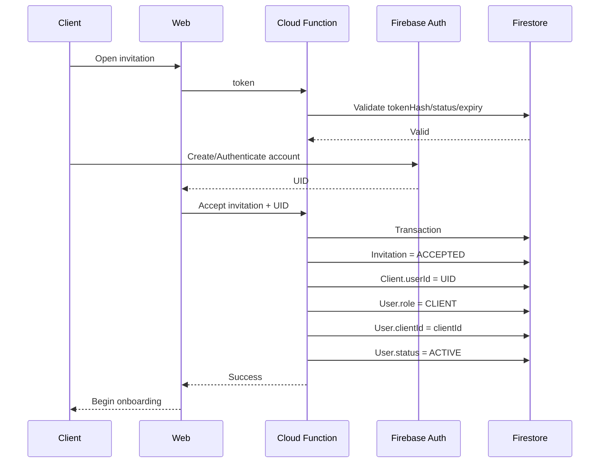

## Invalid Cases

```text
EXPIRED
REVOKED
ALREADY_ACCEPTED
INVALID_TOKEN
```

---

# 13. FLOW-07 — Onboarding Cliente

## Actor

Cliente.

## Preconditions

- User ACTIVE;
- role CLIENT;
- own clientId.

## Steps

```text
1. Identity
2. Goal
3. Audience / Market
4. Experience / Evidence
5. Digital Presence
6. Voice / Boundaries
```

## Save behavior

Cada paso:

```text
autosave / save-step
```

## State

Al iniciar:

```text
onboardingStatus = IN_PROGRESS
```

---

# 14. FLOW-08 — Completar Onboarding

## Rule

No requiere Profile 100%.

Debe alcanzar Minimum Viable Profile.

## Happy Path

```text
1. Backend recalcula completeness.
2. Evalúa Minimum Viable Profile.
3. Si cumple:
   onboardingStatus = COMPLETED
4. Strategy Readiness:
   NOT_READY / BASIC / READY
5. Audit.
6. Notifica Manager.
7. Cliente entra a Client Home.
```

## Audit

```text
ONBOARDING_COMPLETED
PROFILE_COMPLETENESS_CHANGED
```

---

# 15. FLOW-09 — Subir CV / Documento

## Actor

Cliente o Manager autorizado.

## Happy Path

```text
1. Selecciona archivo.
2. Frontend valida extensión/tamaño.
3. Storage Rules validan scope.
4. Archivo sube a Storage.
5. Se crea ProfileDocument.
6. processingStatus = UPLOADED.
7. Backend inicia extracción.
8. status = PROCESSING.
9. Extrae texto.
10. Si IA disponible:
    Profile Agent analiza.
11. Se crean ProfileReviewItems.
12. status = REVIEW_READY.
13. UI muestra datos por revisar.
```

---

# 16. FLOW-10 — Documento sin IA

Si no existe proveedor:

```text
ProfileDocument = COMPLETED or REVIEW_READY_MANUAL
```

según implementación.

El usuario puede completar Profile manualmente.

---

# 17. FLOW-11 — Revisar ProfileReviewItem

## Actor

Manager o Cliente propietario.

## Happy Path CONFIRM

```text
1. Abre Review Queue.
2. Selecciona Confirm.
3. Backend valida ownership.
4. Actualiza Profile / Evidence.
5. ReviewItem.status = CONFIRMED.
6. reviewedBy/reviewedAt.
7. Recalcula completeness.
8. Audit.
```

## EDIT

```text
1. Usuario cambia valor.
2. Backend guarda valor editado.
3. ReviewItem.status = UPDATED.
4. Profile recibe valor final.
```

## REJECT

```text
ReviewItem.status = REJECTED
```

No borrar.

---

# 18. FLOW-12 — Resolver Conflicto de Perfil

## Trigger

Dos fuentes proponen valores incompatibles.

## State

```text
ProfileReviewItem.status = CONFLICT
```

## Manager/Client options

```text
Keep existing
Use new
Edit manually
Mark historical
Reject both
```

---

# 19. FLOW-13 — Crear Tesis manual

## Actor

Manager.

## Happy Path

```text
1. Open Thesis Builder.
2. Select Client.
3. Complete:
   expertIdentity
   audience
   domain
   objective
   evidence
   differentiators
   boundaries
4. Save Draft.
5. readiness calculated.
6. status = DRAFT.
```

---

# 20. FLOW-14 — Generar propuesta de Tesis con IA

## Preconditions

- Profile suficiente;
- AI credential/session;
- Manager authorization.

## Sequence

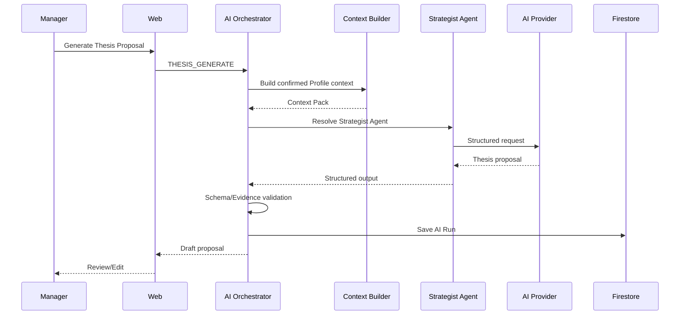

---

# 21. FLOW-15 — Challenge Thesis

## Actor

Manager.

## Output

```text
vagueness
evidence gaps
audience issues
domain conflicts
risks
recommendation:
READY / REFINE / SPLIT / PAUSE / REJECT
```

No cambia Tesis automáticamente.

---

# 22. FLOW-16 — Solicitar revisión de Tesis al Cliente

## Preconditions

- Manager considera Draft suficientemente preparado.

## State

```text
status = UNDER_REVIEW
clientApprovalStatus = PENDING
```

## Side Effect

Crear:

```text
Approval entity
Notification
Client Task optional
```

---

# 23. FLOW-17 — Cliente aprueba Tesis

## Actor

Cliente.

## Options

```text
APPROVE
REQUEST_CHANGES
```

## Approve

```text
Approval = APPROVED
clientApprovalStatus = APPROVED
clientApprovedAt = now
```

Manager aún ejecuta activación.

---

# 24. FLOW-18 — Activar Tesis

## Actor

Manager.

## Backend preconditions

```text
status = UNDER_REVIEW or eligible DRAFT
clientApprovalStatus = APPROVED
readiness = READY
same organization
same client
```

## State

```text
status = ACTIVE
activatedAt = now
```

## Audit

```text
THESIS_ACTIVATED
```

---

# 25. FLOW-19 — Cambiar materialmente Tesis activa

Cambios en:

```text
expertIdentity
primaryAudience
primaryDomain
primaryObjective
```

pueden marcar:

```text
materialChange = true
```

Resultado:

```text
status = UNDER_REVIEW
clientApprovalStatus = PENDING
```

---

# 26. FLOW-20 — Crear Campaña

## Actor

Manager.

## Preconditions

- Thesis existe.

## Happy Path

```text
1. Create Campaign.
2. Select Thesis.
3. Add themes.
4. Define markets/audience if needed.
5. Add dates.
6. Save DRAFT.
```

---

# 27. FLOW-21 — Activar Campaña

## Backend checks

```text
Thesis ACTIVE
Campaign DRAFT/PAUSED
valid dates
same client
```

## State

```text
Campaign.status = ACTIVE
```

---

# 28. FLOW-22 — Pausar Campaña

```text
ACTIVE → PAUSED
```

Effects:

- scheduled campaign-specific work stops;
- data remains;
- manual work can continue as allowed.

---

# 29. FLOW-23 — Completar Campaña

```text
ACTIVE/PAUSED → COMPLETED
```

Manager may add:

```text
closeoutSummary
lessons
nextSteps
```

---

# 30. FLOW-24 — Crear Source

## Actor

Manager.

## Happy Path

```text
1. Open Sources.
2. Add Source.
3. Enter URL/type/scope/frequency.
4. Backend validates URL.
5. Source saved.
6. Source not trusted as active until test.
```

---

# 31. FLOW-25 — Test Source

## Sequence

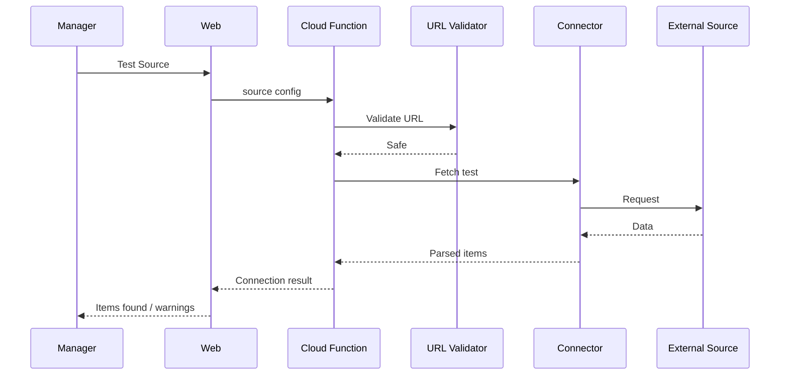

Test does not create Signals unless explicitly requested.

---

# 32. FLOW-26 — Activar Source

Preconditions:

```text
source valid
authorized
```

State:

```text
status = ACTIVE
```

---

# 33. FLOW-27 — Ingesta automática

## Actor

System Scheduler.

## Sequence

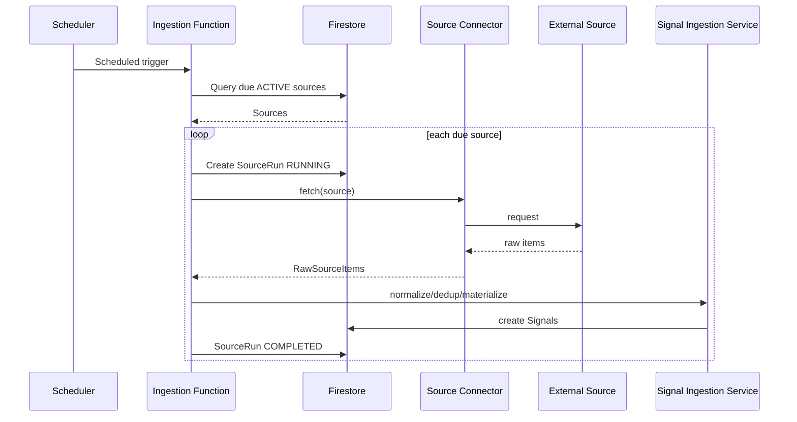

---

# 34. FLOW-28 — Source Failure

If fetch fails:

```text
SourceRun = FAILED
source.lastErrorAt = now
consecutiveFailures += 1
```

Possible:

```text
Source.status = ERROR
```

depending policy.

Manager receives notification if threshold exceeded.

---

# 35. FLOW-29 — Crear Signal manual desde URL

## Actor

Manager.

```text
1. Paste URL.
2. Backend validates SSRF safety.
3. Fetch metadata/content.
4. Normalize.
5. Canonicalize.
6. Fingerprint.
7. Dedup.
8. Create Signal.
9. If AI available → analysis.
10. Else → PENDING_AI.
```

---

# 36. FLOW-30 — Crear Signal manual desde texto/idea

```text
1. Enter title/text.
2. Select type.
3. Select Client/Thesis optional.
4. Backend validates.
5. Signal created.
6. AI optional.
```

No URL required.

---

# 37. FLOW-31 — Deduplicación Signal

## Exact duplicate

```text
canonicalUrl/externalId/hash match
```

Behavior:

```text
Do not create independent Signal
```

Return existing reference or duplicate notice.

## Likely duplicate

```text
create or flag
duplicateOfSignalId
```

for review.

---

# 38. FLOW-32 — Signal sin IA

State:

```text
status = NEW
aiStatus = PENDING_AI
scoringStatus = NOT_SCORED or LIMITED_CONTEXT
```

Manager can:

```text
read manually
save
discard
create opportunity/topic
```

---

# 39. FLOW-33 — Conectar API Key temporal

## Actor

Authorized Manager/User.

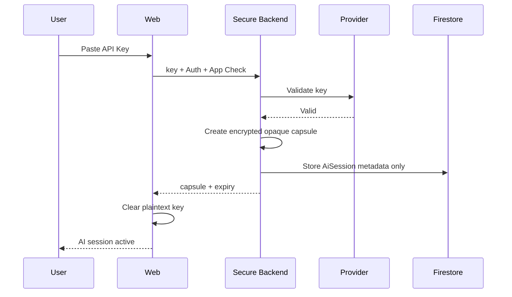

---

# 40. FLOW-34 — Expirar AI Session

When TTL reached:

```text
AiSession.status = EXPIRED
```

Frontend:

```text
AI session expired.
Reconnect to continue.
```

Manual features remain operational.

---

# 41. FLOW-35 — Guardar API Key persistente

## Explicit consent required

```text
1. User chooses Save Securely.
2. Backend validates key.
3. Store secret in Secret Manager.
4. Store metadata reference in Firestore.
5. Never return full secret.
6. Background AI may become available.
7. Audit.
```

---

# 42. FLOW-36 — Revocar credencial persistente

```text
1. Authorized user selects Revoke.
2. Confirm action.
3. Backend disables/deletes secret.
4. Metadata revoked.
5. Background AI stops for provider.
6. Audit.
```

---

# 43. FLOW-37 — Analizar Signal

## Preconditions

```text
Signal belongs to Client
active Thesis or Manager chooses context
AI credential available
budget allowed
```

## Sequence

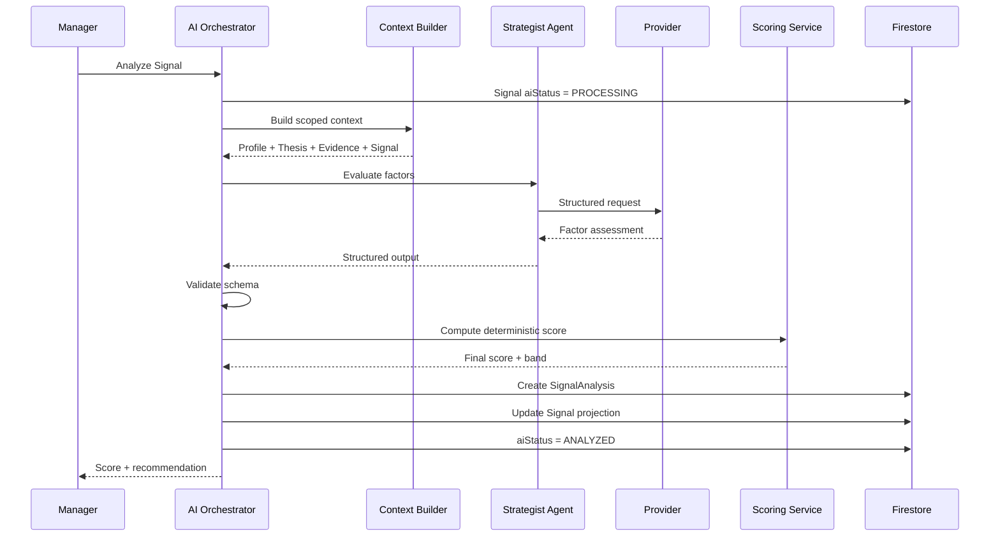

---

# 44. FLOW-38 — AI Analysis Failure

```text
aiStatus = FAILED
```

Preserve Signal.

Store:

```text
AiRun FAILED
errorCode
```

Manager can:

```text
Retry
Review manually
Use another provider if technical fallback allowed
```

---

# 45. FLOW-39 — Batch Analyze Signals

## Preconditions

- same Client;
- batch within limits.

## Behavior

```text
1. Validate all IDs.
2. Process with concurrency cap.
3. Each Signal independent.
4. Partial success allowed.
5. Return summary.
```

Output:

```text
18 completed
2 failed
```

---

# 46. FLOW-40 — Comparative Analysis

## Actor

Manager.

## Preconditions

```text
OpenAI available
Claude available
Comparative enabled
budget available
```

## Sequence

```text
Common Context
↓
OpenAI independent analysis
+
Claude independent analysis
↓
Comparison
↓
Synthesis
↓
Schema validation
↓
Deterministic score
↓
Human review
```

---

# 47. FLOW-41 — Signal Scoring

Application receives factors.

Backend:

```text
1. validate 0–1
2. load scoringVersion
3. calculate Base Score
4. apply Evidence Gap
5. apply Risk
6. apply Staleness
7. apply Conflict
8. apply hard constraints
9. clamp 0–100
10. determine Priority Band
```

---

# 48. FLOW-42 — Signal con hard constraint

Example:

```text
restricted topic
```

Possible result:

```text
Final Score: 88
Recommended Action: BLOCK_ACTION / NO_ACTION
```

Score does not bypass constraints.

---

# 49. FLOW-43 — Manager revisa Intelligence Inbox

## Happy Path

```text
1. Open Dashboard / Intelligence.
2. Filters apply.
3. Cards sorted by Inbox Rank.
4. Manager opens Signal.
5. Reviews:
   - Why
   - Score
   - Risk
   - Evidence Gap
   - Recommendation
6. Manager decides.
```

---

# 50. FLOW-44 — Discard Signal

```text
managerDecision = DISCARDED
status = DISCARDED
managerDecisionAt = now
```

Optional reason.

Signal not hard-deleted.

---

# 51. FLOW-45 — Save Signal

```text
managerDecision = SAVED
status = SAVED
```

Used when valuable but no action yet.

---

# 52. FLOW-46 — Research Signal

```text
managerDecision = RESEARCH
```

May trigger:

```text
Strategic AI Run
```

or manual research.

---

# 53. FLOW-47 — Manager Override

Manager selects:

```text
UPRANK
DOWNRANK
CHANGE_ACTION
FORCE_RESEARCH
```

Store separately from AI score.

---

# 54. FLOW-48 — Crear Topic desde múltiples Signals

## Preconditions

- same Client;
- Manager authorized.

## Happy Path

```text
1. Select Signals.
2. Create Topic.
3. Optional AI synthesis.
4. Manager reviews title/question.
5. Topic created.
6. Signals linked.
```

---

# 55. FLOW-49 — Topic synthesis failure

Topic can still be created manually.

No dependency on AI.

---

# 56. FLOW-50 — Crear Opportunity desde Signal

```text
1. Manager chooses Create Opportunity.
2. Form prefilled from Signal.
3. Manager edits:
   type
   title
   whyItFits
   deadline
4. Save.
5. Opportunity.status = DETECTED/UNDER_REVIEW.
```

---

# 57. FLOW-51 — Recomendar Opportunity al Cliente

Preconditions:

- Manager approves.
- Opportunity relevant.

State:

```text
status = SENT_TO_CLIENT
```

Side effects:

```text
Notification
Task optional
```

---

# 58. FLOW-52 — Cliente acepta Opportunity

State:

```text
ACCEPTED
```

Possible next:

```text
Task creation
Content creation
Event preparation
```

---

# 59. FLOW-53 — Cliente rechaza Opportunity

State:

```text
REJECTED
```

Reason optional.

No delete.

---

# 60. FLOW-54 — Crear Content manual

Manager:

```text
1. Select Content type.
2. Select Thesis/Campaign.
3. Add source/topic/opportunity links.
4. Draft manually.
5. status = DRAFT.
```

---

# 61. FLOW-55 — Generar Content con IA

## Preconditions

- approved strategic context;
- AI available.

```text
1. Manager selects Generate.
2. Context Builder loads:
   Thesis
   Audience
   Voice
   Evidence
   Source Signals
   Boundaries
3. Content Agent generates structured output.
4. Evidence/Risk Gate.
5. Content created:
   status = AI_GENERATED.
6. Manager reviews.
```

---

# 62. FLOW-56 — Unsupported claim during generation

Evidence Gate:

```text
BLOCK or PASS_WITH_WARNINGS
```

If BLOCK:

do not mark content Manager Approved.

Manager sees:

```text
Unsupported claim
Research required
```

---

# 63. FLOW-57 — Manager edits Content

```text
AI_GENERATED / DRAFT
→ MANAGER_REVIEW
```

Save new version when material rewrite occurs.

---

# 64. FLOW-58 — Manager approves Content

Preconditions:

- evidence/risk acceptable;
- review complete.

State:

```text
MANAGER_APPROVED
```

Next:

```text
Send to Client
```

---

# 65. FLOW-59 — Send Content to Client

State:

```text
CLIENT_REVIEW
```

Create:

```text
Approval
Notification
Task optional
```

---

# 66. FLOW-60 — Cliente aprueba Content

State:

```text
CLIENT_APPROVED
```

Then Manager can:

```text
mark READY
```

---

# 67. FLOW-61 — Cliente solicita cambios

State:

```text
CHANGES_REQUESTED
```

Approval:

```text
CHANGES_REQUESTED
```

Manager receives comment.

---

# 68. FLOW-62 — Revisar Content tras cambios

```text
CHANGES_REQUESTED
→ MANAGER_REVIEW
→ MANAGER_APPROVED
→ CLIENT_REVIEW
```

depending workflow.

---

# 69. FLOW-63 — Mark Content Ready

Preconditions:

```text
Manager approved
Client approved when required
```

State:

```text
READY
```

MVP does not auto-publish.

---

# 70. FLOW-64 — Registrar publicación manual

Manager/authorized user records:

```text
publicationUrl
publishedAt
publicationStatus = MARKED_PUBLISHED
```

Creates/updates Result as needed.

---

# 71. FLOW-65 — Crear Task

## Actor

Manager.

Sources:

```text
Opportunity
Content
Profile improvement
Manual
```

State:

```text
DRAFT
```

Then:

```text
ASSIGNED
```

---

# 72. FLOW-66 — Assign Task

```text
status = ASSIGNED
assignedAt = now
```

Notification to Client.

---

# 73. FLOW-67 — Cliente abre Task

First meaningful open:

```text
VIEWED
viewedAt = now
```

---

# 74. FLOW-68 — Cliente inicia Task

```text
VIEWED/ASSIGNED → IN_PROGRESS
```

---

# 75. FLOW-69 — Cliente completa Task

```text
IN_PROGRESS → COMPLETED
completedAt = now
```

Can attach:

- response;
- file;
- URL;
- confirmation.

---

# 76. FLOW-70 — Cliente rechaza/cancela Task

If allowed:

```text
REJECTED
```

Manager can later create a new Task.

---

# 77. FLOW-71 — Upload dentro de Task

File:

```text
Storage
```

Task:

```text
attachmentPaths
```

Authorization same-client.

---

# 78. FLOW-72 — Registrar Result

## Actor

Manager.

Possible sources:

- Content;
- Task;
- Opportunity;
- manual outcome.

## Fields

```text
type
channel
occurredAt
metrics
qualitativeOutcome
```

---

# 79. FLOW-73 — Result desde publicación

```text
Content MARKED_PUBLISHED
↓
Result.type = PUBLICATION
```

---

# 80. FLOW-74 — Result desde Opportunity

Example:

```text
Conference accepted
Podcast invitation completed
Lead generated
```

---

# 81. FLOW-75 — Add Result to Evidence Vault

## Actor

Manager.

```text
1. Open Result.
2. Select Add to Evidence.
3. Pre-fill Evidence item.
4. Manager confirms.
5. ProfileEvidence created.
6. Result remains linked.
7. Profile authority improves.
8. Future AI context may use Evidence.
```

---

# 82. Strategic feedback loop

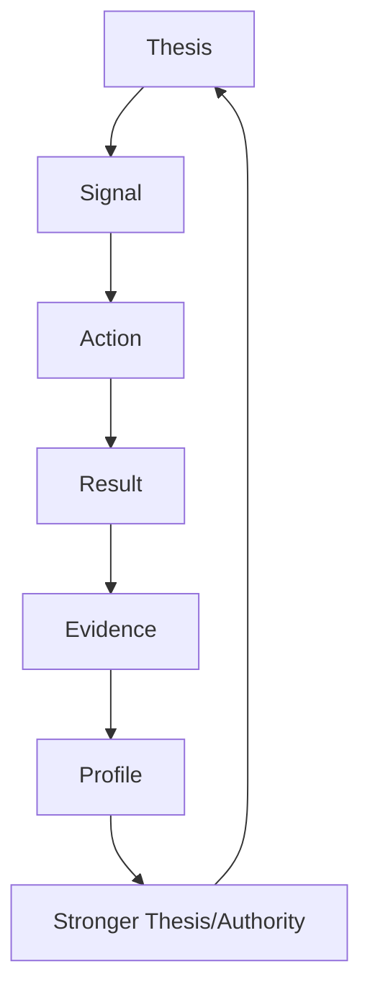

---

# 83. FLOW-76 — Recalculate Profile Completeness after Evidence

```text
New Evidence
↓
ProfileCompletenessService
↓
updated score/readiness
```

---

# 84. FLOW-77 — Re-score Signal after Profile Update

Not automatic for all history.

Manager may:

```text
Reanalyze
```

Creates new SignalAnalysis.

---

# 85. FLOW-78 — Source paused

```text
ACTIVE → PAUSED
```

Scheduler skips.

Existing Signals remain.

---

# 86. FLOW-79 — Source archived

```text
ACTIVE/PAUSED/ERROR → ARCHIVED
```

No new fetches.

Historical references remain.

---

# 87. FLOW-80 — Thesis paused

```text
ACTIVE → PAUSED
```

Effects:

- no standard automatic thesis-based analysis;
- content/history remains.

---

# 88. FLOW-81 — Thesis archived

```text
PAUSED/DRAFT/UNDER_REVIEW → ARCHIVED
```

Historical data remains.

---

# 89. FLOW-82 — Client suspended

## Manager action

```text
Client.status = SUSPENDED
User.status = SUSPENDED
```

Effects:

- Client cannot log in/use app;
- automatic processing may be paused according to policy;
- data remains.

---

# 90. FLOW-83 — Client archived

```text
Client.status = ARCHIVED
archivedAt = now
```

No hard deletion.

---

# 91. FLOW-84 — Permission failure

Any operation:

```text
authorization fails
↓
no state change
↓
security log/audit when appropriate
↓
generic access denied
```

---

# 92. FLOW-85 — App Check failure

If enforcement active:

```text
request rejected
```

No domain operation.

---

# 93. FLOW-86 — Budget exceeded

Before provider call:

```text
Budget Guard → reject
AI_BUDGET_EXCEEDED
```

Signal remains pending/manual.

---

# 94. FLOW-87 — Provider rate limit

```text
AI_RATE_LIMIT
↓
retry with bounded backoff
↓
success or FAILED
```

---

# 95. FLOW-88 — Provider safety refusal

```text
AI_CONTENT_REFUSED
```

Do not provider-hop to evade refusal.

---

# 96. FLOW-89 — AI output schema invalid

```text
1 repair attempt
↓
valid → continue
invalid → FAILED
```

---

# 97. FLOW-90 — AI temporary session missing

Action:

```text
AI_NOT_CONFIGURED
```

UI offers:

```text
Connect OpenAI/Claude
Continue manually
```

---

# 98. FLOW-91 — Source SSRF blocked

Input URL resolves to forbidden target.

```text
SOURCE_URL_BLOCKED
```

No fetch.

Audit security event if appropriate.

---

# 99. FLOW-92 — Upload rejected

Reasons:

```text
TYPE_NOT_ALLOWED
FILE_TOO_LARGE
UNAUTHORIZED
```

No document processing.

---

# 100. FLOW-93 — Network failure during autosave

UI:

```text
Not saved
Retrying
```

Never show false success.

---

# 101. FLOW-94 — AI Run cancellation

If frontend stops waiting:

```text
CANCELLED
```

only when backend can safely mark/cancel.

If provider already processing, final response may still complete server-side.

---

# 102. FLOW-95 — Notification lifecycle

States conceptual:

```text
UNREAD
READ
```

Flow:

```text
System creates
↓
User opens
↓
read = true
readAt = now
```

---

# 103. FLOW-96 — Deep link from Notification

```text
Notification
↓
route
↓
Route Guard
↓
backend authorization
↓
resource
```

Knowing a URL never bypasses permissions.

---

# 104. FLOW-97 — Search / Resource open

Manager searches for Client/Content/etc.

Every opened entity revalidates scope.

---

# 105. State machine — User

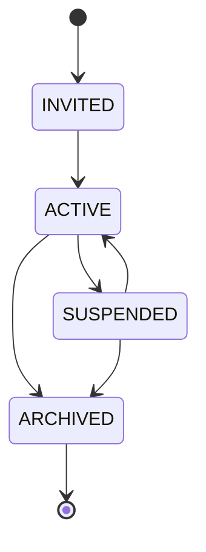

---

# 106. State machine — Client

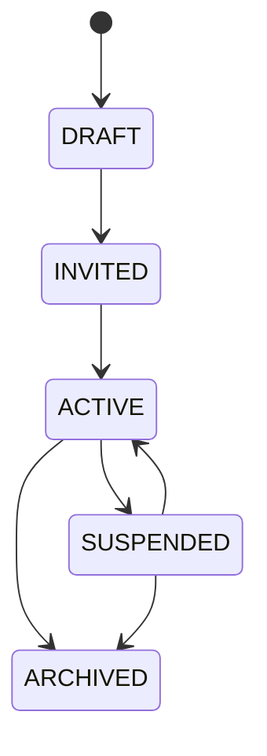

---

# 107. State machine — Onboarding

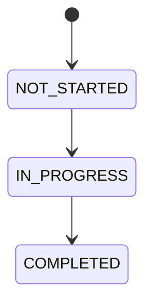

No volver a NOT_STARTED.

---

# 108. State machine — ProfileReviewItem

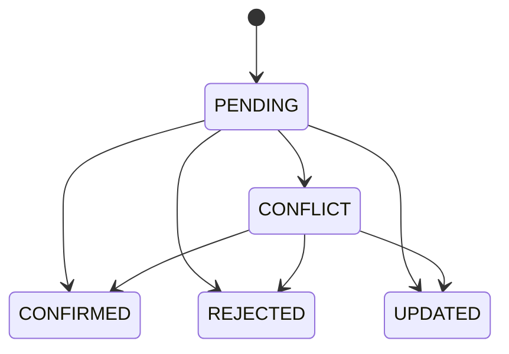

---

# 109. State machine — Thesis

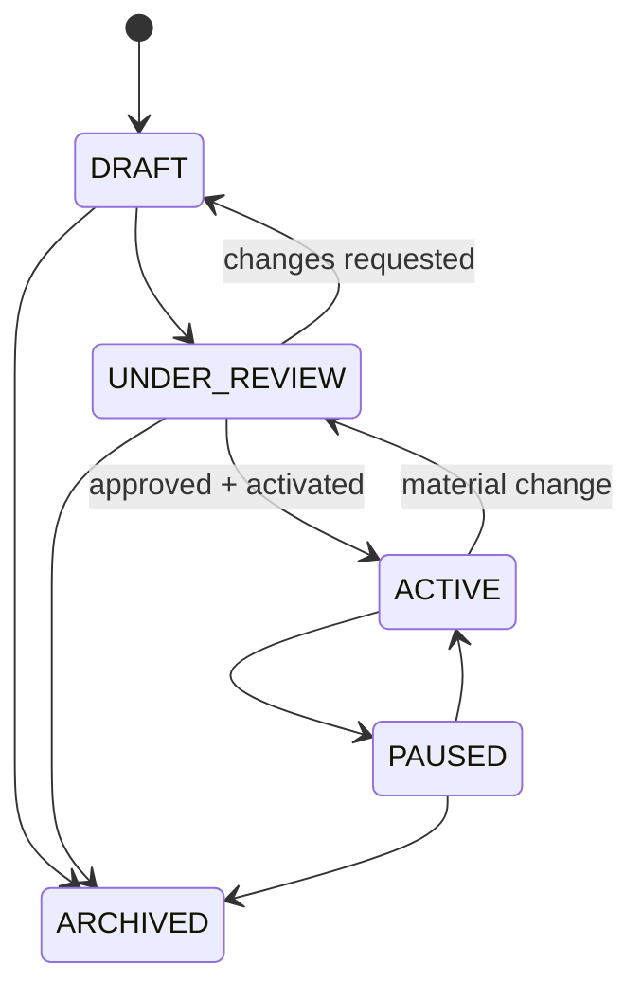

---

# 110. State machine — Campaign

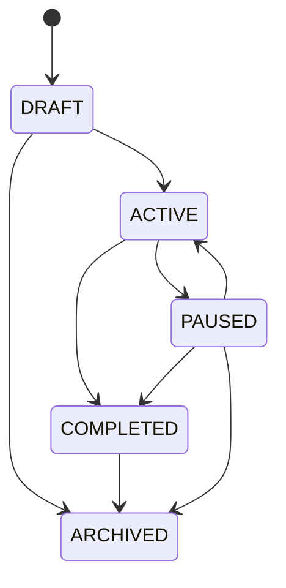

---

# 111. State machine — Source

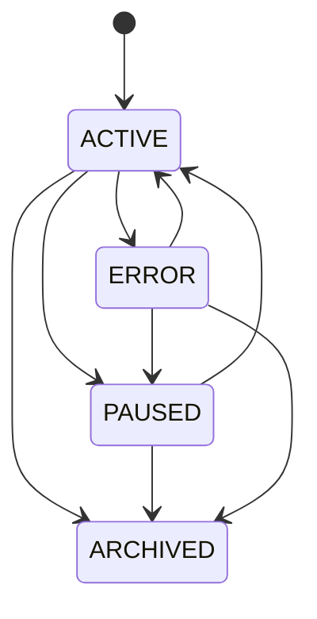

---

# 112. State machine — SourceRun

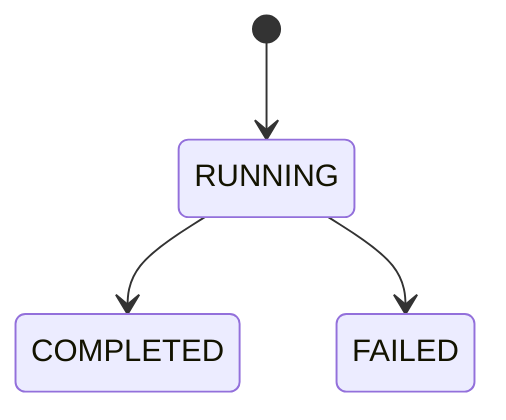

---

# 113. State machine — Signal AI

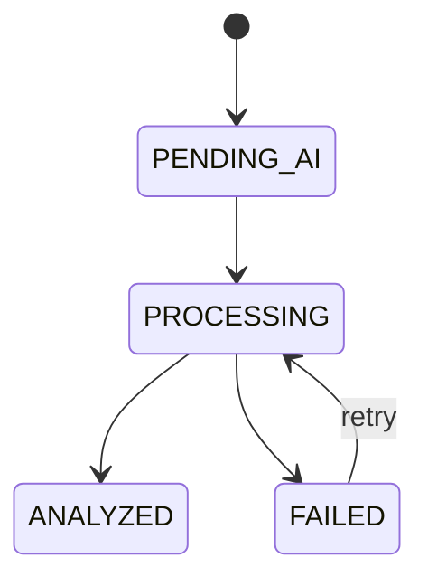

---

# 114. State machine — Signal Manager Decision

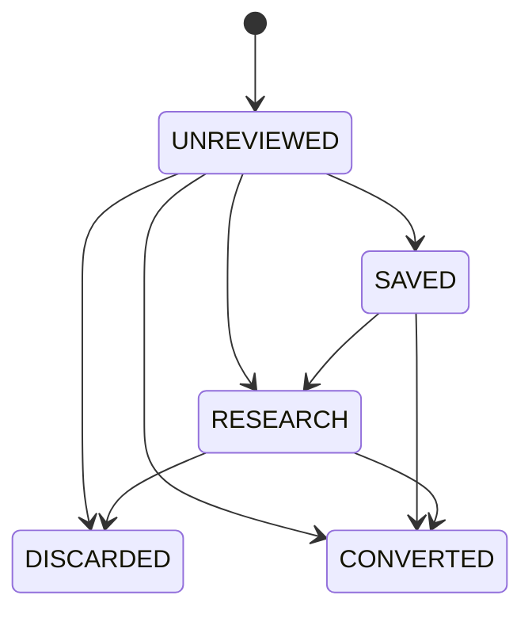

---

# 115. State machine — Opportunity

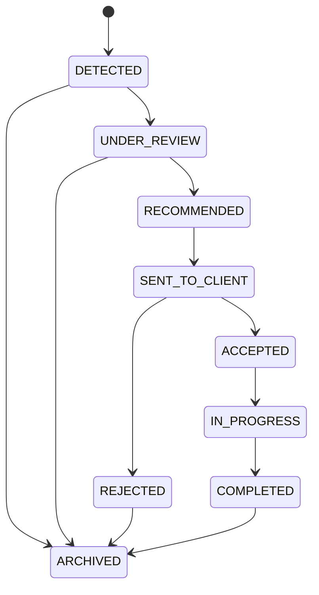

---

# 116. State machine — Content

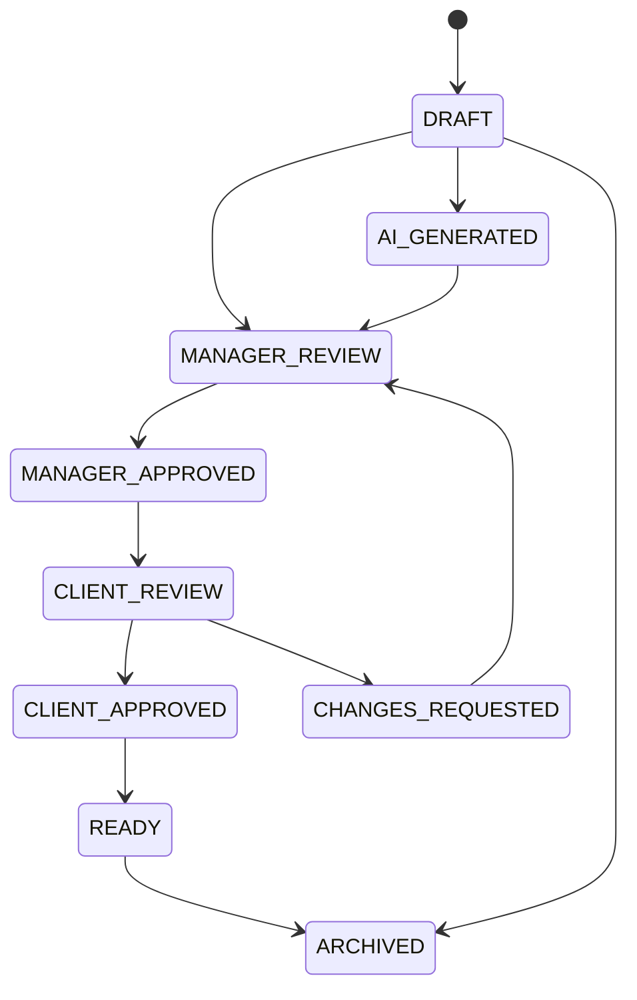

---

# 117. State machine — Task

```mermaid
stateDiagram-v2
    [*] --> DRAFT
    DRAFT --> ASSIGNED
    ASSIGNED --> VIEWED
    ASSIGNED --> IN_PROGRESS
    VIEWED --> IN_PROGRESS
    IN_PROGRESS --> COMPLETED
    ASSIGNED --> REJECTED
    VIEWED --> REJECTED
    IN_PROGRESS --> CANCELLED
    DRAFT --> CANCELLED
```

---

# 118. State machine — Approval

```mermaid
stateDiagram-v2
    [*] --> PENDING
    PENDING --> APPROVED
    PENDING --> REJECTED
    PENDING --> CHANGES_REQUESTED
```

---

# 119. State machine — AI Session

```mermaid
stateDiagram-v2
    [*] --> ACTIVE
    ACTIVE --> REVOKED
    ACTIVE --> EXPIRED
```

---

# 120. State machine — AI Run

```mermaid
stateDiagram-v2
    [*] --> RUNNING
    RUNNING --> COMPLETED
    RUNNING --> FAILED
    RUNNING --> CANCELLED
```

---

# 121. State machine — ProfileDocument

```mermaid
stateDiagram-v2
    [*] --> UPLOADED
    UPLOADED --> PROCESSING
    PROCESSING --> REVIEW_READY
    PROCESSING --> COMPLETED
    PROCESSING --> FAILED
    REVIEW_READY --> COMPLETED
```

---

# 122. Casos de uso P0

Los siguientes son obligatorios para considerar el MVP operativo:

```text
UC-01 Login Manager
UC-02 Login Cliente
UC-03 Create Client
UC-04 Invite Client
UC-05 Client Onboarding
UC-06 Profile Review
UC-07 Create Thesis
UC-08 Client Thesis Approval
UC-09 Add Source
UC-10 Manual Signal
UC-11 Automatic RSS Signal
UC-12 AI Signal Analysis
UC-13 Scoring
UC-14 Inbox Decision
UC-15 Create Opportunity
UC-16 Generate Content
UC-17 Manager Approval
UC-18 Client Approval
UC-19 Assign Task
UC-20 Complete Task
UC-21 Record Result
UC-22 Add Result to Evidence
UC-23 Temporary AI Credential
UC-24 Persistent AI Credential
UC-25 Revoke Credential
```

---

# 123. Casos de uso P1

```text
UC-26 Topic from Multiple Signals
UC-27 Comparative AI
UC-28 Thesis Challenge
UC-29 Campaign Completion
UC-30 Manual Reanalysis
UC-31 Source Run Now
UC-32 Source Diagnostics
UC-33 Result Metrics
UC-34 Client Library
```

---

# 124. Casos de uso P2

```text
UC-35 Advanced search
UC-36 Saved views
UC-37 advanced comments
UC-38 richer analytics
```

---

# 125. Regla de transición

Toda transición deberá implementarse mediante función de dominio.

No:

```text
UI changes status string directly anywhere
```

---

# 126. Ejemplo

En vez de:

```typescript
updateDoc(ref, { status: "ACTIVE" })
```

usar:

```text
activateThesis()
```

cuando la transición tenga reglas.

---

# 127. Transition Guard

Cada domain transition valida:

```text
current state
target state
actor
role
ownership
preconditions
```

---

# 128. Invalid Transition

Debe producir:

```text
INVALID_STATE_TRANSITION
```

sin modificar documento.

---

# 129. Optimistic Concurrency

Cuando dos usuarios modifican el mismo recurso sensible:

usar:

- transaction;
- updatedAt comparison;
- version field;

cuando sea necesario.

---

# 130. Ejemplo Approval race

Manager cambia Content mientras Cliente lo aprueba.

La aprobación debe referirse a una versión concreta.

---

# 131. Content Approval Version

Recomendación:

```text
approval.entityVersion
```

o:

```text
content.currentVersion
```

validado al decidir.

---

# 132. Regla crítica

Un Cliente no debe aprobar silenciosamente una versión distinta de la que revisó.

---

# 133. Thesis Approval Version

Mismo principio para cambios materiales.

---

# 134. Document state history

AuditEvents registra cambios críticos.

No se requiere event sourcing completo.

---

# 135. Retry philosophy

Retry solo cuando:

```text
operación es idempotente o protegida
```

---

# 136. UI retry

No repetir automáticamente acciones que podrían duplicar:

- invitations;
- tasks;
- opportunities;

sin idempotency protection.

---

# 137. Idempotency Keys

Recomendado en:

```text
send invitation
create AI batch
create manual Signal from URL
generate Content
```

cuando riesgo de doble submit exista.

---

# 138. Background Job Pattern

Procesos largos:

```text
Create Job
↓
PENDING
↓
PROCESSING
↓
COMPLETED / FAILED
```

MVP puede usar entidad específica o estados existentes.

---

# 139. Job examples

```text
document extraction
batch AI
source ingestion
```

---

# 140. No blocking UI requirement

Usuario puede navegar mientras:

- ProfileDocument procesa;
- batch AI procesa;
- SourceRun procesa.

---

# 141. Completion notification

System can notify when finished.

---

# 142. Authorization Matrix by Flow

| Flow area | Manager | Client |
|---|---:|---:|
| Create Client | ✅ | ❌ |
| Invite Client | ✅ | ❌ |
| Profile own | ✅ | ✅ own |
| Thesis create | ✅ | ❌ |
| Thesis approve | View | ✅ own |
| Sources | ✅ | ❌ |
| Raw Signals | ✅ | ❌ |
| AI Scoring | ✅ | ❌ |
| Opportunities | ✅ | ✅ own decision |
| Content edit | ✅ | limited/review |
| Content approve | ✅ | ✅ own |
| Tasks | ✅ | ✅ own |
| Results | ✅ | view/limited |
| Credentials | ✅ default | optional policy |
| Audit | ✅ | ❌ |

---

# 143. Failure taxonomy

## Authentication

```text
AUTH_REQUIRED
AUTH_FAILED
ACCOUNT_SUSPENDED
```

## Authorization

```text
ACCESS_DENIED
CLIENT_SCOPE_MISMATCH
ORGANIZATION_SCOPE_MISMATCH
```

## Validation

```text
INVALID_INPUT
INVALID_STATE_TRANSITION
FILE_TOO_LARGE
URL_INVALID
```

## AI

```text
AI_NOT_CONFIGURED
AI_RATE_LIMIT
AI_TIMEOUT
AI_AUTH_ERROR
AI_INVALID_OUTPUT
AI_BUDGET_EXCEEDED
AI_CONTENT_REFUSED
```

## Source

```text
SOURCE_FETCH_FAILED
SOURCE_URL_BLOCKED
SOURCE_PARSE_FAILED
SOURCE_RATE_LIMIT
```

## Storage

```text
UPLOAD_FAILED
FILE_TYPE_NOT_ALLOWED
```

---

# 144. UX error contract

Every user-facing recoverable error should answer:

```text
What happened?
Can I retry?
Can I continue manually?
Is my data saved?
Reference ID?
```

---

# 145. Audit correlation

Each multi-step action can use:

```text
correlationId
```

Example:

```text
Generate Content
↓
AI Run
↓
Content Created
↓
Approval
```

---

# 146. Correlation not security token

Never treat as secret.

---

# 147. End-to-End Example A — New Client to First Signal

```text
Manager creates Client
↓
Invites Client
↓
Client accepts
↓
Completes onboarding
↓
Manager reviews Profile
↓
Creates Thesis
↓
Client approves
↓
Manager activates Thesis
↓
Manager adds RSS Source
↓
Scheduler fetches
↓
Signal created
↓
AI analyzes
↓
Score calculated
↓
Manager sees it in Inbox
```

---

# 148. End-to-End Example B — Signal to Published Content

```text
Signal score = HIGH
↓
Manager reviews
↓
Create Topic
↓
Create Content
↓
AI drafts
↓
Evidence Gate
↓
Manager edits
↓
Manager approves
↓
Client reviews
↓
Client approves
↓
Content READY
↓
Manager publishes externally
↓
Marks Published
↓
Result created
```

---

# 149. End-to-End Example C — Opportunity to Evidence

```text
Signal identifies conference
↓
Opportunity created
↓
Client accepts
↓
Task assigned
↓
Client prepares
↓
Conference completed
↓
Result recorded
↓
Manager adds Result to Evidence Vault
↓
Future Authority Fit improves
```

---

# 150. End-to-End Example D — No AI Key

```text
RSS ingestion active
↓
Signals created
↓
aiStatus = PENDING_AI
↓
Manager logs in
↓
No AI session
↓
Reviews manually
↓
Can save/discard/create Opportunity
↓
Later connects OpenAI
↓
Batch analyzes pending Signals
```

---

# 151. End-to-End Example E — High Score but Unsafe

```text
Signal has:
Thesis Match HIGH
Audience Match HIGH
Timeliness HIGH
↓
Score base 92
↓
Risk Gate detects confidential claim
↓
Hard Constraint
↓
Recommended Action = NO_ACTION / RESEARCH_REQUIRED
↓
Manager sees high priority + high risk separately
```

---

# 152. End-to-End Example F — Profile Gap discovered through scoring

```text
Signal relevant
↓
Authority Fit low
↓
Evidence Gap MAJOR
↓
Manager knows Client has real experience
↓
Manager UPRANKS
↓
Updates Profile / adds Evidence
↓
Future analyses improve
```

---

# 153. Acceptance criteria — End-to-End

## FLOW-CA-001

Manager can log in and reach Dashboard.

## FLOW-CA-002

Client can log in and be routed according to onboarding status.

## FLOW-CA-003

Manager can create Client.

## FLOW-CA-004

Invitation can be accepted only once.

## FLOW-CA-005

Expired invitation is rejected.

## FLOW-CA-006

Client can complete onboarding progressively.

## FLOW-CA-007

Onboarding can resume.

## FLOW-CA-008

CV processing does not block onboarding.

## FLOW-CA-009

AI profile suggestions require review.

## FLOW-CA-010

Manager can create Thesis manually.

## FLOW-CA-011

Manager can generate Thesis with AI.

## FLOW-CA-012

Client can approve/request changes.

## FLOW-CA-013

Thesis activation validates preconditions.

## FLOW-CA-014

Material Thesis changes require new review.

## FLOW-CA-015

Manager can create/activate Campaign.

## FLOW-CA-016

Manager can create/test Source.

## FLOW-CA-017

Scheduler creates SourceRun.

## FLOW-CA-018

Automatic ingest creates Signals.

## FLOW-CA-019

Manual ingest creates Signals.

## FLOW-CA-020

Exact duplicates do not multiply.

## FLOW-CA-021

Signal can remain PENDING_AI.

## FLOW-CA-022

Temporary AI session can be established.

## FLOW-CA-023

Temporary session can expire/revoke.

## FLOW-CA-024

Persistent credential can be stored securely.

## FLOW-CA-025

Persistent credential can be revoked.

## FLOW-CA-026

Signal can be analyzed.

## FLOW-CA-027

Backend calculates Score.

## FLOW-CA-028

AI failure preserves Signal.

## FLOW-CA-029

Batch analysis supports partial failure.

## FLOW-CA-030

Manager can discard/save/research/convert Signal.

## FLOW-CA-031

Manager Override is stored separately.

## FLOW-CA-032

Multiple Signals can form Topic.

## FLOW-CA-033

Signal can create Opportunity.

## FLOW-CA-034

Client can accept/reject Opportunity.

## FLOW-CA-035

Manager can create/generate Content.

## FLOW-CA-036

Unsupported claims can block approval.

## FLOW-CA-037

Manager can approve Content.

## FLOW-CA-038

Client can approve/request changes.

## FLOW-CA-039

Content can become READY only when conditions pass.

## FLOW-CA-040

No automatic publication exists.

## FLOW-CA-041

Task can be assigned.

## FLOW-CA-042

Client can complete Task.

## FLOW-CA-043

Result can be recorded.

## FLOW-CA-044

Result can become Evidence after human confirmation.

## FLOW-CA-045

Client suspension blocks access.

## FLOW-CA-046

Archive preserves historical data.

## FLOW-CA-047

Authorization failure causes no state change.

## FLOW-CA-048

SSRF blocked Source causes no fetch.

## FLOW-CA-049

Budget exceeded prevents provider call.

## FLOW-CA-050

Safety refusal is not bypassed through provider fallback.

---

# 154. Reglas obligatorias de flujo

## FLOW-RN-001

No existe transición directa que evite aprobación obligatoria.

## FLOW-RN-002

Una Tesis no se activa automáticamente.

## FLOW-RN-003

Content no se publica automáticamente.

## FLOW-RN-004

Profile facts suggested by AI require validation.

## FLOW-RN-005

Manager owns raw Intelligence workflow.

## FLOW-RN-006

Client only accesses own resources.

## FLOW-RN-007

Every critical transition validates current state.

## FLOW-RN-008

Invalid transitions are rejected.

## FLOW-RN-009

AI failure never deletes source data.

## FLOW-RN-010

No AI key does not block manual product usage.

## FLOW-RN-011

Temporary credentials expire.

## FLOW-RN-012

Persistent credentials require explicit consent.

## FLOW-RN-013

Exact duplicates are controlled.

## FLOW-RN-014

High Score does not bypass Risk/Evidence constraints.

## FLOW-RN-015

Manager Override never rewrites historical AI Score.

## FLOW-RN-016

Client approval must correspond to reviewed version.

## FLOW-RN-017

Archived entities remain available for authorized historical review.

## FLOW-RN-018

Sensitive backend actions emit Audit Events.

## FLOW-RN-019

Long operations can run without blocking navigation.

## FLOW-RN-020

Partial batch failure is supported.

## FLOW-RN-021

Retry must be bounded/idempotent.

## FLOW-RN-022

No security failure reveals cross-client existence unnecessarily.

## FLOW-RN-023

Source content cannot issue system commands.

## FLOW-RN-024

State is domain logic, not UI decoration.

## FLOW-RN-025

Every important flow has a recoverable/manual path where feasible.

---

# 155. Recommended implementation order

```text
F1 — Auth routing
F2 — Client create/invite
F3 — Invitation acceptance
F4 — Onboarding state
F5 — Profile documents/review
F6 — Thesis lifecycle
F7 — Thesis approval
F8 — Campaign lifecycle
F9 — Source lifecycle
F10 — Manual Signal
F11 — Automatic Signal
F12 — AI credential flows
F13 — Signal AI lifecycle
F14 — Scoring lifecycle
F15 — Intelligence decisions
F16 — Topic flow
F17 — Opportunity flow
F18 — Content lifecycle
F19 — Approval version protection
F20 — Task lifecycle
F21 — Result lifecycle
F22 — Evidence feedback
F23 — Archive/suspend flows
F24 — Error/retry flows
F25 — End-to-End automated tests
```

---

# 156. Recommended domain services

```text
AuthFlowService
ClientLifecycleService
InvitationService
OnboardingService
ProfileReviewService
ThesisLifecycleService
CampaignLifecycleService
SourceLifecycleService
SignalIngestionService
SignalAnalysisService
StrategicScoringService
ManagerDecisionService
TopicService
OpportunityLifecycleService
ContentLifecycleService
ApprovalService
TaskLifecycleService
ResultService
EvidenceService
CredentialService
AuditService
```

---

# 157. End-to-End test suites

## E2E-01 — Client lifecycle

```text
create → invite → accept → onboarding → active
```

## E2E-02 — Thesis lifecycle

```text
draft → review → client approve → active → pause
```

## E2E-03 — Ingestion

```text
source → run → signal → dedup
```

## E2E-04 — AI

```text
connect → analyze → score → decision
```

## E2E-05 — Content

```text
generate → manager approve → client approve → ready
```

## E2E-06 — Task

```text
assign → view → progress → complete
```

## E2E-07 — Result

```text
record → link → evidence
```

## E2E-08 — Security

```text
Client A attempts Client B resource → denied
```

## E2E-09 — Degraded Mode

```text
no AI → manual flow succeeds
```

## E2E-10 — Credential expiry

```text
temporary session expires → AI blocked → manual app remains
```

---

# 158. Definition of Done for a flow

A flow is not complete until:

```text
✅ happy path implemented
✅ authorization implemented
✅ state transition validation
✅ persistence
✅ audit where required
✅ loading state
✅ empty/error state
✅ retry/manual fallback where applicable
✅ unit/integration/e2e test
✅ no cross-client leakage
```

---

# 159. MVP operational sequence recommended

The first usable vertical slice should be:

```text
Manager Login
↓
Create Client
↓
Profile
↓
Thesis
↓
Manual Signal
↓
AI Analysis
↓
Score
↓
Manager Decision
↓
Opportunity
↓
Content
↓
Client Approval
↓
Result
```

Only after this loop works well should automatic ingestion become the main focus.

---

# 160. Why this order

It validates the central business hypothesis:

> Postura can convert relevant information into useful positioning actions.

Automatic feeds are valuable only after the decision loop is solid.

---

# 161. Pilot success path

For a pilot Client, success means:

```text
Profile exists
Thesis active
Sources configured
Signals arrive
Top Signals are useful
Manager decisions are fast
Client can approve/execute
Results are recorded
Evidence accumulates
```

---

# 162. Out of scope in this phase

This document does not define:

```text
full code implementation
deployment scripts
CI/CD implementation details
production migration scripts
advanced analytics
billing
full CRM
auto publishing
social OAuth
Agent Factory
```

These belong to implementation/roadmap phases.

---

# 163. Decisiones cerradas al finalizar la Fase 14

1. Todos los procesos críticos tienen estado explícito.
2. Login distingue Manager y Cliente.
3. Onboarding es reanudable.
4. Invitaciones son single-use.
5. Profile review es human-in-the-loop.
6. Thesis requiere aprobación y activación.
7. Material Thesis changes pueden requerir nueva revisión.
8. Campaign lifecycle queda formalizado.
9. Source create/test/activate queda formalizado.
10. Automatic ingestion utiliza SourceRun.
11. Manual and automatic ingestion convergen en Signal.
12. Exact duplicates se controlan.
13. Signal puede operar sin IA.
14. Temporary AI Session queda formalizada.
15. Persistent credential flow queda formalizado.
16. Signal AI lifecycle queda formalizado.
17. Backend calcula scoring.
18. AI failures preserve domain data.
19. Batch partial failures son válidos.
20. Manager decisions son explícitas.
21. Manager Override es independiente del AI Score.
22. Multiple Signals pueden crear Topic.
23. Opportunity lifecycle queda formalizado.
24. Content lifecycle queda formalizado.
25. Manager approval y Client approval son distintos.
26. Approval debe corresponder a una versión específica.
27. Publication remains manual.
28. Task lifecycle queda formalizado.
29. Result lifecycle queda formalizado.
30. Result puede convertirse en Evidence.
31. Evidence retroalimenta Profile.
32. Profile puede mejorar futuros analyses.
33. Suspension y Archive son diferentes.
34. Permission failure nunca modifica estado.
35. Retry estará limitado.
36. Los estados se manejarán mediante domain services.
37. El primer vertical slice debe validar Signal → Action → Result.
38. La siguiente fase definirá el plan técnico de implementación.

---

# 164. Siguiente fase

## FASE 15 — Documento 15 de 16
### Plan Técnico de Implementación, Backlog y Orden de Construcción

El siguiente documento deberá definir:

- estructura de repositorio;
- paquetes;
- frontend;
- Cloud Functions;
- Firebase;
- Security Rules;
- IA;
- Source connectors;
- servicios;
- fases de desarrollo;
- épicas;
- historias técnicas;
- dependencias;
- P0/P1/P2;
- vertical slices;
- milestones;
- definición de terminado;
- estrategia de branches;
- CI/CD;
- environments;
- testing;
- seed data;
- emulator;
- deploy;
- rollout;
- backlog para Cursor/IA desarrolladora;
- prompts de implementación por etapa;
- criterios de salida.

---

# 165. Estado de documentación

```text
FASE 1
✅ Documento 01 — Documento Maestro

FASE 2
✅ Documento 02 — Especificación Funcional del MVP

FASE 3
✅ Documento 03 — Roles, Usuarios y Modelo Operativo

FASE 4
✅ Documento 04 — Arquitectura Funcional Integral

FASE 5
✅ Documento 05 — Arquitectura Técnica del MVP

FASE 6
✅ Documento 06 — Modelo de Datos Firebase

FASE 7
✅ Documento 07 — Perfil Maestro y Onboarding Inteligente

FASE 8
✅ Documento 08 — Tesis de Posicionamiento y Campañas

FASE 9
✅ Documento 09 — Fuentes, Señales e Inteligencia de Ingesta

FASE 10
✅ Documento 10 — Arquitectura de Inteligencia Artificial, Agentes y AI Router

FASE 11
✅ Documento 11 — Seguridad de APIs, Credenciales, Sesiones y Protección del MVP

FASE 12
✅ Documento 12 — Sistema de Scoring, Priorización y Recomendaciones Estratégicas

FASE 13
✅ Documento 13 — UX/UI, Navegación y Sistema de Experiencia del Producto

FASE 14
✅ Documento 14 — Flujos, Casos de Uso y Estados End-to-End

FASE 15
⬜ Documento 15 — Plan Técnico de Implementación, Backlog y Orden de Construcción
```

---

**FIN DEL DOCUMENTO — POSTURA-F14-D14 v1.0**
