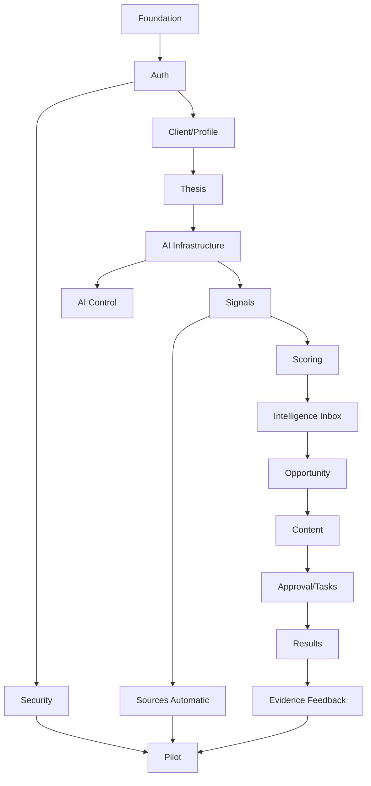

# POSTURA — FASE 15
## Documento 15 de 16 — Plan Técnico de Implementación, Backlog y Orden de Construcción

**Código:** POSTURA-F15-D15  
**Versión:** 1.0  
**Estado:** Plan de ejecución técnica del MVP  
**Tipo de documento:** Implementación, Backlog, Milestones, Priorización, CI/CD, Testing y Guía para Cursor/IA desarrolladora  
**Proyecto:** Postura — Positioning Intelligence & Management System  
**Formato:** Markdown  
**Ámbito:** MVP web-first + Electron, Firebase, Cloud Functions, OpenAI/Claude  
**Fecha de referencia:** 18 de agosto de 2026

---

# 1. Propósito del documento

Este documento transforma las Fases 1–14 en un plan concreto de construcción.

Su objetivo es responder:

> ¿En qué orden debe desarrollarse Postura para reducir riesgo, validar el producto temprano y evitar construir módulos aislados que todavía no demuestran valor?

Este documento será la guía principal para:

- Cursor;
- IA desarrolladora;
- desarrolladores humanos;
- revisión técnica;
- planificación de sprints;
- definición de issues;
- integración;
- pruebas;
- despliegue.

---

# 2. Principio rector de implementación

Postura no debe construirse:

```text
módulo por módulo hasta completar todo
```

Debe construirse mediante:

```text
VERTICAL SLICES
```

que permitan validar ciclos completos de negocio.

---

# 3. Vertical Slice principal

El primer flujo que debe funcionar de extremo a extremo será:

```text
Manager Login
↓
Create Client
↓
Profile
↓
Thesis
↓
Manual Signal
↓
AI Analysis
↓
Strategic Score
↓
Manager Decision
↓
Opportunity
↓
Content
↓
Client Approval
↓
Result
```

---

# 4. Por qué este orden

Porque valida la hipótesis central del producto:

> Postura puede transformar información relevante en decisiones y acciones concretas de posicionamiento.

Antes de automatizar Sources, RSS y grandes volúmenes de Signals, debe demostrarse que el núcleo estratégico funciona.

---

# 5. Estrategia general de construcción

El desarrollo se dividirá en:

```text
FOUNDATION
↓
CORE DOMAIN
↓
FIRST VERTICAL SLICE
↓
AI
↓
SCORING
↓
CLIENT COLLABORATION
↓
AUTOMATIC INGESTION
↓
SECURITY HARDENING
↓
DESKTOP
↓
QA / PILOT
```

---

# 6. Prioridades

## P0 — Obligatorio para MVP usable

Sin estas funciones Postura no puede validar su propuesta.

## P1 — Importante para piloto sólido

Mejora operación y automatización.

## P2 — Deseable

No debe retrasar el piloto.

---

# 7. P0 — alcance técnico

```text
Authentication
Manager role
Client role
Client creation
Client invitation
Onboarding básico
Master Profile
Positioning Thesis
Manual Signal
AI connection
OpenAI provider
Anthropic provider
AI Orchestrator
Signal analysis
Scoring
Intelligence Inbox
Manager decision
Opportunity
Content generation
Manager approval
Client approval
Task
Result
Basic Evidence Vault
Audit critical events
Security Rules
Storage Rules
Responsive web
```

---

# 8. P1 — alcance técnico

```text
Automatic RSS ingestion
Source Registry
Source health
Batch AI
Comparative AI
Thesis Challenge
Profile document extraction
Profile Review Queue
Campaigns
Topics from multiple Signals
AI Control Center
Persistent API credentials
App Check
Advanced audit
Electron packaging
```

---

# 9. P2 — alcance técnico

```text
Advanced analytics
Saved views
Advanced search
Advanced comments
Sophisticated trend detection
Custom source connectors
Rich exports
Dark mode
Desktop notifications
Advanced client metrics
```

---

# 10. Stack técnico oficial del MVP

## Frontend

```text
HTML
CSS
TypeScript
React
Vite
```

React se utilizará como capa de interfaz.

---

# 11. Por qué React

Postura requiere:

- rutas;
- vistas complejas;
- estado;
- componentes;
- formularios;
- filtros;
- drawers;
- approval workflows;
- Client/Manager experiences;
- Electron reuse.

React reduce complejidad frente a mantener una aplicación grande únicamente con DOM imperativo.

---

# 12. CSS

Recomendación:

```text
CSS Modules / modular CSS
+
CSS Custom Properties
```

No es obligatorio Tailwind para el MVP.

---

# 13. Backend

```text
Firebase Authentication
Cloud Firestore
Cloud Storage
Cloud Functions
Cloud Scheduler
Secret Manager
App Check
```

---

# 14. Functions

```text
TypeScript
Node.js runtime soportado por Firebase
```

La versión concreta se fijará y versionará al iniciar implementación.

---

# 15. AI

```text
OpenAI SDK oficial
Anthropic SDK oficial
Provider abstraction
AI Router
AI Orchestrator
```

---

# 16. Validation

```text
Zod
```

para contratos runtime compartidos.

---

# 17. Testing

```text
Vitest
React Testing Library
Firebase Emulator Suite
Playwright
```

---

# 18. Package Manager

```text
pnpm
```

---

# 19. Monorepo

Se recomienda:

```text
pnpm workspaces
```

---

# 20. Estructura general de repositorio

```text
postura/
│
├── apps/
│   ├── web/
│   ├── desktop/
│   └── functions/
│
├── packages/
│   ├── shared/
│   ├── domain/
│   ├── schemas/
│   ├── firebase/
│   ├── ui/
│   └── config/
│
├── docs/
│   ├── architecture/
│   ├── adr/
│   └── product/
│
├── scripts/
│   ├── seed/
│   └── migrations/
│
├── firebase/
│   ├── firestore.rules
│   ├── storage.rules
│   └── firestore.indexes.json
│
├── .github/
│   └── workflows/
│
├── pnpm-workspace.yaml
├── package.json
├── tsconfig.base.json
└── README.md
```

---

# 21. apps/web

Responsabilidad:

```text
Manager Cockpit
Client Portal
Onboarding
AI Control Center
```

---

# 22. apps/functions

Responsabilidad:

```text
authorization
domain transitions
AI
source ingestion
scoring
credentials
audit
secure operations
```

---

# 23. apps/desktop

Electron wrapper del mismo frontend.

No lógica de dominio duplicada.

---

# 24. packages/shared

```text
types
enums
utilities
```

---

# 25. packages/schemas

```text
Zod schemas
AI outputs
API requests
domain validation
```

---

# 26. packages/domain

```text
domain models
state transitions
business rules
```

---

# 27. packages/firebase

```text
Firestore repositories
Firebase initialization
typed converters
```

---

# 28. packages/ui

Primitives y domain components reutilizables.

---

# 29. packages/config

```text
feature flags
route config
scoring config
AI operation registry
```

---

# 30. Arquitectura de ramas

MVP recomendado:

```text
main
develop
feature/*
fix/*
```

---

# 31. main

Producción/pilot candidate.

---

# 32. develop

Integración continua del equipo.

---

# 33. Feature branch examples

```text
feature/client-onboarding
feature/signal-scoring
feature/ai-router
```

---

# 34. Pull Requests

Toda integración significativa:

```text
PR → review → CI → merge
```

---

# 35. No direct production coding

Evitar commits directos a `main`.

---

# 36. Commit style

Recomendado:

```text
feat:
fix:
refactor:
test:
docs:
chore:
```

---

# 37. Entornos

Mínimo:

```text
LOCAL
DEV
PROD
```

---

# 38. LOCAL

Firebase Emulator Suite.

---

# 39. DEV

Proyecto Firebase independiente.

---

# 40. PROD

Piloto/producción.

---

# 41. Firebase projects

Ejemplo:

```text
postura-dev
postura-prod
```

---

# 42. No shared production credentials

DEV no utiliza claves PROD.

---

# 43. Configuración frontend

Usar:

```text
.env.local
.env.development
.env.production
```

sin secretos privados.

---

# 44. Firebase web config

Puede existir en frontend.

No debe contener secretos sensibles.

---

# 45. Secrets backend

```text
Secret Manager
GitHub Actions Secrets
```

solo cuando aplique.

---

# 46. Milestones

El desarrollo se dividirá en 10 milestones.

---

# 47. M0 — Repository Foundation

Objetivo:

tener proyecto ejecutable y testeable.

Entregables:

```text
Monorepo
Vite/React
TypeScript
Firebase config
Emulators
Cloud Functions
Lint
Formatting
Tests
CI base
```

---

# 48. M1 — Authentication + Roles + App Shell

Objetivo:

entrar de forma segura.

Entregables:

```text
Login
Logout
Manager route
Client route
User loading
Role guards
Manager sidebar
Client navigation
```

---

# 49. M2 — Client + Profile + Onboarding

Entregables:

```text
Create Client
Invite Client
Client Workspace
Onboarding
Profile
Profile completeness
Evidence basic
```

---

# 50. M3 — Thesis + Strategy

Entregables:

```text
Thesis Builder
Manual Thesis
Client approval
Thesis activation
Campaign basic
```

---

# 51. M4 — Manual Intelligence Vertical Slice

Entregables:

```text
Manual Signal
Signal list
Signal detail
AI connect temporary
AI Orchestrator
OpenAI
Claude
Signal Analysis
Scoring
Intelligence Inbox
```

---

# 52. M5 — Opportunity + Content + Approval

Entregables:

```text
Create Opportunity
Generate Content
Content Editor
Manager approval
Client approval
Task creation
```

---

# 53. M6 — Results + Evidence Feedback

Entregables:

```text
Results
Publication record
Opportunity result
Task result
Add to Evidence Vault
```

---

# 54. M7 — Automatic Sources

Entregables:

```text
Source Registry
RSS Connector
SourceRun
Scheduler
Dedup
PENDING_AI
Batch Analysis
```

---

# 55. M8 — Security Hardening + AI Control

Entregables:

```text
App Check
Persistent credentials
Secret Manager
Rate limits
Budget Guard
CSP
SSRF hardening
AI Control Center
Audit
```

---

# 56. M9 — Electron + QA + Pilot

Entregables:

```text
Electron wrapper
Responsive polish
E2E
Security Gate
Pilot seed
Deployment
Monitoring
```

---

# 57. Epic structure

Backlog se dividirá en épicas:

```text
EPIC-01 Foundation
EPIC-02 Identity & Access
EPIC-03 Client & Profile
EPIC-04 Thesis & Campaign
EPIC-05 AI Infrastructure
EPIC-06 Signals & Scoring
EPIC-07 Intelligence Inbox
EPIC-08 Opportunities
EPIC-09 Content
EPIC-10 Tasks & Approvals
EPIC-11 Results & Evidence
EPIC-12 Sources & Ingestion
EPIC-13 Security
EPIC-14 UX / Design System
EPIC-15 Electron
EPIC-16 QA / Release
```

---

# 58. EPIC-01 — Foundation

## P0

### TECH-001

Crear monorepo pnpm.

### TECH-002

Crear `apps/web`.

### TECH-003

Crear `apps/functions`.

### TECH-004

Crear packages compartidos.

### TECH-005

Configurar TypeScript estricto.

### TECH-006

Configurar ESLint.

### TECH-007

Configurar formatter.

### TECH-008

Configurar Firebase Emulator Suite.

### TECH-009

Configurar Vitest.

### TECH-010

Configurar CI.

---

# 59. Definition of Done EPIC-01

```text
pnpm install
pnpm dev
pnpm test
pnpm build
```

funcionan desde root.

---

# 60. EPIC-02 — Identity & Access

## P0

```text
AUTH-001 Login
AUTH-002 Logout
AUTH-003 User repository
AUTH-004 Role guard
AUTH-005 Active status validation
AUTH-006 Manager shell
AUTH-007 Client shell
AUTH-008 Unauthorized screen
```

---

# 61. P1

```text
AUTH-009 Invitation acceptance
AUTH-010 Account suspension
AUTH-011 App Check
```

---

# 62. EPIC-03 — Client & Profile

## P0

```text
CLIENT-001 Create Client
CLIENT-002 Client list
CLIENT-003 Client Workspace
PROFILE-001 Base Profile
PROFILE-002 Onboarding
PROFILE-003 Completeness
PROFILE-004 Evidence basic
PROFILE-005 Profile edit
```

---

# 63. P1

```text
PROFILE-006 ProfileDocuments
PROFILE-007 AI Profile extraction
PROFILE-008 ProfileReviewItems
PROFILE-009 Conflict resolution
PROFILE-010 Voice analysis
```

---

# 64. EPIC-04 — Thesis & Campaign

## P0

```text
THESIS-001 Thesis schema
THESIS-002 Thesis Builder
THESIS-003 Save Draft
THESIS-004 Client review
THESIS-005 Approval
THESIS-006 Activation
THESIS-007 Pause/Archive
```

---

# 65. P1

```text
THESIS-008 AI proposal
THESIS-009 Challenge Thesis
CAMPAIGN-001 Campaign CRUD
CAMPAIGN-002 Activation
```

---

# 66. EPIC-05 — AI Infrastructure

## P0

```text
AI-001 Shared enums
AI-002 Operation Registry
AI-003 Provider interface
AI-004 OpenAI Provider
AI-005 Anthropic Provider
AI-006 Credential Resolver
AI-007 AI Router
AI-008 Context Builder
AI-009 Agent Resolver
AI-010 AI Orchestrator
AI-011 AI Run Recorder
AI-012 Structured output validation
AI-013 Error normalization
```

---

# 67. P1

```text
AI-014 Comparative workflow
AI-015 Budget Guard
AI-016 Retry/backoff
AI-017 Prompt Registry
AI-018 Eval suite
```

---

# 68. EPIC-06 — Signals & Scoring

## P0

```text
SIGNAL-001 Manual Signal
SIGNAL-002 Signal repository
SIGNAL-003 Signal Detail
SIGNAL-004 AI analysis
SIGNAL-005 SignalAnalysis
SCORE-001 Scoring Config
SCORE-002 Factor schema
SCORE-003 Scoring Service
SCORE-004 Penalties
SCORE-005 Hard Constraints
SCORE-006 Priority Bands
```

---

# 69. EPIC-07 — Intelligence Inbox

## P0

```text
INBOX-001 List
INBOX-002 Filters
INBOX-003 Signal Card
INBOX-004 Score explanation
INBOX-005 Manager Decision
INBOX-006 Manager Override
INBOX-007 Ranking
```

---

# 70. P1

```text
INBOX-008 Multi-select
INBOX-009 Topic creation
INBOX-010 Batch analysis
```

---

# 71. EPIC-08 — Opportunities

## P0

```text
OPP-001 Create Opportunity
OPP-002 Opportunity list
OPP-003 Detail
OPP-004 Recommend to Client
OPP-005 Client accept/reject
```

---

# 72. EPIC-09 — Content

## P0

```text
CONTENT-001 Content schema
CONTENT-002 Manual draft
CONTENT-003 AI generation
CONTENT-004 Editor
CONTENT-005 Evidence/Risk warnings
CONTENT-006 Manager approval
CONTENT-007 Client review
CONTENT-008 Ready state
CONTENT-009 Mark published
```

---

# 73. P1

```text
CONTENT-010 Version history
CONTENT-011 Adapt format
CONTENT-012 Strategic rewrite
```

---

# 74. EPIC-10 — Tasks & Approvals

## P0

```text
TASK-001 Task create
TASK-002 Assign
TASK-003 Client task list
TASK-004 View
TASK-005 In progress
TASK-006 Complete
APPROVAL-001 Approval create
APPROVAL-002 Version validation
```

---

# 75. EPIC-11 — Results & Evidence

## P0

```text
RESULT-001 Create Result
RESULT-002 Link Content/Task/Opportunity
RESULT-003 Metrics
RESULT-004 Qualitative outcome
EVID-001 Add Result to Evidence
```

---

# 76. EPIC-12 — Sources & Ingestion

## P1

```text
SOURCE-001 Source Registry
SOURCE-002 Add Source
SOURCE-003 Test Source
SOURCE-004 Activate/Pause
SOURCE-005 RSS Connector
SOURCE-006 HTTP Connector limited
SOURCE-007 SourceRun
SOURCE-008 Scheduler
SOURCE-009 Normalizer
SOURCE-010 Canonicalizer
SOURCE-011 Fingerprint
SOURCE-012 Dedup
SOURCE-013 PENDING_AI
SOURCE-014 Batch AI
```

---

# 77. EPIC-13 — Security

## P0

```text
SEC-001 Firestore Rules
SEC-002 Storage Rules
SEC-003 Authorization helper
SEC-004 Cross-client tests
SEC-005 Secret redaction
SEC-006 SSRF validator
```

---

# 78. P1

```text
SEC-007 App Check
SEC-008 AI Session Capsule
SEC-009 Secret Manager persistent key
SEC-010 Rate limiter
SEC-011 Budget Guard
SEC-012 CSP
SEC-013 Audit security events
SEC-014 Secret scanning
```

---

# 79. EPIC-14 — UX / Design System

## P0

```text
UX-001 Tokens
UX-002 Button/Input/Select
UX-003 Card
UX-004 Badge
UX-005 Modal/Drawer
UX-006 Empty State
UX-007 Skeleton
UX-008 Toast
UX-009 Responsive navigation
```

---

# 80. EPIC-15 — Electron

## P1

```text
DESK-001 Electron app
DESK-002 Safe BrowserWindow
DESK-003 preload minimal
DESK-004 navigation restrictions
DESK-005 external links
DESK-006 packaging
```

---

# 81. EPIC-16 — QA / Release

## P0

```text
QA-001 Unit suite
QA-002 Rules tests
QA-003 Integration tests
QA-004 E2E vertical slice
QA-005 Seed data
QA-006 Build pipeline
```

---

# 82. P1

```text
QA-007 Security suite
QA-008 AI eval suite
QA-009 Pilot checklist
QA-010 Monitoring
```

---

# 83. Dependency graph



---

# 84. Critical Path

La ruta crítica es:

```text
Foundation
→ Auth
→ Client/Profile
→ Thesis
→ AI
→ Manual Signal
→ Scoring
→ Inbox
→ Opportunity
→ Content
→ Approval
→ Result
```

---

# 85. No bloquear Critical Path

No permitir que:

```text
RSS
Electron
Advanced analytics
Dark mode
```

retrasen el primer ciclo funcional.

---

# 86. Vertical Slice VS-01

## Nombre

```text
Manual Strategic Loop
```

## Incluye

```text
Manager
Client
Profile
Thesis
Manual Signal
AI
Scoring
Opportunity
Content
Approval
Result
```

---

# 87. VS-01 Acceptance

Debe poder demostrarse en una sesión completa.

---

# 88. Vertical Slice VS-02

```text
Automatic Intelligence Loop
```

Incluye:

```text
Source
RSS
Scheduler
Signal
PENDING_AI
Batch Analysis
Inbox
```

---

# 89. Vertical Slice VS-03

```text
Evidence Compounding Loop
```

Incluye:

```text
Result
Evidence
Profile
Future Authority Fit
```

---

# 90. Vertical Slice VS-04

```text
Secure AI Automation
```

Incluye:

```text
Persistent credential
automatic analysis
Budget Guard
Audit
```

---

# 91. Development sequence

## Stage 0

Repository + tooling.

## Stage 1

Auth + shells.

## Stage 2

Client + Profile.

## Stage 3

Thesis.

## Stage 4

AI core.

## Stage 5

Manual Signal + scoring.

## Stage 6

Inbox + decisions.

## Stage 7

Opportunity + Content.

## Stage 8

Client approval + Task.

## Stage 9

Results + Evidence.

## Stage 10

Automatic ingestion.

## Stage 11

Security hardening.

## Stage 12

Electron + QA.

---

# 92. Definition of Done — Story

Una historia técnica no se considera terminada hasta:

```text
✅ code complete
✅ TypeScript no errors
✅ lint pass
✅ unit tests
✅ authorization checked
✅ error handling
✅ loading/error/empty UI if applicable
✅ audit if critical
✅ no secret leakage
✅ documentation updated
✅ PR reviewed
```

---

# 93. Definition of Done — Epic

```text
✅ all P0 stories done
✅ happy path demo
✅ failure path tested
✅ security cases
✅ E2E where applicable
✅ no blocker known
```

---

# 94. Definition of Done — MVP

```text
✅ VS-01 works
✅ VS-02 works
✅ Manager can operate multiple Clients
✅ Client portal works
✅ AI works with OpenAI
✅ AI works with Claude
✅ no provider required for manual fallback
✅ Rules tested
✅ security gate passed
✅ production build
✅ pilot data
```

---

# 95. Testing Pyramid

```text
          E2E
       Integration
        Unit
```

---

# 96. Unit tests

Focus:

```text
scoring
state transitions
authorization helpers
validators
canonicalization
dedup
AI error normalization
```

---

# 97. Integration tests

Focus:

```text
Firestore repositories
Cloud Functions
AI providers mocked
Storage
Invitation transaction
Approval version
```

---

# 98. E2E

Focus:

```text
real user journeys
```

---

# 99. Required E2E flows

```text
Manager Login
Create Client
Onboarding
Thesis
Signal
AI
Score
Opportunity
Content
Client Approval
Result
```

---

# 100. Firebase Emulator

Use for:

```text
Auth
Firestore
Functions
Storage
Rules tests
```

---

# 101. Seed Data

Crear script:

```text
pnpm seed
```

---

# 102. Seed entities

```text
Organization
Manager
Client
Profile
Evidence
Thesis
Campaign
Source
Signals
Opportunity
Content
Task
Result
```

---

# 103. Demo Client

Debe ser genérico.

No hardcodear una persona real.

---

# 104. Fixtures

AI tests deben usar datos sintéticos.

---

# 105. Mock providers

Crear:

```text
MockOpenAiProvider
MockAnthropicProvider
```

---

# 106. Why mocks

Evitar:

- costo;
- flaky tests;
- rate limits.

---

# 107. AI integration tests

Separados y opcionales.

---

# 108. Evals

Ejecutar manualmente o CI controlada cuando cambien:

```text
prompts
model config
scoring prompt
```

---

# 109. CI pipeline

PR:

```text
install
typecheck
lint
unit
rules tests
build
secret scan
```

---

# 110. Develop deployment

Después de merge:

```text
deploy web dev
deploy functions dev
deploy rules dev
```

según estrategia.

---

# 111. Production deployment

Manual/protected.

---

# 112. GitHub Actions

Workflows:

```text
ci.yml
deploy-dev.yml
deploy-prod.yml
security.yml
```

---

# 113. No production auto-deploy from every commit

Require protected branch / environment.

---

# 114. GitHub Pages

Puede alojar web inicial.

---

# 115. Routing for GitHub Pages

Se recomienda:

```text
HashRouter
```

si se mantiene GitHub Pages.

---

# 116. Production alternative

```text
Firebase Hosting
```

es recomendable si se requieren mejores headers y routing.

---

# 117. Deployment decision

MVP puede iniciar:

```text
GitHub Pages frontend
+
Firebase backend
```

sin impedir migración.

---

# 118. Build artifacts

```text
apps/web/dist
apps/desktop/dist
```

---

# 119. Environment config

No copiar keys privadas a Vite.

---

# 120. Firebase CLI

Rules/indexes deberán desplegarse desde repo.

---

# 121. Firestore indexes

Agregar según consultas reales.

---

# 122. No speculative indexes

---

# 123. Migration strategy

Cada cambio de schema relevante:

```text
script
version
test
backup
```

---

# 124. Backward compatibility

Durante piloto:

preferir cambios compatibles.

---

# 125. Feature Flags

Utilizar para features incompletas.

---

# 126. Suggested flags

```text
enableAutomaticIngestion
enableComparativeAi
enablePersistentKeys
enableElectron
enableCriticalMode
```

---

# 127. No half-built feature exposed

Flag off until usable.

---

# 128. Observability

Mínimo:

```text
Function errors
AI errors
Source errors
Auth errors
build version
```

---

# 129. Correlation ID

Propagar en operaciones críticas.

---

# 130. Release version

UI puede mostrar:

```text
v0.1.0
```

en Settings/About.

---

# 131. Semantic versioning

Recomendado:

```text
0.x during MVP
1.0 after launch criteria
```

---

# 132. ADRs

Registrar decisiones técnicas relevantes.

---

# 133. ADR examples

```text
ADR-001 Firebase instead of PostgreSQL
ADR-002 React + Vite
ADR-003 Provider abstraction
ADR-004 BYOK strategy
ADR-005 Top-level Firestore collections
ADR-006 GitHub Pages initial hosting
ADR-007 No Agent Factory MVP
```

---

# 134. Why ADR

Evita que futuras IAs reviertan decisiones sin contexto.

---

# 135. Cursor / AI Developer Rules

Toda IA programadora deberá:

```text
1. Leer docs relevantes antes de modificar código.
2. No cambiar stack sin ADR.
3. No introducir nueva base de datos.
4. No llamar provider desde frontend.
5. No saltar authorization.
6. No guardar secretos.
7. No inventar estados.
8. No crear tablas/collections no documentadas sin justificar.
9. No auto-publicar.
10. No reemplazar arquitectura con un chatbot genérico.
```

---

# 136. Documento requerido por tarea

Antes de una tarea:

```text
Auth → Docs 03, 06, 11, 14
Profile → Docs 06, 07, 14
Thesis → Docs 08, 14
Sources → Docs 09, 11, 14
AI → Docs 10, 11
Scoring → Doc 12
UX → Doc 13
```

---

# 137. Prompt base para Cursor

```text
You are implementing Postura, a Positioning Intelligence &
Management System.

Before coding:
1. Read the referenced Postura specification documents.
2. Preserve the approved domain terminology.
3. Do not change architecture or stack unless explicitly requested.
4. Implement only the requested scope.
5. Use TypeScript strict mode.
6. Enforce authorization server-side.
7. Do not expose secrets.
8. Add tests.
9. Report files changed, decisions made, and remaining risks.
10. Do not implement future features unless required by the task.
```

---

# 138. Prompt Cursor — Stage 0 Foundation

```text
Implement Stage 0 of Postura.

Goal:
Create the monorepo foundation.

Required:
- pnpm workspaces
- apps/web with React + TypeScript + Vite
- apps/functions with TypeScript
- packages/shared
- packages/schemas
- packages/domain
- packages/firebase
- packages/ui
- packages/config
- strict TypeScript
- ESLint
- formatting
- Vitest
- Firebase Emulator configuration
- root scripts for dev/build/test/typecheck/lint

Do not implement business features yet.

Return:
- tree
- commands
- important configs
- validation results
```

---

# 139. Prompt Cursor — Stage 1 Auth

```text
Implement Postura Authentication and Role Shell.

Read:
Document 03
Document 06
Document 11
Document 13
Document 14

Required:
- Firebase Auth
- users/{uid}
- ADMIN and CLIENT roles
- ACTIVE status validation
- Manager route guard
- Client route guard
- login
- logout
- Manager shell
- Client shell
- unauthorized handling
- tests

Do not rely on frontend role checks as security.
```

---

# 140. Prompt Cursor — Stage 2 Client/Profile

```text
Implement Client creation and Master Profile foundation.

Read:
Documents 06, 07, 13, 14.

Required:
- clients
- profiles
- create Client
- Client Workspace
- progressive onboarding
- Profile completeness
- Evidence basic
- autosave
- client-scoped authorization
- tests
```

---

# 141. Prompt Cursor — Stage 3 Thesis

```text
Implement Positioning Thesis lifecycle.

Read:
Documents 08, 13, 14.

Required:
- Thesis schema
- Thesis Builder
- DRAFT
- UNDER_REVIEW
- ACTIVE
- PAUSED
- ARCHIVED
- client approval
- activation backend guard
- material change handling
- tests
```

---

# 142. Prompt Cursor — Stage 4 AI Core

```text
Implement Postura AI Core.

Read:
Documents 10 and 11.

Required:
- AI Provider interface
- OpenAI Provider
- Anthropic Provider
- AI Router
- Agent Resolver
- Context Builder
- AI Orchestrator
- Prompt Registry
- Zod output schemas
- AI Run recorder
- normalized errors
- temporary credential support
- no direct frontend provider calls
- tests with mock providers
```

---

# 143. Prompt Cursor — Stage 5 Signal + Scoring

```text
Implement the Manual Signal → AI → Score flow.

Read:
Documents 09, 10, 12, 14.

Required:
- manual Signal
- SignalAnalysis
- strategic factor prompt
- factor validation
- StrategicScoringService
- penalties
- hard constraints
- scoringVersion
- active analysis projection
- tests
```

---

# 144. Prompt Cursor — Stage 6 Intelligence Inbox

```text
Implement Intelligence Inbox.

Read:
Documents 12, 13, 14.

Required:
- Signal Cards
- filters
- Priority / Risk separate
- Score Breakdown
- PENDING_AI
- RESEARCH_REQUIRED
- NO_ACTION
- Manager Decision
- Manager Override
- Inbox Rank
- pagination
```

---

# 145. Prompt Cursor — Stage 7 Opportunity + Content

```text
Implement Signal → Opportunity → Content.

Read:
Documents 04, 08, 10, 13, 14.

Required:
- Opportunity lifecycle
- Content schema
- manual draft
- AI generation
- Content Editor
- Evidence/Risk warnings
- Manager review
- tests
```

---

# 146. Prompt Cursor — Stage 8 Client Approval + Tasks

```text
Implement Client collaboration flow.

Required:
- Content CLIENT_REVIEW
- approvals
- version-safe approval
- CHANGES_REQUESTED
- CLIENT_APPROVED
- READY
- Tasks
- assign/view/in-progress/complete
- client notifications
- authorization tests
```

---

# 147. Prompt Cursor — Stage 9 Results + Evidence

```text
Implement Results and Evidence feedback.

Required:
- Result schema
- link Opportunity/Content/Task
- manual metrics
- qualitative outcomes
- Add Result to Evidence
- recalculate Profile completeness
- audit
```

---

# 148. Prompt Cursor — Stage 10 Automatic Sources

```text
Implement Source Registry and automatic RSS ingestion.

Read:
Documents 09, 11, 14.

Required:
- Source CRUD
- test Source
- RSS connector
- SourceRun
- scheduled Function
- canonicalization
- fingerprint
- exact dedup
- PENDING_AI
- batch analysis
- SSRF protection
- tests
```

---

# 149. Prompt Cursor — Stage 11 Security

```text
Harden Postura security.

Read Document 11 fully.

Required:
- Firestore Rules
- Storage Rules
- App Check
- AI Session Capsule
- Secret Manager persistent credentials
- rate limiter
- Budget Guard
- CSP
- secret redaction
- audit
- security test suite

Do not weaken existing security controls for convenience.
```

---

# 150. Prompt Cursor — Stage 12 Electron

```text
Implement Postura Electron wrapper.

Required:
- reuse web application
- nodeIntegration false
- contextIsolation true
- sandbox true
- minimal preload
- restricted navigation
- safe external links
- no local persistent API keys
- build/package scripts
```

---

# 151. Prompt Cursor — Final QA

```text
Perform final MVP QA.

Read Documents 11, 14, 15 and 16 when available.

Validate:
- vertical slice VS-01
- VS-02
- role isolation
- client isolation
- AI provider fallback
- manual no-AI mode
- approvals
- scoring
- source dedup
- credential revocation
- responsive client portal
- Electron security

Return:
- pass/fail matrix
- blockers
- defects
- recommended fixes
```

---

# 152. AI Developer Output Contract

Para cada tarea Cursor debe devolver:

```text
1. Summary
2. Files created
3. Files modified
4. Tests added
5. Commands executed
6. Decisions
7. Risks
8. Remaining work
```

---

# 153. Do not allow AI scope creep

Si Cursor detecta una mejora:

```text
recommend it
```

pero no implementarla sin necesidad si altera scope.

---

# 154. Backlog issue format

```text
ID
Title
Priority
Epic
Dependencies
Description
Acceptance Criteria
Tests
Docs
```

---

# 155. Example Issue

```text
ID: SCORE-003
Title: Implement StrategicScoringService
Priority: P0
Epic: Signals & Scoring
Dependencies:
- AI factor schema
- ScoringConfig

Acceptance:
- factor range validated
- deterministic score
- penalties
- clamp
- version
- tests
```

---

# 156. Sprint philosophy

No fijar calendarios rígidos en este documento.

Organizar por entrega funcional.

---

# 157. Suggested Iterations

```text
Iteration 1:
Foundation/Auth

Iteration 2:
Client/Profile/Thesis

Iteration 3:
AI/Signal/Scoring

Iteration 4:
Inbox/Opportunity/Content

Iteration 5:
Client Approval/Tasks/Results

Iteration 6:
Automatic Sources/Security

Iteration 7:
Electron/QA
```

---

# 158. Release candidates

```text
v0.1 — foundation
v0.2 — profile/thesis
v0.3 — manual intelligence
v0.4 — collaboration
v0.5 — automatic ingestion
v0.6 — hardened pilot
```

---

# 159. MVP pilot candidate

```text
v0.6
```

conceptualmente.

---

# 160. Performance priorities

Optimize only where needed:

```text
Inbox pagination
Firestore query count
AI context size
batch concurrency
source fetch limits
```

---

# 161. No premature optimization

Do not introduce:

```text
Redis
Kafka
Kubernetes
microservices
vector database
```

for MVP.

---

# 162. Future scale triggers

Consider infrastructure changes when real data shows:

```text
high Firestore cost
heavy async workloads
complex analytics
large semantic search
many organizations
many concurrent source jobs
```

---

# 163. Cloud Run future trigger

Use when:

```text
long-running AI jobs
custom headless browser extraction
heavy document processing
```

outgrow Cloud Functions.

---

# 164. PostgreSQL future trigger

Consider when:

```text
complex relational analytics
knowledge graph
cross-client analytics
reporting joins
```

become central.

---

# 165. Do not migrate early

Firebase remains MVP system of record.

---

# 166. Development Guardrails

No code should:

```text
hardcode specific Client
hardcode Juan
hardcode a country
hardcode one profession
```

---

# 167. Global positioning support

All fields must support global markets/languages.

---

# 168. Localization

MVP UI Spanish.

Architecture ready for English.

---

# 169. Data enums English

Keep.

---

# 170. Pilot strategy

Start with:

```text
1–3 Clients
```

---

# 171. Pilot purpose

Validate:

```text
Signal relevance
Manager speed
Content quality
Client completion
Result capture
```

---

# 172. Pilot Source strategy

Use:

```text
few curated high-quality Sources
```

not hundreds.

---

# 173. Pilot AI strategy

Start:

```text
single provider default
```

Comparative only for selected cases.

---

# 174. Pilot scoring strategy

Use `scoring-v1.0`.

Do not change every few Signals.

---

# 175. Calibration checkpoint

After meaningful sample:

review:

```text
over-ranked
under-ranked
wrong action
evidence gaps
source noise
```

---

# 176. Pilot UX checkpoint

Observe:

```text
Manager confusion
Client abandonment
unnecessary clicks
approval delays
```

---

# 177. Bugs classification

```text
BLOCKER
CRITICAL
MAJOR
MINOR
```

---

# 178. BLOCKER examples

```text
cannot login
cross-client leak
AI key exposure
cannot create Client
vertical slice broken
```

---

# 179. CRITICAL examples

```text
wrong approval state
wrong scoring persistence
source duplicates massive
```

---

# 180. Release Gate

No pilot if any:

```text
BLOCKER
security CRITICAL
cross-client issue
secret exposure
```

remains open.

---

# 181. Production-like seed

Use realistic synthetic data.

---

# 182. QA checklist by module

Each module validates:

```text
happy path
empty
loading
error
authorization
state transition
responsive
```

---

# 183. Observability release checklist

```text
Function logs
AI correlation IDs
SourceRun errors
build version
audit
```

---

# 184. Rollback

Before production deploy:

know how to rollback:

```text
web build
functions
rules
```

---

# 185. Firestore schema rollback

Harder.

Prefer backwards-compatible migrations.

---

# 186. Rules rollback

Versioned.

---

# 187. Feature flag rollback

Fastest for incomplete features.

---

# 188. Documentation discipline

After each Epic:

update:

```text
README
ADR if needed
API/domain docs
status
```

---

# 189. No documentation drift

If implementation differs from Fases 1–15:

record:

```text
ADR / change note
```

---

# 190. Decision authority

Architecture changes require explicit approval.

Cursor should not decide silently.

---

# 191. Security Review authority

Any relaxation of:

```text
Rules
CSP
SSRF
credential handling
```

must be explicitly justified.

---

# 192. Final implementation objective

At the end of Fase 15 execution, Postura should be able to demonstrate:

```text
1. Secure login.
2. Multiple Clients.
3. Progressive Profile.
4. Active Thesis.
5. Manual Signal.
6. AI Analysis.
7. Explainable Score.
8. Manager Decision.
9. Opportunity.
10. Professional Content.
11. Client Approval.
12. Task.
13. Result.
14. Evidence feedback.
15. Automatic RSS.
16. Secure AI credentials.
17. Responsive Web.
18. Electron desktop.
19. Security tests.
20. Pilot-ready build.
```

---

# 193. Acceptance Criteria — Fase 15

## IMP-CA-001

Repository structure is defined.

## IMP-CA-002

Stack is fixed for MVP.

## IMP-CA-003

Development environments are defined.

## IMP-CA-004

Milestones are defined.

## IMP-CA-005

P0/P1/P2 scope is defined.

## IMP-CA-006

Critical Path is defined.

## IMP-CA-007

Vertical Slice VS-01 is defined.

## IMP-CA-008

Automatic intelligence slice is defined.

## IMP-CA-009

Evidence feedback slice is defined.

## IMP-CA-010

Epics are defined.

## IMP-CA-011

Technical stories are identified.

## IMP-CA-012

Dependencies are identified.

## IMP-CA-013

Definition of Done exists.

## IMP-CA-014

Testing strategy exists.

## IMP-CA-015

Emulator strategy exists.

## IMP-CA-016

Seed data strategy exists.

## IMP-CA-017

CI pipeline is defined.

## IMP-CA-018

Deployment strategy exists.

## IMP-CA-019

GitHub Pages path is defined.

## IMP-CA-020

Firebase Hosting remains production alternative.

## IMP-CA-021

Feature flags are defined.

## IMP-CA-022

ADRs are required for architectural changes.

## IMP-CA-023

Cursor operating rules are defined.

## IMP-CA-024

Stage-specific Cursor prompts exist.

## IMP-CA-025

AI Developer output contract is defined.

## IMP-CA-026

Release candidates are proposed.

## IMP-CA-027

Pilot strategy is defined.

## IMP-CA-028

Release gate is defined.

## IMP-CA-029

No premature scale infrastructure is introduced.

## IMP-CA-030

MVP construction order protects the business hypothesis.

---

# 194. Reglas obligatorias

## IMP-RN-001

Build vertical slices, not isolated modules.

## IMP-RN-002

Manual Strategic Loop comes before automatic ingestion.

## IMP-RN-003

Automatic feeds do not block MVP core.

## IMP-RN-004

Electron does not block Web MVP.

## IMP-RN-005

Security is part of Definition of Done.

## IMP-RN-006

No direct provider SDK imports in domain/UI.

## IMP-RN-007

No new database without ADR.

## IMP-RN-008

No Agent Factory in MVP.

## IMP-RN-009

No auto publishing in MVP.

## IMP-RN-010

No production secrets in repo.

## IMP-RN-011

All P0 state transitions must be tested.

## IMP-RN-012

Cross-client isolation must be tested before pilot.

## IMP-RN-013

AI tests use mocks by default.

## IMP-RN-014

Provider integration tests are separate.

## IMP-RN-015

Schema changes require versioning/migration consideration.

## IMP-RN-016

Architecture differences require ADR.

## IMP-RN-017

Feature flags hide unfinished features.

## IMP-RN-018

Pilot starts with curated Sources.

## IMP-RN-019

Pilot starts with small Client count.

## IMP-RN-020

Production release requires QA/Security Gate.

---

# 195. Siguiente fase

## FASE 16 — Documento 16 de 16
### QA, Validación, Piloto, Lanzamiento y Criterios de Aceptación Final

El siguiente documento deberá cerrar la especificación del MVP definiendo:

- estrategia QA;
- matriz de pruebas;
- pruebas funcionales;
- pruebas de seguridad;
- pruebas de IA;
- pruebas de scoring;
- pruebas de UX;
- pruebas responsive;
- pruebas Electron;
- datos de prueba;
- defect severity;
- pilot protocol;
- success metrics;
- acceptance gates;
- rollback;
- monitoring;
- incident readiness;
- launch checklist;
- post-launch validation;
- MVP acceptance;
- criterios para considerar Postura listo.

---

# 196. Estado de documentación

```text
FASE 1
✅ Documento 01 — Documento Maestro

FASE 2
✅ Documento 02 — Especificación Funcional del MVP

FASE 3
✅ Documento 03 — Roles, Usuarios y Modelo Operativo

FASE 4
✅ Documento 04 — Arquitectura Funcional Integral

FASE 5
✅ Documento 05 — Arquitectura Técnica del MVP

FASE 6
✅ Documento 06 — Modelo de Datos Firebase

FASE 7
✅ Documento 07 — Perfil Maestro y Onboarding Inteligente

FASE 8
✅ Documento 08 — Tesis de Posicionamiento y Campañas

FASE 9
✅ Documento 09 — Fuentes, Señales e Inteligencia de Ingesta

FASE 10
✅ Documento 10 — Arquitectura de Inteligencia Artificial, Agentes y AI Router

FASE 11
✅ Documento 11 — Seguridad de APIs, Credenciales, Sesiones y Protección del MVP

FASE 12
✅ Documento 12 — Sistema de Scoring, Priorización y Recomendaciones Estratégicas

FASE 13
✅ Documento 13 — UX/UI, Navegación y Sistema de Experiencia del Producto

FASE 14
✅ Documento 14 — Flujos, Casos de Uso y Estados End-to-End

FASE 15
✅ Documento 15 — Plan Técnico de Implementación, Backlog y Orden de Construcción

FASE 16
⬜ Documento 16 — QA, Validación, Piloto, Lanzamiento y Criterios de Aceptación Final
```

---

**FIN DEL DOCUMENTO — POSTURA-F15-D15 v1.0**
