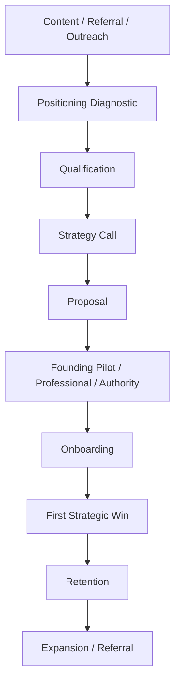

# POSTURA — FASE 17
## Documento 17 — Modelo Comercial, Planes y Pricing

**Código:** POSTURA-F17-D17  
**Versión:** 1.0  
**Estado:** Estrategia comercial recomendada para piloto y lanzamiento  
**Tipo de documento:** Modelo de negocio, empaquetado, pricing, unit economics, expansión y estrategia comercial  
**Proyecto:** Postura — Positioning Intelligence & Management System  
**Formato:** Markdown  
**Ámbito:** Comercialización global, Managed SaaS, profesionales, ejecutivos, firmas y equipos de posicionamiento  
**Fecha de referencia:** 18 de agosto de 2026

---

# 1. Propósito del documento

Este documento define cómo Postura debe convertirse en un negocio comercialmente sostenible.

La pregunta central no es:

> ¿Cuánto cobrar por un software de IA?

La pregunta correcta es:

> ¿Cuánto vale un sistema gestionado que ayuda a un profesional o empresa a identificar mejores oportunidades de posicionamiento, convertirlas en acciones y acumular autoridad de forma sistemática?

Postura no debe comercializarse como:

```text
chatbot
generador de posts
agenda de contenidos
lector de noticias
social media scheduler
```

Debe comercializarse como:

```text
POSITIONING INTELLIGENCE
+
STRATEGIC MANAGEMENT
+
EXECUTION SYSTEM
```

---

# 2. Decisión comercial principal

El modelo inicial recomendado será:

```text
MANAGED / ASSISTED SaaS
```

No:

```text
pure self-service SaaS
```

durante la primera etapa.

---

# 3. Razón

La propuesta de valor de Postura depende de:

- Perfil Maestro;
- Tesis;
- selección de Sources;
- interpretación de Signals;
- criterio del Manager;
- priorización;
- oportunidades;
- contenido;
- seguimiento;
- resultados.

En la etapa inicial, vender solo acceso al software reduciría demasiado el valor y aumentaría el riesgo de que el Cliente no sepa operarlo correctamente.

---

# 4. Posicionamiento comercial de Postura

Declaración recomendada:

> Postura es un sistema de inteligencia y gestión de posicionamiento profesional que conecta el perfil real de una persona con señales del mercado, oportunidades, contenido y acciones estratégicas.

Versión comercial corta:

> Intelligence for professional positioning.

Versión operativa:

> Postura tells you what is worth acting on, why it matters, and what to do next.

---

# 5. Qué compra realmente el Cliente

El Cliente no compra:

```text
50 señales
10 prompts
1.000 tokens
20 publicaciones
```

Compra:

```text
DIRECCIÓN
PRIORIDAD
CRITERIO
VELOCIDAD
CONSISTENCIA
AUTORIDAD
OPORTUNIDADES
```

---

# 6. Unidad de valor principal

La unidad comercial recomendada será:

```text
ACTIVE CLIENT WORKSPACE
```

Un `Active Client Workspace` representa una persona/profesional cuya estrategia está siendo gestionada activamente.

---

# 7. Por qué no cobrar principalmente por usuario

Un Manager puede gestionar varios Clientes.

El valor aumenta más por:

```text
cantidad de Clientes activos
+
intensidad estratégica
```

que por número de personas con login.

---

# 8. Por qué no cobrar principalmente por Signals

Las Signals son una métrica de costo y capacidad.

No son el valor final.

Cobrar por miles de Signals incentivaría volumen, cuando Postura debe incentivar calidad.

---

# 9. Modelo de ingresos inicial

Postura tendrá cuatro posibles capas de ingreso:

```text
1. Managed Positioning Subscription
2. Platform Access
3. Add-ons / Premium Services
4. Future AI / Data Usage
```

---

# 10. Capa 1 — Managed Positioning Subscription

Será la principal durante piloto y primera etapa comercial.

Incluye:

- acceso a Postura;
- configuración;
- Perfil Maestro;
- Tesis;
- Sources;
- Intelligence Inbox;
- revisión del Manager;
- recomendaciones;
- oportunidades;
- contenido según plan;
- seguimiento.

---

# 11. Capa 2 — Platform Access

En fases futuras podrá venderse a:

- agencias;
- firmas;
- consultores;
- equipos internos;
- departamentos de marketing;
- firmas legales;
- firmas contables;
- firmas de consultoría.

En este caso el Cliente ya posee su propio Manager.

---

# 12. Capa 3 — Add-ons

Ejemplos:

```text
Extra Thesis
Extra Client Workspace
Deep Research
Comparative AI
Executive Brief
Profile Intensive
Special Campaign
Event Opportunity Pack
Additional Content
Custom Source Connector
```

---

# 13. Capa 4 — AI Usage

Para MVP:

```text
BYOK
```

El Cliente/Manager aporta su propia API Key.

Por tanto, el precio de Postura no tiene que absorber inicialmente todo el costo de OpenAI/Claude.

---

# 14. Futuro AI-managed

Más adelante Postura podrá ofrecer:

```text
AI INCLUDED
```

con:

- créditos;
- fair-use;
- overage;
- presupuestos;
- límites.

No debe hacerse antes de entender costos reales.

---

# 15. Benchmark de mercado — contexto

Las herramientas de social listening y gestión social ya se comercializan a precios relevantes sin incluir necesariamente una capa humana de estrategia de posicionamiento.

A agosto de 2026, Brand24 publica planes desde aproximadamente:

```text
USD 199/mes anual
USD 299/mes anual
USD 399/mes anual
USD 599/mes anual
Enterprise desde USD 1.499/mes
```

dependiendo del plan.

Sprout Social publica niveles que llegan aproximadamente a:

```text
USD 199
USD 299
USD 399
por usuario/mes
```

en sus planes Standard, Professional y Advanced.

Este benchmark no significa que Postura deba copiar esos precios.

Demuestra que el mercado paga varios cientos de dólares mensuales por herramientas de monitoreo, workflow e inteligencia incluso antes de añadir gestión estratégica humana.

---

# 16. Señal adicional del mercado

Mention dejó de venderse como producto standalone para nuevos Clientes a partir del 1 de julio de 2026 y su oferta de listening pasó hacia Agorapulse Listening.

Esto refuerza una tendencia relevante:

```text
monitoring aislado
→
suite de inteligencia + workflow
```

Postura debe posicionarse aún más arriba:

```text
intelligence
→
strategic decision
→
execution
→
result
```

---

# 17. Principio de pricing

Postura no debe competir por ser:

```text
el más barato
```

Debe competir por:

```text
claridad estratégica
personalización
calidad de decisión
ejecución
trazabilidad
```

---

# 18. Regla comercial

No vender:

```text
Unlimited everything
```

en lanzamiento.

---

# 19. Razón

El costo real depende de:

- tiempo del Manager;
- número de Clientes;
- cantidad de Sources;
- volumen de Signals;
- uso de IA;
- profundidad de investigación;
- cantidad de contenido;
- soporte;
- revisiones.

---

# 20. Arquitectura de planes recomendada

Para etapa inicial:

```text
FOUNDING PILOT
PROFESSIONAL
AUTHORITY
EXECUTIVE / ENTERPRISE
```

---

# 21. PLAN 0 — Founding Pilot

## Objetivo

Validación con primeros Clientes.

## Precio recomendado

```text
USD 390–490 / mes por Cliente
```

Precio sugerido para venta inicial:

```text
USD 450 / mes
```

---

# 22. Founding Pilot — duración

```text
2–3 meses
```

No debe convertirse en tarifa permanente.

---

# 23. Founding Pilot — incluye

```text
1 Active Client Workspace
1 Tesis activa
Hasta 10 Sources curadas
Intelligence Inbox
Análisis estratégico
Hasta 50 Signals analizadas/mes
Hasta 4 piezas/acciones estratégicas asistidas/mes
Client Portal
Aprobaciones
Tasks
Results
Evidence Vault
1 revisión estratégica mensual
BYOK AI
```

---

# 24. Founding Pilot — objetivo comercial

No maximizar margen.

Objetivo:

```text
obtener evidencia real
validar flujo
calibrar scoring
obtener testimonios/casos
entender carga del Manager
```

---

# 25. Founding Pilot — condición

Cliente acepta:

- feedback;
- uso de métricas anonimizadas de producto cuando proceda;
- participación en revisiones;
- condiciones claras de piloto.

---

# 26. No descuento permanente

Al finalizar:

```text
migrate to standard plan
```

o:

```text
renew under new commercial terms
```

---

# 27. PLAN 1 — Professional

## Cliente ideal

Profesional consolidado que quiere construir autoridad y oportunidades de forma consistente.

Ejemplos:

- abogado;
- consultor;
- contador;
- médico;
- ejecutivo;
- ingeniero;
- especialista;
- fundador.

---

# 28. Professional — precio recomendado

```text
USD 790 / mes por Cliente
```

Rango de validación:

```text
USD 690–890
```

---

# 29. Professional — incluye

```text
1 Active Client Workspace
Hasta 2 Tesis activas
Hasta 25 Sources
Hasta 150 Signals analizadas/mes
Intelligence Inbox completo
Scoring explicable
Manager review
Hasta 8 acciones/contenidos estratégicos/mes
Opportunities
Tasks
Client approvals
Results
Evidence Vault
1 strategic review mensual
BYOK AI
```

---

# 30. Qué significa “acción/contenido”

Puede ser:

```text
article
LinkedIn post
reel script
talking points
opportunity brief
commentary
event response
research brief
```

El plan no obliga a producir 8 publicaciones.

---

# 31. Regla

Si la mejor recomendación es:

```text
NO_ACTION
```

no debe fabricarse contenido solo para “cumplir cuota”.

---

# 32. PLAN 2 — Authority

## Cliente ideal

Profesional o ejecutivo con estrategia más activa, múltiples líneas de autoridad y mayor nivel de acompañamiento.

---

# 33. Authority — precio recomendado

```text
USD 1.490 / mes por Cliente
```

Rango de validación:

```text
USD 1.290–1.690
```

---

# 34. Authority — incluye

```text
1 Active Client Workspace
Hasta 3 Tesis activas
Hasta 50 Sources
Hasta 400 Signals analizadas/mes
Topics y trend synthesis
Hasta 16 acciones/contenidos estratégicos/mes
Comparative AI selectivo
Deep Research selectivo
Campaigns
Opportunity management
Priority Manager review
2 strategic reviews mensuales
Advanced Results
Evidence compounding
BYOK AI
```

---

# 35. Authority — diferenciador

No es “más posts”.

Es:

```text
más inteligencia
más profundidad
más velocidad
más amplitud estratégica
```

---

# 36. PLAN 3 — Executive / Enterprise

## Cliente ideal

- C-level;
- socio de firma;
- firma profesional;
- organización;
- equipo;
- multi-executive program;
- reputación de alta sensibilidad.

---

# 37. Executive / Enterprise — precio

```text
CUSTOM
```

Punto de entrada recomendado:

```text
desde USD 2.500 / mes
```

dependiendo de:

- número de perfiles;
- Manager allocation;
- Source intensity;
- research;
- compliance;
- reporting;
- support.

---

# 38. Enterprise — posibles inclusiones

```text
Multiple Client Workspaces
Dedicated Manager
Custom Source Packs
Advanced Research
Custom reporting
Executive briefs
Organization-level dashboards
Priority support
Security review
Custom onboarding
SLA / commercial terms
```

---

# 39. Enterprise no debe prometer ilimitado

Cotizar capacidad específica.

---

# 40. Planes resumidos

| Plan | Precio recomendado | Tesis | Sources | Signals analizadas | Acciones estratégicas |
|---|---:|---:|---:|---:|---:|
| Founding Pilot | USD 450 | 1 | 10 | 50/mes | 4/mes |
| Professional | USD 790 | 2 | 25 | 150/mes | 8/mes |
| Authority | USD 1.490 | 3 | 50 | 400/mes | 16/mes |
| Executive / Enterprise | Desde USD 2.500 | Custom | Custom | Custom | Custom |

---

# 41. El pricing es hipótesis

Estos valores no deben presentarse internamente como una verdad definitiva.

Son:

```text
LAUNCH PRICING HYPOTHESIS
```

a validar con mercado real.

---

# 42. Recomendación de prueba

No probar diez precios simultáneamente.

Empezar con:

```text
Pilot
Professional
Authority
```

y observar cierre, carga y valor.

---

# 43. Annual Pricing

Después del piloto:

ofrecer:

```text
10–15% de ahorro anual
```

si se paga anticipadamente.

---

# 44. Ejemplo Professional

Mensual:

```text
USD 790
```

Anual con ~12%:

```text
aprox. USD 8.340/año
```

en lugar de USD 9.480.

---

# 45. No descuento excesivo

Evitar:

```text
30–50%
```

solo para cerrar.

Eso debilita percepción de valor y márgenes.

---

# 46. Setup / Onboarding Fee

Recomendado para Professional/Authority cuando onboarding sea intensivo.

---

# 47. Setup Fee recomendado

Professional:

```text
USD 300–500
```

Authority:

```text
USD 600–1.000
```

Enterprise:

```text
custom
```

---

# 48. Founding Pilot

Puede:

```text
waive setup fee
```

a cambio de feedback estructurado.

---

# 49. Qué cubre setup

- entrevista;
- Profile;
- Evidence;
- Tesis;
- Sources;
- configuración;
- Client Portal;
- voz;
- límites;
- AI setup.

---

# 50. Evitar esconder trabajo de onboarding

Un Perfil de calidad tiene valor real.

---

# 51. Add-on — Additional Thesis

Recomendación:

```text
USD 150–250/mes
```

según plan/intensidad.

---

# 52. Add-on — Deep Research

Por investigación:

```text
USD 150–500+
```

según complejidad.

---

# 53. Add-on — Executive Brief

```text
USD 150–300
```

por brief avanzado si está fuera de plan.

---

# 54. Add-on — Additional Strategic Content

```text
USD 100–250
```

por pieza/acción según profundidad.

---

# 55. Add-on — Intensive Profile Build

Para Cliente con documentación compleja:

```text
USD 500–1.500
```

one-time.

---

# 56. Add-on — Custom Source Connector

No fijar precio estándar.

Cotizar:

```text
development
maintenance
API cost
```

---

# 57. Add-on — Additional Client Workspace

Para firmas/consultores:

precio incremental por workspace.

Future recommended structure:

```text
base platform fee
+
active workspace fee
```

---

# 58. Modelo futuro para firmas

Ejemplo conceptual:

```text
Manager Platform
USD 500–1.000/mes base

+
USD 250–500
por Active Client Workspace
```

sin incluir servicio humano de Postura.

---

# 59. Importante

No lanzar inmediatamente el plan self-service para firmas.

Primero aprender:

```text
cómo opera un buen Manager dentro de Postura
```

---

# 60. Manager Playbook

La operación gestionada generará:

- procesos;
- prompts;
- decisiones;
- templates;
- scoring feedback;
- mejores prácticas.

Eso luego permite productizar el software.

---

# 61. Estrategia de monetización por etapas

## Etapa A — Managed Pilot

```text
high touch
few Clients
learning
```

## Etapa B — Managed Product

```text
standardized plans
repeatable delivery
```

## Etapa C — Assisted SaaS

```text
Clients/Managers perform more themselves
```

## Etapa D — Platform

```text
agencies/firms manage multiple Clients
```

## Etapa E — Enterprise

```text
organizations
multi-profile programs
custom governance
```

---

# 62. No freemium inicial

Recomendación:

```text
NO FREE PLAN
```

en lanzamiento.

---

# 63. Razón

Postura requiere:

- onboarding;
- configuración;
- Sources;
- Tesis;
- IA;
- soporte.

Un free plan atraerá usuarios sin compromiso y elevará carga.

---

# 64. Alternativa

Ofrecer:

```text
Strategy Assessment
```

o:

```text
14-day guided evaluation
```

solo cuando el producto sea suficientemente self-service.

---

# 65. Free trial futuro

Puede incluir:

```text
1 Profile
1 Thesis draft
5 manual Signals
limited AI
```

sin servicio completo.

---

# 66. Lead Magnet

Antes de trial:

```text
Positioning Diagnostic
```

---

# 67. Positioning Diagnostic

Formulario / sesión que produce:

- Profile Snapshot;
- Positioning Gap;
- Thesis candidate;
- 3 Signals;
- recommended next step.

---

# 68. Pricing Diagnostic

Puede ser:

```text
free qualification
```

o:

```text
low-cost paid assessment
```

---

# 69. Recomendación

Para B2B/profesionales de alto valor:

```text
paid diagnostic
```

puede filtrar mejor.

---

# 70. Ejemplo

```text
USD 150–300
```

acreditable al primer mes si contrata.

---

# 71. Sales Funnel



---

# 72. Ideal Customer Profile — ICP 1

## Professional Expert

Características:

- 10+ años de experiencia o autoridad demostrable;
- alto valor por Cliente/oportunidad;
- poco tiempo para posicionamiento;
- conocimiento especializado;
- reputación importante.

Ejemplos:

- abogados;
- médicos;
- consultores;
- ingenieros;
- ejecutivos;
- expertos técnicos.

---

# 73. ICP 2 — Founder / Executive

Necesita:

- thought leadership;
- media visibility;
- investor/customer authority;
- speaking;
- industry positioning.

---

# 74. ICP 3 — Professional Firm

Quiere posicionar:

- socios;
- directores;
- especialistas.

---

# 75. ICP 4 — Agency / Consultant

Futuro.

Quiere operar Postura para sus propios Clientes.

---

# 76. Anti-ICP

No priorizar inicialmente:

```text
influencers seeking mass posting
low-ticket creators
accounts wanting 100 posts/month
generic social media management
users expecting autonomous posting
```

---

# 77. Por qué

Desvía a Postura hacia volumen, no posicionamiento.

---

# 78. Buyer pain

Mensajes de venta deben hablar de:

```text
"I know I should be visible, but I don't know what is worth saying."
```

```text
"I don't have time to monitor everything."
```

```text
"My content is inconsistent with my real expertise."
```

```text
"I react to trends instead of building authority."
```

---

# 79. Commercial Value Proposition

```text
Postura monitors what matters to your positioning,
filters the noise, explains why something matters,
and turns the best opportunities into actions.
```

---

# 80. Value Pillars

```text
KNOW WHAT MATTERS
KNOW WHY IT MATTERS
KNOW WHAT TO DO
BUILD EVIDENCE OVER TIME
```

---

# 81. No “content machine” message

Avoid:

```text
Generate unlimited posts with AI.
```

---

# 82. Better message

```text
Stop posting randomly.
Build authority around a clear positioning thesis.
```

---

# 83. Sales Qualification

Before accepting Client, evaluate:

```text
Profile depth
Business/professional goal
Evidence
Willingness to participate
Audience
Positioning need
Budget
```

---

# 84. Qualification score

Possible:

```text
STRONG FIT
POSSIBLE FIT
WEAK FIT
```

---

# 85. Strong Fit

- expertise exists;
- objective clear;
- high-value audience;
- willingness to execute;
- budget.

---

# 86. Weak Fit

- wants mass content only;
- no evidence;
- expects guaranteed virality;
- refuses approvals;
- no time to participate at all.

---

# 87. Sales promise boundaries

Never guarantee:

```text
X followers
viral content
media coverage
revenue
Google ranking
```

---

# 88. Promise

Can promise:

```text
structured positioning process
curated intelligence
documented recommendations
managed execution
traceability
```

---

# 89. Contract scope

Commercial agreement should define:

```text
plan
Client Workspace count
Manager service
Sources
analysis limits
deliverables
approval responsibilities
AI model/BYOK
external costs
term
payment
cancellation
confidentiality
```

---

# 90. AI cost clause

For BYOK:

```text
AI provider charges are billed by the provider to the credential owner.
```

Postura subscription does not necessarily include provider usage.

---

# 91. Third-party data/API clause

Some future Sources may require:

```text
separate third-party subscription
```

This must be disclosed.

---

# 92. Overages

MVP recommendation:

Do not automatically charge surprise overages.

---

# 93. Better MVP approach

When limit approached:

```text
warn Manager
pause/limit automation
offer upgrade
```

---

# 94. Later overage model

Can define:

```text
additional Signal analysis pack
additional Source pack
additional AI credit pack
```

---

# 95. Signal pack future

Example:

```text
+100 analyzed Signals
```

price based on real COGS.

Do not price before observing costs.

---

# 96. Usage metrics for billing

Track:

```text
active workspaces
active theses
sources
signals analyzed
comparative runs
strategic actions
manager review time
```

---

# 97. Billable metric priority

Recommended future:

```text
Active Client Workspace
```

first.

Usage metrics support capacity control, not main value pricing.

---

# 98. Unit Economics

Formula:

```text
Revenue per Client
-
Human Delivery Cost
-
Infrastructure
-
AI cost paid by Postura
-
External data cost
-
Support/admin
-
Payment processing
=
Gross Contribution
```

---

# 99. Human Delivery Cost

Critical variable.

Measure:

```text
Manager hours per Client/month
```

---

# 100. Pilot tracking

For every Client, record approximate:

```text
onboarding hours
weekly review hours
content review hours
support hours
```

---

# 101. Why

A USD 790 plan can be excellent or unprofitable depending on Manager time.

---

# 102. Target Manager capacity

Do not define from theory.

Measure during pilot.

---

# 103. Example

If a Professional Client consumes:

```text
6 Manager hours/month
```

and loaded Manager cost is:

```text
USD 40/hour
```

human cost:

```text
USD 240
```

before infra/support.

This is an example, not a fixed assumption.

---

# 104. Margin target — Managed phase

Recommended direction:

```text
50–65% gross contribution
```

once operation stabilizes.

---

# 105. Early pilot

May be lower.

Learning is part of return.

---

# 106. Mature assisted SaaS

Can target higher margins because Manager time decreases.

---

# 107. Margin target — pure platform future

Potentially:

```text
70%+
```

depending AI/data costs.

---

# 108. Do not optimize margin before PMF

But do measure it.

---

# 109. Pricing floor formula

```text
Minimum Monthly Price =
Expected Monthly Delivery Cost
/
(1 - Target Gross Margin)
```

---

# 110. Example

If total delivery cost:

```text
USD 350
```

and target margin:

```text
55%
```

minimum:

```text
350 / 0.45
≈ USD 778
```

This supports why Professional around USD 790 can be a reasonable hypothesis.

---

# 111. Pricing ceiling

Determined by:

```text
value created
budget
alternative cost
reputation importance
opportunity value
```

not production cost alone.

---

# 112. Value-based anchor

If one successful:

- legal engagement;
- consulting engagement;
- board opportunity;
- conference;
- enterprise lead;

can be worth thousands, Postura can justify premium pricing when value is demonstrated.

---

# 113. Customer Acquisition Cost — CAC

Track:

```text
sales hours
ads
events
referral fees
diagnostic time
```

---

# 114. Initial acquisition

Recommended channels:

```text
referrals
professional networks
LinkedIn
strategic content
partnerships
direct outreach
```

---

# 115. Avoid high paid-acquisition early

Until:

- ICP is clear;
- close rate known;
- retention known.

---

# 116. Sales motion

Initial:

```text
consultative sale
```

---

# 117. Why

The Buyer needs to understand:

```text
positioning intelligence
```

not compare a checkbox list.

---

# 118. Demo structure

Recommended:

```text
1. Profile
2. Thesis
3. Signal
4. Why It Matters
5. Score
6. Recommendation
7. Content/Opportunity
8. Result/Evidence
```

---

# 119. Do not demo settings first

Avoid leading with:

```text
AI model selector
API keys
Sources config
```

These are infrastructure.

---

# 120. Demo “aha moment”

Show:

```text
one ordinary news item
→
why irrelevant
```

then:

```text
one niche Signal
→
why strategically valuable
→
action
```

---

# 121. Core differentiation

Postura's commercial story:

```text
NOT MORE INFORMATION
BETTER SELECTION
```

---

# 122. Competitive category

Postura sits between:

```text
social listening
personal branding
executive positioning
content workflow
AI research
reputation management
```

---

# 123. Category creation opportunity

Potential category:

```text
Positioning Intelligence Platform
```

or:

```text
Professional Positioning Operating System
```

---

# 124. Recommended category term

Primary:

```text
Positioning Intelligence
```

---

# 125. Secondary explanation

```text
AI-assisted positioning management system
```

---

# 126. Avoid category

```text
social media management tool
```

---

# 127. Competitive differentiation

Against social listening:

```text
Postura knows the Client's Profile and Thesis.
```

Against content generators:

```text
Postura decides what is worth saying first.
```

Against agencies:

```text
Postura creates a persistent intelligence and evidence system.
```

Against generic AI:

```text
Postura has structured memory, scoring, workflows and approvals.
```

---

# 128. Pricing differentiation

Do not price Postura against:

```text
ChatGPT subscription
```

The comparison is wrong.

---

# 129. Better comparison

Alternatives include:

```text
consultant
brand strategist
social listening software
content team
research analyst
executive communications
```

Postura combines parts of these.

---

# 130. Retention model

Retention must be based on compounding value.

---

# 131. Compounding assets

Over time Postura accumulates:

```text
Profile
Evidence
Theses
Source intelligence
Manager decisions
Content history
Results
Voice learning
```

---

# 132. Switching cost

Should arise from:

```text
useful accumulated intelligence
```

not artificial lock-in.

---

# 133. Renewal conversation

Should show:

```text
What changed?
What authority was built?
What opportunities appeared?
What evidence accumulated?
What should we do next?
```

---

# 134. Quarterly Review

Authority/Enterprise:

recommend:

```text
Quarterly Positioning Review
```

---

# 135. Review output

```text
Thesis progress
Signal patterns
Best actions
Results
Evidence gaps
Next priorities
```

---

# 136. Churn indicators

Monitor:

```text
low Manager use
low Client completion
no active Thesis
no useful Signals
high discard rate
no Results
```

---

# 137. Intervention

Before churn:

- reduce Sources;
- refine Thesis;
- simplify tasks;
- reset objectives.

---

# 138. Expansion revenue

Triggers:

```text
second Thesis
second executive
more Sources
new market
new campaign
deep research
additional Manager
```

---

# 139. Land and expand

Professional Client:

```text
1 person
↓
2nd executive
↓
team/firma
```

---

# 140. Firm plan future

Example packaging:

```text
Firm Core
5 active workspaces
3 Manager seats
Shared Sources
Org dashboard
```

Custom price.

---

# 141. Enterprise value

More about:

```text
governance
consistency
visibility
multi-executive strategy
```

than content volume.

---

# 142. Geographic strategy

Postura should remain:

```text
GLOBAL
```

---

# 143. Pricing currency

Primary commercial reference:

```text
USD
```

because global.

---

# 144. Local invoicing

Can invoice in local currency according to market/legal entity.

Do not hardcode currency conversion inside commercial plan documentation.

---

# 145. Colombia entry strategy

For local launch, a separate regional price can be tested if purchasing power demands it.

---

# 146. Do not permanently underprice global service

A regional pilot price should be:

```text
market-entry strategy
```

not the global reference forever.

---

# 147. Possible Colombia pilot

If needed commercially:

```text
regional founding cohort
```

with fixed local price.

Exact COP price should be set at sales time, not embedded permanently in product architecture.

---

# 148. Taxes

Pricing pages should clarify:

```text
taxes may apply
```

depending jurisdiction.

---

# 149. Payment frequency

Recommended:

```text
monthly in advance
annual in advance with discount
```

---

# 150. Contract term

Professional:

```text
month-to-month
```

or:

```text
3-month initial commitment
```

recommended due to positioning time horizon.

---

# 151. Authority

Recommended:

```text
3–6 month initial term
```

depending sales strategy.

---

# 152. Why not one-week service

Positioning is cumulative.

---

# 153. Cancellation

Define clearly.

Avoid hidden friction.

---

# 154. Paused Service

Could offer:

```text
maintenance mode
```

future.

For example:

- data retained;
- automation paused;
- lower fee.

Not MVP commercial requirement.

---

# 155. Refund policy

Must be legally reviewed per entity/jurisdiction.

Do not invent a universal policy here.

---

# 156. SLA

Not required for Professional MVP.

Enterprise may negotiate.

---

# 157. Support levels

Professional:

```text
standard
```

Authority:

```text
priority
```

Enterprise:

```text
dedicated / agreed
```

---

# 158. Commercial onboarding checklist

Before billing activation:

```text
Contract
Payment
Client user
Profile intake
AI mode
Privacy
Source scope
Thesis session
```

---

# 159. First Value Milestone

Within onboarding, the first visible value should be:

```text
approved Thesis
+
first high-value Signals
```

not just a completed Profile.

---

# 160. Time-to-Value metric

Track:

```text
subscription start
→
first useful Signal/Action
```

---

# 161. Product-led evidence for sales

Collect:

```text
Manager usefulness rating
Client approval
Result
Evidence growth
```

---

# 162. Case Study structure

Do not focus only on follower growth.

Use:

```text
Situation
Positioning problem
Thesis
Signals discovered
Actions taken
Result
Evidence accumulated
```

---

# 163. Testimonial prompts

Ask:

```text
What did Postura help you see?
What decision became easier?
What did you stop wasting time on?
What opportunity did it help identify?
```

---

# 164. Commercial KPI dashboard

Track:

```text
MRR
Active Clients
ARPA
Gross Contribution
Manager Hours/Client
Trial/Pilot Conversion
Churn
Expansion
CAC
Time to First Value
```

---

# 165. ARPA

Average Revenue Per Active Client.

---

# 166. Gross Contribution

More useful early than software gross margin alone because service labor matters.

---

# 167. Manager Hours/Client

Critical metric.

---

# 168. Pilot Conversion

```text
Pilot → paid standard plan
```

---

# 169. Churn

Needs enough time to be meaningful.

---

# 170. Expansion

Additional:

- workspaces;
- theses;
- services.

---

# 171. Commercial dashboard does not need MVP UI

Can be tracked externally initially.

---

# 172. Billing system

Do not build complex billing before pilot.

---

# 173. MVP billing

Can be:

```text
manual invoice
payment link
bank transfer
```

depending commercial entity.

---

# 174. Future billing

Stripe or relevant provider.

Not a blocker.

---

# 175. No full billing engine in core MVP

Correct.

---

# 176. Entitlement model

Even without automated billing, product should understand:

```text
plan
limits
features
```

future-compatible.

---

# 177. Suggested account fields

Conceptual:

```typescript
interface CommercialEntitlement {
  plan:
    | "FOUNDING_PILOT"
    | "PROFESSIONAL"
    | "AUTHORITY"
    | "ENTERPRISE";

  maxActiveTheses?: number;
  maxSources?: number;
  maxAnalyzedSignalsMonthly?: number;
  maxStrategicActionsMonthly?: number;

  comparativeAiEnabled?: boolean;
  deepResearchEnabled?: boolean;

  startsAt: Timestamp;
  renewsAt?: Timestamp;
}
```

---

# 178. Important

Do not put billing enforcement into every frontend component.

Use:

```text
EntitlementService
```

---

# 179. Limit behavior

When limit reached:

```text
warn
explain
offer upgrade/contact
```

---

# 180. No destructive limit behavior

Never delete data because plan downgraded.

---

# 181. Downgrade behavior

Possible:

- existing data stays;
- extra Thesis becomes paused;
- new Sources cannot be added;
- excess analysis stops.

---

# 182. Upgrade behavior

Immediate capability unlock.

---

# 183. Enterprise overrides

Custom entitlements.

---

# 184. Pricing experimentation

Track quote:

```text
offered price
accepted/rejected
reason
```

---

# 185. Do not change public price after every objection

Look for patterns.

---

# 186. Price sensitivity questions

During sales:

```text
What are you currently spending on research/content/branding?
What is one qualified opportunity worth?
Who currently monitors these topics?
How much time do you spend doing this?
```

---

# 187. ROI framing

Avoid fabricated ROI.

Use:

```text
time saved
opportunities discovered
better focus
professional assets created
```

until revenue attribution is real.

---

# 188. High-value opportunity economics

For professionals whose engagement value is high, one qualified opportunity can justify months of Postura.

This is a sales frame, not a guaranteed outcome.

---

# 189. Pricing page structure future

```text
Headline
Who it is for
Plan comparison
What Postura does
What AI costs are/aren't included
FAQ
Book a strategy call
```

---

# 190. Pricing page CTA

For early stage:

```text
Book a Positioning Assessment
```

preferable to:

```text
Buy now
```

---

# 191. Professional CTA

```text
Start with a Positioning Assessment
```

---

# 192. Authority CTA

```text
Build your positioning system
```

---

# 193. Enterprise CTA

```text
Talk to us
```

---

# 194. Sales deck narrative

```text
Problem
↓
Why current tools fail
↓
Postura model
↓
Profile + Thesis
↓
Signals
↓
Decision
↓
Execution
↓
Results
↓
Plans
```

---

# 195. Demo data

Use realistic but synthetic professional.

Do not demo with empty system.

---

# 196. Proposal format

Commercial proposal should include:

```text
Client context
Positioning objective
Scope
Plan
Deliverables
Timeline
Roles
AI model
Price
Terms
Next step
```

---

# 197. Commercial roles

Postura Manager:

```text
strategic operator
```

Client:

```text
subject-matter authority + approver
```

---

# 198. Client responsibilities

Must provide:

- accurate information;
- approvals;
- feedback;
- evidence;
- timely responses.

---

# 199. Manager responsibilities

- curate;
- analyze;
- recommend;
- maintain Thesis;
- manage workflow;
- protect quality.

---

# 200. AI responsibility

- assist;
- structure;
- analyze;
- draft.

Not final authority.

---

# 201. Service quality guard

If Manager workload exceeds capacity:

do not keep adding Clients.

---

# 202. Capacity threshold

Pilot must identify:

```text
max active Clients per Manager
```

for each plan.

---

# 203. Capacity equation

```text
Available Manager Hours
/
Average Hours per Client
=
Theoretical Capacity
```

Then reduce for:

- sales;
- admin;
- variability.

---

# 204. Product goal

Over time reduce:

```text
Manager hours per Client
```

without reducing quality.

---

# 205. Automation priority

Automate:

```text
collection
normalization
analysis
drafting
reminders
```

Keep human:

```text
strategy
judgment
relationship
approval
```

---

# 206. Commercial moat

Postura's moat can emerge from:

```text
structured Profile
Positioning Thesis
decision history
evidence graph
scoring calibration
workflow data
Manager playbook
```

not merely access to LLMs.

---

# 207. Pricing implication

As this data compounds, Postura can support higher-value recurring relationships.

---

# 208. Churn prevention through value

Do not create artificial data hostage.

Allow export.

Retention should come from ongoing usefulness.

---

# 209. Future self-service pricing

After Managed model is proven:

Possible:

```text
SOLO
TEAM
AGENCY
ENTERPRISE
```

---

# 210. Possible future SaaS-only ranges

Hypothesis only:

```text
Solo: USD 149–249/month
Team: USD 399–699/month
Agency: USD 999–1.999/month
Enterprise: Custom
```

excluding human strategic management.

---

# 211. Why these ranges are plausible

Current monitoring and social management platforms already charge in comparable ranges for software-only offerings.

Postura's final price must be validated against actual adoption and value.

---

# 212. Do not launch both models together

Avoid confusing:

```text
USD 199 SaaS
```

and:

```text
USD 1.490 managed service
```

before market understands difference.

---

# 213. Recommended initial commercial offer

Publicly lead with:

```text
Managed Positioning Intelligence
```

not software license.

---

# 214. Recommended first three offers

```text
Founding Pilot
Professional
Authority
```

Enterprise by quote.

---

# 215. Recommended pilot pricing decision

Start:

```text
USD 450/month
```

for tightly defined Founding Pilot.

---

# 216. Recommended standard anchor

Primary plan:

```text
Professional — USD 790/month
```

---

# 217. Recommended premium anchor

```text
Authority — USD 1.490/month
```

---

# 218. Why three anchors

They make the middle plan understandable while preserving a premium path.

---

# 219. Avoid too many add-ons early

Only sell add-ons that solve real capacity problems.

---

# 220. Recommended initial add-ons

```text
Additional Thesis
Deep Research
Additional Strategic Action
Intensive Profile Build
```

---

# 221. Pricing review cadence

Review after:

```text
first 5–10 paying Clients
```

or enough pilot evidence.

Not every week.

---

# 222. Questions for pricing review

```text
What is close rate?
How many hours are consumed?
Which deliverables are valued?
Which limits are hit?
Which plan is chosen?
Why do prospects say no?
```

---

# 223. Increase price when

- demand is strong;
- delivery quality proven;
- Manager load high;
- outcomes credible;
- onboarding standardized.

---

# 224. Reduce/reshape price when

- wrong ICP;
- plan too complex;
- value unclear;
- delivery scope misaligned.

Do not automatically discount because one prospect says no.

---

# 225. Commercial Risk Register

## RISK-COM-01 — Underpricing

Effect:

```text
high workload
low margin
poor perceived value
```

## RISK-COM-02 — Overpromising AI

Effect:

```text
trust loss
```

## RISK-COM-03 — Selling content instead of strategy

Effect:

```text
commoditization
```

## RISK-COM-04 — Too many Sources

Effect:

```text
noise + cost
```

## RISK-COM-05 — Unlimited service

Effect:

```text
uncontrolled labor
```

## RISK-COM-06 — Wrong ICP

Effect:

```text
churn
```

## RISK-COM-07 — SaaS too early

Effect:

```text
low activation
```

---

# 226. Commercial mitigations

```text
clear scope
curated Sources
plan limits
qualification
human review
pilot cohort
measurement
```

---

# 227. KPIs for first commercial phase

Priority:

```text
Pilot conversion
ARPA
Manager hours/client
High-priority Signal usefulness
Client approval rate
Retention
```

---

# 228. North Star commercial metric

Recommended:

```text
ACTIVE CLIENTS RECEIVING USEFUL STRATEGIC ACTIONS
```

not:

```text
content pieces generated
```

---

# 229. Supporting metric

```text
Useful Strategic Actions per Active Client
```

---

# 230. Definition of Useful Strategic Action

An action that Manager:

```text
accepts
```

and that advances:

- Thesis;
- opportunity;
- authority;
- evidence;
- business/professional objective.

---

# 231. Commercial acceptance criteria

## COM-CA-001

Managed SaaS is the initial business model.

## COM-CA-002

Active Client Workspace is the primary commercial unit.

## COM-CA-003

Plans are not based primarily on raw Signal count.

## COM-CA-004

BYOK remains default AI cost model in MVP.

## COM-CA-005

Founding Pilot has temporary preferential pricing.

## COM-CA-006

Founding Pilot has defined limits.

## COM-CA-007

Professional plan is defined.

## COM-CA-008

Authority plan is defined.

## COM-CA-009

Enterprise is custom.

## COM-CA-010

No unlimited plan is recommended.

## COM-CA-011

No free plan is recommended initially.

## COM-CA-012

Setup fee may apply.

## COM-CA-013

Annual discount is limited.

## COM-CA-014

AI provider charges are disclosed separately under BYOK.

## COM-CA-015

Third-party data costs can be separate.

## COM-CA-016

Human Manager time is measured.

## COM-CA-017

Gross contribution is measured.

## COM-CA-018

Pricing is treated as hypothesis.

## COM-CA-019

Pricing review waits for real data.

## COM-CA-020

The commercial story is Positioning Intelligence, not content generation.

## COM-CA-021

ICP is defined.

## COM-CA-022

Anti-ICP is defined.

## COM-CA-023

Sales qualification exists.

## COM-CA-024

Sales promises avoid guaranteed outcomes.

## COM-CA-025

Pilot success metrics are defined.

## COM-CA-026

Expansion revenue paths are defined.

## COM-CA-027

Future SaaS-only model is separated from managed service.

## COM-CA-028

Commercial entitlements are future-compatible.

## COM-CA-029

No destructive downgrade behavior is allowed.

## COM-CA-030

Commercial value compounds through Profile, Evidence, Results and decision history.

---

# 232. Reglas comerciales obligatorias

## COM-RN-001

Do not sell Postura as a generic AI writer.

## COM-RN-002

Do not promise virality.

## COM-RN-003

Do not guarantee leads/revenue.

## COM-RN-004

Do not sell unlimited human service.

## COM-RN-005

Do not optimize for Signal volume.

## COM-RN-006

Do not hide AI provider costs under BYOK.

## COM-RN-007

Pilot price is not permanent list price.

## COM-RN-008

Manager workload must be measured.

## COM-RN-009

Pricing changes must use market evidence.

## COM-RN-010

No free plan before activation is repeatable.

## COM-RN-011

Enterprise is custom scoped.

## COM-RN-012

No billing engine is required to start pilot.

## COM-RN-013

No plan downgrade deletes Client data.

## COM-RN-014

The Client must retain approval control.

## COM-RN-015

Commercial plans must preserve strategic quality.

---

# 233. Recommended launch offer

## Founding Cohort

```text
POSTURA FOUNDING PILOT

USD 450/month
2–3 month pilot
1 Client
1 Positioning Thesis
10 curated Sources
50 analyzed Signals/month
4 strategic actions/month
Client Portal
Results + Evidence
BYOK AI
Monthly strategic review
```

---

# 234. Recommended standard offer

```text
POSTURA PROFESSIONAL

USD 790/month

For professionals who want a consistent,
managed positioning intelligence system.
```

---

# 235. Recommended premium offer

```text
POSTURA AUTHORITY

USD 1.490/month

For executives and recognized experts
who need deeper intelligence, multiple strategic lines,
higher response speed and more active opportunity development.
```

---

# 236. Recommended Enterprise offer

```text
POSTURA EXECUTIVE / ENTERPRISE

From USD 2.500/month
Custom scope.
```

---

# 237. Recommended commercial sequence

```text
STEP 1
Sell 3–5 Founding Pilots.

STEP 2
Measure Manager hours and Signal usefulness.

STEP 3
Refine delivery.

STEP 4
Move successful Clients to Professional/Authority.

STEP 5
Document case studies.

STEP 6
Sell 5–10 standard Clients.

STEP 7
Recalculate margins/capacity.

STEP 8
Only then design SaaS-only / agency licensing.
```

---

# 238. Decision Gate for SaaS-only

Do not launch self-service until:

```text
onboarding is repeatable
Thesis creation is understandable
Source setup is manageable
scoring is trustworthy
Manager playbook is documented
support burden is known
```

---

# 239. Final commercial thesis

Postura should begin as:

> A managed positioning intelligence system for high-value professionals and executives.

It should evolve toward:

> A platform that enables professionals, firms and positioning managers to operate a repeatable system of professional authority.

---

# 240. Benchmark notes

External market benchmark reviewed on 18 August 2026:

```text
Brand24:
software-only social listening plans published
around USD 199–599/month on annual billing,
Enterprise from USD 1.499/month.

Sprout Social:
published plans include approximately
USD 199, 299 and 399 per seat/month
for Standard, Professional and Advanced.

Mention:
standalone new-customer sales ended July 1, 2026,
with listening moving into Agorapulse Listening.
```

These references are directional benchmarks, not direct competitors or pricing instructions.

---

# 241. Próxima fase recomendada

## FASE 18 — Documento 18
### Privacidad, Cumplimiento y Seguridad Avanzada

El siguiente documento deberá definir:

- privacy model;
- data classification;
- consent;
- data minimization;
- retention;
- deletion;
- export;
- subprocessors;
- AI provider data handling;
- international data transfers;
- professional confidentiality;
- private Sources;
- evidence handling;
- copyright;
- terms/privacy requirements;
- controller/processor concepts;
- enterprise security requirements;
- incident notification;
- compliance roadmap;
- Colombia/global considerations;
- future SOC 2 / ISO readiness;
- DPIA-style risk assessment;
- acceptance criteria.

---

# 242. Estado de documentación ampliada

```text
FASE 1–16
✅ Especificación principal del MVP completa

FASE 17
✅ Modelo Comercial, Planes y Pricing

FASE 18
⬜ Privacidad, Cumplimiento y Seguridad Avanzada

FASE 19
⬜ Roadmap Post-MVP y Escalabilidad

FASE 20
⬜ Manual Maestro de Desarrollo para Cursor / Agentes de Código
```

---

**FIN DEL DOCUMENTO — POSTURA-F17-D17 v1.0**
