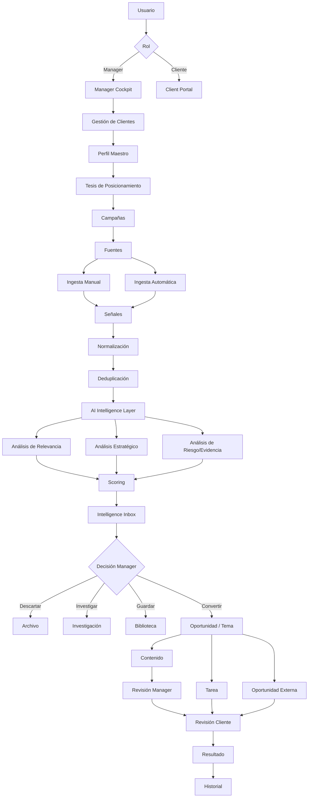
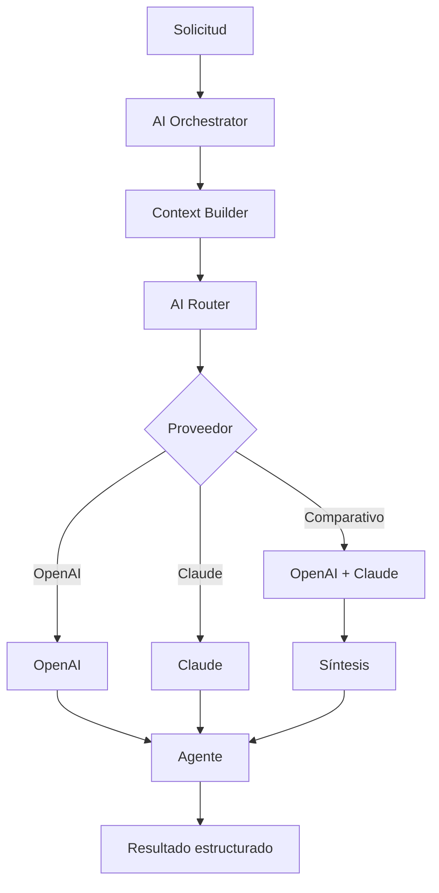
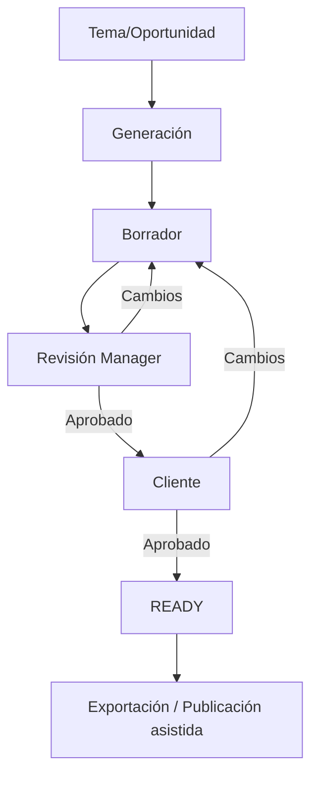
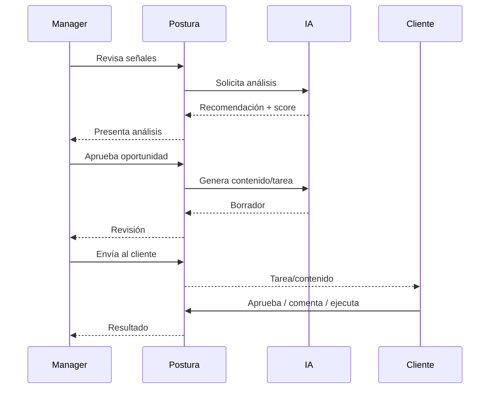
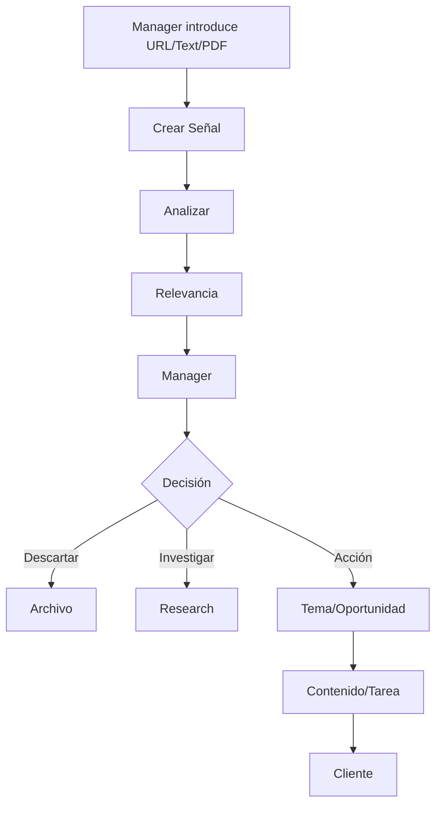
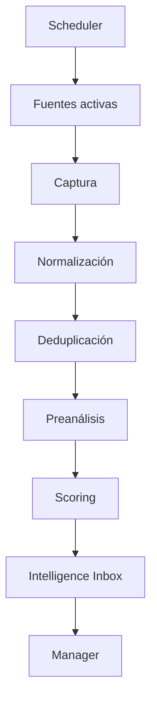

# POSTURA — FASE 4
## Documento 04 de 16 — Arquitectura Funcional Integral del MVP

**Código:** POSTURA-F4-D04  
**Versión:** 1.0  
**Estado:** Especificación funcional de arquitectura  
**Tipo de documento:** Arquitectura funcional del producto  
**Proyecto:** Postura — Positioning Intelligence & Management System  
**Formato:** Markdown  
**Ámbito:** MVP web-first, Managed SaaS, Manager + Cliente, Firebase, OpenAI/Claude, GitHub/Electron

---

# 1. Propósito del documento

Este documento define la arquitectura funcional integral del MVP de Postura.

Su función es transformar las decisiones estratégicas, funcionales y operativas de los documentos anteriores en una estructura clara de:

- módulos;
- submódulos;
- responsabilidades;
- entradas;
- salidas;
- eventos;
- dependencias;
- estados;
- flujos;
- interacción entre Manager y Cliente;
- interacción con inteligencia artificial;
- circulación de Señales;
- generación de Oportunidades;
- generación de Contenido;
- asignación de Tareas;
- captura de Resultados;
- auditoría;
- límites del MVP.

Este documento **no define todavía el código, estructura definitiva de Firestore, reglas Firebase, endpoints exactos, clases, funciones o componentes UI concretos**. Eso se desarrollará en fases posteriores.

Su objetivo es responder con precisión a la pregunta:

> ¿Cómo debe funcionar Postura como sistema completo antes de decidir cómo se programa cada componente?

---

# 2. Documentos de referencia

Este documento se apoya en:

1. **POSTURA-F1-D01 — Documento Maestro de Definición, Visión y Alcance**
2. **POSTURA-F2-D02 — Especificación Funcional del MVP**
3. **POSTURA-F3-D03 — Roles, Usuarios y Modelo Operativo Detallado**

En caso de contradicción, deberá revisarse primero la decisión estratégica más reciente aprobada por el proyecto.

---

# 3. Definición funcional resumida

Postura es un **sistema inteligente de gestión de posicionamiento profesional**.

Su función principal no es generar contenido por volumen.

Su función es:

```text
OBSERVAR
   ↓
COMPRENDER
   ↓
FILTRAR
   ↓
RELACIONAR
   ↓
PRIORIZAR
   ↓
RECOMENDAR
   ↓
DECIDIR
   ↓
EJECUTAR
   ↓
MEDIR
   ↓
APRENDER
```

La salida del sistema puede ser:

- una tarea;
- un artículo;
- un guion;
- una publicación;
- una recomendación;
- una oportunidad;
- una investigación;
- una respuesta;
- una participación;
- una acción de networking;
- una decisión de no publicar.

Por tanto, **Contenido** es una salida posible del sistema, no el centro de su arquitectura.

---

# 4. Principio arquitectónico central

La arquitectura funcional del MVP se construirá alrededor de cinco elementos principales:

1. **Cliente**
2. **Perfil Maestro**
3. **Tesis de Posicionamiento**
4. **Sistema de Inteligencia**
5. **Manager Humano**

El sistema debe mantener este ciclo:

```text
CLIENTE
   ↓
PERFIL MAESTRO
   ↓
TESIS
   ↓
FUENTES / SEÑALES
   ↓
INTELIGENCIA IA
   ↓
SCORING Y RECOMENDACIÓN
   ↓
MANAGER
   ↓
DECISIÓN
   ↓
TAREA / CONTENIDO / OPORTUNIDAD
   ↓
CLIENTE
   ↓
APROBACIÓN / EJECUCIÓN
   ↓
RESULTADO
   ↓
HISTORIAL
```

---

# 5. Vista general de arquitectura funcional



---

# 6. Mapa de módulos del MVP

La arquitectura funcional se divide en 13 módulos principales.

| Código | Módulo | Función principal |
|---|---|---|
| MOD-01 | Acceso y Sesiones | Autenticación y control de sesión |
| MOD-02 | Gestión de Usuarios y Clientes | Crear, invitar, activar, suspender y administrar clientes |
| MOD-03 | Perfil Maestro | Construir y mantener la identidad profesional del cliente |
| MOD-04 | Tesis y Campañas | Definir qué posicionamiento se quiere construir |
| MOD-05 | Fuentes | Registrar y administrar orígenes de información |
| MOD-06 | Ingesta y Señales | Recibir información manual y automática |
| MOD-07 | Inteligencia Artificial | Analizar señales y generar razonamiento estratégico |
| MOD-08 | Scoring e Intelligence Inbox | Priorizar y presentar información al Manager |
| MOD-09 | Oportunidades y Temas | Convertir señales relevantes en acciones potenciales |
| MOD-10 | Contenido | Crear y revisar activos de contenido |
| MOD-11 | Tareas y Aprobaciones | Coordinar acciones Manager–Cliente |
| MOD-12 | Resultados y Biblioteca | Registrar resultados y conservar historial |
| MOD-13 | Configuración, Seguridad y Auditoría | Controlar IA, credenciales, permisos y trazabilidad |

---

# 7. MOD-01 — Acceso y Sesiones

## 7.1 Objetivo

Gestionar el acceso seguro de Managers y Clientes a Postura.

---

## 7.2 Funciones

- inicio de sesión;
- cierre de sesión;
- recuperación de acceso;
- validación de estado de cuenta;
- detección de primer ingreso;
- redirección por rol;
- control de sesión;
- expiración;
- cierre de sesión IA;
- limpieza de credenciales temporales;
- bloqueo de cuentas suspendidas.

---

## 7.3 Entradas

- correo;
- contraseña o mecanismo de autenticación autorizado;
- token de invitación;
- estado de usuario;
- rol;
- datos de sesión.

---

## 7.4 Salidas

- sesión válida;
- acceso denegado;
- onboarding obligatorio;
- dashboard correspondiente;
- sesión cerrada.

---

## 7.5 Dependencias

- Gestión de Usuarios;
- Firebase Authentication;
- Seguridad;
- Auditoría.

---

# 8. MOD-02 — Gestión de Usuarios y Clientes

## 8.1 Objetivo

Permitir al Manager administrar las personas cuyo posicionamiento está siendo gestionado.

---

## 8.2 Funciones del Manager

- crear cliente;
- editar información inicial;
- enviar invitación;
- reenviar invitación;
- revocar invitación;
- suspender cliente;
- reactivar cliente;
- archivar cliente;
- consultar estado de onboarding;
- acceder al entorno individual del cliente.

---

## 8.3 Vista conceptual del cliente

Cada cliente deberá ser tratado funcionalmente como un espacio independiente.

```text
CLIENTE
   │
   ├── Perfil
   ├── Tesis
   ├── Campañas
   ├── Fuentes
   ├── Señales
   ├── Temas
   ├── Oportunidades
   ├── Contenido
   ├── Tareas
   ├── Resultados
   └── Biblioteca
```

---

## 8.4 Regla crítica

La información de dos clientes diferentes nunca deberá mezclarse en:

- búsquedas;
- IA;
- dashboards;
- recomendaciones;
- señales;
- contenidos;
- tareas;
- resultados.

---

# 9. MOD-03 — Perfil Maestro

## 9.1 Objetivo

Construir una representación rica, progresiva y reutilizable del cliente.

El Perfil Maestro será una de las principales fuentes de contexto para los agentes de IA.

---

## 9.2 Categorías funcionales

### Identidad

- nombre;
- descripción profesional;
- ubicación general;
- idiomas.

### Carrera

- profesión;
- cargos;
- empresas;
- experiencia;
- trayectoria.

### Formación

- estudios;
- certificaciones;
- programas;
- formación especializada.

### Autoridad demostrable

- publicaciones;
- proyectos;
- conferencias;
- premios;
- casos;
- patentes;
- reconocimientos;
- experiencia relevante.

### Actividad comercial

- servicios;
- productos;
- empresas;
- clientes objetivo;
- mercados.

### Presencia digital

- sitio web;
- LinkedIn;
- YouTube;
- Instagram;
- Facebook;
- TikTok;
- X;
- blogs;
- otros perfiles.

### Posicionamiento

- temas dominados;
- temas deseados;
- temas prohibidos;
- audiencia;
- mercados;
- objetivos.

### Voz

- tono;
- formalidad;
- estilo;
- expresiones;
- palabras preferidas;
- palabras a evitar.

---

# 10. Onboarding progresivo

El Perfil Maestro no será completado mediante un formulario masivo.

Flujo:

```text
DATOS MÍNIMOS
     ↓
CLIENTE APORTA
     ↓
DOCUMENTOS / URLs
     ↓
IA PROPONE
     ↓
CLIENTE / MANAGER CONFIRMAN
     ↓
PERFIL MAESTRO
     ↓
MEJORA CONTINUA
```

---

# 11. Estados de información del Perfil Maestro

Todo dato enriquecido automáticamente deberá poder tener estado:

```text
PENDING
CONFIRMED
REJECTED
UPDATED
```

Esto permite diferenciar:

> "La IA encontró esta información"

de:

> "Esta información está confirmada como verdadera por el cliente o Manager".

---

# 12. Evidence Vault

## 12.1 Objetivo

Relacionar afirmaciones importantes del Perfil Maestro con evidencia verificable.

Ejemplo:

```text
Afirmación:
"Experiencia en gobernanza de IA"

Evidencia:
- proyecto;
- artículo;
- cargo;
- certificación;
- conferencia;
- documento.
```

---

## 12.2 Función

Reducir:

- exageraciones;
- afirmaciones no demostrables;
- errores de perfil;
- contenido reputacionalmente riesgoso.

---

## 12.3 Estado MVP

Se implementará en formato básico.

No se construirá todavía un motor complejo de validación probatoria.

---

# 13. MOD-04 — Tesis de Posicionamiento y Campañas

## 13.1 Objetivo

Definir con precisión qué percepción se pretende construir en el mercado.

---

# 14. Componentes de una Tesis

Toda tesis deberá responder:

### ¿Quién?

La identidad profesional que se desea fortalecer.

### ¿Como qué?

La categoría o autoridad que se pretende construir.

### ¿Ante quién?

La audiencia objetivo.

### ¿Sobre qué?

El dominio o área temática.

### ¿Para qué?

El objetivo estratégico.

### ¿Con qué evidencia?

La experiencia que respalda esa posición.

### ¿Con qué límites?

Temas, reglas y restricciones.

---

# 15. Ejemplo conceptual

```text
POSICIONAR A:
Juan Vasquez

COMO:
Autoridad en gobernanza y regulación de IA

ANTE:
General Counsel, ejecutivos, empresas y equipos jurídicos

PARA:
Desarrollo de práctica profesional y autoridad pública

BASADO EN:
Experiencia, publicaciones, proyectos y actividad profesional
```

---

# 16. Campañas

Un cliente podrá tener varias tesis.

Cada tesis puede operarse como una campaña separada.

Ejemplo:

```text
CLIENTE
   │
   ├── Campaña A
   │      └── AI Governance
   │
   └── Campaña B
          └── Patent Prosecution
```

Esto evita mezclar públicos, objetivos y mensajes incompatibles.

---

# 17. Estados de tesis

```text
DRAFT
UNDER_REVIEW
ACTIVE
PAUSED
ARCHIVED
```

---

# 18. MOD-05 — Fuentes

## 18.1 Objetivo

Administrar los lugares donde Postura obtiene información.

---

# 19. Tipos de fuente

El MVP deberá poder registrar:

- RSS;
- sitio web;
- medio;
- blog;
- página regulatoria;
- organismo público;
- repositorio;
- fuente académica;
- newsletter;
- canal;
- URL específica;
- fuente manual;
- API externa;
- fuente especializada.

Las redes sociales podrán incorporarse únicamente mediante mecanismos técnicamente y contractualmente permitidos.

---

# 20. Fuente global y fuente de cliente

## Fuente global

Puede ser relevante para múltiples clientes.

Ejemplo:

- grandes medios tecnológicos;
- organismos internacionales;
- publicaciones globales.

## Fuente de cliente

Específica para una tesis, sector o profesional.

Ejemplo:

- oficina de patentes;
- asociación profesional;
- regulador especializado.

---

# 21. Propiedades funcionales de una fuente

Una fuente deberá permitir definir:

- nombre;
- tipo;
- URL;
- alcance;
- cliente;
- campaña;
- temática;
- idioma;
- región;
- frecuencia;
- estado;
- nivel de confianza;
- forma de ingestión.

---

# 22. Estados de fuente

```text
ACTIVE
PAUSED
ERROR
ARCHIVED
```

---

# 23. MOD-06 — Ingesta y Señales

## 23.1 Objetivo

Unificar toda información potencialmente relevante en un solo modelo conceptual: la **Señal**.

---

# 24. Principio de Señal

Postura no tendrá arquitecturas separadas para cada tipo de información.

Una noticia, una regulación, una publicación de blog o un evento serán procesados inicialmente como una Señal.

---

# 25. Entrada manual

El Manager podrá insertar manualmente:

- URL;
- noticia;
- texto;
- documento;
- PDF;
- publicación;
- regulación;
- sentencia;
- evento;
- idea;
- investigación;
- tendencia;
- empresa;
- competidor;
- oportunidad;
- tema.

---

# 26. Entrada automática

Postura podrá obtener información automáticamente mediante fuentes habilitadas.

Flujo conceptual:

```text
SCHEDULER
   ↓
FUENTES ACTIVAS
   ↓
OBTENCIÓN
   ↓
NORMALIZACIÓN
   ↓
DEDUPLICACIÓN
   ↓
SEÑALES
```

---

# 27. Normalización

La información recibida deberá transformarse a una estructura común.

Conceptualmente:

```text
Signal
- title
- type
- source
- url
- publishedAt
- capturedAt
- language
- region
- rawContent
- summary
- clientId
- campaignId
- ingestionMode
- status
```

La definición técnica final corresponde al Documento de Modelo de Datos.

---

# 28. Deduplicación

El sistema deberá intentar detectar cuando varias fuentes se refieren al mismo evento.

Objetivo:

Evitar que cinco artículos sobre el mismo hecho aparezcan como cinco oportunidades diferentes.

---

# 29. Agrupación de señales

Varias Señales podrán relacionarse con un Tema.

Ejemplo:

```text
Señal 1 ─┐
Señal 2 ─┼──> Tema estratégico
Señal 3 ─┘
```

Esta capacidad permite que Postura supere el modelo de "noticia individual".

---

# 30. Estados de Señal

```text
NEW
PROCESSING
ANALYZED
RELEVANT
LOW_RELEVANCE
DISCARDED
SAVED
CONVERTED
ERROR
```

---

# 31. MOD-07 — Inteligencia Artificial

## 31.1 Objetivo

Transformar información bruta en análisis útil para el Manager.

---

# 32. Capa funcional de IA



---

# 33. AI Orchestrator

Será responsable funcionalmente de:

- recibir solicitudes;
- determinar tipo de tarea;
- reunir contexto;
- seleccionar modo;
- invocar agente;
- devolver resultado estructurado;
- registrar ejecución.

---

# 34. Context Builder

Antes de ejecutar una tarea estratégica, deberá reunir únicamente el contexto necesario.

Puede incluir:

- Perfil Maestro;
- tesis;
- campaña;
- señal;
- fuentes;
- evidencias;
- contenidos previos;
- preferencias de voz;
- instrucciones del Manager.

---

# 35. AI Router

Permitirá:

```text
OPENAI
CLAUDE
AUTOMATIC
COMPARATIVE
```

---

# 36. Agentes base del MVP

Se definen cuatro capacidades principales.

---

## AGENT-01 — Profile Intelligence

Funciones:

- interpretar información del cliente;
- detectar datos importantes;
- proponer enriquecimiento;
- resumir trayectoria;
- estructurar Perfil Maestro;
- identificar evidencia faltante.

---

## AGENT-02 — Research & Signals

Funciones:

- analizar señales;
- resumir fuentes;
- identificar hechos;
- detectar coincidencias;
- agrupar información;
- separar información central de ruido.

---

## AGENT-03 — Positioning Strategist

Funciones:

- relacionar señal con tesis;
- determinar relevancia;
- identificar audiencia;
- valorar timing;
- sugerir ángulo;
- identificar oportunidad;
- identificar riesgo;
- recomendar acción.

---

## AGENT-04 — Content & Tasks

Funciones:

- crear guiones;
- crear posts;
- crear artículos;
- crear briefs;
- preparar tareas;
- adaptar formato;
- generar borradores;
- estructurar acciones.

---

# 37. Evidence / Risk Check

No será todavía un gran agente independiente.

Será una capacidad transversal utilizada para:

- identificar afirmaciones no verificadas;
- diferenciar hechos de opiniones;
- señalar riesgo;
- conservar fuentes;
- evitar atribuciones falsas.

---

# 38. Salida estructurada de IA

La IA no deberá devolver únicamente texto libre.

Ejemplo conceptual:

```json
{
  "relevanceScore": 92,
  "whyItMatters": "...",
  "thesisMatch": "...",
  "audience": ["..."],
  "recommendedAction": "...",
  "riskLevel": "LOW",
  "evidence": [],
  "contentIdeas": [],
  "warnings": []
}
```

Esto facilitará:

- UI;
- filtros;
- scoring;
- auditoría;
- comparación.

---

# 39. MOD-08 — Scoring e Intelligence Inbox

## 39.1 Objetivo

Reducir cientos o miles de señales a un grupo pequeño de decisiones relevantes.

---

# 40. Factores de scoring

El MVP deberá considerar como mínimo:

- coincidencia con tesis;
- relevancia para audiencia;
- actualidad;
- autoridad demostrable;
- diferenciación;
- potencial de posicionamiento;
- potencial comercial;
- riesgo;
- calidad de fuente.

---

# 41. Score conceptual

```text
0 ─────────────────────────── 100

0–39    Baja prioridad
40–69   Revisión opcional
70–84   Relevante
85–100  Alta prioridad
```

Los rangos podrán ajustarse posteriormente.

---

# 42. Scoring explicable

Toda señal priorizada deberá indicar por qué obtuvo una puntuación.

Ejemplo:

```text
Relevancia: 93/100

+ Alta coincidencia con tesis
+ Audiencia objetivo directa
+ Tema en crecimiento
+ Cliente tiene experiencia demostrable
+ Fuente confiable
- Riesgo reputacional moderado
```

---

# 43. Intelligence Inbox

La bandeja de inteligencia será una de las vistas principales del Manager.

Deberá mostrar:

- señales nuevas;
- señales críticas;
- señales por cliente;
- señales por campaña;
- relevancia;
- riesgo;
- origen;
- acción recomendada;
- estado;
- proveedor IA utilizado.

---

# 44. Acciones desde Intelligence Inbox

El Manager podrá:

```text
DESCARTAR
GUARDAR
INVESTIGAR
CREAR TEMA
CREAR OPORTUNIDAD
GENERAR CONTENIDO
CREAR TAREA
```

No todas las señales deben convertirse en contenido.

---

# 45. MOD-09 — Temas y Oportunidades

## 45.1 Tema

Un Tema es una agrupación estratégica de información.

Puede originarse a partir de:

- una señal;
- varias señales;
- una idea manual;
- una investigación;
- una recomendación de IA.

---

# 46. Tema vs Señal

```text
SEÑAL
"Se publicó X noticia"

TEMA
"Qué significa X para las empresas que adoptan IA"
```

La Señal es el acontecimiento.

El Tema es el espacio de posicionamiento.

---

# 47. Oportunidad

Una Oportunidad es una posibilidad concreta de acción.

Ejemplos:

- participar en conferencia;
- grabar reel;
- publicar artículo;
- comentar una regulación;
- participar en podcast;
- responder consulta pública;
- presentar candidatura;
- contactar organización;
- escribir artículo invitado.

---

# 48. Estados de oportunidad

```text
DETECTED
UNDER_REVIEW
RECOMMENDED
SENT_TO_CLIENT
ACCEPTED
REJECTED
IN_PROGRESS
COMPLETED
ARCHIVED
```

---

# 49. MOD-10 — Contenido

## 49.1 Objetivo

Transformar una decisión estratégica en un activo comunicacional.

---

# 50. Tipos MVP de contenido

- short post;
- LinkedIn post;
- artículo;
- blog;
- reel script;
- short video script;
- long-form video outline;
- brief;
- talking points;
- comentario;
- respuesta;
- email/nota de presentación, cuando sea necesario para una oportunidad.

---

# 51. Orígenes de contenido

Un contenido deberá indicar si fue generado desde:

- señal;
- tema;
- oportunidad;
- tarea;
- decisión manual;
- campaña.

---

# 52. Estados de contenido

```text
DRAFT
AI_GENERATED
MANAGER_REVIEW
MANAGER_APPROVED
CLIENT_REVIEW
CHANGES_REQUESTED
CLIENT_APPROVED
READY
ARCHIVED
```

---

# 53. Flujo de contenido



---

# 54. Regla de identidad

Ningún contenido que represente públicamente la opinión del Cliente deberá considerarse final sin su aprobación.

---

# 55. MOD-11 — Tareas y Aprobaciones

## 55.1 Objetivo

Convertir la estrategia en acciones concretas.

---

# 56. Ejemplos de tarea

```text
Grabar video de 60 segundos
Revisar artículo
Confirmar información
Aceptar oportunidad
Preparar comentario
Subir fotografía
Responder pregunta
Completar experiencia profesional
```

---

# 57. Estados de tarea

```text
DRAFT
ASSIGNED
VIEWED
IN_PROGRESS
COMPLETED
REJECTED
CANCELLED
```

---

# 58. Componentes mínimos de una tarea

- título;
- descripción;
- cliente;
- campaña;
- prioridad;
- fecha sugerida;
- material adjunto;
- contenido relacionado;
- instrucciones;
- estado;
- comentarios;
- resultado.

---

# 59. Aprobaciones

La aprobación deberá ser un objeto funcional identificable.

Debe poder registrar:

- qué se aprobó;
- quién aprobó;
- fecha;
- decisión;
- comentarios.

---

# 60. MOD-12 — Resultados y Biblioteca

## 60.1 Objetivo

Conservar lo que ocurrió después de una recomendación.

---

# 61. Resultados MVP

El MVP no implementará aprendizaje predictivo avanzado.

Sí deberá capturar datos básicos.

Ejemplos:

- publicado;
- no publicado;
- fecha;
- canal;
- URL;
- visualizaciones;
- reacciones;
- comentarios;
- leads;
- oportunidades generadas;
- observaciones;
- resultado cualitativo.

---

# 62. Por qué capturar resultados desde MVP

El aprendizaje avanzado se construirá posteriormente.

Sin datos históricos no será posible entrenar o ajustar una estrategia futura.

Por tanto:

```text
MVP:
CAPTURAR

FUTURO:
APRENDER
```

---

# 63. Biblioteca

La Biblioteca funcionará como repositorio histórico.

Podrá contener:

- artículos;
- guiones;
- publicaciones;
- documentos;
- contenido aprobado;
- oportunidades;
- resultados;
- evidencias;
- materiales del cliente.

---

# 64. MOD-13 — Configuración, Seguridad y Auditoría

## 64.1 Objetivo

Controlar los aspectos transversales del sistema.

---

# 65. AI Control Center

El Manager autorizado podrá consultar:

- proveedores configurados;
- proveedor activo;
- modo;
- estado;
- conexión;
- modelo utilizado;
- ejecución reciente;
- errores;
- costo estimado cuando sea posible.

---

# 66. API Keys

Comportamiento predeterminado:

```text
TEMPORAL
```

La clave:

1. se introduce;
2. se valida;
3. se utiliza durante sesión;
4. se invalida al cerrar sesión o expirar.

---

# 67. Guardado opcional

El usuario autorizado podrá seleccionar:

```text
Usar durante esta sesión
Guardar de forma segura
```

Guardar deberá ser una decisión explícita.

---

# 68. Auditoría

Eventos críticos:

- login;
- logout;
- cliente creado;
- cliente suspendido;
- señal creada;
- análisis ejecutado;
- contenido generado;
- aprobación;
- rechazo;
- tarea;
- oportunidad;
- configuración IA;
- cambio de permisos;
- eliminación de credencial.

---

# 69. Arquitectura de interacción Manager–Cliente



---

# 70. Flujo end-to-end de Señal a Resultado

```text
1. Fuente detecta información
2. Postura crea Señal
3. Señal se normaliza
4. Se intenta deduplicar
5. IA analiza
6. Se relaciona con Perfil
7. Se relaciona con Tesis
8. Se calcula Score
9. Intelligence Inbox
10. Manager revisa
11. Manager decide
12. Se crea Tema/Oportunidad
13. Se genera Tarea o Contenido
14. Manager revisa
15. Cliente recibe
16. Cliente aprueba/ejecuta
17. Se registra Resultado
18. Se conserva historial
```

---

# 71. Flujo manual completo



---

# 72. Flujo automático completo



El flujo automático termina en decisión humana dentro del MVP.

---

# 73. Eventos funcionales principales

Se recomienda que el sistema piense internamente en eventos.

Ejemplos:

```text
USER_LOGGED_IN
CLIENT_CREATED
ONBOARDING_COMPLETED
PROFILE_UPDATED
THESIS_ACTIVATED
SOURCE_ACTIVATED
SIGNAL_CREATED
SIGNAL_ANALYZED
SIGNAL_HIGH_PRIORITY
OPPORTUNITY_CREATED
CONTENT_GENERATED
CONTENT_MANAGER_APPROVED
CONTENT_CLIENT_APPROVED
TASK_ASSIGNED
TASK_COMPLETED
RESULT_RECORDED
AI_PROVIDER_ERROR
AI_SESSION_EXPIRED
```

La implementación técnica de estos eventos se decidirá posteriormente.

---

# 74. Dependencias funcionales

```text
Perfil Maestro
     ↓
Tesis
     ↓
Campaña
     ↓
Señal
     ↓
Análisis
     ↓
Scoring
     ↓
Oportunidad
     ↓
Contenido/Tarea
     ↓
Resultado
```

No todos los módulos necesitan utilizar toda la cadena, pero la arquitectura deberá respetar estas dependencias.

---

# 75. Estados transversales

Postura deberá utilizar estados explícitos y evitar inferir estados únicamente por ausencia o presencia de datos.

Ejemplo:

No interpretar:

```text
approvedAt != null
```

como única fuente de estado.

Preferir:

```text
status = CLIENT_APPROVED
```

más metadatos de aprobación.

---

# 76. Manejo de errores

Cada módulo deberá poder representar errores sin bloquear todo el sistema.

Ejemplos:

- fuente inaccesible;
- señal incompleta;
- IA no disponible;
- API Key inválida;
- documento no procesable;
- deduplicación incierta;
- error de proveedor;
- tarea sin cliente;
- autorización insuficiente.

---

# 77. Principio de degradación controlada

Si OpenAI falla pero Claude está disponible:

Postura podrá continuar cuando el modo lo permita.

Si Claude falla pero OpenAI está disponible:

Postura podrá continuar cuando el modo lo permita.

Si ambos fallan:

las funciones no IA deben continuar operativas.

---

# 78. Principio de trazabilidad

Toda recomendación estratégica importante deberá permitir conocer:

- cliente;
- tesis;
- señal;
- fuentes;
- análisis;
- proveedor IA;
- fecha;
- Manager;
- decisión.

---

# 79. Principio de evidencia

Postura deberá diferenciar visual y funcionalmente:

```text
FUENTE
HECHO
INTERPRETACIÓN
OPINIÓN
RECOMENDACIÓN
```

Esto es especialmente importante cuando el Cliente sea profesional regulado.

---

# 80. Principio de mínima automatización irreversible

El MVP puede automatizar:

- recopilación;
- clasificación;
- resumen;
- scoring;
- borradores;
- priorización.

No automatizará acciones públicas irreversibles.

---

# 81. Navegación funcional del Manager

Mapa recomendado:

```text
Dashboard
│
├── Clientes
│   └── Cliente
│       ├── Resumen
│       ├── Perfil
│       ├── Tesis
│       ├── Campañas
│       ├── Señales
│       ├── Temas
│       ├── Oportunidades
│       ├── Contenido
│       ├── Tareas
│       ├── Resultados
│       └── Biblioteca
│
├── Intelligence Inbox
├── Fuentes
├── IA
├── Biblioteca
├── Auditoría
└── Configuración
```

---

# 82. Navegación funcional del Cliente

Mapa recomendado:

```text
Inicio
├── Mis tareas
├── Contenido
├── Oportunidades
├── Mi perfil
├── Mi posicionamiento
├── Resultados
└── Biblioteca
```

---

# 83. Dashboard Manager

Indicadores recomendados MVP:

- clientes activos;
- onboarding pendientes;
- señales nuevas;
- señales de alta prioridad;
- tareas pendientes;
- contenidos pendientes;
- oportunidades activas;
- errores de fuentes;
- errores IA.

---

# 84. Dashboard Cliente

Indicadores:

- tareas pendientes;
- contenido para revisar;
- oportunidades;
- porcentaje de perfil;
- actividades recientes;
- resultados básicos.

---

# 85. Automatizaciones MVP permitidas

El MVP podrá automatizar:

- consulta periódica de fuentes;
- creación de señales;
- deduplicación básica;
- preclasificación;
- scoring;
- resumen;
- análisis;
- propuesta de contenido;
- propuesta de tarea;
- notificaciones.

---

# 86. Automatizaciones excluidas

No se permitirá:

- publicación autónoma;
- respuesta autónoma en redes;
- contacto autónomo de terceros;
- envío masivo;
- decisiones reputacionales finales;
- creación libre de agentes;
- modificación automática de tesis;
- modificación automática de Perfil confirmado;
- eliminación automática de evidencia.

---

# 87. Alcance funcional de Electron

Electron será un contenedor opcional del frontend web.

No deberá crear una arquitectura funcional paralela.

```text
MISMA APP
   ├── Web
   └── Electron
```

Las reglas de negocio permanecerán en el sistema central.

---

# 88. Alcance funcional de GitHub Pages

GitHub Pages podrá servir la interfaz web estática del MVP.

No deberá contener:

- secretos;
- claves OpenAI;
- claves Claude;
- lógica sensible;
- autorización real;
- privilegios administrativos confiables únicamente desde frontend.

---

# 89. Firebase como plataforma de soporte

Funcionalmente se espera utilizar:

```text
Firebase Authentication
Cloud Firestore
Cloud Storage
Cloud Functions
```

La distribución exacta de responsabilidades se definirá en los documentos técnicos.

---

# 90. Límites entre frontend y backend

## Frontend

Responsable de:

- mostrar información;
- capturar interacción;
- validación básica;
- navegación;
- experiencia de usuario.

## Backend / funciones seguras

Responsable de:

- autorización;
- secretos;
- IA;
- procesos automáticos;
- operaciones críticas;
- integridad;
- auditoría.

---

# 91. Reglas funcionales de seguridad

## ARQ-RN-001

Toda operación sensible debe verificar usuario y rol.

## ARQ-RN-002

Todo recurso de Cliente debe estar asociado a un ámbito identificable.

## ARQ-RN-003

La interfaz no constituye una barrera de seguridad.

## ARQ-RN-004

Las API Keys no pueden llegar a repositorios públicos.

## ARQ-RN-005

Las señales automáticas no se convierten automáticamente en publicaciones.

## ARQ-RN-006

El Cliente debe aprobar contenido que represente su opinión.

## ARQ-RN-007

El Manager puede descartar recomendaciones IA.

## ARQ-RN-008

La IA puede fallar sin bloquear las funciones administrativas principales.

## ARQ-RN-009

Toda Señal debe conservar referencia a su origen cuando exista.

## ARQ-RN-010

Los resultados IA deben poder registrar modelo/proveedor utilizado.

## ARQ-RN-011

Un dato de perfil sugerido por IA no se considera confirmado automáticamente.

## ARQ-RN-012

Una señal puede relacionarse con múltiples temas, pero su propiedad de cliente debe respetarse.

## ARQ-RN-013

Los contenidos deben mantener historial de estados.

## ARQ-RN-014

Las aprobaciones deben registrar actor y fecha.

## ARQ-RN-015

Los registros críticos se archivan antes de eliminarse físicamente.

---

# 92. Historias funcionales de arquitectura

## ARQ-HU-001 — Procesar señal manual

**Como** Manager  
**quiero** introducir una fuente manual  
**para** analizar inmediatamente una información relevante.

---

## ARQ-HU-002 — Recibir señales automáticas

**Como** Manager  
**quiero** que Postura consulte fuentes configuradas  
**para** no depender exclusivamente de búsquedas manuales.

---

## ARQ-HU-003 — Explicar relevancia

**Como** Manager  
**quiero** conocer por qué una señal tiene alta prioridad  
**para** mantener control sobre la recomendación.

---

## ARQ-HU-004 — Convertir señal en oportunidad

**Como** Manager  
**quiero** transformar una señal relevante en una oportunidad  
**para** convertir inteligencia en acción.

---

## ARQ-HU-005 — Convertir oportunidad en contenido

**Como** Manager  
**quiero** generar contenido basado en una oportunidad  
**para** preparar la intervención del cliente.

---

## ARQ-HU-006 — Aprobar contenido

**Como** Cliente  
**quiero** revisar el contenido antes de que represente mi identidad  
**para** conservar control sobre mi reputación.

---

## ARQ-HU-007 — Registrar resultado

**Como** Manager  
**quiero** registrar qué ocurrió con una acción  
**para** construir historial estratégico.

---

## ARQ-HU-008 — Continuar sin IA

**Como** Manager  
**quiero** acceder a perfiles, tareas y contenido existente aunque la IA falle  
**para** que la operación no quede bloqueada.

---

# 93. Criterios de aceptación de arquitectura funcional

## ARQ-CA-001

Todos los módulos principales están definidos.

## ARQ-CA-002

La relación entre Perfil, Tesis, Señal, Oportunidad, Tarea, Contenido y Resultado está documentada.

## ARQ-CA-003

Existe un flujo manual de ingestión.

## ARQ-CA-004

Existe un flujo automático de ingestión.

## ARQ-CA-005

Ambos flujos convergen en la entidad Señal.

## ARQ-CA-006

La arquitectura incorpora AI Orchestrator y AI Router.

## ARQ-CA-007

OpenAI y Claude pueden operar de forma independiente.

## ARQ-CA-008

Existe modo comparativo.

## ARQ-CA-009

El Intelligence Inbox es el centro de revisión de señales.

## ARQ-CA-010

El Manager conserva decisión final.

## ARQ-CA-011

El Cliente conserva aprobación de identidad.

## ARQ-CA-012

El flujo de resultados está presente.

## ARQ-CA-013

La publicación automática está fuera del MVP.

## ARQ-CA-014

La creación dinámica de agentes está fuera del MVP.

## ARQ-CA-015

El sistema puede degradar funcionalmente si un proveedor IA falla.

## ARQ-CA-016

La arquitectura es compatible con web y Electron.

## ARQ-CA-017

Los secretos no dependen del frontend.

## ARQ-CA-018

El sistema está preparado conceptualmente para múltiples clientes.

---

# 94. Matriz módulo → actor

| Módulo | Manager | Cliente | IA |
|---|---:|---:|---:|
| Acceso | Sí | Sí | No |
| Clientes | Sí | No | No |
| Perfil | Sí | Sí | Asiste |
| Tesis | Sí | Revisa | Asiste |
| Campañas | Sí | Consulta | Asiste |
| Fuentes | Sí | No | No |
| Señales | Sí | No MVP | Analiza |
| Intelligence Inbox | Sí | No | Genera análisis |
| Oportunidades | Sí | Responde | Sugiere |
| Contenido | Sí | Revisa | Genera |
| Tareas | Sí | Ejecuta | Sugiere |
| Resultados | Sí | Consulta | Futuro |
| Configuración IA | Sí | Opcional | — |
| Auditoría | Sí | No | No |

---

# 95. Matriz módulo → dependencia

| Módulo | Depende de |
|---|---|
| Perfil | Cliente |
| Tesis | Cliente + Perfil |
| Campaña | Tesis |
| Fuente | Cliente/Campaña opcional |
| Señal | Fuente |
| Análisis IA | Señal + Perfil + Tesis |
| Scoring | Análisis |
| Tema | Señal/Manager |
| Oportunidad | Tema/Señal |
| Contenido | Tema/Oportunidad |
| Tarea | Oportunidad/Contenido |
| Resultado | Tarea/Contenido/Oportunidad |

---

# 96. Arquitectura de información resumida

```text
ORGANIZATION
    │
    ├── USERS
    │
    └── CLIENTS
           │
           ├── PROFILE
           │     └── EVIDENCE
           │
           ├── THESES
           │     └── CAMPAIGNS
           │
           ├── SOURCES
           │     └── SIGNALS
           │            └── ANALYSES
           │
           ├── TOPICS
           ├── OPPORTUNITIES
           ├── CONTENT
           ├── TASKS
           ├── RESULTS
           └── LIBRARY
```

---

# 97. Flujo de valor del MVP

Postura debe demostrar que puede convertir:

```text
INFORMACIÓN DISPERSA
        ↓
SEÑAL RELEVANTE
        ↓
DECISIÓN ESTRATÉGICA
        ↓
ACCIÓN PREPARADA
        ↓
EJECUCIÓN DEL CLIENTE
        ↓
RESULTADO REGISTRADO
```

Ese es el ciclo que deberá validarse en el piloto.

---

# 98. KPI funcional principal del MVP

La métrica primaria no será:

> Cantidad de textos generados.

La pregunta de validación será:

> ¿Postura ayuda al Manager a identificar mejores oportunidades de posicionamiento y convertirlas en acciones ejecutables por el Cliente con menor esfuerzo y mejor calidad?

---

# 99. Indicadores iniciales sugeridos

- señales procesadas;
- señales descartadas;
- señales de alta relevancia;
- oportunidades creadas;
- oportunidades aceptadas;
- tareas completadas;
- contenidos aprobados;
- tiempo de Manager por cliente;
- acciones ejecutadas;
- resultados positivos registrados.

---

# 100. Exclusiones explícitas del Documento 04

Este documento no autoriza todavía:

- implementación de estructura Firestore definitiva;
- implementación de reglas Firebase definitivas;
- diseño visual final;
- creación de endpoints;
- selección final de modelos OpenAI/Claude;
- almacenamiento permanente de claves sin diseño de seguridad;
- publicación automática;
- integración completa con redes sociales;
- scraping masivo;
- Agent Factory;
- machine learning predictivo;
- CRM comercial;
- facturación;
- suscripciones;
- múltiples organizaciones visibles.

---

# 101. Directrices para IA desarrolladora

Una IA que utilice este documento debe:

1. Respetar los módulos definidos.
2. No fusionar arbitrariamente conceptos.
3. No convertir Señal en sinónimo de Noticia.
4. Mantener entrada manual y automática.
5. Conservar Intelligence Inbox como centro de revisión.
6. Mantener decisión humana.
7. Mantener Perfil Maestro como contexto principal.
8. Mantener Tesis como filtro estratégico.
9. Mantener OpenAI y Claude desacoplados mediante router.
10. No crear Agent Factory.
11. No publicar automáticamente.
12. Mantener aislamiento entre clientes.
13. Registrar estados explícitos.
14. Conservar trazabilidad.
15. Mantener web-first.
16. Tratar Electron como envoltorio de la misma aplicación.
17. No almacenar secretos en frontend.
18. No eliminar evidencia histórica sin proceso.
19. No implementar funcionalidades futuras como si fueran MVP.
20. Marcar cualquier ampliación como propuesta.

---

# 102. Decisiones cerradas al finalizar esta fase

Con la aprobación del Documento 04 quedan cerradas las siguientes decisiones funcionales:

1. Postura se estructura en 13 módulos principales.
2. La Señal es la unidad común de inteligencia entrante.
3. La información puede entrar manual o automáticamente.
4. Las fuentes son configurables.
5. Las señales son normalizadas.
6. Se implementa deduplicación básica.
7. El Perfil Maestro contextualiza la inteligencia.
8. La Tesis actúa como filtro de posicionamiento.
9. AI Orchestrator coordina el procesamiento IA.
10. AI Router abstrae OpenAI y Claude.
11. Existen cuatro capacidades de agentes base.
12. Evidence/Risk es transversal en MVP.
13. El scoring debe ser explicable.
14. Intelligence Inbox es la bandeja principal del Manager.
15. Señal y Tema son conceptos diferentes.
16. Tema y Oportunidad son conceptos diferentes.
17. Contenido no es el centro del sistema.
18. Tareas convierten estrategia en acción.
19. Cliente debe aprobar contenido que represente su identidad.
20. Resultados deben capturarse desde MVP.
21. Aprendizaje avanzado queda para fases posteriores.
22. Las API Keys son temporales por defecto.
23. La publicación autónoma queda excluida.
24. Electron no crea un producto diferente.
25. GitHub Pages no aloja secretos ni lógica sensible.
26. La arquitectura debe degradarse de forma controlada si falla IA.
27. Toda operación relevante deberá ser trazable.
28. El sistema debe estar preparado para múltiples clientes.
29. El MVP debe validar el ciclo información → decisión → acción → resultado.
30. Las siguientes fases técnicas deberán implementar esta arquitectura sin alterar sus principios.

---

# 103. Siguiente fase

## FASE 5 — Documento 05 de 16
### Arquitectura Técnica del MVP

El próximo documento deberá convertir esta arquitectura funcional en decisiones técnicas concretas.

Deberá definir:

- estructura del repositorio;
- HTML/CSS/TypeScript;
- estrategia de frontend;
- Firebase Authentication;
- Firestore;
- Cloud Storage;
- Cloud Functions;
- GitHub Pages;
- Firebase Hosting opcional;
- Electron;
- AI Orchestrator;
- AI Router;
- integración OpenAI;
- integración Claude;
- arquitectura de seguridad;
- jobs automáticos;
- manejo de secretos;
- logging;
- configuración por entornos;
- CI/CD;
- límites técnicos del MVP;
- requisitos de despliegue;
- estrategia de escalabilidad inicial.

---

# 104. Estado de la documentación

```text
FASE 1
✅ Documento 01 — Documento Maestro

FASE 2
✅ Documento 02 — Especificación Funcional del MVP

FASE 3
✅ Documento 03 — Roles, Usuarios y Modelo Operativo

FASE 4
✅ Documento 04 — Arquitectura Funcional Integral

FASE 5
⬜ Documento 05 — Arquitectura Técnica del MVP
```

---

**FIN DEL DOCUMENTO — POSTURA-F4-D04 v1.0**
