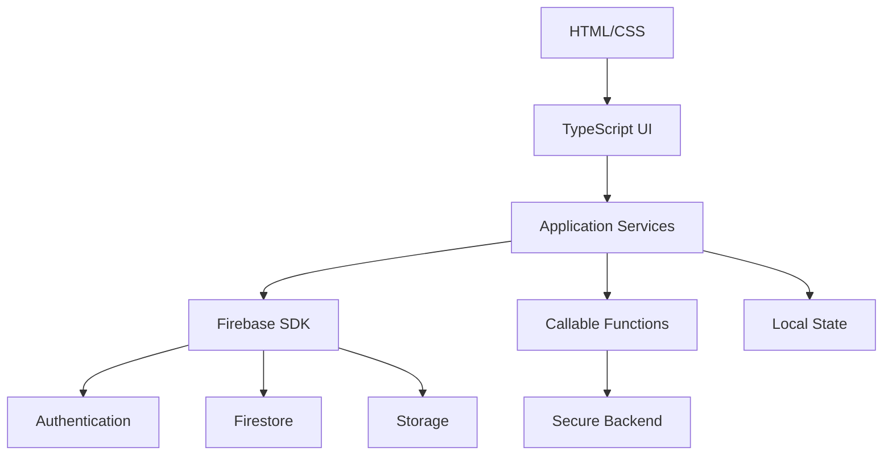
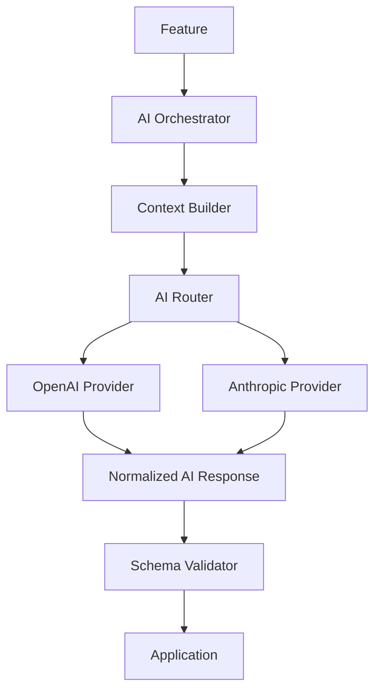
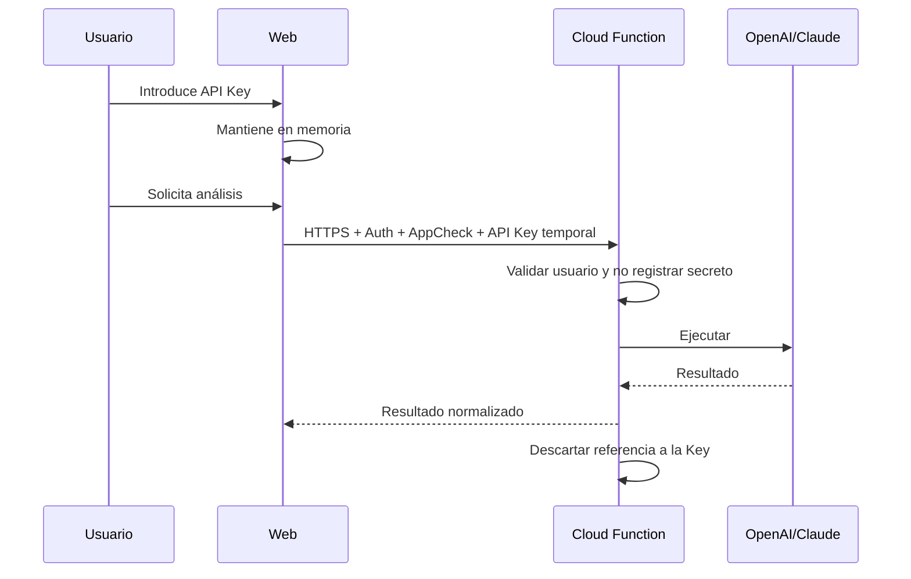
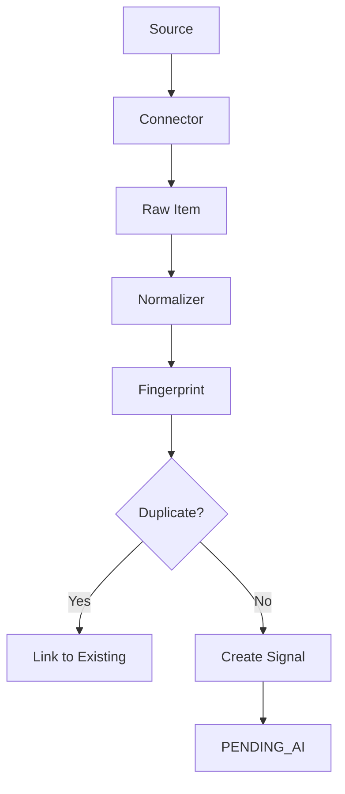
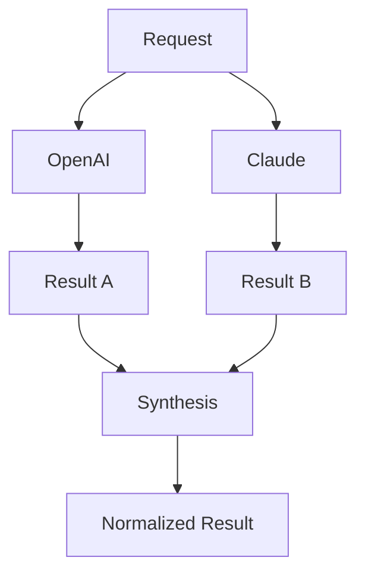
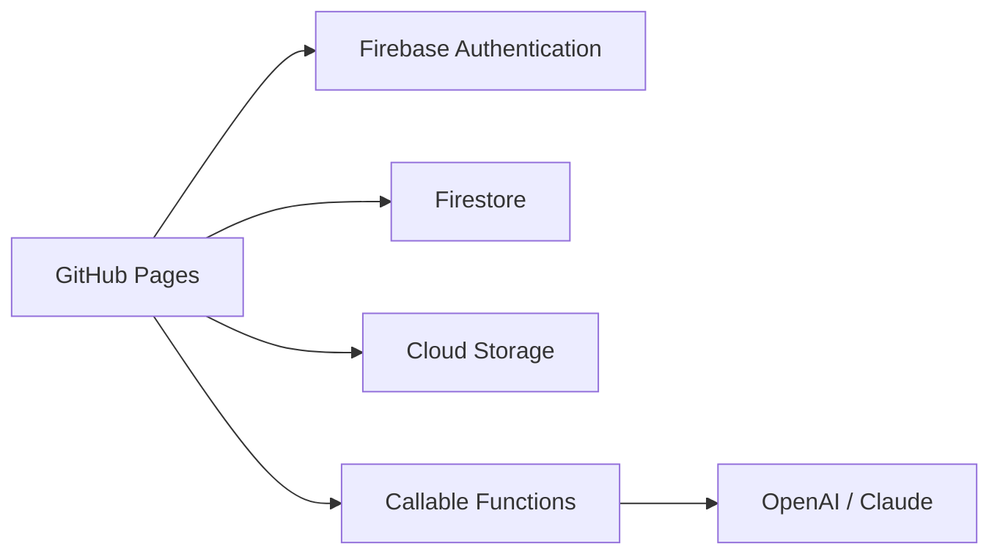
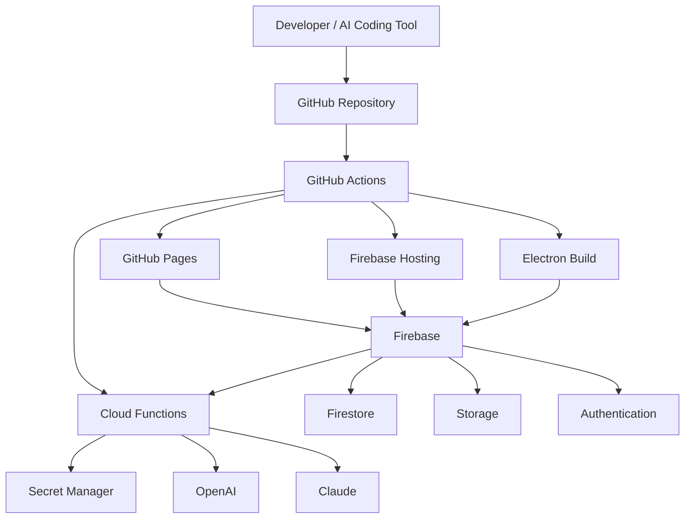

# POSTURA — FASE 5
## Documento 05 de 16 — Arquitectura Técnica del MVP

**Código:** POSTURA-F5-D05  
**Versión:** 1.0  
**Estado:** Arquitectura técnica propuesta para implementación  
**Tipo de documento:** Especificación técnica de alto nivel y contrato de implementación  
**Proyecto:** Postura — Positioning Intelligence & Management System  
**Formato:** Markdown  
**Ámbito:** MVP web-first + Electron, Firebase, GitHub, OpenAI y Claude  
**Fecha de referencia técnica:** 18 de agosto de 2026

---

# 1. Propósito del documento

Este documento convierte la arquitectura funcional definida en las fases anteriores en una arquitectura técnica concreta para construir el MVP de Postura.

Su objetivo es establecer, antes de escribir el producto completo:

- stack tecnológico;
- estructura del repositorio;
- organización del código;
- arquitectura frontend;
- arquitectura backend serverless;
- Firebase Authentication;
- Cloud Firestore;
- Cloud Storage;
- Cloud Functions;
- Firebase App Check;
- integración OpenAI;
- integración Claude;
- AI Orchestrator;
- AI Router;
- manejo temporal y persistente de API Keys;
- procesos automáticos;
- GitHub Pages;
- Firebase Hosting;
- Electron;
- seguridad;
- observabilidad;
- entornos;
- CI/CD;
- pruebas;
- despliegue;
- límites técnicos del MVP.

Este documento se utilizará como referencia directa por las inteligencias artificiales o desarrolladores que implementen el sistema.

---

# 2. Documentos previos obligatorios

La implementación técnica debe respetar:

1. **POSTURA-F1-D01 — Documento Maestro de Definición, Visión y Alcance**
2. **POSTURA-F2-D02 — Especificación Funcional del MVP**
3. **POSTURA-F3-D03 — Roles, Usuarios y Modelo Operativo Detallado**
4. **POSTURA-F4-D04 — Arquitectura Funcional Integral del MVP**

Este documento no autoriza modificar decisiones de producto ya cerradas.

---

# 3. Objetivo técnico del MVP

Construir una aplicación que pueda ejecutarse:

```text
1. En navegador
2. Desde GitHub Pages durante MVP/demostración
3. Desde Firebase Hosting cuando se requiera
4. Empaquetada como aplicación Electron
```

sin duplicar la lógica de negocio.

La arquitectura debe ser:

- web-first;
- modular;
- serverless;
- multi-client;
- segura;
- desacoplada de proveedores IA;
- desplegable desde GitHub;
- compatible con desarrollo asistido por IA;
- suficientemente sencilla para un MVP;
- preparada para crecer sin convertirse desde el inicio en una arquitectura empresarial excesiva.

---

# 4. Decisión de stack

## 4.1 Frontend

```text
HTML5
CSS3
TypeScript
Vite
Firebase Web SDK
```

### Decisión

Para el MVP se utilizará **TypeScript en lugar de JavaScript puro**.

Razones:

- tipado;
- menor cantidad de errores;
- contratos claros;
- mejor mantenibilidad;
- mejor experiencia con IA de programación;
- reutilización de tipos entre frontend, Cloud Functions y Electron.

No se utilizará Java como lenguaje principal del producto.

---

# 5. Framework frontend

El MVP utilizará:

```text
Vite + Vanilla TypeScript
```

No será obligatorio React, Angular o Vue.

## Justificación

El objetivo es mantener:

- HTML explícito;
- CSS controlado;
- TypeScript modular;
- bajo peso;
- menor complejidad inicial;
- fácil publicación estática;
- compatibilidad directa con Electron.

La arquitectura deberá permitir migrar posteriormente a un framework si el crecimiento de UI lo exige.

---

# 6. Backend

El backend del MVP será principalmente serverless.

```text
Firebase Cloud Functions 2nd Gen
Node.js 22
TypeScript
```

Node.js 22 será la versión objetivo inicial mientras siga soportada oficialmente por Firebase.

No se implementará un servidor Express/NestJS permanente en el MVP.

---

# 7. Persistencia

## Base principal

```text
Cloud Firestore
```

## Archivos

```text
Cloud Storage for Firebase
```

## Autenticación

```text
Firebase Authentication
```

## Procesos seguros

```text
Cloud Functions 2nd Gen
```

## Jobs programados

```text
Cloud Scheduler
+
Scheduled Cloud Functions
```

---

# 8. Repositorio

El proyecto utilizará un único repositorio Git.

Nombre sugerido:

```text
postura-mvp
```

---

# 9. Estructura recomendada del repositorio

```text
postura-mvp/
│
├── apps/
│   │
│   ├── web/
│   │   ├── index.html
│   │   ├── src/
│   │   │   ├── app/
│   │   │   ├── auth/
│   │   │   ├── manager/
│   │   │   ├── client/
│   │   │   ├── modules/
│   │   │   ├── components/
│   │   │   ├── services/
│   │   │   ├── state/
│   │   │   ├── utils/
│   │   │   ├── types/
│   │   │   ├── styles/
│   │   │   └── main.ts
│   │   │
│   │   ├── public/
│   │   ├── vite.config.ts
│   │   └── package.json
│   │
│   └── desktop/
│       ├── src/
│       │   ├── main.ts
│       │   ├── preload.ts
│       │   └── ipc/
│       ├── package.json
│       └── electron-builder.yml
│
├── functions/
│   ├── src/
│   │   ├── index.ts
│   │   ├── auth/
│   │   ├── clients/
│   │   ├── signals/
│   │   ├── sources/
│   │   ├── ai/
│   │   │   ├── orchestrator/
│   │   │   ├── router/
│   │   │   ├── providers/
│   │   │   │   ├── openai.provider.ts
│   │   │   │   └── anthropic.provider.ts
│   │   │   ├── agents/
│   │   │   ├── schemas/
│   │   │   └── security/
│   │   ├── tasks/
│   │   ├── content/
│   │   ├── opportunities/
│   │   ├── results/
│   │   ├── jobs/
│   │   ├── audit/
│   │   └── common/
│   └── package.json
│
├── packages/
│   └── shared/
│       ├── src/
│       │   ├── types/
│       │   ├── schemas/
│       │   ├── constants/
│       │   ├── enums/
│       │   └── validation/
│       └── package.json
│
├── firebase/
│   ├── firestore.rules
│   ├── firestore.indexes.json
│   └── storage.rules
│
├── docs/
│   ├── architecture/
│   └── decisions/
│
├── .github/
│   └── workflows/
│
├── firebase.json
├── .firebaserc
├── package.json
├── pnpm-workspace.yaml
├── tsconfig.base.json
├── .gitignore
├── .editorconfig
├── README.md
└── LICENSE
```

---

# 10. Gestor de paquetes

Se recomienda:

```text
pnpm
```

con workspaces.

## Motivo

Permite administrar:

- frontend;
- Electron;
- Functions;
- código compartido;

desde el mismo repositorio.

No constituye una dependencia funcional del producto; si fuera necesario puede utilizarse npm.

---

# 11. Paquete compartido

`packages/shared` deberá contener contratos comunes.

Ejemplos:

```text
UserRole
UserStatus
SignalStatus
TaskStatus
ContentStatus
OpportunityStatus
AiProvider
AiMode
RiskLevel
RelevanceBand
Client
PositioningThesis
Signal
AiAnalysis
```

Esto evita que frontend y backend mantengan definiciones diferentes.

---

# 12. Validación de datos

Se recomienda utilizar:

```text
Zod
```

o una biblioteca equivalente de validación TypeScript.

El mismo esquema podrá servir para:

- validar formularios;
- validar payloads;
- validar respuestas IA estructuradas;
- validar datos antes de escribir en Firestore.

---

# 13. Arquitectura frontend



---

# 14. Principio de frontend

El frontend:

- presenta;
- captura;
- navega;
- valida de manera básica;
- mantiene estado de UI.

No será autoridad sobre:

- roles;
- permisos;
- secretos;
- análisis IA seguro;
- operaciones administrativas críticas;
- tareas programadas.

---

# 15. Enrutamiento web

La aplicación será una SPA ligera.

Rutas conceptuales:

```text
/login
/onboarding
/manager
/manager/clients
/manager/clients/:clientId
/manager/intelligence
/manager/sources
/manager/ai
/client
/client/tasks
/client/content
/client/profile
```

La implementación podrá utilizar un router ligero o un router interno propio.

---

# 16. Estado de aplicación

No se implementará Redux u otra infraestructura pesada en MVP.

Se recomienda una capa simple de estado:

```text
SessionStore
ClientContextStore
UiStore
AiSessionStore
```

El estado persistente pertenece a Firebase.

---

# 17. Firebase Initialization

La configuración pública de Firebase podrá existir en el frontend.

Ejemplo conceptual:

```typescript
const firebaseConfig = {
  apiKey: "...",
  authDomain: "...",
  projectId: "...",
  storageBucket: "..."
};
```

Esta configuración **no debe confundirse con las claves privadas de OpenAI o Claude**.

La seguridad de Firebase debe basarse en:

- Authentication;
- Security Rules;
- IAM;
- App Check;
- autorización de backend.

---

# 18. Firebase Authentication

El MVP utilizará inicialmente:

```text
Email + Password
```

Google Sign-In podrá añadirse posteriormente sin cambiar la arquitectura general.

---

# 19. Flujo Authentication

```text
LOGIN
   ↓
Firebase Authentication
   ↓
UID
   ↓
users/{uid}
   ↓
ROLE + STATUS
   ↓
Authorization
   ↓
Manager o Client Portal
```

---

# 20. Autenticación no equivale a autorización

Firebase Authentication responde:

```text
¿Quién es?
```

Firestore Rules y backend responden:

```text
¿Qué puede hacer?
```

Ambos controles son obligatorios.

---

# 21. Firestore

Firestore almacenará datos estructurados del MVP.

Colecciones conceptuales:

```text
organizations
users
clients
profiles
evidence
theses
campaigns
sources
signals
signalAnalyses
topics
opportunities
content
tasks
approvals
results
auditEvents
aiRuns
aiCredentialMetadata
invitations
notifications
```

La estructura definitiva será definida en el Documento 06.

---

# 22. Regla de multi-tenancy

Toda entidad sensible deberá poder identificar como mínimo:

```text
organizationId
clientId
```

según corresponda.

Nunca se confiará únicamente en filtros del frontend.

---

# 23. Security Rules

Las reglas de Firestore deben:

- denegar por defecto;
- exigir autenticación;
- comprobar rol;
- comprobar `organizationId`;
- comprobar `clientId`;
- restringir campos sensibles;
- impedir escalamiento de privilegios.

Patrón:

```text
DENY BY DEFAULT
      ↓
ALLOW EXPLICITLY
```

---

# 24. Regla crítica sobre Admin SDK

Las Cloud Functions utilizarán Firebase Admin SDK.

Las operaciones realizadas con SDK de servidor **no dependen de Firestore Security Rules**.

Por tanto, toda Cloud Function deberá implementar autorización explícita antes de acceder o modificar datos.

---

# 25. Cloud Storage

Cloud Storage almacenará:

- CV;
- PDFs;
- imágenes;
- videos;
- documentos;
- evidencias;
- archivos de contenido.

---

# 26. Ruta lógica de archivos

Ejemplo conceptual:

```text
organizations/{organizationId}/
  clients/{clientId}/
    profile/
    evidence/
    content/
    tasks/
    uploads/
```

El Documento de Datos definirá el esquema definitivo.

---

# 27. Reglas de Storage

Las reglas deben impedir:

- lectura cruzada entre clientes;
- carga de tipos no autorizados;
- archivos excesivamente grandes;
- escritura pública;
- acceso anónimo.

Se deberán validar:

- usuario;
- cliente;
- tipo MIME cuando sea posible;
- tamaño.

---

# 28. App Check

Se recomienda activar Firebase App Check para:

- Firestore;
- Storage;
- Functions compatibles.

En web se utilizará un proveedor aprobado por Firebase, preferiblemente reCAPTCHA Enterprise cuando se configure producción.

App Check complementa Authentication; no la reemplaza.

---

# 29. Cloud Functions

Se utilizarán funciones de segunda generación.

Runtime objetivo:

```text
Node.js 22
TypeScript
```

---

# 30. Tipos de Functions

## Callable Functions

Se utilizarán para acciones iniciadas desde Postura que requieran:

- autenticación;
- App Check;
- lógica segura;
- validación;
- IA.

Ejemplos:

```text
createClient
createInvitation
analyzeSignal
generateContent
createOpportunity
saveAiCredential
deleteAiCredential
```

---

# 31. HTTP Functions

Solo cuando sea necesario:

- endpoints externos;
- health checks;
- integraciones futuras;
- webhooks futuros.

No será el patrón predeterminado del MVP.

---

# 32. Scheduled Functions

Se utilizarán para:

- consultar fuentes;
- detectar nuevas entradas;
- crear señales;
- mantenimiento;
- limpieza;
- expiración;
- procesos periódicos.

Ejemplo:

```text
ingestSourcesScheduled
```

---

# 33. Firestore Triggers

Se utilizarán con moderación.

No debe generarse una arquitectura en la que cada escritura provoque una cadena difícil de auditar.

Se preferirán flujos explícitos.

---

# 34. Diseño de Functions por dominio

```text
functions/src/
│
├── clients/
├── signals/
├── sources/
├── ai/
├── content/
├── tasks/
├── opportunities/
├── results/
└── audit/
```

Una Function no debe convertirse en un archivo gigantesco con toda la lógica.

---

# 35. Capas internas de una Function

Patrón recomendado:

```text
Handler
   ↓
Authentication / Authorization
   ↓
Input Validation
   ↓
Application Service
   ↓
Domain Logic
   ↓
Repository / Provider
   ↓
Result
```

---

# 36. AI Layer

La inteligencia artificial se implementará exclusivamente mediante una capa desacoplada.



---

# 37. AI Orchestrator

Responsabilidades:

- recibir tipo de operación;
- reunir contexto;
- seleccionar agente;
- seleccionar modo IA;
- llamar al router;
- validar respuesta;
- guardar metadatos;
- devolver resultado.

No deberá contener código específico de OpenAI o Claude.

---

# 38. AI Router

Interfaz conceptual:

```typescript
interface AiProvider {
  analyze(request: AiRequest): Promise<AiResponse>;
}
```

Implementaciones:

```text
OpenAiProvider
AnthropicProvider
```

---

# 39. Modelos no hardcodeados

El código no deberá depender directamente de un modelo específico.

Incorrecto:

```typescript
const model = "modelo-x-especifico";
```

Preferido:

```text
AI_MODEL_OPENAI_STANDARD
AI_MODEL_OPENAI_ADVANCED
AI_MODEL_CLAUDE_STANDARD
AI_MODEL_CLAUDE_ADVANCED
```

configurados externamente.

---

# 40. OpenAI

La integración utilizará el SDK oficial de JavaScript/TypeScript.

Para nuevas operaciones se utilizará la API vigente recomendada por OpenAI para generación y respuestas estructuradas.

El provider deberá encapsular completamente:

- autenticación;
- modelo;
- request;
- timeout;
- errores;
- retry;
- extracción de texto;
- Structured Outputs cuando corresponda;
- uso/tokens cuando estén disponibles.

---

# 41. Anthropic / Claude

La integración utilizará el SDK oficial de Anthropic para TypeScript y la API nativa de Claude.

No se recomienda depender en producción de una capa de compatibilidad OpenAI para Claude.

El provider nativo permitirá conservar características propias del proveedor y mantener mejor control de errores y formatos.

---

# 42. Normalización de respuestas IA

OpenAI y Claude devuelven estructuras diferentes.

Postura debe convertirlas a una estructura común.

Ejemplo:

```typescript
interface AiExecutionResult<T> {
  provider: "openai" | "anthropic";
  model: string;
  requestId?: string;
  output: T;
  usage?: {
    inputTokens?: number;
    outputTokens?: number;
  };
  latencyMs: number;
  warnings: string[];
}
```

---

# 43. Structured Output

Cuando una función necesite:

- scoring;
- clasificación;
- campos;
- acciones;
- alertas;

la IA deberá devolver una estructura validable.

No se dependerá exclusivamente de texto libre.

---

# 44. Agentes del MVP

```text
ProfileAgent
ResearchSignalsAgent
PositioningStrategistAgent
ContentTasksAgent
```

No se implementará Agent Factory.

---

# 45. Prompt Architecture

Los prompts deberán almacenarse como plantillas versionadas.

Ejemplo:

```text
functions/src/ai/prompts/
  profile/
  research/
  strategy/
  content/
```

Cada prompt deberá tener:

- identificador;
- versión;
- propósito;
- variables;
- output schema;
- reglas;
- restricciones.

---

# 46. Context Builder

No se enviará a la IA todo el expediente del Cliente en cada consulta.

El Context Builder deberá seleccionar:

```text
Tarea
+
Tesis relevante
+
Fragmentos del Perfil
+
Señal
+
Evidencia necesaria
+
Preferencias
```

Objetivo:

- reducir costos;
- reducir ruido;
- aumentar precisión;
- reducir exposición de información innecesaria.

---

# 47. AI Run

Cada ejecución relevante deberá generar metadatos.

```text
aiRunId
organizationId
clientId
agent
provider
model
mode
startedAt
finishedAt
status
usage
estimatedCost
errorCode
```

Nunca:

```text
apiKey
```

---

# 48. BYOK — principio del MVP

Postura utilizará inicialmente:

```text
Bring Your Own Key
```

El usuario autorizado aporta su propia clave de OpenAI y/o Claude.

---

# 49. Modo de credencial temporal

Este será el modo predeterminado.

## Regla

La API Key no se escribirá en:

- Firestore;
- localStorage;
- IndexedDB;
- GitHub;
- archivos;
- logs.

---

# 50. Runtime Session Vault

Para el MVP web, la clave temporal se conservará únicamente en memoria durante la sesión de la página.

Conceptualmente:

```typescript
class RuntimeAiCredentialVault {
  private openAiKey?: string;
  private anthropicKey?: string;
}
```

La clave desaparece si:

- el usuario cierra sesión;
- la aplicación se recarga;
- la pestaña se cierra;
- la memoria se pierde.

---

# 51. Uso de una clave temporal

Flujo:



---

# 52. Riesgo controlado del modo temporal

Una clave que vive en memoria del navegador sigue estando disponible para el código que se ejecuta en esa sesión.

Por tanto será obligatorio:

- Content Security Policy estricta;
- evitar scripts externos innecesarios;
- no usar `eval`;
- evitar `innerHTML` con contenido no confiable;
- sanitizar contenido;
- dependencias limitadas;
- HTTPS;
- App Check;
- revisión de XSS.

---

# 53. Limpieza de credenciales temporales

En logout:

```text
1. RuntimeAiCredentialVault.clear()
2. Limpiar referencias
3. Firebase signOut()
4. Limpiar estado de aplicación
5. Redirigir /login
```

También se ejecutará limpieza por expiración de sesión.

---

# 54. Prohibición de logging

Nunca se deberá hacer:

```typescript
console.log(apiKey);
console.log(request.data);
```

en handlers que puedan contener secretos.

Los logs utilizarán payloads redactados.

---

# 55. Opción “Guardar de forma segura”

Si el usuario decide conservar la clave:

```text
TEMPORAL → no persistir
PERSISTENTE → Secret Manager
```

---

# 56. Secret Manager

Para credenciales persistentes se utilizará Google Cloud Secret Manager.

Firestore guardará únicamente metadatos.

Ejemplo:

```json
{
  "provider": "openai",
  "ownerType": "user",
  "ownerId": "uid",
  "configured": true,
  "secretRef": "opaque-reference",
  "lastFour": "A72F",
  "createdAt": "timestamp"
}
```

No se almacenará la clave completa.

---

# 57. Secret Manager dinámico

Para BYOK persistente por usuario u organización se utilizará la API de Secret Manager desde backend.

Los nombres de secretos:

- no incluirán emails;
- no incluirán nombres personales;
- no incluirán la propia API Key.

Se utilizarán identificadores opacos o hashes.

---

# 58. Permisos Secret Manager

Solamente la cuenta de servicio de Functions correspondiente deberá poder acceder a los secretos requeridos.

Se aplicará principio de mínimo privilegio.

---

# 59. Consecuencia técnica de API Keys temporales

Este punto es obligatorio.

Una credencial temporal existe únicamente mientras el usuario está conectado.

Por tanto:

```text
INGESTA AUTOMÁTICA 24/7
            ✅ posible

ANÁLISIS IA AUTOMÁTICO 24/7
            ❌ no posible con clave exclusivamente temporal
```

---

# 60. Estrategia MVP para automatización sin clave persistente

Cuando nadie esté conectado:

```text
Scheduler
   ↓
Fuentes
   ↓
Captura
   ↓
Normalización
   ↓
Deduplicación básica
   ↓
Firestore: Señal NUEVA
```

El análisis IA queda:

```text
PENDING_AI
```

Cuando el Manager entra e introduce una clave:

```text
PENDING_AI
   ↓
Procesar lote
   ↓
IA
   ↓
ANALYZED
```

---

# 61. Automatización con clave persistente

Si existe una clave guardada y autorizada:

```text
Scheduler
   ↓
Señal
   ↓
AI Credential Resolver
   ↓
Secret Manager
   ↓
IA
   ↓
Scoring
   ↓
Intelligence Inbox
```

Este modo deberá ser opcional.

---

# 62. Futura API Postura

No forma parte del MVP.

En una versión comercial futura:

```text
POSTURA MANAGED AI
```

podrá utilizar una cuenta de IA propiedad del servicio.

Esto permitirá automatización completa sin exigir BYOK al Cliente.

---

# 63. Ingesta automática

La ingesta se implementará como conectores controlados.

Primeros tipos recomendados:

```text
RSS
URL/Feed configurado
APIs permitidas
Fuentes institucionales estructuradas
```

---

# 64. Scraping

No se implementará un crawler masivo general en el MVP.

Cualquier extracción HTML deberá:

- respetar restricciones técnicas;
- utilizar fuentes autorizadas;
- tener timeout;
- tener límite de tamaño;
- identificar errores;
- no intentar evadir bloqueos.

---

# 65. Source Connector

Interfaz conceptual:

```typescript
interface SourceConnector {
  fetch(source: Source): Promise<RawSourceItem[]>;
}
```

Implementaciones iniciales:

```text
RssConnector
ManualConnector
HttpPageConnector limitado
```

---

# 66. Pipeline de ingestión



---

# 67. Deduplicación MVP

No se utilizarán embeddings inicialmente como requisito obligatorio.

Se utilizará una combinación de:

- URL canonicalizada;
- hash;
- título normalizado;
- fuente;
- fecha;
- similitud simple cuando sea necesaria.

Embeddings podrán añadirse en evolución posterior.

---

# 68. Procesamiento de documentos

Para MVP:

- PDF;
- texto;
- archivos de oficina cuando el extractor disponible lo permita.

Los documentos se almacenan en Storage.

La extracción de contenido podrá ejecutarse en backend.

No se implementará OCR masivo como requisito del MVP.

---

# 69. Búsqueda y memoria

El MVP no utilizará una base vectorial obligatoria.

La memoria principal será estructurada en Firestore.

Estrategia:

```text
Perfil estructurado
+
Tesis
+
Evidence
+
Contenido histórico
```

Una capa vectorial puede incorporarse posteriormente.

---

# 70. Firestore Queries

Las vistas deben diseñarse con consultas previsibles.

Ejemplos:

```text
signals by clientId + status + createdAt
tasks by clientId + status
content by clientId + status
opportunities by clientId + status
```

Los índices compuestos serán administrados en:

```text
firestore.indexes.json
```

---

# 71. Pagination

Listados grandes deberán paginarse.

No se cargarán miles de señales en una única consulta.

---

# 72. Cost Control

El MVP deberá reducir operaciones innecesarias.

Medidas:

- limitar lecturas;
- paginar;
- evitar listeners globales;
- evitar duplicar documentos completos;
- agrupar operaciones;
- no ejecutar IA sobre señales descartables cuando sea posible.

---

# 73. AI Cost Control

Cada ejecución deberá poder registrar:

- provider;
- model;
- input tokens;
- output tokens;
- estimated cost;
- client;
- agent.

Si un proveedor no devuelve una métrica, el campo podrá quedar vacío o estimarse separadamente.

---

# 74. AI Budget Guard

Configuración futura compatible desde MVP:

```text
dailyLimit
monthlyLimit
maxComparativeRuns
maxSignalsPerBatch
```

No debe bloquear el desarrollo inicial si aún no se definen precios comerciales.

---

# 75. Modo comparativo

Flujo:



La síntesis podrá ejecutarse con uno de los proveedores definido por configuración.

---

# 76. Timeouts

Toda llamada externa debe tener timeout explícito.

Incluye:

- OpenAI;
- Claude;
- RSS;
- URLs;
- APIs externas.

No se permitirán procesos indefinidos.

---

# 77. Retry

Retries deberán ser:

- limitados;
- con backoff;
- solamente para errores recuperables.

No repetir automáticamente:

- errores de autenticación;
- claves inválidas;
- errores de permisos;
- payload inválido.

---

# 78. Idempotencia

Jobs automáticos y triggers deberán diseñarse para tolerar ejecuciones repetidas.

Una misma fuente no debe generar señales infinitas si un job se ejecuta dos veces.

---

# 79. Concurrencia

Para ingesta automática:

- procesar por lotes;
- limitar concurrencia;
- evitar cientos de llamadas IA simultáneas.

---

# 80. Observabilidad

El MVP deberá registrar:

- función;
- evento;
- resultado;
- duración;
- error;
- provider IA;
- cliente;
- request/correlation ID.

---

# 81. Correlation ID

Cada operación importante podrá generar:

```text
correlationId
```

para seguir el recorrido:

```text
Signal
→ AI Run
→ Opportunity
→ Content
→ Task
```

---

# 82. Logs estructurados

Formato conceptual:

```json
{
  "severity": "INFO",
  "event": "AI_ANALYSIS_COMPLETED",
  "correlationId": "...",
  "clientId": "...",
  "provider": "openai",
  "latencyMs": 1500
}
```

Nunca incluir secretos.

---

# 83. Manejo de errores frontend

El frontend deberá mapear códigos técnicos a mensajes comprensibles.

Ejemplo:

```text
AI_PROVIDER_UNAVAILABLE
→ "El proveedor de IA no está disponible en este momento."
```

---

# 84. Error Contract

Formato sugerido:

```typescript
interface AppError {
  code: string;
  message: string;
  retryable: boolean;
  correlationId?: string;
}
```

---

# 85. GitHub

GitHub será:

- repositorio de código;
- historial;
- ramas;
- Pull Requests;
- Actions;
- documentación.

Nunca será un almacén de secretos.

---

# 86. GitHub Pages

GitHub Pages podrá utilizarse para publicar la versión web estática del MVP.

GitHub Pages sirve:

```text
HTML
CSS
JavaScript
assets
```

No ejecuta el backend de Postura.

---

# 87. GitHub Pages + Firebase



---

# 88. Base path GitHub Pages

La aplicación deberá soportar despliegue bajo:

```text
https://usuario.github.io/postura/
```

Vite deberá configurar correctamente `base`.

No debe asumirse siempre `/`.

---

# 89. Authorized Domains

Los dominios utilizados deberán configurarse correctamente en Firebase Authentication y App Check cuando corresponda.

Ejemplos conceptuales:

```text
localhost
usuario.github.io
dominio-final.com
```

---

# 90. Firebase Hosting

Aunque GitHub Pages es válido para el MVP, Firebase Hosting será la opción recomendada cuando se requiera:

- preview channels;
- despliegue integrado;
- headers;
- configuración SPA;
- integración más directa con Firebase;
- dominio de producción.

---

# 91. Estrategia recomendada de despliegue

## MVP

```text
GitHub
   ↓
GitHub Pages
   +
Firebase Backend
```

## Producción posterior

```text
GitHub
   ↓
GitHub Actions
   ↓
Firebase Hosting
   +
Firebase Backend
```

---

# 92. Electron

Electron será una distribución alternativa del mismo producto.

No habrá una segunda lógica de negocio.

---

# 93. Arquitectura Electron

```text
Electron Main
    │
    ├── BrowserWindow
    │      ↓
    │   Web Build Local
    │
    ├── Preload
    │
    └── Minimal IPC
```

---

# 94. Electron no cargará Node en Renderer

Configuración obligatoria:

```text
nodeIntegration: false
contextIsolation: true
sandbox: true
```

---

# 95. Contenido Electron

La opción preferida será empaquetar el `dist` web localmente dentro de Electron.

No se recomienda cargar directamente la web remota como arquitectura principal.

La aplicación local continuará comunicándose por HTTPS con Firebase.

---

# 96. Preload

El `preload` expondrá únicamente operaciones estrictamente necesarias.

Nunca:

```text
ipcRenderer.send completo
fs completo
shell completo
```

---

# 97. Context Bridge

Si se necesita comunicación Electron:

```typescript
contextBridge.exposeInMainWorld("posturaDesktop", {
  getVersion: () => ...
});
```

No se expondrán APIs genéricas poderosas.

---

# 98. Navegación Electron

Se limitará:

- navegación externa;
- nuevas ventanas;
- permisos;
- URLs no confiables.

Los enlaces externos deberán ser validados antes de abrirse.

---

# 99. Content Security Policy

Tanto web como Electron deberán utilizar CSP restrictiva.

Objetivo:

- reducir XSS;
- limitar scripts;
- limitar conexiones;
- proteger API Keys temporales en memoria.

---

# 100. Environments

Se definirán como mínimo:

```text
development
staging
production
```

---

# 101. Proyectos Firebase

Recomendación:

```text
postura-dev
postura-prod
```

Staging puede incorporarse cuando sea necesario.

No mezclar datos de prueba y producción.

---

# 102. Variables frontend

Ejemplo:

```text
VITE_FIREBASE_API_KEY
VITE_FIREBASE_AUTH_DOMAIN
VITE_FIREBASE_PROJECT_ID
VITE_FIREBASE_STORAGE_BUCKET
VITE_FIREBASE_APP_ID
```

Estas variables pertenecen a configuración pública de Firebase.

No incluir:

```text
OPENAI_API_KEY
ANTHROPIC_API_KEY
```

---

# 103. Variables backend

Las Functions podrán tener configuración no sensible mediante variables de entorno.

Los secretos persistentes deberán administrarse mediante mecanismos seguros.

---

# 104. `.env`

Los archivos locales:

```text
.env
.env.local
.env.production.local
```

deberán estar excluidos de Git cuando contengan información privada.

---

# 105. `.gitignore`

Debe incluir como mínimo:

```text
node_modules/
dist/
.env
.env.*
!.env.example
.firebase/
*.log
```

Se podrá ajustar según tooling.

---

# 106. `.env.example`

El repositorio sí podrá contener un ejemplo sin secretos.

```text
VITE_FIREBASE_PROJECT_ID=
...
```

Nunca claves reales.

---

# 107. CI

Cada Pull Request deberá ejecutar:

```text
install
typecheck
lint
test
build web
build functions
```

---

# 108. CD de web

GitHub Actions podrá desplegar:

```text
main
→ GitHub Pages
```

o posteriormente:

```text
main
→ Firebase Hosting
```

---

# 109. CD de Functions

El despliegue de Functions deberá mantenerse separado del build estático.

Podrá ejecutarse mediante:

- workflow protegido;
- despliegue manual;
- workflow en branch principal.

---

# 110. Protección de secretos CI

GitHub Actions Secrets podrán contener únicamente credenciales necesarias de despliegue.

Nunca deberán imprimirse.

Cuando sea posible se preferirán mecanismos modernos de identidad federada frente a archivos de claves de larga duración.

---

# 111. Branch strategy

MVP simple:

```text
main
develop
feature/*
fix/*
```

Si el equipo es pequeño, `develop` puede omitirse posteriormente.

---

# 112. Pull Requests

No se fusionará a `main` código que:

- no compile;
- falle typecheck;
- rompa reglas;
- exponga secretos;
- cambie arquitectura sin documentar.

---

# 113. Local Emulator Suite

El desarrollo deberá utilizar Firebase Emulator Suite cuando sea posible.

Servicios:

```text
Authentication
Firestore
Functions
Storage
Hosting
```

Objetivo:

- evitar tocar producción;
- probar reglas;
- reducir costos;
- permitir desarrollo local.

---

# 114. Seed Data

El entorno local deberá disponer de datos de prueba controlados.

Ejemplos:

```text
Manager Demo
Cliente Demo
Perfil Demo
Tesis Demo
Fuentes Demo
Señales Demo
```

No usar datos personales reales para pruebas automatizadas.

---

# 115. Tests

## Unit Tests

- scoring helpers;
- normalizers;
- routers;
- validators;
- status transitions.

## Integration Tests

- Functions;
- Firestore;
- Rules;
- Auth;
- AI providers mocked.

## E2E

- login;
- onboarding;
- señal;
- análisis;
- contenido;
- aprobación.

---

# 116. AI Testing

Las pruebas automáticas no deberán llamar constantemente a APIs reales.

Se utilizarán providers simulados:

```text
MockAiProvider
```

Las pruebas reales se ejecutarán de forma controlada.

---

# 117. Security Rules Tests

Obligatorios para:

- Client A no lee Client B;
- Client no se vuelve admin;
- usuario suspendido no opera;
- archivos no cruzan clientes;
- escritura de campos sensibles rechazada.

---

# 118. Backup

Para producción se deberá definir política de respaldo de Firestore y Storage.

No es necesario implementar una plataforma de disaster recovery empresarial en MVP, pero no se deberá asumir que Firestore sustituye automáticamente una política de backup.

---

# 119. Retención

Los datos deberán poder clasificarse posteriormente por políticas de retención.

MVP:

- soft delete;
- archival;
- no borrado automático de historia crítica.

---

# 120. Privacidad

El Context Builder deberá aplicar minimización de datos:

> enviar a los modelos solamente la información necesaria para la tarea.

No enviar por defecto el expediente completo del Cliente.

---

# 121. Datos sensibles

El sistema deberá evitar almacenar datos que no sean necesarios para posicionamiento.

El onboarding no deberá convertirse en una recopilación indiscriminada de información personal.

---

# 122. Fuentes y copyright

Postura deberá conservar:

- URL;
- título;
- fuente;
- fecha;
- extractos necesarios;
- hechos usados.

No deberá guardar ni republicar de forma indiscriminada copias completas de contenido protegido cuando no sea necesario.

---

# 123. Rate Limiting

Las Functions de IA deberán incluir límites lógicos.

Por usuario/organización:

- máximo de requests simultáneos;
- lotes máximos;
- protección ante loops.

---

# 124. Abuse Protection

App Check + Authentication + autorización + rate limits deberán trabajar conjuntamente.

---

# 125. Estados de procesamiento

Jobs largos deberán utilizar estados:

```text
PENDING
PROCESSING
COMPLETED
FAILED
```

La UI podrá consultar progreso.

---

# 126. Background Work

Cloud Functions no deberán mantener tareas indefinidas.

Procesos grandes se dividirán en lotes o jobs.

---

# 127. Límite de MVP para ingestión

El MVP prioriza calidad sobre cantidad.

Ejemplo:

```text
20–50 fuentes bien configuradas
```

es preferible a:

```text
10.000 fuentes sin control.
```

El número real dependerá del piloto.

---

# 128. Escalabilidad inicial

La arquitectura debe soportar inicialmente:

```text
1–3 clientes piloto
```

sin asumir que ese será el máximo.

Debe estar preparada para decenas de clientes mediante:

- clientId;
- organizationId;
- índices;
- paginación;
- jobs;
- aislamiento.

---

# 129. No microservicios en MVP

No se implementarán:

- Kubernetes;
- Kafka;
- service mesh;
- múltiples bases;
- decenas de microservicios.

La complejidad deberá justificarse por uso real.

---

# 130. No PostgreSQL en MVP

La arquitectura oficial del MVP utilizará Firestore.

PostgreSQL podrá incorporarse en fases futuras si Postura necesita:

- analítica relacional compleja;
- reporting intensivo;
- joins;
- warehouse;
- vector search avanzado;
- cargas que Firestore gestione de forma poco eficiente.

---

# 131. No Redis en MVP

No se instalará Redis inicialmente.

Se evaluará posteriormente si se necesita:

- caching avanzado;
- distributed locks;
- queues dedicadas;
- rate limiting de alta escala.

---

# 132. No GPU propia

El MVP utilizará proveedores de IA vía API.

No se requiere infraestructura GPU propia.

---

# 133. No modelos locales

Los modelos locales quedan fuera del MVP.

La arquitectura de `AiProvider` permite agregarlos posteriormente.

---

# 134. No publicación autónoma

No se integrará una función que publique sin aprobación.

La publicación asistida podrá limitarse inicialmente a:

- copiar;
- exportar;
- descargar;
- marcar como publicado;
- guardar URL final.

---

# 135. No social listening masivo

No se construirá infraestructura de escucha masiva de redes en el MVP.

Las integraciones sociales dependerán de APIs y permisos disponibles.

---

# 136. Performance target

Objetivos iniciales:

- navegación UI percibida rápida;
- queries paginadas;
- acciones normales sin IA en pocos segundos;
- tareas IA con feedback de procesamiento;
- evitar bloqueo de UI.

No se establecerá un SLA empresarial antes de tener mediciones reales.

---

# 137. UX para IA lenta

Cuando un análisis tome tiempo:

```text
Analizando...
Proveedor: OpenAI/Claude
Etapa: Estrategia
```

La UI no debe parecer congelada.

---

# 138. Cancelación

Cuando técnicamente sea posible, operaciones iniciadas por usuario podrán marcarse como canceladas.

No se promete que una llamada externa ya enviada pueda detenerse instantáneamente.

---

# 139. Arquitectura de despliegue



---

# 140. Flujo técnico principal: Señal manual

```text
Web
  ↓
Create Signal
  ↓
Firestore
  ↓
Manager clicks Analyze
  ↓
Callable Function
  ↓
Auth + Authorization
  ↓
AI Orchestrator
  ↓
AI Router
  ↓
Provider
  ↓
Schema Validation
  ↓
signalAnalyses
  ↓
Intelligence Inbox
```

---

# 141. Flujo técnico: Señal automática sin clave persistente

```text
Scheduler
  ↓
Source Connector
  ↓
Normalizer
  ↓
Dedup
  ↓
Signal: PENDING_AI
  ↓
Manager Login
  ↓
Temporary BYOK
  ↓
Batch Analyze
```

---

# 142. Flujo técnico: Señal automática con clave persistente

```text
Scheduler
  ↓
Signal
  ↓
Credential Resolver
  ↓
Secret Manager
  ↓
AI Orchestrator
  ↓
Analysis
  ↓
Score
  ↓
Inbox
```

---

# 143. Flujo técnico de contenido

```text
Opportunity
  ↓
Generate Content Callable
  ↓
AI
  ↓
DRAFT
  ↓
Manager Review
  ↓
CLIENT_REVIEW
  ↓
CLIENT_APPROVED
  ↓
READY
```

---

# 144. Health / diagnostics

El Manager deberá disponer posteriormente de un diagnóstico mínimo:

```text
Firebase: OK
OpenAI: configured/not configured
Claude: configured/not configured
Sources: active/error
Scheduler: last run
```

No exponer información sensible.

---

# 145. Feature Flags

Se recomienda una configuración simple para activar funciones.

Ejemplo:

```text
enableComparativeAi
enablePersistentKeys
enableAutomaticAiAnalysis
enableElectron
```

Puede implementarse mediante configuración central.

---

# 146. Versionado

Postura deberá identificar:

```text
appVersion
buildId
environment
```

para facilitar soporte.

---

# 147. SemVer

Se recomienda:

```text
0.x.x → MVP
1.0.0 → MVP validado / primera versión estable
```

---

# 148. Documentación técnica

Toda Function crítica deberá tener:

- propósito;
- input;
- output;
- permisos;
- errores;
- efectos secundarios.

---

# 149. Architecture Decision Records

Cambios importantes se documentarán en:

```text
docs/decisions/
```

Ejemplos:

```text
ADR-001 Firebase instead of PostgreSQL
ADR-002 Vanilla TypeScript
ADR-003 BYOK temporary keys
ADR-004 AI Provider abstraction
```

---

# 150. Definición de “Done” técnica

Una funcionalidad no está terminada solo porque aparezca en UI.

Debe cumplir:

```text
✅ código
✅ tipos
✅ validación
✅ autorización
✅ manejo de error
✅ logs sin secretos
✅ prueba
✅ build
✅ documentación mínima
```

---

# 151. Convenciones de nombres

Código:

```text
camelCase
PascalCase
UPPER_SNAKE_CASE para constantes
```

Firestore:

definición definitiva en Documento 06.

Evitar nombres inconsistentes entre español e inglés dentro del código.

---

# 152. Idioma del código

Se recomienda:

```text
Código y nombres técnicos: inglés
Interfaz MVP: español inicialmente
```

Esto facilita bibliotecas, mantenimiento y desarrollo internacional futuro.

---

# 153. Localización

Los textos UI deberán evitar quedar dispersos en el código.

Preparar estructura:

```text
i18n/es.ts
```

aunque el MVP utilice solamente español.

---

# 154. Zona horaria

Guardar fechas en timestamp UTC.

La UI convierte a zona local.

No guardar fechas ambiguas como strings regionales.

---

# 155. IDs

Utilizar IDs generados por Firestore o UUID cuando sea técnicamente necesario.

No utilizar nombres del Cliente como identificadores primarios.

---

# 156. Soft Delete

Campos conceptuales:

```text
status
archivedAt
archivedBy
```

No borrar automáticamente registros críticos.

---

# 157. Data ownership

Cada registro sensible deberá incluir suficiente contexto para validar propiedad.

Ejemplo:

```text
organizationId
clientId
createdBy
```

cuando aplique.

---

# 158. Criterios de aceptación técnicos

## TEC-CA-001

Existe un único repositorio con web, desktop, functions y shared.

## TEC-CA-002

El frontend compila con TypeScript.

## TEC-CA-003

El build web funciona como sitio estático.

## TEC-CA-004

El build admite base path de GitHub Pages.

## TEC-CA-005

Firebase Authentication funciona con Manager y Cliente.

## TEC-CA-006

Firestore Rules impiden acceso cruzado.

## TEC-CA-007

Functions validan autorización además de Authentication.

## TEC-CA-008

Storage impide acceso cruzado.

## TEC-CA-009

OpenAI funciona detrás de `AiProvider`.

## TEC-CA-010

Claude funciona detrás de `AiProvider`.

## TEC-CA-011

El código de negocio no depende directamente de un proveedor.

## TEC-CA-012

El modo temporal no persiste API Keys.

## TEC-CA-013

Logout limpia las credenciales IA en memoria.

## TEC-CA-014

Una recarga obliga a introducir de nuevo una API Key temporal.

## TEC-CA-015

El modo persistente utiliza Secret Manager.

## TEC-CA-016

Firestore no contiene claves completas.

## TEC-CA-017

Logs no contienen claves.

## TEC-CA-018

La ingesta programada funciona sin IA.

## TEC-CA-019

Señales sin clave persistente quedan `PENDING_AI`.

## TEC-CA-020

Una clave persistente puede habilitar análisis automático.

## TEC-CA-021

GitHub Pages no contiene backend ni secretos.

## TEC-CA-022

Electron usa `nodeIntegration: false`.

## TEC-CA-023

Electron usa `contextIsolation: true`.

## TEC-CA-024

Electron usa sandbox.

## TEC-CA-025

La aplicación Electron reutiliza el build web.

## TEC-CA-026

Existe CI de typecheck, tests y build.

## TEC-CA-027

Existe entorno local con Emulator Suite.

## TEC-CA-028

AI tests pueden ejecutarse sin APIs reales.

## TEC-CA-029

Toda operación crítica genera error estructurado.

## TEC-CA-030

El sistema conserva trazabilidad mínima de AI Runs.

---

# 159. Reglas técnicas obligatorias

## TEC-RN-001

No almacenar API Keys IA en frontend persistente.

## TEC-RN-002

No incluir secretos en Git.

## TEC-RN-003

No confiar en rol enviado por el frontend.

## TEC-RN-004

No permitir consultas sin aislamiento de cliente.

## TEC-RN-005

No utilizar Admin SDK sin autorización previa.

## TEC-RN-006

No hardcodear modelos IA en lógica de negocio.

## TEC-RN-007

No importar SDK OpenAI/Anthropic desde módulos UI.

## TEC-RN-008

No ejecutar IA directamente desde el navegador.

## TEC-RN-009

No registrar request payload completo si puede contener secretos.

## TEC-RN-010

No activar publicación autónoma.

## TEC-RN-011

No habilitar Node Integration en Electron Renderer.

## TEC-RN-012

No cargar código remoto no confiable en Electron.

## TEC-RN-013

No construir microservicios innecesarios.

## TEC-RN-014

No utilizar producción para pruebas automatizadas.

## TEC-RN-015

No ejecutar análisis comparativo por defecto para todas las señales.

---

# 160. Orden técnico recomendado de construcción

```text
ETAPA T1 — Repository Foundation
ETAPA T2 — Firebase Foundation
ETAPA T3 — Authentication & Roles
ETAPA T4 — Client Workspace
ETAPA T5 — Profile & Thesis
ETAPA T6 — Sources & Signals
ETAPA T7 — AI Provider Layer
ETAPA T8 — Intelligence Inbox
ETAPA T9 — Opportunities
ETAPA T10 — Content & Tasks
ETAPA T11 — Results
ETAPA T12 — Electron
ETAPA T13 — CI/CD & Hardening
```

---

# 161. ETAPA T1 — Repository Foundation

Entregables:

- pnpm workspace;
- TypeScript;
- Vite;
- apps/web;
- apps/desktop;
- functions;
- shared;
- lint;
- formatter;
- build.

---

# 162. ETAPA T2 — Firebase Foundation

Entregables:

- proyecto Firebase dev;
- Auth;
- Firestore;
- Storage;
- Functions;
- Emulator;
- reglas deny-by-default;
- configuración local.

---

# 163. ETAPA T3 — Authentication & Roles

Entregables:

- login;
- logout;
- users;
- role routing;
- account status;
- manager/client guards;
- tests.

---

# 164. ETAPA T4 — Client Workspace

Entregables:

- crear cliente;
- invitación;
- lista;
- workspace;
- aislamiento;
- onboarding flag.

---

# 165. ETAPA T5 — Profile & Thesis

Entregables:

- Perfil Maestro básico;
- onboarding;
- tesis;
- campaña;
- evidence básico.

---

# 166. ETAPA T6 — Sources & Signals

Entregables:

- source registry;
- inserción manual;
- RSS;
- scheduler;
- normalización;
- dedup;
- PENDING_AI.

---

# 167. ETAPA T7 — AI Provider Layer

Entregables:

- AI Orchestrator;
- Router;
- OpenAI Provider;
- Claude Provider;
- temporary credential vault;
- persistent credential path;
- schemas;
- AI Run.

---

# 168. ETAPA T8 — Intelligence Inbox

Entregables:

- análisis;
- scoring;
- filtros;
- explicación;
- Manager decision.

---

# 169. ETAPA T9 — Opportunities

Entregables:

- tema;
- oportunidad;
- estado;
- envío al Cliente.

---

# 170. ETAPA T10 — Content & Tasks

Entregables:

- generación;
- revisión;
- approvals;
- tareas;
- comentarios;
- estados.

---

# 171. ETAPA T11 — Results

Entregables:

- resultado manual;
- URL;
- métricas básicas;
- biblioteca;
- histórico.

---

# 172. ETAPA T12 — Electron

Entregables:

- Main;
- Preload;
- local dist;
- packaging;
- security settings;
- Windows build inicial.

---

# 173. ETAPA T13 — CI/CD & Hardening

Entregables:

- GitHub Actions;
- Pages;
- optional Hosting;
- function deployment;
- App Check;
- CSP;
- security tests;
- final MVP smoke tests.

---

# 174. Requerimientos de máquina de desarrollo

No se requiere servidor especial.

Recomendación:

```text
Node.js 22
Git
pnpm
Firebase CLI
VS Code / Cursor / IDE compatible
```

Electron requerirá herramientas normales de build de escritorio.

---

# 175. Requerimientos cloud

MVP:

```text
Firebase project
Google Cloud project asociado
OpenAI account/API key
Anthropic account/API key
GitHub repository
```

Cloud Functions y ciertos servicios pueden requerir plan de facturación habilitado.

---

# 176. Riesgos técnicos principales

| Riesgo | Impacto | Mitigación |
|---|---|---|
| Firestore mal modelado | Alto | Documento 06 + queries-first |
| Reglas permisivas | Crítico | deny-by-default + tests |
| API Key expuesta | Crítico | runtime memory / Secret Manager |
| XSS | Crítico | CSP + sanitización |
| Costos IA | Alto | routing + límites + métricas |
| Ruido de fuentes | Alto | registry + scoring |
| Functions encadenadas | Medio | flujos explícitos |
| Vendor lock-in Firebase | Medio | capas de servicio |
| Vendor lock-in IA | Bajo/Medio | AiProvider |
| Electron inseguro | Alto | context isolation + sandbox |
| Scraping frágil | Medio | conectores limitados |
| Automatización sin clave | Funcional | PENDING_AI |

---

# 177. Decisión sobre Firebase y portabilidad

Aunque Firestore se utilice directamente en algunas operaciones cliente seguras, la lógica estratégica deberá estar encapsulada.

No distribuir lógica crítica por toda la UI.

Esto facilitará una migración futura si fuera necesaria.

---

# 178. Definición de MVP técnicamente viable

El MVP se considerará técnicamente completo cuando un Manager pueda:

```text
1. Entrar
2. Crear Cliente
3. Cliente hace onboarding
4. Crear tesis
5. Agregar fuente
6. Recibir/crear Señal
7. Introducir API Key temporal
8. Analizar señal con OpenAI o Claude
9. Ver scoring
10. Convertir en oportunidad
11. Generar contenido/tarea
12. Enviar al Cliente
13. Cliente aprobar/ejecutar
14. Registrar resultado
15. Cerrar sesión
16. Confirmar que la clave temporal desapareció
```

---

# 179. Definición de automatización MVP técnicamente viable

Sin clave persistente:

```text
AUTO INGEST ✅
AUTO AI     ❌ offline
```

Con clave persistente autorizada:

```text
AUTO INGEST ✅
AUTO AI     ✅
AUTO PUBLISH ❌
```

---

# 180. Exclusiones técnicas

No se implementará en el MVP:

- PostgreSQL;
- Redis;
- Elasticsearch;
- vector DB obligatoria;
- Kubernetes;
- Docker Swarm;
- Kafka;
- RabbitMQ;
- GPU propia;
- LLM local;
- Agent Factory;
- scraping masivo;
- publicación autónoma;
- social listening masivo;
- CRM;
- billing;
- mobile app nativa;
- observabilidad empresarial compleja;
- data warehouse;
- machine learning propio.

---

# 181. Directrices para Cursor / Claude Code / IA desarrolladora

La IA de programación deberá:

1. Leer Documentos 01–05 antes de generar arquitectura.
2. No cambiar el stack sin justificarlo.
3. Usar TypeScript.
4. Mantener separación web/functions/desktop/shared.
5. No introducir React por iniciativa propia.
6. No introducir PostgreSQL.
7. No introducir backend permanente.
8. No introducir secretos en frontend.
9. No implementar llamadas directas OpenAI/Claude desde browser.
10. Usar Cloud Functions para IA.
11. Mantener providers separados.
12. Mantener claves temporales solo en memoria.
13. Implementar logout que limpie memoria.
14. Mantener análisis automático offline condicionado a clave persistente.
15. Utilizar Secret Manager para claves guardadas.
16. Implementar Firestore Rules.
17. Implementar authorization en Functions.
18. Utilizar Emulator Suite.
19. Mantener Electron seguro.
20. No implementar funciones post-MVP.

---

# 182. Architecture Guardrails

Si una IA propone:

```text
"Necesitamos MongoDB"
"Necesitamos Kubernetes"
"Necesitamos un servidor Express 24/7"
"Guardemos la API Key en localStorage"
"Llamemos OpenAI directamente desde el frontend"
"Activemos nodeIntegration en Electron"
```

deberá detenerse y justificar por qué la arquitectura definida ya no puede cumplir el requisito.

No deberá cambiarla automáticamente.

---

# 183. Referencias técnicas oficiales consultadas

La arquitectura de este documento fue contrastada con documentación vigente al 18 de agosto de 2026 de:

- Firebase Authentication para Web.
- Cloud Functions for Firebase 2nd Gen.
- Node.js runtimes soportados por Firebase.
- Scheduled Functions / Cloud Scheduler.
- Cloud Firestore Security Rules.
- Firebase App Check.
- Firebase Hosting y su integración con GitHub.
- GitHub Pages como hosting estático.
- Electron Security y Context Isolation.
- OpenAI API Platform y SDK oficial JavaScript.
- Anthropic Claude Platform y SDK oficial TypeScript.

Las versiones concretas de paquetes deberán resolverse al iniciar la implementación utilizando las versiones estables compatibles vigentes, evitando fijar dependencias obsoletas únicamente porque aparezcan en ejemplos históricos.

---

# 184. Decisiones cerradas al finalizar Fase 5

Con la aprobación de este documento quedan cerradas:

1. TypeScript como lenguaje principal.
2. HTML + CSS + TypeScript como frontend.
3. Vite como build tool del frontend.
4. Vanilla TypeScript como estrategia MVP.
5. Firebase como backend del MVP.
6. Firestore como base principal.
7. Authentication para identidad.
8. Storage para archivos.
9. Cloud Functions 2nd Gen para lógica segura.
10. Node.js 22 como runtime objetivo inicial.
11. Scheduler para ingesta periódica.
12. GitHub como repositorio.
13. GitHub Pages como hosting posible del MVP.
14. Firebase Hosting como alternativa/recomendación productiva.
15. Electron reutiliza el frontend web.
16. Electron no habilita Node Integration.
17. Electron usa Context Isolation y Sandbox.
18. OpenAI y Claude se integran mediante providers.
19. AI Orchestrator no depende de proveedor.
20. Modelos se configuran, no se hardcodean.
21. API Keys temporales viven únicamente en memoria de sesión.
22. API Keys temporales desaparecen en reload/logout/cierre.
23. Claves persistentes son opcionales.
24. Claves persistentes utilizan Secret Manager.
25. Firestore solo guarda metadatos de secretos.
26. Ingesta automática funciona sin clave IA.
27. IA automática offline requiere credencial persistente autorizada.
28. Sin clave persistente, señales quedan pendientes de análisis.
29. App Check será parte del hardening.
30. No se utilizará PostgreSQL en MVP.
31. No se utilizará Redis en MVP.
32. No se utilizarán microservicios complejos.
33. No se utilizará vector DB obligatoria.
34. No habrá GPU propia.
35. No habrá publicación autónoma.
36. CI/CD se construirá sobre GitHub Actions.
37. Emulator Suite será parte del desarrollo.
38. Security Rules tendrán pruebas.
39. Los logs no podrán incluir secretos.
40. El siguiente documento definirá el modelo de datos Firebase.

---

# 185. Siguiente fase

## FASE 6 — Documento 06 de 16
### Modelo de Datos Firebase

El siguiente documento deberá definir con precisión:

- colecciones;
- documentos;
- subcolecciones;
- campos;
- tipos;
- relaciones;
- IDs;
- índices;
- consultas;
- estados;
- ownership;
- organizationId;
- clientId;
- timestamps;
- soft delete;
- audit fields;
- modelo de Perfil;
- Tesis;
- Campañas;
- Fuentes;
- Señales;
- AI Runs;
- Opportunities;
- Content;
- Tasks;
- Results;
- Invitations;
- Notifications;
- Credential metadata;
- reglas conceptuales de seguridad;
- estrategia de desnormalización;
- límites de documentos;
- consultas principales que debe soportar el MVP.

---

# 186. Estado de documentación

```text
FASE 1
✅ Documento 01 — Documento Maestro

FASE 2
✅ Documento 02 — Especificación Funcional del MVP

FASE 3
✅ Documento 03 — Roles, Usuarios y Modelo Operativo

FASE 4
✅ Documento 04 — Arquitectura Funcional Integral

FASE 5
✅ Documento 05 — Arquitectura Técnica del MVP

FASE 6
⬜ Documento 06 — Modelo de Datos Firebase
```

---

**FIN DEL DOCUMENTO — POSTURA-F5-D05 v1.0**
