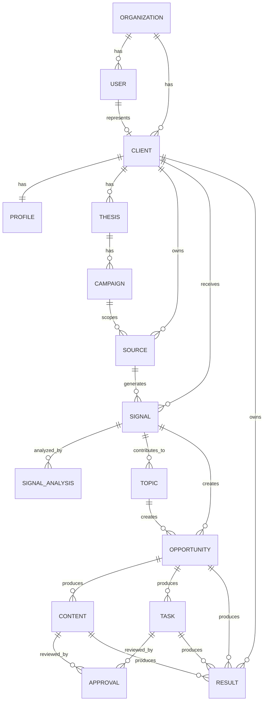
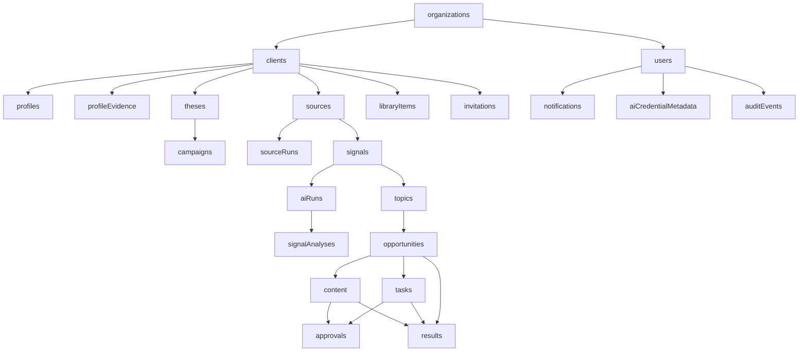

# POSTURA — FASE 6
## Documento 06 de 16 — Modelo de Datos Firebase

**Código:** POSTURA-F6-D06  
**Versión:** 1.0  
**Estado:** Especificación de modelo de datos para implementación  
**Tipo de documento:** Arquitectura de datos / contrato de persistencia  
**Proyecto:** Postura — Positioning Intelligence & Management System  
**Formato:** Markdown  
**Ámbito:** MVP web-first + Electron, Firebase Authentication, Cloud Firestore, Cloud Storage, Cloud Functions, OpenAI/Claude

---

# 1. Propósito del documento

Este documento define el modelo de datos oficial del MVP de Postura sobre Firebase.

Su objetivo es especificar de forma suficientemente precisa:

- colecciones;
- documentos;
- subcolecciones;
- campos;
- tipos;
- ownership;
- relaciones;
- estados;
- timestamps;
- soft delete;
- índices;
- consultas;
- desnormalización;
- metadatos;
- auditoría;
- seguridad conceptual;
- estructura multi-client;
- preparación multi-tenant;
- trazabilidad de inteligencia artificial;
- manejo de fuentes;
- señales;
- temas;
- oportunidades;
- contenido;
- tareas;
- resultados;
- invitaciones;
- notificaciones;
- metadatos de credenciales IA;
- almacenamiento de archivos;
- límites de consulta;
- principios de crecimiento.

Este documento debe ser utilizado por cualquier desarrollador o IA que implemente Firestore en Postura.

---

# 2. Principios rectores del modelo

El modelo de datos deberá cumplir los siguientes principios:

1. **Aislamiento por cliente.**
2. **Preparación multi-organización.**
3. **Trazabilidad.**
4. **Estados explícitos.**
5. **Soft delete.**
6. **Datos pensados según consultas reales.**
7. **Desnormalización controlada.**
8. **No almacenar secretos.**
9. **Separar hechos, análisis y resultados.**
10. **Permitir crecimiento sin rediseño completo.**
11. **Evitar documentos excesivamente grandes.**
12. **No usar Firestore como almacenamiento de archivos.**
13. **No depender de joins.**
14. **Mantener contexto suficiente para autorización.**
15. **Evitar duplicación innecesaria de contenido bruto.**

---

# 3. Convenciones generales

## 3.1 Idioma técnico

Los nombres de colecciones y campos serán en inglés.

La interfaz podrá presentarse en español.

---

## 3.2 Formato de nombres

Colecciones:

```text
camelCase
```

Campos:

```text
camelCase
```

Enums:

```text
UPPER_SNAKE_CASE
```

---

# 4. Campos transversales

Toda entidad principal deberá incluir, cuando aplique:

```typescript
{
  id: string;
  organizationId: string;
  clientId?: string;
  createdAt: Timestamp;
  createdBy: string;
  updatedAt: Timestamp;
  updatedBy: string;
  status: string;
  archivedAt?: Timestamp | null;
  archivedBy?: string | null;
}
```

No todos los documentos necesitan físicamente un campo `id` si el document ID ya lo representa, pero podrá incluirse cuando simplifique interfaces o exportaciones.

---

# 5. Ownership

## 5.1 organizationId

Identifica la organización lógica propietaria del recurso.

MVP inicial:

```text
postura-default
```

Aunque exista una sola organización, el campo deberá existir en entidades sensibles.

---

## 5.2 clientId

Identifica al Cliente profesional al cual pertenece el recurso.

Ejemplos:

- perfil;
- tesis;
- campaña;
- señal;
- contenido;
- tarea;
- oportunidad;
- resultado.

---

## 5.3 userId

Identifica una cuenta autenticada.

No debe utilizarse como sustituto universal de `clientId`.

---

# 6. Relación conceptual principal



---

# 7. Colecciones principales

El MVP utilizará las siguientes colecciones top-level:

```text
organizations
users
clients
profiles
profileEvidence
theses
campaigns
sources
signals
signalAnalyses
topics
opportunities
content
tasks
approvals
results
libraryItems
invitations
notifications
aiRuns
aiCredentialMetadata
auditEvents
sourceRuns
systemConfig
```

---

# 8. organizations

## 8.1 Propósito

Representa el tenant lógico superior.

Aunque el MVP opere con una sola organización, esta entidad permitirá crecimiento futuro.

---

## 8.2 Documento

Ruta:

```text
organizations/{organizationId}
```

---

## 8.3 Esquema

```typescript
interface Organization {
  name: string;
  slug: string;
  status: "ACTIVE" | "SUSPENDED" | "ARCHIVED";

  defaultLocale: string;
  defaultTimezone: string;

  createdAt: Timestamp;
  createdBy: string;
  updatedAt: Timestamp;
  updatedBy: string;

  archivedAt?: Timestamp | null;
  archivedBy?: string | null;
}
```

---

# 9. users

## 9.1 Propósito

Representa cada cuenta autenticada.

---

## 9.2 Ruta

```text
users/{uid}
```

El document ID será el UID de Firebase Authentication.

---

## 9.3 Esquema

```typescript
interface User {
  organizationId: string;

  email: string;
  displayName: string;

  role: "ADMIN" | "CLIENT";

  status:
    | "INVITED"
    | "ACTIVE"
    | "SUSPENDED"
    | "ARCHIVED";

  clientId?: string | null;
  managerId?: string | null;

  mustCompleteOnboarding: boolean;
  aiKeyManagementAllowed: boolean;

  locale: string;
  timezone: string;

  lastLoginAt?: Timestamp | null;

  createdAt: Timestamp;
  createdBy: string;
  updatedAt: Timestamp;
  updatedBy: string;

  archivedAt?: Timestamp | null;
  archivedBy?: string | null;
}
```

---

# 10. Reglas de users

## DATA-RN-USER-001

El document ID deberá coincidir con el Firebase UID.

## DATA-RN-USER-002

Un usuario `CLIENT` deberá tener `clientId`.

## DATA-RN-USER-003

Un usuario `ADMIN` no requiere `clientId`.

## DATA-RN-USER-004

El frontend no podrá modificar libremente `role`.

## DATA-RN-USER-005

El frontend no podrá cambiar `organizationId`.

---

# 11. clients

## 11.1 Propósito

Representa al profesional cuyo posicionamiento se administra.

---

## 11.2 Ruta

```text
clients/{clientId}
```

---

## 11.3 Esquema

```typescript
interface Client {
  organizationId: string;

  primaryManagerId: string;
  userId?: string | null;

  firstName: string;
  lastName: string;
  displayName: string;

  primaryEmail: string;

  profession?: string;
  company?: string;
  country?: string;

  onboardingStatus:
    | "NOT_STARTED"
    | "IN_PROGRESS"
    | "COMPLETED";

  profileCompleteness?: number;

  status:
    | "DRAFT"
    | "INVITED"
    | "ACTIVE"
    | "SUSPENDED"
    | "ARCHIVED";

  internalNotes?: string;

  createdAt: Timestamp;
  createdBy: string;
  updatedAt: Timestamp;
  updatedBy: string;

  archivedAt?: Timestamp | null;
  archivedBy?: string | null;
}
```

---

# 12. Clients — campos denormalizados

Se permite guardar:

```text
displayName
profession
company
country
profileCompleteness
```

aunque parte de esta información exista en el Perfil Maestro.

Motivo:

- listas rápidas;
- filtros;
- dashboards;
- reducción de lecturas.

El Perfil Maestro continúa siendo la fuente detallada.

---

# 13. profiles

## 13.1 Propósito

Representa el Perfil Maestro del Cliente.

---

## 13.2 Ruta

```text
profiles/{clientId}
```

Se recomienda utilizar `clientId` como ID del documento porque el MVP tendrá un Perfil Maestro principal por Cliente.

---

# 14. Esquema Profile

```typescript
interface ClientProfile {
  organizationId: string;
  clientId: string;

  identity: {
    professionalHeadline?: string;
    shortBio?: string;
    longBio?: string;
    location?: string;
    languages?: string[];
  };

  career: {
    profession?: string;
    currentRole?: string;
    currentCompany?: string;
    yearsExperience?: number;
    industries?: string[];
  };

  educationSummary?: string[];

  expertise: string[];
  preferredTopics: string[];
  restrictedTopics: string[];

  productsServices: string[];

  targetAudiences: string[];
  targetMarkets: string[];

  communication: {
    tone?: string;
    formality?: string;
    preferredExpressions?: string[];
    avoidExpressions?: string[];
  };

  digitalPresence: {
    website?: string;
    linkedin?: string;
    youtube?: string;
    instagram?: string;
    facebook?: string;
    tiktok?: string;
    x?: string;
    other?: string[];
  };

  strategicGoals: string[];

  profileCompleteness: number;

  createdAt: Timestamp;
  createdBy: string;
  updatedAt: Timestamp;
  updatedBy: string;
}
```

---

# 15. Datos extensos del Perfil

No se recomienda guardar toda la experiencia, educación, publicaciones y proyectos como arrays gigantes dentro de `profiles/{clientId}`.

Para evitar crecimiento excesivo, se utilizarán colecciones separadas de evidencia y entidades de perfil.

MVP básico:

```text
profileEvidence
```

Podrá evolucionar posteriormente a:

```text
profileExperiences
profileEducation
profilePublications
profileProjects
```

si el volumen lo exige.

---

# 16. profileEvidence

## 16.1 Propósito

Representa evidencia que respalda afirmaciones del Perfil.

---

## 16.2 Ruta

```text
profileEvidence/{evidenceId}
```

---

## 16.3 Esquema

```typescript
interface ProfileEvidence {
  organizationId: string;
  clientId: string;

  type:
    | "EXPERIENCE"
    | "EDUCATION"
    | "CERTIFICATION"
    | "PUBLICATION"
    | "PROJECT"
    | "PATENT"
    | "AWARD"
    | "CONFERENCE"
    | "MEDIA"
    | "DOCUMENT"
    | "OTHER";

  title: string;
  description?: string;

  sourceUrl?: string;
  storagePath?: string;

  organizationName?: string;
  dateFrom?: Timestamp | null;
  dateTo?: Timestamp | null;

  verificationStatus:
    | "PENDING"
    | "CONFIRMED"
    | "REJECTED"
    | "UPDATED";

  discoveredBy:
    | "CLIENT"
    | "MANAGER"
    | "AI"
    | "IMPORT";

  linkedClaims?: string[];

  createdAt: Timestamp;
  createdBy: string;
  updatedAt: Timestamp;
  updatedBy: string;

  archivedAt?: Timestamp | null;
}
```

---

# 17. theses

## 17.1 Propósito

Representa una Tesis de Posicionamiento.

---

## 17.2 Ruta

```text
theses/{thesisId}
```

---

## 17.3 Esquema

```typescript
interface PositioningThesis {
  organizationId: string;
  clientId: string;

  name: string;

  expertIdentity: string;
  targetAudience: string[];
  domain: string[];
  objective: string;

  proofSummary?: string;
  boundaries?: string[];
  positioningStatement: string;

  status:
    | "DRAFT"
    | "UNDER_REVIEW"
    | "ACTIVE"
    | "PAUSED"
    | "ARCHIVED";

  clientApprovalStatus:
    | "NOT_REQUESTED"
    | "PENDING"
    | "APPROVED"
    | "CHANGES_REQUESTED";

  createdAt: Timestamp;
  createdBy: string;
  updatedAt: Timestamp;
  updatedBy: string;

  activatedAt?: Timestamp | null;
  archivedAt?: Timestamp | null;
}
```

---

# 18. campaigns

## 18.1 Propósito

Permite operar una tesis como una línea estratégica independiente.

---

## 18.2 Ruta

```text
campaigns/{campaignId}
```

---

## 18.3 Esquema

```typescript
interface Campaign {
  organizationId: string;
  clientId: string;
  thesisId: string;

  name: string;
  description?: string;

  status:
    | "DRAFT"
    | "ACTIVE"
    | "PAUSED"
    | "COMPLETED"
    | "ARCHIVED";

  startAt?: Timestamp | null;
  endAt?: Timestamp | null;

  targetAudiences?: string[];
  targetMarkets?: string[];
  themes?: string[];

  createdAt: Timestamp;
  createdBy: string;
  updatedAt: Timestamp;
  updatedBy: string;
}
```

---

# 19. sources

## 19.1 Propósito

Representa fuentes de información manuales o automáticas.

---

## 19.2 Ruta

```text
sources/{sourceId}
```

---

# 20. Esquema Source

```typescript
interface Source {
  organizationId: string;
  clientId?: string | null;
  campaignId?: string | null;

  scope: "GLOBAL" | "CLIENT";

  name: string;

  type:
    | "RSS"
    | "WEB"
    | "API"
    | "REGULATORY"
    | "ACADEMIC"
    | "BLOG"
    | "MEDIA"
    | "MANUAL"
    | "OTHER";

  url?: string;

  language?: string;
  region?: string;

  topics?: string[];

  trustLevel:
    | "HIGH"
    | "MEDIUM"
    | "LOW"
    | "UNASSESSED";

  ingestionMode:
    | "MANUAL"
    | "AUTOMATIC";

  frequency?: "HOURLY" | "DAILY" | "WEEKLY" | "MANUAL";

  status:
    | "ACTIVE"
    | "PAUSED"
    | "ERROR"
    | "ARCHIVED";

  lastCheckedAt?: Timestamp | null;
  lastSuccessAt?: Timestamp | null;
  lastErrorAt?: Timestamp | null;
  lastErrorCode?: string | null;

  createdAt: Timestamp;
  createdBy: string;
  updatedAt: Timestamp;
  updatedBy: string;
}
```

---

# 21. sourceRuns

## 21.1 Propósito

Registrar cada ejecución automática de una fuente.

Esto evita meter historial técnico creciente dentro de `sources`.

---

## 21.2 Ruta

```text
sourceRuns/{sourceRunId}
```

---

## 21.3 Esquema

```typescript
interface SourceRun {
  organizationId: string;
  sourceId: string;
  clientId?: string | null;

  startedAt: Timestamp;
  finishedAt?: Timestamp | null;

  status:
    | "RUNNING"
    | "COMPLETED"
    | "FAILED";

  itemsFetched: number;
  signalsCreated: number;
  duplicatesDetected: number;

  errorCode?: string | null;
  errorMessage?: string | null;

  correlationId: string;
}
```

---

# 22. signals

## 22.1 Propósito

Representa la unidad común de inteligencia entrante.

Una Señal puede ser:

- noticia;
- regulación;
- sentencia;
- publicación;
- evento;
- idea;
- artículo;
- documento;
- tendencia;
- oportunidad preliminar;
- información manual.

---

## 22.2 Ruta

```text
signals/{signalId}
```

---

# 23. Esquema Signal

```typescript
interface Signal {
  organizationId: string;
  clientId: string;
  campaignId?: string | null;

  sourceId?: string | null;
  sourceRunId?: string | null;

  title: string;

  type:
    | "NEWS"
    | "REGULATION"
    | "COURT_DECISION"
    | "ARTICLE"
    | "BLOG_POST"
    | "SOCIAL_POST"
    | "EVENT"
    | "RESEARCH"
    | "TREND"
    | "IDEA"
    | "OPPORTUNITY"
    | "DOCUMENT"
    | "OTHER";

  sourceName?: string;
  sourceUrl?: string;

  publishedAt?: Timestamp | null;
  capturedAt: Timestamp;

  language?: string;
  region?: string;

  rawText?: string;
  normalizedText?: string;
  summary?: string;

  ingestionMode:
    | "MANUAL"
    | "AUTOMATIC";

  fingerprint?: string;
  canonicalUrl?: string;

  duplicateOfSignalId?: string | null;

  aiStatus:
    | "NOT_REQUIRED"
    | "PENDING_AI"
    | "PROCESSING"
    | "ANALYZED"
    | "FAILED";

  relevanceScore?: number | null;
  relevanceBand?:
    | "LOW"
    | "MEDIUM"
    | "HIGH"
    | "CRITICAL"
    | null;

  riskLevel?:
    | "LOW"
    | "MEDIUM"
    | "HIGH"
    | "UNKNOWN";

  managerDecision?:
    | "UNREVIEWED"
    | "DISCARDED"
    | "SAVED"
    | "RESEARCH"
    | "CONVERTED";

  status:
    | "NEW"
    | "PROCESSING"
    | "ANALYZED"
    | "RELEVANT"
    | "LOW_RELEVANCE"
    | "DISCARDED"
    | "SAVED"
    | "CONVERTED"
    | "ERROR";

  createdAt: Timestamp;
  createdBy: string;
  updatedAt: Timestamp;
  updatedBy: string;

  archivedAt?: Timestamp | null;
}
```

---

# 24. Reglas Signal

## DATA-RN-SIG-001

Toda Señal deberá pertenecer a un Cliente.

## DATA-RN-SIG-002

Una fuente global puede producir una señal para múltiples clientes, pero cada Señal materializada debe tener `clientId`.

## DATA-RN-SIG-003

La Señal deberá conservar la URL original cuando exista.

## DATA-RN-SIG-004

La IA no debe sobrescribir el contenido original.

## DATA-RN-SIG-005

`rawText` y `normalizedText` representan contenido fuente; análisis de IA se guarda separadamente.

---

# 25. signalAnalyses

## 25.1 Propósito

Separar los resultados de análisis IA de la Señal original.

Permite:

- reanalizar;
- comparar proveedores;
- conservar versiones;
- auditar resultados.

---

## 25.2 Ruta

```text
signalAnalyses/{analysisId}
```

---

# 26. Esquema SignalAnalysis

```typescript
interface SignalAnalysis {
  organizationId: string;
  clientId: string;

  signalId: string;
  thesisId?: string | null;
  campaignId?: string | null;

  aiRunId: string;

  analysisType:
    | "RELEVANCE"
    | "STRATEGIC"
    | "RISK"
    | "COMPARATIVE"
    | "FULL";

  relevanceScore: number;

  factors: {
    thesisMatch?: number;
    audienceMatch?: number;
    timeliness?: number;
    authorityFit?: number;
    differentiation?: number;
    commercialPotential?: number;
    sourceQuality?: number;
    riskPenalty?: number;
  };

  whyItMatters: string;

  targetAudience?: string[];

  recommendedAction?: string;

  suggestedAngles?: string[];

  riskLevel:
    | "LOW"
    | "MEDIUM"
    | "HIGH"
    | "UNKNOWN";

  warnings?: string[];

  evidenceRefs?: string[];

  provider: "OPENAI" | "ANTHROPIC" | "COMPARATIVE";
  model?: string;

  promptVersion?: string;

  createdAt: Timestamp;
  createdBy: string;
}
```

---

# 27. topics

## 27.1 Propósito

Representa una agrupación estratégica de una o varias Señales.

---

## 27.2 Ruta

```text
topics/{topicId}
```

---

# 28. Esquema Topic

```typescript
interface Topic {
  organizationId: string;
  clientId: string;

  thesisId?: string | null;
  campaignId?: string | null;

  title: string;
  strategicQuestion?: string;
  description?: string;

  signalIds: string[];

  createdFrom:
    | "SIGNAL"
    | "MULTIPLE_SIGNALS"
    | "MANUAL"
    | "AI";

  relevanceScore?: number | null;

  status:
    | "DRAFT"
    | "ACTIVE"
    | "USED"
    | "ARCHIVED";

  createdAt: Timestamp;
  createdBy: string;
  updatedAt: Timestamp;
  updatedBy: string;
}
```

---

# 29. Nota sobre signalIds

No deberá permitirse que `signalIds` crezca indefinidamente.

Para MVP, el número de Señales vinculadas por Tema será pequeño.

Si el producto necesita cientos o miles, se migrará a una colección relacional de vínculos.

---

# 30. opportunities

## 30.1 Propósito

Representa una acción potencial de posicionamiento.

---

## 30.2 Ruta

```text
opportunities/{opportunityId}
```

---

# 31. Esquema Opportunity

```typescript
interface Opportunity {
  organizationId: string;
  clientId: string;

  thesisId?: string | null;
  campaignId?: string | null;

  sourceSignalId?: string | null;
  topicId?: string | null;

  type:
    | "CONTENT"
    | "SPEAKING"
    | "PODCAST"
    | "JOURNAL"
    | "PUBLIC_COMMENT"
    | "AWARD"
    | "EVENT"
    | "NETWORKING"
    | "COLLABORATION"
    | "OTHER";

  title: string;
  description: string;

  whyItFits?: string;

  deadlineAt?: Timestamp | null;

  externalUrl?: string | null;

  relevanceScore?: number | null;
  riskLevel?: "LOW" | "MEDIUM" | "HIGH" | "UNKNOWN";

  status:
    | "DETECTED"
    | "UNDER_REVIEW"
    | "RECOMMENDED"
    | "SENT_TO_CLIENT"
    | "ACCEPTED"
    | "REJECTED"
    | "IN_PROGRESS"
    | "COMPLETED"
    | "ARCHIVED";

  clientDecisionAt?: Timestamp | null;
  clientDecisionBy?: string | null;

  createdAt: Timestamp;
  createdBy: string;
  updatedAt: Timestamp;
  updatedBy: string;

  archivedAt?: Timestamp | null;
}
```

---

# 32. content

## 32.1 Propósito

Representa activos de contenido.

---

## 32.2 Ruta

```text
content/{contentId}
```

---

# 33. Esquema Content

```typescript
interface ContentAsset {
  organizationId: string;
  clientId: string;

  thesisId?: string | null;
  campaignId?: string | null;

  sourceSignalId?: string | null;
  topicId?: string | null;
  opportunityId?: string | null;

  type:
    | "SHORT_POST"
    | "LINKEDIN_POST"
    | "ARTICLE"
    | "BLOG"
    | "REEL_SCRIPT"
    | "SHORT_VIDEO_SCRIPT"
    | "LONG_VIDEO_OUTLINE"
    | "BRIEF"
    | "TALKING_POINTS"
    | "COMMENT"
    | "RESPONSE"
    | "OTHER";

  title: string;

  body?: string;
  excerpt?: string;

  language: string;

  status:
    | "DRAFT"
    | "AI_GENERATED"
    | "MANAGER_REVIEW"
    | "MANAGER_APPROVED"
    | "CLIENT_REVIEW"
    | "CHANGES_REQUESTED"
    | "CLIENT_APPROVED"
    | "READY"
    | "ARCHIVED";

  currentVersion: number;

  aiGenerated: boolean;
  aiRunId?: string | null;

  managerApprovedAt?: Timestamp | null;
  managerApprovedBy?: string | null;

  clientApprovedAt?: Timestamp | null;
  clientApprovedBy?: string | null;

  publicationStatus?:
    | "NOT_PUBLISHED"
    | "MARKED_PUBLISHED";

  publicationUrl?: string | null;
  publishedAt?: Timestamp | null;

  createdAt: Timestamp;
  createdBy: string;
  updatedAt: Timestamp;
  updatedBy: string;
}
```

---

# 34. Versionado de contenido

No se recomienda guardar un historial ilimitado dentro de un array.

Si se requiere versionado real:

```text
contentVersions/{versionId}
```

---

# 35. contentVersions

## 35.1 Propósito

Conservar cambios importantes de contenido.

---

## 35.2 Esquema

```typescript
interface ContentVersion {
  organizationId: string;
  clientId: string;
  contentId: string;

  version: number;

  body: string;

  changedBy: string;
  changeType:
    | "AI_GENERATION"
    | "MANAGER_EDIT"
    | "CLIENT_EDIT"
    | "REVISION";

  createdAt: Timestamp;
}
```

Esta colección podrá habilitarse en MVP si se requiere trazabilidad de edición completa.

---

# 36. tasks

## 36.1 Propósito

Representa acciones asignadas al Cliente.

---

## 36.2 Ruta

```text
tasks/{taskId}
```

---

# 37. Esquema Task

```typescript
interface Task {
  organizationId: string;
  clientId: string;

  campaignId?: string | null;

  opportunityId?: string | null;
  contentId?: string | null;

  title: string;
  description?: string;

  type:
    | "RECORD_VIDEO"
    | "REVIEW_CONTENT"
    | "CONFIRM_INFORMATION"
    | "ACCEPT_OPPORTUNITY"
    | "UPLOAD_FILE"
    | "RESPOND"
    | "OTHER";

  priority:
    | "LOW"
    | "MEDIUM"
    | "HIGH"
    | "URGENT";

  status:
    | "DRAFT"
    | "ASSIGNED"
    | "VIEWED"
    | "IN_PROGRESS"
    | "COMPLETED"
    | "REJECTED"
    | "CANCELLED";

  dueAt?: Timestamp | null;

  assignedAt?: Timestamp | null;
  viewedAt?: Timestamp | null;
  completedAt?: Timestamp | null;

  clientResponse?: string | null;

  attachmentPaths?: string[];

  createdAt: Timestamp;
  createdBy: string;
  updatedAt: Timestamp;
  updatedBy: string;
}
```

---

# 38. approvals

## 38.1 Propósito

Registrar aprobaciones y rechazos de forma auditable.

---

## 38.2 Ruta

```text
approvals/{approvalId}
```

---

# 39. Esquema Approval

```typescript
interface Approval {
  organizationId: string;
  clientId: string;

  entityType:
    | "THESIS"
    | "CONTENT"
    | "TASK"
    | "OPPORTUNITY";

  entityId: string;

  requestedBy: string;
  requestedAt: Timestamp;

  reviewerId: string;
  reviewerRole: "ADMIN" | "CLIENT";

  decision:
    | "PENDING"
    | "APPROVED"
    | "REJECTED"
    | "CHANGES_REQUESTED";

  comments?: string;

  decidedAt?: Timestamp | null;

  createdAt: Timestamp;
}
```

---

# 40. results

## 40.1 Propósito

Capturar resultados de acciones de posicionamiento.

---

## 40.2 Ruta

```text
results/{resultId}
```

---

# 41. Esquema Result

```typescript
interface Result {
  organizationId: string;
  clientId: string;

  campaignId?: string | null;

  opportunityId?: string | null;
  contentId?: string | null;
  taskId?: string | null;

  type:
    | "PUBLICATION"
    | "EVENT"
    | "LEAD"
    | "ENGAGEMENT"
    | "BUSINESS_OPPORTUNITY"
    | "QUALITATIVE"
    | "OTHER";

  channel?: string;

  publicationUrl?: string;
  occurredAt?: Timestamp;

  metrics?: {
    views?: number;
    reactions?: number;
    comments?: number;
    shares?: number;
    leads?: number;
  };

  qualitativeOutcome?: string;

  manuallyEntered: boolean;

  createdAt: Timestamp;
  createdBy: string;
  updatedAt: Timestamp;
  updatedBy: string;
}
```

---

# 42. libraryItems

## 42.1 Propósito

Proporcionar un índice unificado de materiales valiosos.

No necesariamente duplicará el contenido completo.

---

## 42.2 Ruta

```text
libraryItems/{libraryItemId}
```

---

# 43. Esquema LibraryItem

```typescript
interface LibraryItem {
  organizationId: string;
  clientId: string;

  entityType:
    | "CONTENT"
    | "EVIDENCE"
    | "DOCUMENT"
    | "OPPORTUNITY"
    | "RESULT";

  entityId: string;

  title: string;
  description?: string;

  tags?: string[];

  storagePath?: string;
  externalUrl?: string;

  createdAt: Timestamp;
  createdBy: string;

  archivedAt?: Timestamp | null;
}
```

---

# 44. invitations

## 44.1 Propósito

Controlar el acceso inicial de Clientes.

---

## 44.2 Ruta

```text
invitations/{invitationId}
```

---

# 45. Esquema Invitation

```typescript
interface Invitation {
  organizationId: string;
  clientId: string;

  email: string;

  role: "CLIENT";

  tokenHash: string;

  status:
    | "PENDING"
    | "ACCEPTED"
    | "EXPIRED"
    | "REVOKED";

  expiresAt: Timestamp;

  acceptedAt?: Timestamp | null;
  acceptedByUid?: string | null;

  createdAt: Timestamp;
  createdBy: string;

  revokedAt?: Timestamp | null;
  revokedBy?: string | null;
}
```

---

# 46. Invitaciones — seguridad

El token de invitación completo no deberá guardarse si puede evitarse.

Se recomienda guardar:

```text
tokenHash
```

y entregar el token únicamente al destinatario.

---

# 47. notifications

## 47.1 Propósito

Notificaciones internas del MVP.

---

## 47.2 Ruta

```text
notifications/{notificationId}
```

---

# 48. Esquema Notification

```typescript
interface Notification {
  organizationId: string;

  userId: string;
  clientId?: string | null;

  type:
    | "TASK_ASSIGNED"
    | "CONTENT_REVIEW"
    | "OPPORTUNITY"
    | "ONBOARDING"
    | "COMMENT"
    | "SYSTEM";

  title: string;
  message: string;

  entityType?: string;
  entityId?: string;

  read: boolean;
  readAt?: Timestamp | null;

  createdAt: Timestamp;
}
```

---

# 49. aiRuns

## 49.1 Propósito

Registrar metadatos de cada ejecución IA.

---

## 49.2 Ruta

```text
aiRuns/{aiRunId}
```

---

# 50. Esquema AiRun

```typescript
interface AiRun {
  organizationId: string;
  clientId?: string | null;

  userId: string;

  agent:
    | "PROFILE"
    | "RESEARCH_SIGNALS"
    | "POSITIONING_STRATEGIST"
    | "CONTENT_TASKS"
    | "SYSTEM";

  operation: string;

  provider:
    | "OPENAI"
    | "ANTHROPIC"
    | "COMPARATIVE";

  model?: string;

  mode:
    | "OPENAI"
    | "CLAUDE"
    | "AUTOMATIC"
    | "COMPARATIVE";

  promptVersion?: string;

  startedAt: Timestamp;
  finishedAt?: Timestamp | null;

  status:
    | "RUNNING"
    | "COMPLETED"
    | "FAILED"
    | "CANCELLED";

  usage?: {
    inputTokens?: number;
    outputTokens?: number;
  };

  estimatedCost?: number | null;

  latencyMs?: number | null;

  requestId?: string | null;
  correlationId: string;

  errorCode?: string | null;
  warnings?: string[];

  createdAt: Timestamp;
}
```

---

# 51. AiRun — prohibiciones

Nunca almacenar:

```text
apiKey
authorizationHeader
complete raw secret payload
```

---

# 52. aiCredentialMetadata

## 52.1 Propósito

Guardar únicamente metadatos de una credencial persistente.

---

## 52.2 Ruta

```text
aiCredentialMetadata/{credentialId}
```

---

# 53. Esquema CredentialMetadata

```typescript
interface AiCredentialMetadata {
  organizationId: string;

  ownerType:
    | "USER"
    | "ORGANIZATION";

  ownerId: string;

  provider:
    | "OPENAI"
    | "ANTHROPIC";

  configured: boolean;

  secretRef: string;

  lastFour?: string;

  createdAt: Timestamp;
  createdBy: string;

  updatedAt: Timestamp;
  updatedBy: string;

  revokedAt?: Timestamp | null;
}
```

---

# 54. Clave temporal

Las claves temporales **no tendrán documento Firestore**.

Esta ausencia es intencional.

---

# 55. auditEvents

## 55.1 Propósito

Trazabilidad de acciones críticas.

---

## 55.2 Ruta

```text
auditEvents/{auditEventId}
```

---

# 56. Esquema AuditEvent

```typescript
interface AuditEvent {
  organizationId: string;
  clientId?: string | null;

  actorUserId: string;
  actorRole: "ADMIN" | "CLIENT" | "SYSTEM";

  eventType: string;

  entityType?: string;
  entityId?: string;

  correlationId?: string;

  metadata?: Record<string, unknown>;

  createdAt: Timestamp;
}
```

---

# 57. Regla de auditoría

`metadata` debe ser redactada.

Nunca debe contener:

- API Keys;
- tokens;
- contraseñas;
- documentos completos;
- contenido privado innecesario.

---

# 58. systemConfig

## 58.1 Propósito

Configuración no secreta.

---

## 58.2 Ruta

```text
systemConfig/{configId}
```

Ejemplos:

```text
featureFlags
aiDefaults
uiDefaults
sourceDefaults
```

---

# 59. Ejemplo featureFlags

```json
{
  "enableComparativeAi": true,
  "enablePersistentKeys": false,
  "enableAutomaticAiAnalysis": false,
  "enableElectron": true
}
```

No almacenar secretos.

---

# 60. Archivos en Cloud Storage

Firestore almacenará referencias a archivos.

Ejemplo:

```text
storagePath
```

No se guardarán archivos codificados en Base64 dentro de documentos Firestore.

---

# 61. Convención Storage

Ruta recomendada:

```text
organizations/{organizationId}/clients/{clientId}/
```

Subrutas:

```text
profile/
evidence/
content/
tasks/
uploads/
results/
```

---

# 62. Ejemplo

```text
organizations/postura-default/
clients/abc123/
profile/cv.pdf
```

---

# 63. Metadatos de archivos

Cuando un archivo sea importante, podrá existir un objeto Firestore asociado.

Campos:

```text
storagePath
fileName
contentType
sizeBytes
uploadedAt
uploadedBy
```

---

# 64. Relaciones: referencia por ID

Firestore no requiere `DocumentReference` obligatoriamente.

Para MVP se preferirán IDs simples:

```text
clientId
signalId
contentId
```

Ventajas:

- serialización;
- frontend;
- debugging;
- exportación;
- portabilidad.

---

# 65. No duplicar objetos completos

Incorrecto:

```json
{
  "client": {
    "...": "perfil completo"
  }
}
```

dentro de cada Señal.

Preferido:

```json
{
  "clientId": "..."
}
```

y algunos campos denormalizados necesarios.

---

# 66. Desnormalización permitida

Ejemplos:

En `signals`:

```text
sourceName
```

aunque exista `sourceId`.

En `clients`:

```text
displayName
profession
```

aunque exista Profile.

En `notifications`:

```text
title
message
```

aunque el evento original exista.

---

# 67. Desnormalización prohibida

No copiar repetidamente:

- Perfil Maestro completo;
- Tesis completa;
- contenido de documentos extensos;
- credenciales;
- análisis enteros.

---

# 68. Query-first design

El modelo debe satisfacer las consultas reales del MVP.

---

# 69. Consultas principales del Manager

## Q-001 — Clientes activos

```text
clients
where organizationId == X
where status == ACTIVE
orderBy displayName
```

---

# 70. Q-002 — Señales nuevas de un cliente

```text
signals
where organizationId == X
where clientId == Y
where status in [NEW, RELEVANT]
orderBy capturedAt desc
```

---

# 71. Q-003 — Intelligence Inbox

```text
signals
where organizationId == X
where clientId == Y
where managerDecision == UNREVIEWED
orderBy relevanceScore desc
```

---

# 72. Q-004 — Señales pendientes de IA

```text
signals
where organizationId == X
where clientId == Y
where aiStatus == PENDING_AI
orderBy capturedAt desc
```

---

# 73. Q-005 — Tareas pendientes

```text
tasks
where organizationId == X
where clientId == Y
where status in [ASSIGNED, VIEWED, IN_PROGRESS]
orderBy dueAt asc
```

---

# 74. Q-006 — Contenido esperando Cliente

```text
content
where organizationId == X
where clientId == Y
where status == CLIENT_REVIEW
orderBy updatedAt desc
```

---

# 75. Q-007 — Oportunidades activas

```text
opportunities
where organizationId == X
where clientId == Y
where status in [...]
orderBy deadlineAt asc
```

---

# 76. Q-008 — Historial de resultados

```text
results
where organizationId == X
where clientId == Y
orderBy occurredAt desc
```

---

# 77. Q-009 — AI Runs por Cliente

```text
aiRuns
where organizationId == X
where clientId == Y
orderBy startedAt desc
```

---

# 78. Q-010 — Notificaciones de usuario

```text
notifications
where userId == UID
where read == false
orderBy createdAt desc
```

---

# 79. Índices compuestos previstos

El archivo:

```text
firestore.indexes.json
```

deberá contener los índices necesarios.

Lista inicial:

```text
clients:
organizationId + status + displayName

signals:
organizationId + clientId + status + capturedAt
organizationId + clientId + managerDecision + relevanceScore
organizationId + clientId + aiStatus + capturedAt
organizationId + clientId + campaignId + capturedAt

tasks:
organizationId + clientId + status + dueAt

content:
organizationId + clientId + status + updatedAt

opportunities:
organizationId + clientId + status + deadlineAt

results:
organizationId + clientId + occurredAt

aiRuns:
organizationId + clientId + startedAt

notifications:
userId + read + createdAt

sources:
organizationId + status + frequency
```

Los índices definitivos se ajustarán al implementar consultas reales.

---

# 80. Pagination

Todas las listas de crecimiento continuo deberán paginar.

Patrón:

```text
limit
startAfter
```

No utilizar offsets grandes.

---

# 81. Tamaño de documentos

La arquitectura evitará acercarse innecesariamente al límite máximo de documento de Firestore.

Reglas:

- no guardar PDFs en Firestore;
- no guardar videos;
- no guardar historial ilimitado en arrays;
- no guardar miles de IDs en un documento;
- no guardar conversaciones completas indefinidamente.

---

# 82. Arrays

Arrays se usarán únicamente para conjuntos pequeños.

Adecuados:

```text
tags
topics
languages
preferredTopics
```

No adecuados:

```text
10.000 signalIds
10.000 auditEvents
historial completo
```

---

# 83. Contenido largo

Artículos y guiones MVP pueden almacenarse como string en Firestore si su tamaño es razonable.

Documentos extensos o archivos deben ir a Storage.

---

# 84. Historial técnico

No incorporar histórico de ejecuciones dentro del documento principal.

Ejemplo:

Incorrecto:

```text
source.runs[]
```

Preferido:

```text
sourceRuns
```

---

# 85. Timestamps

Todas las fechas se guardarán mediante:

```text
Firestore Timestamp
```

No mediante strings locales.

---

# 86. serverTimestamp

Para creación y actualización desde backend se utilizará preferiblemente tiempo de servidor.

---

# 87. Soft delete

Las entidades importantes utilizarán:

```text
archivedAt
archivedBy
status = ARCHIVED
```

No borrar inmediatamente.

---

# 88. Hard delete

Solo se permitirá cuando:

- exista una razón concreta;
- no afecte trazabilidad;
- se cumplan políticas de privacidad;
- sea ejecutado por backend autorizado.

---

# 89. Cascadas

Firestore no implementará cascadas relacionales automáticas.

Al archivar un Cliente:

- Cliente queda suspendido/archivado;
- no se borrarán automáticamente sus Señales;
- no se borrarán contenidos;
- no se borrarán resultados.

Podrán pausarse:

- fuentes;
- automatizaciones.

---

# 90. Actualizaciones masivas

Para cambios consistentes en varios documentos se utilizarán:

- batched writes;
- transactions;
- Cloud Functions;

según necesidad.

---

# 91. Transactions

Se reservarán para operaciones que realmente requieran consistencia.

Ejemplos:

- aceptar invitación;
- cambiar ownership;
- actualizar contador crítico.

No utilizar transacciones para operaciones que no lo necesitan.

---

# 92. Contadores

No se almacenarán contadores complejos salvo necesidad.

Dashboards MVP podrán obtener ciertos valores mediante consultas limitadas o agregaciones compatibles.

Si el costo crece, se crearán documentos de métricas resumidas.

---

# 93. Dashboard aggregates futuro

Preparación para:

```text
clientStats/{clientId}
```

pero no obligatorio en primera implementación.

---

# 94. Seguridad conceptual — usuarios

## ADMIN

Puede leer Clientes dentro de su `organizationId`.

## CLIENT

Puede leer únicamente recursos cuyo `clientId` coincide con su cuenta.

---

# 95. Seguridad conceptual — Profile

Cliente:

```text
read own
update permitted fields
```

Manager:

```text
read/write managed client
```

---

# 96. Seguridad conceptual — Signals

Cliente:

```text
no direct access in MVP
```

Manager:

```text
read/write within organization/client scope
```

---

# 97. Seguridad conceptual — Content

Cliente:

```text
read own
edit only permitted states/fields
approve
```

Manager:

```text
full workflow control
```

---

# 98. Seguridad conceptual — Tasks

Cliente:

```text
read own
update status/response permitted
```

No puede:

- reasignarse;
- cambiar clientId;
- cambiar createdBy.

---

# 99. Seguridad conceptual — Results

Cliente podrá ver resultados propios.

Escritura del Cliente será limitada.

Manager podrá registrar y corregir resultados dentro de su ámbito.

---

# 100. Seguridad conceptual — Audit

Solo Manager autorizado / backend.

Cliente no modifica.

---

# 101. Security Rules — patrón conceptual

```text
request.auth != null
AND user.status == ACTIVE
AND resource.organizationId == user.organizationId
AND (
   user.role == ADMIN
   OR resource.clientId == user.clientId
)
```

No debe copiarse literalmente sin adaptar cada colección.

---

# 102. Authorization en Cloud Functions

Toda Function con Admin SDK deberá hacer:

```text
1. validate auth
2. load user
3. validate status
4. validate role
5. validate organization
6. validate client scope
7. execute
```

---

# 103. No confiar en parámetros clientId

Si el frontend envía:

```text
clientId
```

el backend debe comprobar que el usuario tiene derecho a operar sobre ese Cliente.

---

# 104. Índices de búsqueda textual

Firestore no es un motor full-text.

El MVP no deberá prometer búsqueda semántica global avanzada.

Se podrán implementar:

- filtros;
- tags;
- títulos normalizados;
- búsquedas básicas.

Un motor de búsqueda dedicado podrá añadirse posteriormente.

---

# 105. Search keywords opcionales

Podrá almacenarse:

```text
searchKeywords
```

para búsquedas básicas controladas.

No es requisito obligatorio para todas las entidades.

---

# 106. Datos de redes sociales

No se almacenarán credenciales OAuth de redes en el MVP salvo que una integración futura lo requiera.

Los perfiles públicos del Cliente se almacenarán como URLs en Profile.

---

# 107. Copyright y fuentes

Para Señales externas se recomienda almacenar:

- metadatos;
- URL;
- resumen;
- extractos necesarios;

no copias completas indiscriminadas.

---

# 108. RawText

`rawText` deberá limitarse a contenido razonablemente necesario.

Si el contenido completo es muy extenso:

- Storage;
- referencia;
- extracto normalizado.

---

# 109. Modelado de fuente global

Una fuente global:

```text
scope = GLOBAL
clientId = null
```

No implica que exista una Señal global.

Cuando se materialice para análisis de un Cliente:

```text
signal.clientId = cliente
```

---

# 110. Estrategia de Signal fan-out

Si una misma fuente global produce un evento relevante para tres clientes, pueden existir:

```text
Signal A → Client 1
Signal B → Client 2
Signal C → Client 3
```

compartiendo:

```text
canonicalUrl
fingerprint
sourceId
```

Esto facilita scoring y autorización independientes.

---

# 111. Alternativa futura

En una versión de mayor escala podría existir:

```text
globalSignals
clientSignalLinks
```

No se implementará inicialmente.

---

# 112. AI comparative runs

Para análisis comparativo:

```text
aiRuns:
Run A OpenAI
Run B Anthropic
Run C Synthesis
```

o un run padre con relaciones.

MVP recomendado:

```text
parentAiRunId
```

opcional.

---

# 113. Extensión AiRun

```typescript
parentAiRunId?: string | null;
```

Esto permite relacionar:

```text
Comparative
├── OpenAI
├── Claude
└── Synthesis
```

---

# 114. Prompt versioning

`aiRuns.promptVersion` deberá permitir:

```text
strategy-v1
strategy-v2
```

para saber con qué reglas se produjo un resultado.

---

# 115. AI output versioning

`signalAnalyses` no se sobrescribirá silenciosamente al reanalizar.

Cada análisis podrá ser un documento nuevo.

La Señal mantendrá como campos denormalizados:

```text
relevanceScore
riskLevel
```

del análisis activo más reciente.

---

# 116. activeAnalysisId

Se recomienda añadir en Signal:

```typescript
activeAnalysisId?: string | null;
```

para identificar el análisis vigente.

---

# 117. Manager decisions

La decisión humana deberá registrarse.

En Signal:

```text
managerDecision
```

y opcionalmente:

```text
managerDecisionAt
managerDecisionBy
```

---

# 118. Extensión Signal

```typescript
managerDecisionAt?: Timestamp | null;
managerDecisionBy?: string | null;
```

---

# 119. Estado vs decisión

`status` representa el estado del proceso.

`managerDecision` representa la decisión humana.

No fusionarlos innecesariamente.

---

# 120. Manejo de comentarios

El MVP puede almacenar comentarios simples dentro de:

- approvals;
- tasks;
- content.

Si se necesita conversación extensa, deberá crearse una colección:

```text
comments
```

No obligatorio inicialmente.

---

# 121. comments futuro-compatible

Esquema conceptual:

```typescript
interface Comment {
  organizationId: string;
  clientId: string;
  entityType: string;
  entityId: string;
  authorId: string;
  body: string;
  createdAt: Timestamp;
}
```

---

# 122. Archivos de contenido

Un video grabado por Cliente:

```text
Storage
```

Task:

```text
attachmentPaths
```

Content o Library:

referencia posterior.

---

# 123. Videos

No guardar blobs en Firestore.

---

# 124. Thumbnails

Podrán generarse posteriormente mediante función.

No requisito para MVP funcional.

---

# 125. Migraciones de datos

Firestore no tiene migraciones SQL tradicionales.

Todo cambio importante de esquema deberá documentarse.

Carpeta recomendada:

```text
scripts/migrations/
```

---

# 126. schemaVersion

Para entidades susceptibles a evolución se podrá incluir:

```text
schemaVersion
```

No es obligatorio desde el día uno en todas las colecciones.

Recomendado en:

- profiles;
- signals;
- content.

---

# 127. Datos seed

El desarrollo deberá disponer de:

```text
Organization Demo
Manager Demo
Client Demo
Profile Demo
Thesis Demo
Campaign Demo
Source Demo
Signals Demo
```

---

# 128. Datos demo

No mezclar datos demo con producción.

---

# 129. Emulator

Las pruebas del modelo deberán realizarse con Emulator Suite.

---

# 130. Tests de reglas obligatorios

## SEC-DATA-001

Cliente A no puede leer Profile B.

## SEC-DATA-002

Cliente A no puede leer Task B.

## SEC-DATA-003

Cliente no puede cambiar `role`.

## SEC-DATA-004

Cliente no puede cambiar `organizationId`.

## SEC-DATA-005

Cliente no puede cambiar `clientId`.

## SEC-DATA-006

Usuario suspendido no puede operar.

## SEC-DATA-007

Cliente no puede leer `auditEvents`.

## SEC-DATA-008

Cliente no puede leer `aiCredentialMetadata` ajeno.

## SEC-DATA-009

Manager no puede acceder a otra organización.

## SEC-DATA-010

Storage impide archivos cruzados.

---

# 131. Tests de integridad

## INT-DATA-001

Signal siempre tiene clientId.

## INT-DATA-002

Campaign siempre tiene thesisId.

## INT-DATA-003

Client role user tiene clientId.

## INT-DATA-004

Opportunity con sourceSignalId referencia Signal del mismo Cliente.

## INT-DATA-005

Content no puede vincular Opportunity de otro Cliente.

## INT-DATA-006

Approval debe pertenecer al mismo Cliente que la entidad.

---

# 132. Queries prohibidas

No ejecutar consultas top-level sin ámbito cuando no sean necesarias.

Ejemplo riesgoso:

```text
signals orderBy createdAt
```

sin organización/cliente.

---

# 133. Collection Group Queries

No necesarias inicialmente.

Si se utilizan en el futuro, deberán mantener filtros de tenant.

---

# 134. Subcollections vs top-level

Se ha elegido top-level para las entidades principales por:

- consultas administrativas;
- facilidad de índices;
- agregación entre clientes autorizados;
- simplicidad de Functions.

La seguridad dependerá de `organizationId` y `clientId`.

---

# 135. Por qué no todo bajo clients/{clientId}

Estructura completamente anidada:

```text
clients/{clientId}/signals
```

sería viable, pero complicaría:

- consultas globales de Manager;
- inteligencia administrativa;
- jobs;
- índices transversales;
- dashboards.

Por ello el MVP utilizará colecciones top-level con ownership explícito.

---

# 136. Excepción Profile

`profiles/{clientId}` mantiene relación uno-a-uno clara.

---

# 137. Deletion strategy

Al archivar Cliente:

```text
clients.status = ARCHIVED
```

y no borrar automáticamente colecciones relacionadas.

---

# 138. Data lifecycle

```text
ACTIVE
   ↓
ARCHIVED
   ↓
OPTIONAL RETENTION REVIEW
   ↓
HARD DELETE IF AUTHORIZED
```

---

# 139. Audit immutability

Los eventos de auditoría no deberán editarse desde la UI.

Correcciones se registrarán mediante un nuevo evento.

---

# 140. Métricas de datos

Se recomienda vigilar:

- cantidad de Señales por Cliente;
- lecturas por Intelligence Inbox;
- escrituras por ingesta;
- AI Runs;
- tamaño medio de rawText;
- archivos Storage.

---

# 141. Cost-aware architecture

Las listas no deberán usar listeners realtime indiscriminadamente.

Realtime se reservará para:

- notificaciones;
- tareas activas;
- estados donde aporte valor.

---

# 142. Intelligence Inbox

Puede utilizar consulta paginada en lugar de listener de toda la colección.

---

# 143. Batch AI

Cuando el Manager analice múltiples Señales:

no realizar una escritura desordenada desde frontend.

Utilizar backend para:

- validar lote;
- marcar PROCESSING;
- ejecutar;
- actualizar estados.

---

# 144. Lock lógico

Campo opcional en Signal:

```text
processingLock
processingStartedAt
```

si la implementación detecta riesgo de doble procesamiento.

No obligatorio hasta probar concurrencia.

---

# 145. Error recovery

Una Signal `FAILED` conservará:

```text
lastErrorCode
lastErrorAt
```

opcionales.

---

# 146. Extensión Signal recomendada

```typescript
lastErrorCode?: string | null;
lastErrorAt?: Timestamp | null;
```

---

# 147. Source reliability

`Source.trustLevel` es una clasificación operativa.

No debe presentarse como una verdad científica absoluta.

---

# 148. Result metrics

MVP permite métricas manuales.

No se diseñará aún ingestion automática de analytics sociales.

---

# 149. No machine learning fields

No crear todavía:

```text
predictedSuccess
conversionProbability
```

como si fueran métricas confiables.

---

# 150. Datos para aprendizaje futuro

Sí capturar:

```text
signal score
manager decision
client decision
content type
publication result
engagement
```

Esto permitirá análisis posterior.

---

# 151. Relación futura de aprendizaje

```text
Signal
   ↓
Recommendation
   ↓
Manager Decision
   ↓
Client Decision
   ↓
Result
```

El MVP ya debe conservar estas conexiones.

---

# 152. CorrelationId

Se utilizará para procesos técnicos.

No reemplaza IDs de entidad.

---

# 153. Ejemplo de trazabilidad completa

```text
signalId: SIG-001
aiRunId: AIR-001
analysisId: ANA-001
topicId: TOP-001
opportunityId: OPP-001
contentId: CNT-001
taskId: TSK-001
resultId: RES-001
```

---

# 154. Índice conceptual del ciclo

No es necesario almacenar un único documento "journey".

Las relaciones por ID permiten reconstruirlo.

---

# 155. Exportación

El modelo debe permitir exportar información de un Cliente posteriormente.

Por eso:

- ownership explícito;
- IDs;
- timestamps;
- colecciones claras.

---

# 156. Portabilidad

No almacenar lógica crítica exclusivamente en estructuras difíciles de migrar.

Firestore es el backend actual, no la definición eterna del producto.

---

# 157. Backup

La estrategia técnica posterior deberá incluir respaldos.

Este modelo no asume que soft delete sustituye backups.

---

# 158. Retención de AI Runs

Los AI Runs pueden crecer rápidamente.

Se deberá definir posteriormente una política de retención o agregación cuando exista uso real.

No borrar durante piloto si son necesarios para auditoría.

---

# 159. Retención de Source Runs

También podrá limitarse posteriormente.

---

# 160. PII minimization

No guardar información personal que no sea necesaria para posicionamiento.

---

# 161. Credenciales

Ninguna contraseña de Firebase Authentication se guarda en Firestore.

---

# 162. Tokens

No guardar tokens de sesión Firebase en Firestore.

---

# 163. Claves IA

Temporal:

```text
memory only
```

Persistente:

```text
Secret Manager
```

Firestore:

```text
metadata only
```

---

# 164. Schema validation

Cada write importante desde Functions deberá validarse con schemas TypeScript/Zod.

---

# 165. Field whitelisting

No hacer:

```typescript
setDoc(ref, request.data)
```

sin filtrar.

Construir objetos permitidos explícitamente.

---

# 166. Prevent privilege escalation

Campos como:

```text
role
organizationId
primaryManagerId
aiKeyManagementAllowed
```

solo deben poder cambiar mediante paths administrativos autorizados.

---

# 167. Data contract shared

Los tipos del Documento 06 deberán traducirse a:

```text
packages/shared/src/types/
packages/shared/src/schemas/
packages/shared/src/enums/
```

---

# 168. Enums centrales

Lista inicial:

```text
UserRole
UserStatus
ClientStatus
OnboardingStatus
ThesisStatus
CampaignStatus
SourceStatus
SignalStatus
SignalAiStatus
ManagerDecision
OpportunityStatus
ContentStatus
TaskStatus
ApprovalDecision
AiProvider
AiMode
AiRunStatus
RiskLevel
TrustLevel
```

---

# 169. Estados no se inventan localmente

No crear strings ad hoc:

```text
"done"
"finished"
"complete"
```

si existe:

```text
COMPLETED
```

---

# 170. Firestore converters

Se recomienda utilizar converters o repositories tipados en TypeScript.

---

# 171. Repository layer

Funciones seguras deberán utilizar repositories conceptuales:

```text
ClientRepository
SignalRepository
ContentRepository
TaskRepository
```

para evitar acceso desordenado.

---

# 172. Frontend direct reads

El frontend podrá realizar lecturas directas seguras de Firestore cuando:

- rules lo permitan;
- sea eficiente;
- no involucre lógica crítica.

---

# 173. Backend-only writes

Operaciones críticas deberán pasar por Functions.

Ejemplos:

- cambiar rol;
- crear invitación;
- persistir clave IA;
- análisis IA;
- crear AI Run;
- modificar permisos;
- decisiones administrativas sensibles.

---

# 174. Writes cliente permitidos

Cliente podrá escribir campos muy limitados.

Ejemplos:

- completar campos propios de onboarding;
- marcar tarea;
- comentarios;
- aprobar contenido.

La implementación final definirá allowlists.

---

# 175. Datos internos de Manager

Campos como:

```text
internalNotes
```

no deberán incluirse en vistas Client.

Idealmente separar información especialmente sensible si las reglas de campo se vuelven complejas.

---

# 176. Internal notes future collection

Si aumenta sensibilidad:

```text
managerNotes
```

backend-only.

MVP podrá mantener `internalNotes` en Client con reglas adecuadas.

---

# 177. Auditoría de cambios de perfil

No se requiere versionado completo de Profile en MVP.

Cambios críticos pueden generar `auditEvents`.

---

# 178. Historia de Tesis

Puede utilizar auditoría.

Si se requiere versionado editorial complejo, crear `thesisVersions` en fase posterior.

---

# 179. Data freshness

Fuentes y Signals deberán tener:

```text
capturedAt
publishedAt
```

separados.

---

# 180. createdAt vs capturedAt

`createdAt`:

momento del documento en Postura.

`capturedAt`:

momento en que Postura obtuvo la información.

`publishedAt`:

fecha original de la fuente.

---

# 181. Query por fecha

No utilizar `publishedAt` cuando puede ser null como único criterio del Inbox.

`capturedAt` es más confiable para orden de ingreso.

---

# 182. Tags

Tags deberán normalizarse:

```text
lowercase
trimmed
```

si se utilizan para filtros.

---

# 183. URL canonicalization

`canonicalUrl` deberá remover, cuando sea seguro:

- fragmentos;
- tracking parameters conocidos;
- variaciones triviales.

---

# 184. Fingerprint

El fingerprint podrá calcularse con:

```text
canonical URL
+
normalized title
+
source
```

No se define algoritmo criptográfico obligatorio en este documento.

---

# 185. Duplicate handling

Cuando una Señal sea duplicada:

```text
duplicateOfSignalId
```

No borrar necesariamente.

Puede archivarse o vincularse.

---

# 186. Global source duplicate optimization

Durante MVP, la deduplicación se realizará principalmente por Cliente.

Optimización global queda futura.

---

# 187. Índices y costo

Cada nuevo índice tiene costo de almacenamiento y escritura.

No crear índices especulativos masivos.

Crear los necesarios para queries reales.

---

# 188. Composite index governance

Toda nueva query que necesite índice deberá:

1. documentarse;
2. agregarse a `firestore.indexes.json`;
3. probarse;
4. incluirse en Git.

---

# 189. Security Rules governance

`firestore.rules` y `storage.rules` son código versionado.

No editar reglas de producción manualmente sin reflejarlas en repositorio.

---

# 190. Data migration governance

Todo script de migración:

- versionado;
- idempotente cuando sea posible;
- probado en dev;
- respaldado antes de producción.

---

# 191. No SQL joins

Una IA desarrolladora no deberá diseñar funciones esperando:

```text
JOIN
```

en Firestore.

Debe resolver:

- IDs;
- lecturas controladas;
- denormalización.

---

# 192. No giant document strategy

No crear un documento:

```text
clients/{clientId}/everything
```

con todo el sistema embebido.

---

# 193. No giant arrays

No acumular:

```text
allTasks[]
allSignals[]
allContent[]
```

dentro de Client.

---

# 194. No secret metadata leak

`lastFour` es opcional.

No almacenar más fragmentos de la clave de los necesarios.

---

# 195. Field-level sensitivity

Clasificación conceptual:

## Public within client workspace

- displayName;
- tasks;
- approved content.

## Private operational

- internalNotes;
- AI warnings;
- scoring.

## Secret

- API Keys;
- tokens.

Secret nunca Firestore.

---

# 196. AI warnings

Los warnings podrán almacenarse en `signalAnalyses`.

El Cliente no necesita verlos automáticamente.

---

# 197. Data access service

Frontend debe centralizar acceso en:

```text
services/
```

No dispersar llamadas Firestore por cada botón.

---

# 198. ClientContext

Cuando Manager entra a un Cliente:

```text
activeClientId
```

es estado UI.

No reemplaza controles de seguridad.

---

# 199. Manager global queries

Manager puede consultar:

- clientes;
- señales;
- tareas;

dentro de su organización.

Por eso las colecciones son top-level.

---

# 200. Future multiple Managers

El MVP usa `primaryManagerId`.

Futuro:

```text
clientAssignments
```

No implementado.

---

# 201. Future organization memberships

Futuro:

```text
organizationMemberships
```

No implementado.

---

# 202. Future vector search

No modificar el esquema actual para simular embeddings.

Futuro podrá añadir:

```text
embeddings
```

o una infraestructura externa.

---

# 203. Future analytics warehouse

Results y AiRuns están estructurados para poder exportarse posteriormente.

---

# 204. Documento de Profile Completeness

`profileCompleteness` será calculado por aplicación.

Rango:

```text
0–100
```

No se considera métrica científica.

---

# 205. Cliente sin usuario

Puede existir Client antes de aceptar invitación.

Por eso:

```text
userId = null
```

es válido inicialmente.

---

# 206. Usuario sin Cliente

Admin no tiene Client.

---

# 207. Invitation acceptance transaction

Al aceptar:

```text
Invitation → ACCEPTED
Client.userId → UID
User.clientId → clientId
User.status → ACTIVE
```

debe realizarse de forma consistente.

---

# 208. Manager reassignment

No se implementará UI avanzada para reasignación en MVP.

Si se requiere, deberá realizarse mediante backend administrativo.

---

# 209. Timestamps de aprobación

No depender únicamente de status.

Guardar:

```text
managerApprovedAt
clientApprovedAt
```

cuando aplique.

---

# 210. Decision actor

Guardar también:

```text
managerApprovedBy
clientApprovedBy
```

---

# 211. Content publication

MVP no publica automáticamente.

Pero deberá poder registrar:

```text
publicationUrl
publishedAt
```

---

# 212. Result linkage

Un Result puede relacionarse con múltiples tipos, pero no debe requerir todos.

---

# 213. Nullability

Los esquemas TypeScript deberán distinguir:

- required;
- optional;
- nullable.

Evitar campos ambiguos.

---

# 214. Undefined

Firestore no debe recibir `undefined`.

La capa de validación deberá limpiar o rechazar valores no permitidos.

---

# 215. Empty strings

No utilizar `""` como sustituto sistemático de null.

---

# 216. Locale

User guarda locale.

Organization guarda defaultLocale.

---

# 217. Timezone

User guarda timezone.

Organization guarda defaultTimezone.

---

# 218. Search by displayName

Si se requiere búsqueda prefix simple, puede agregarse:

```text
displayNameLower
```

a Client.

No obligatorio hasta implementarlo.

---

# 219. Country codes

Preferir códigos normalizados cuando se implemente catálogo.

MVP puede iniciar con strings controlados.

---

# 220. Language codes

Preferir:

```text
es
en
```

u otro estándar consistente.

---

# 221. AI provider enums

Código:

```text
OPENAI
ANTHROPIC
COMPARATIVE
```

Interfaz puede mostrar:

```text
OpenAI
Claude
Comparativo
```

---

# 222. Claude naming

En código se utilizará:

```text
ANTHROPIC
```

como provider y `Claude` como marca visible.

---

# 223. Content type extensibility

El enum puede ampliarse.

No usar nombres de plataformas como única estructura de contenido.

---

# 224. Campaign optionality

Algunas señales pueden pertenecer al Cliente sin campaña específica.

Por eso:

```text
campaignId optional
```

---

# 225. Thesis context

Análisis estratégico de alta relevancia debería indicar:

```text
thesisId
```

cuando aplique.

---

# 226. Signal raw content privacy

No almacenar información innecesaria extraída de páginas.

---

# 227. External URLs

URLs deben validarse antes de mostrarse como enlaces.

---

# 228. Storage file naming

No depender solo del nombre original del archivo.

Usar ID generado + metadata original.

---

# 229. Storage example

```text
.../uploads/{fileId}/original.pdf
```

---

# 230. Audit event retention

Durante piloto, mantener eventos.

Política de largo plazo se define posteriormente.

---

# 231. Notification deletion

Puede marcarse leída.

No necesita borrarse inmediatamente.

---

# 232. Source error handling

Source conserva último estado.

SourceRun conserva historial.

---

# 233. AI error handling

AiRun conserva error técnico.

Signal conserva estado de proceso.

No copiar stack traces a Signal.

---

# 234. Error message privacy

`errorMessage` debe ser sanitizado antes de persistir.

---

# 235. Data exports

Cuando se implemente exportación, deberá extraer únicamente datos del Cliente autorizado.

---

# 236. Data imports

Los imports deberán validar:

- organizationId;
- clientId;
- schema;
- duplicados.

---

# 237. No open writes

No permitir que el navegador cree `auditEvents` arbitrarios.

Idealmente backend-only.

---

# 238. No direct AI Run creation

`aiRuns` deberá ser backend-only.

---

# 239. No direct Credential Metadata write

backend-only.

---

# 240. No direct SourceRun write

backend/system.

---

# 241. Direct Signal create

Manager puede iniciar creación, pero backend puede ser preferible para normalización.

---

# 242. Manual ingestion recommended path

```text
UI
→ Callable Function
→ validate
→ normalize
→ create Signal
```

---

# 243. Direct Client Profile update

Puede permitirse con rules de campos o mediante callable.

Se decidirá en la implementación de seguridad detallada.

---

# 244. Data access classification

| Collection | Manager | Client | Backend only critical writes |
|---|---:|---:|---:|
| organizations | Read | Limited | Yes |
| users | Scoped | Own | Sensitive fields |
| clients | Yes | Own basic | Sensitive fields |
| profiles | Yes | Own | Some |
| profileEvidence | Yes | Own | Validation optional |
| theses | Yes | Own read/review | Creation/control |
| campaigns | Yes | Read | Creation/control |
| sources | Yes | No | Auto status |
| sourceRuns | Yes | No | Yes |
| signals | Yes | No MVP | Analysis/status |
| signalAnalyses | Yes | No | Yes |
| topics | Yes | No | AI creation |
| opportunities | Yes | Own | Workflow |
| content | Yes | Own | AI generation |
| tasks | Yes | Own | Assignment |
| approvals | Yes | Own | Workflow |
| results | Yes | Own | Some |
| libraryItems | Yes | Own | Some |
| invitations | Yes | Own acceptance | Yes |
| notifications | Scoped | Own | System |
| aiRuns | Yes | No | Yes |
| aiCredentialMetadata | Scoped | Own if permitted | Yes |
| auditEvents | Yes | No | Yes |

---

# 245. Índices funcionales obligatorios de primera etapa

Se recomienda comenzar con:

```json
{
  "indexes": [
    {
      "collectionGroup": "signals",
      "queryScope": "COLLECTION",
      "fields": [
        {"fieldPath": "organizationId", "order": "ASCENDING"},
        {"fieldPath": "clientId", "order": "ASCENDING"},
        {"fieldPath": "capturedAt", "order": "DESCENDING"}
      ]
    }
  ]
}
```

El archivo real se ampliará según las queries descritas.

---

# 246. No copiar ejemplos literalmente sin revisar

Los JSON anteriores son contratos conceptuales.

La implementación debe usar el formato exacto de Firebase CLI vigente.

---

# 247. Data initialization

Al crear un Cliente:

mínimo:

```text
Client
Profile
```

Profile puede comenzar vacío/parcial.

---

# 248. Creating thesis

No crear automáticamente tesis final sin Manager.

Puede existir draft generado asistidamente.

---

# 249. Automatic Signal ingest

Puede crear:

```text
Signal.aiStatus = PENDING_AI
```

---

# 250. Manager analyze batch

Backend:

```text
PENDING_AI
→ PROCESSING
→ ANALYZED
```

Si falla:

```text
FAILED
```

---

# 251. Active analysis projection

Después de análisis válido, backend actualiza Signal:

```text
activeAnalysisId
relevanceScore
relevanceBand
riskLevel
```

Estos campos son proyecciones para consultas rápidas.

---

# 252. Source trust projection

Puede copiarse `sourceName`.

No hace falta copiar `trustLevel` si no se usa en Inbox.

---

# 253. Opportunity conversion

Al convertir Signal:

```text
Signal.managerDecision = CONVERTED
```

Opportunity:

```text
sourceSignalId = signalId
```

---

# 254. Content generation

Content deberá mantener:

```text
aiRunId
```

si fue generado por IA.

---

# 255. Manual content

```text
aiGenerated = false
aiRunId = null
```

---

# 256. Task from content

Task:

```text
contentId
```

---

# 257. Task result

Result:

```text
taskId
```

---

# 258. Content result

Result:

```text
contentId
```

---

# 259. Opportunity result

Result:

```text
opportunityId
```

---

# 260. Biblioteca

LibraryItem actúa como índice.

No duplicar body del contenido.

---

# 261. Data integrity through backend

Firestore no impone foreign keys.

La integridad deberá verificarse en Functions cuando se creen relaciones.

---

# 262. Same-client validation

Antes de vincular:

```text
Signal → Opportunity
Opportunity → Content
Content → Task
```

validar que todos tengan el mismo `clientId`.

---

# 263. Same-organization validation

También verificar `organizationId`.

---

# 264. Transactional consistency

No se necesita consistencia SQL global.

Sí para operaciones críticas pequeñas.

---

# 265. Eventual consistency expectations

UI debe tolerar pequeños retrasos entre:

- creación;
- AI processing;
- actualización.

---

# 266. Processing UI

Estados explícitos facilitan mostrar:

```text
Analizando
Error
Pendiente
Completado
```

---

# 267. Audit event example

```json
{
  "eventType": "CONTENT_CLIENT_APPROVED",
  "entityType": "CONTENT",
  "entityId": "cnt123",
  "actorUserId": "uid123"
}
```

---

# 268. Security-sensitive metadata

No incluir:

```text
email body completo
API response raw con secretos
headers
```

en audit.

---

# 269. AI raw prompts

No se almacenarán prompts completos por defecto si incluyen datos sensibles.

Guardar:

```text
promptVersion
```

y metadatos.

---

# 270. AI raw responses

La salida útil se almacena en entidad correspondiente.

No es necesario duplicar toda respuesta cruda del proveedor.

---

# 271. Debug mode

En dev puede existir logging adicional, pero debe estar desactivado o redactado en producción.

---

# 272. Data model version 1

Este documento representa:

```text
Postura Data Model v1
```

---

# 273. Criterios de aceptación del modelo de datos

## DATA-CA-001

Existe colección `users`.

## DATA-CA-002

Existe colección `clients`.

## DATA-CA-003

Existe Perfil Maestro uno-a-uno por Cliente.

## DATA-CA-004

Existe evidencia separada del Perfil.

## DATA-CA-005

Tesis soporta múltiples registros por Cliente.

## DATA-CA-006

Campaña referencia Tesis.

## DATA-CA-007

Sources soporta alcance GLOBAL y CLIENT.

## DATA-CA-008

Signals tiene `clientId`.

## DATA-CA-009

Signals separa contenido fuente de análisis IA.

## DATA-CA-010

SignalAnalysis conserva scoring y razonamiento.

## DATA-CA-011

AI Runs conserva provider/model/usage sin secretos.

## DATA-CA-012

Claves temporales no se almacenan.

## DATA-CA-013

CredentialMetadata no contiene claves completas.

## DATA-CA-014

Opportunity referencia Signal/Topic cuando aplica.

## DATA-CA-015

Content soporta workflow de aprobación.

## DATA-CA-016

Tasks soporta workflow de ejecución.

## DATA-CA-017

Approvals es auditable.

## DATA-CA-018

Results puede vincular Content/Task/Opportunity.

## DATA-CA-019

AuditEvents registra acciones críticas.

## DATA-CA-020

Las consultas principales del MVP están soportadas.

## DATA-CA-021

Los listados crecientes son paginables.

## DATA-CA-022

No se almacenan archivos binarios en Firestore.

## DATA-CA-023

No existen arrays ilimitados.

## DATA-CA-024

organizationId permite evolución multi-tenant.

## DATA-CA-025

clientId permite aislamiento.

## DATA-CA-026

Soft delete está previsto.

## DATA-CA-027

Timestamps son Firestore Timestamp.

## DATA-CA-028

El modelo soporta GitHub Pages + Firebase sin depender de backend SQL.

## DATA-CA-029

El modelo soporta OpenAI y Claude desacoplados.

## DATA-CA-030

El ciclo Señal → Acción → Resultado es trazable.

---

# 274. Reglas obligatorias para IA desarrolladora

1. No cambiar nombres de colecciones sin documentarlo.
2. No introducir PostgreSQL.
3. No crear joins ficticios.
4. No crear documentos gigantes.
5. No guardar archivos en Base64.
6. No guardar claves IA.
7. No guardar passwords.
8. No confiar en clientId del navegador.
9. No omitir organizationId en entidades sensibles.
10. No omitir clientId cuando la entidad pertenece a Cliente.
11. No mezclar contenido fuente y análisis IA.
12. No sobrescribir análisis históricos.
13. No usar arrays ilimitados.
14. No crear subcolecciones arbitrarias.
15. No permitir accesos cruzados.
16. No escribir roles desde el Cliente.
17. No usar strings de estados no documentados.
18. No hacer hard delete por defecto.
19. No crear índices masivos sin necesidad.
20. No duplicar Perfil completo en otras entidades.
21. No guardar logs con secretos.
22. No implementar búsqueda full-text falsa sobre Firestore.
23. No crear AI Runs desde frontend.
24. No crear AuditEvents sensibles desde frontend.
25. Validar relaciones mismo Cliente/misma Organización.

---

# 275. Orden recomendado de implementación del modelo

```text
D1 — organizations
D2 — users
D3 — clients
D4 — profiles
D5 — profileEvidence
D6 — theses
D7 — campaigns
D8 — sources
D9 — sourceRuns
D10 — signals
D11 — aiRuns
D12 — signalAnalyses
D13 — topics
D14 — opportunities
D15 — content
D16 — tasks
D17 — approvals
D18 — results
D19 — libraryItems
D20 — invitations
D21 — notifications
D22 — aiCredentialMetadata
D23 — auditEvents
D24 — indexes
D25 — security rules
```

---

# 276. Mapa final de datos



---

# 277. Decisiones cerradas al finalizar la Fase 6

Quedan definidas oficialmente:

1. Firestore utilizará colecciones top-level para entidades principales.
2. El ownership se expresa con `organizationId` y `clientId`.
3. `users/{uid}` utiliza Firebase UID.
4. `profiles/{clientId}` representa el Perfil Maestro principal.
5. Evidencia se almacena separadamente.
6. Un Cliente puede tener múltiples Tesis.
7. Las Campañas dependen de Tesis.
8. Sources puede ser GLOBAL o CLIENT.
9. Signals es la unidad de inteligencia entrante.
10. Toda Signal materializada pertenece a Cliente.
11. Contenido fuente y análisis IA se separan.
12. SignalAnalysis permite múltiples análisis.
13. AiRun conserva trazabilidad técnica.
14. AI Keys temporales no se almacenan.
15. Secret Manager queda fuera de Firestore.
16. CredentialMetadata guarda solo referencias/metadatos.
17. Topics agrupa Señales estratégicamente.
18. Opportunities convierte inteligencia en acción.
19. Content contiene activos comunicacionales.
20. Tasks contiene acciones ejecutables.
21. Approvals contiene decisiones auditables.
22. Results captura desempeño.
23. LibraryItems actúa como índice histórico.
24. AuditEvents es inmutable desde UI.
25. SourceRuns separa histórico técnico de fuentes.
26. No habrá giant documents.
27. No habrá giant arrays.
28. No habrá joins.
29. No habrá blobs en Firestore.
30. Los listados serán paginados.
31. Los índices serán versionados.
32. La seguridad se diseñará deny-by-default.
33. Admin SDK requerirá autorización explícita.
34. Same-client validation será obligatoria.
35. Soft delete será la política inicial.
36. Las fechas serán Firestore Timestamp.
37. La estructura soporta crecimiento futuro.
38. El siguiente documento profundizará Perfil Maestro y Onboarding.

---

# 278. Siguiente fase

## FASE 7 — Documento 07 de 16
### Perfil Maestro y Onboarding Inteligente

El siguiente documento deberá definir:

- experiencia completa de onboarding;
- preguntas mínimas;
- datos opcionales;
- progresividad;
- CV;
- URLs;
- documentos;
- enriquecimiento asistido;
- validación humana;
- estados de información;
- Evidence Vault;
- voz;
- expertise;
- trayectoria;
- audiencias;
- mercados;
- objetivos;
- restricciones;
- perfil completeness;
- flujo Manager;
- flujo Cliente;
- prompts del Profile Agent;
- qué puede inferir IA;
- qué debe confirmar el Cliente;
- qué no debe inferirse;
- reglas de privacidad;
- criterios de aceptación.

---

# 279. Estado de documentación

```text
FASE 1
✅ Documento 01 — Documento Maestro

FASE 2
✅ Documento 02 — Especificación Funcional del MVP

FASE 3
✅ Documento 03 — Roles, Usuarios y Modelo Operativo

FASE 4
✅ Documento 04 — Arquitectura Funcional Integral

FASE 5
✅ Documento 05 — Arquitectura Técnica del MVP

FASE 6
✅ Documento 06 — Modelo de Datos Firebase

FASE 7
⬜ Documento 07 — Perfil Maestro y Onboarding Inteligente
```

---

**FIN DEL DOCUMENTO — POSTURA-F6-D06 v1.0**
