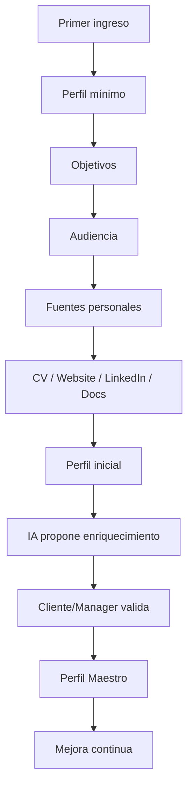
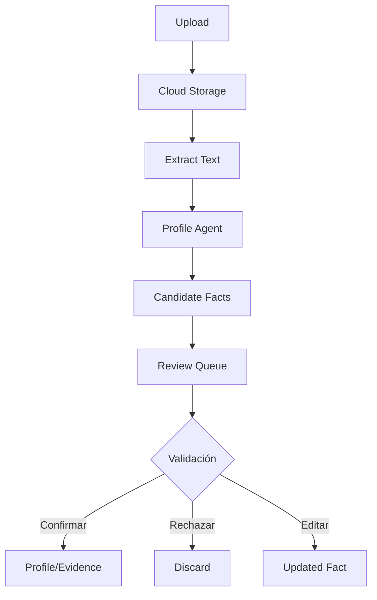
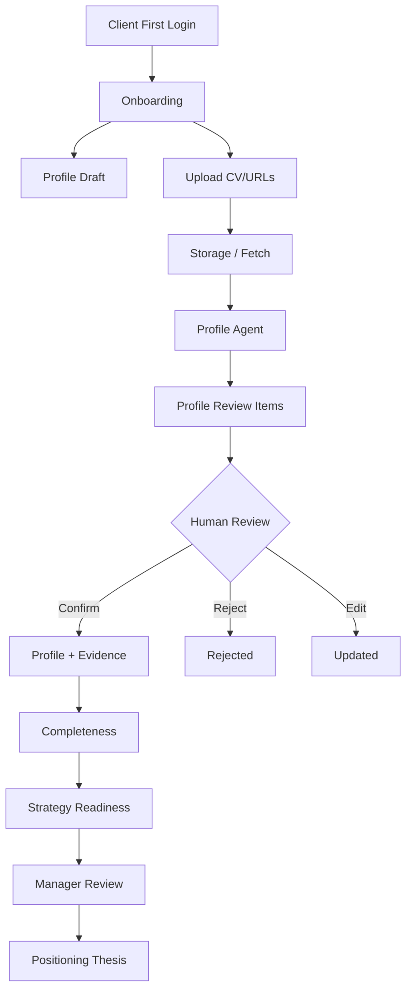

# POSTURA — FASE 7
## Documento 07 de 16 — Perfil Maestro y Onboarding Inteligente

**Código:** POSTURA-F7-D07  
**Versión:** 1.0  
**Estado:** Especificación funcional y de datos para implementación  
**Tipo de documento:** Perfil Maestro, Onboarding, Enriquecimiento y Evidencia  
**Proyecto:** Postura — Positioning Intelligence & Management System  
**Formato:** Markdown  
**Ámbito:** MVP web-first + Electron, Managed SaaS, Manager + Cliente, Firebase, OpenAI/Claude

---

# 1. Propósito del documento

Este documento define cómo Postura construirá, mantendrá y utilizará el **Perfil Maestro del Cliente**.

El Perfil Maestro es la representación estructurada de quién es el Cliente desde la perspectiva de:

- identidad profesional;
- experiencia;
- autoridad;
- conocimientos;
- trayectoria;
- servicios;
- mercado;
- audiencia;
- objetivos;
- tono;
- límites;
- evidencia;
- presencia digital;
- preferencias de comunicación;
- ambición de posicionamiento.

Su objetivo es convertir información dispersa sobre una persona en un contexto confiable que pueda ser utilizado por los agentes de IA y por el Manager.

El Perfil Maestro no es una biografía.

Es el **contexto estratégico y operativo principal de Postura**.

---

# 2. Principio central

Postura no debe tratar a todos los Clientes de la misma manera.

La misma Señal puede ser relevante para un Cliente y completamente irrelevante para otro.

Por ello, la secuencia lógica será:

```text
CLIENTE
   ↓
PERFIL MAESTRO
   ↓
TESIS DE POSICIONAMIENTO
   ↓
SEÑALES
   ↓
IA
   ↓
RECOMENDACIÓN PERSONALIZADA
```

---

# 3. Objetivos del Perfil Maestro

El Perfil Maestro deberá permitir responder:

1. ¿Quién es el Cliente?
2. ¿Qué sabe?
3. ¿Qué ha hecho?
4. ¿Qué puede demostrar?
5. ¿Qué vende?
6. ¿A quién quiere llegar?
7. ¿En qué mercados quiere posicionarse?
8. ¿Qué temas domina?
9. ¿Sobre qué temas quiere hablar?
10. ¿Sobre qué temas no quiere hablar?
11. ¿Qué objetivos busca?
12. ¿Cómo comunica?
13. ¿Qué estilo le resulta natural?
14. ¿Qué credenciales respaldan su autoridad?
15. ¿Qué experiencia no debe exagerarse?
16. ¿Qué oportunidades tienen sentido para él?
17. ¿Qué contenido sería coherente con su trayectoria?
18. ¿Qué afirmaciones requieren evidencia?
19. ¿Qué riesgos profesionales o reputacionales deben respetarse?
20. ¿Qué debe aprender Postura de su comportamiento futuro?

---

# 4. Principios del onboarding

El onboarding debe ser:

- progresivo;
- claro;
- breve al inicio;
- ampliable;
- asistido;
- verificable;
- editable;
- no invasivo;
- orientado al valor;
- compatible con documentos;
- compatible con URLs;
- compatible con enriquecimiento IA;
- controlado por el Cliente y Manager.

---

# 5. Lo que NO debe ser el onboarding

Postura no deberá mostrar al nuevo Cliente:

```text
FORMULARIO DE 50 CAMPOS
```

antes de permitirle acceder al producto.

Esto genera:

- abandono;
- fatiga;
- información incompleta;
- respuestas superficiales;
- mala experiencia.

---

# 6. Estrategia de onboarding progresivo



---

# 7. Etapas del onboarding

El onboarding se dividirá en 6 bloques principales.

| Etapa | Nombre | Objetivo |
|---|---|---|
| ONB-01 | Identidad profesional | Entender quién es |
| ONB-02 | Objetivo estratégico | Entender qué quiere conseguir |
| ONB-03 | Audiencia y mercado | Entender ante quién |
| ONB-04 | Experiencia y autoridad | Entender qué puede demostrar |
| ONB-05 | Presencia digital | Localizar fuentes de contexto |
| ONB-06 | Voz y límites | Entender cómo debe expresarse |

---

# 8. ONB-01 — Identidad profesional

## 8.1 Campos mínimos

El Cliente deberá responder:

```text
Nombre
Apellido
Profesión
Cargo actual
Empresa / organización
País principal
Idioma principal
Descripción breve de lo que hace
```

---

## 8.2 Pregunta clave

> ¿Cómo describirías en una o dos frases lo que haces profesionalmente?

Esta respuesta será tratada como:

```text
selfDescription
```

y no como una verdad final del sistema.

---

# 9. ONB-02 — Objetivo estratégico

El Cliente deberá indicar qué quiere conseguir.

Opciones iniciales:

```text
Aumentar autoridad profesional
Conseguir nuevos clientes
Posicionarme como experto
Aumentar oportunidades de negocio
Conseguir invitaciones a eventos
Conseguir entrevistas / podcasts
Publicar más artículos
Aumentar presencia en redes
Prepararme para un cambio profesional
Acceder a cargos directivos
Influir en debates profesionales
Desarrollar una práctica profesional
Otro
```

---

# 10. Objetivos múltiples

El Cliente podrá seleccionar varios objetivos.

Pero deberá existir:

```text
primaryGoal
```

para el MVP.

---

# 11. ONB-03 — Audiencia y mercado

Preguntas:

```text
¿A quién quieres llegar?
¿Qué tipo de personas quieres que te reconozcan?
¿En qué países o mercados?
¿Qué empresas o sectores te interesan?
¿Qué tipo de cliente quieres atraer?
```

---

# 12. Audiencias

Ejemplos:

```text
Ejecutivos
CEOs
General Counsel
Abogados
Startups
Empresas tecnológicas
Médicos
Ingenieros
Inversionistas
Emprendedores
Reguladores
Académicos
Consumidores
Medios
```

---

# 13. Mercado

Campos:

```text
targetCountries
targetRegions
targetIndustries
targetOrganizations
```

No es necesario completarlos todos al inicio.

---

# 14. ONB-04 — Experiencia y autoridad

Este bloque será progresivo.

Se deberán capturar:

- experiencia profesional;
- estudios;
- certificaciones;
- proyectos;
- publicaciones;
- artículos;
- conferencias;
- premios;
- patentes;
- entrevistas;
- cargos;
- empresas;
- casos relevantes;
- productos;
- servicios;
- emprendimientos.

---

# 15. Entrada rápida de experiencia

El Cliente podrá escoger:

```text
[ Subir CV ]
[ Importar desde URL ]
[ Escribir manualmente ]
[ Completar después ]
```

---

# 16. CV como acelerador

Si el Cliente carga un CV:

```text
CV
 ↓
Extracción
 ↓
Profile Agent
 ↓
Propuestas estructuradas
 ↓
Cliente confirma
```

La IA no deberá insertar automáticamente toda la información como confirmada.

---

# 17. ONB-05 — Presencia digital

El Cliente podrá añadir:

```text
Website
LinkedIn
YouTube
Instagram
Facebook
TikTok
X
Blog
Medium
Substack
Google Scholar
ORCID
GitHub
Sitios corporativos
Otros
```

No todos deben existir.

---

# 18. Propósito de URLs personales

Las URLs permitirán:

- obtener contexto;
- verificar experiencia;
- encontrar publicaciones;
- detectar tono;
- identificar actividad;
- encontrar temas recurrentes;
- descubrir evidencia.

---

# 19. ONB-06 — Voz y límites

## 19.1 Voz

Preguntas:

```text
¿Prefieres comunicarte de forma formal o cercana?
¿Usas lenguaje técnico?
¿Prefieres textos directos o reflexivos?
¿Hay expresiones que utilizas frecuentemente?
¿Hay palabras o tonos que no te representan?
```

---

# 20. Ejemplos de estilos

```text
Ejecutivo
Académico
Técnico
Didáctico
Directo
Conversacional
Analítico
Crítico
Institucional
Inspirador
```

El Cliente podrá combinar estilos.

---

# 21. Límites

Se deberán poder registrar:

```text
restrictedTopics
restrictedClaims
restrictedTone
restrictedPlatforms
restrictedActions
```

---

# 22. Ejemplos de límites

```text
No hacer predicciones financieras
No opinar sobre política partidista
No hablar de casos confidenciales
No mencionar clientes sin autorización
No utilizar tono agresivo
No generar afirmaciones médicas no respaldadas
```

---

# 23. Perfil Maestro — estructura funcional

El Perfil Maestro se organiza en 12 dimensiones.

| Código | Dimensión |
|---|---|
| PM-01 | Identidad |
| PM-02 | Trayectoria |
| PM-03 | Formación |
| PM-04 | Expertise |
| PM-05 | Autoridad demostrable |
| PM-06 | Productos y servicios |
| PM-07 | Audiencia |
| PM-08 | Mercados |
| PM-09 | Objetivos |
| PM-10 | Voz |
| PM-11 | Límites |
| PM-12 | Presencia digital |

---

# 24. PM-01 — Identidad

Campos conceptuales:

```text
displayName
professionalHeadline
shortBio
longBio
profession
currentRole
currentCompany
location
languages
```

---

# 25. PM-02 — Trayectoria

Incluye:

- experiencia laboral;
- empresas;
- emprendimientos;
- cargos;
- proyectos;
- sectores;
- años de experiencia.

---

# 26. PM-03 — Formación

Incluye:

- títulos;
- universidades;
- certificaciones;
- cursos relevantes;
- programas ejecutivos;
- formación especializada.

---

# 27. PM-04 — Expertise

Debe diferenciar:

```text
EXPERTISE CONFIRMADO
INTERÉS
TEMA DE POSICIONAMIENTO
```

No son lo mismo.

---

# 28. Expertise confirmado

Área en la que existe experiencia suficiente y evidencia razonable.

---

# 29. Interés

Tema que interesa al Cliente pero no necesariamente domina.

---

# 30. Tema de posicionamiento

Tema sobre el que el Cliente quiere desarrollar autoridad.

Puede coincidir o no con expertise actual.

---

# 31. Regla crítica

Postura no debe presentar un interés como expertise.

---

# 32. PM-05 — Autoridad demostrable

La autoridad deberá sustentarse con Evidence Vault.

Tipos:

```text
EXPERIENCE
EDUCATION
CERTIFICATION
PUBLICATION
PROJECT
PATENT
AWARD
CONFERENCE
MEDIA
CLIENT_WORK
VENTURE
OTHER
```

---

# 33. PM-06 — Productos y servicios

Capturar:

- qué vende;
- qué ofrece;
- a quién;
- rango de servicio;
- mercado;
- líneas de negocio.

---

# 34. Regla comercial

Postura debe saber si el objetivo del Cliente es:

```text
autoridad
negocio
influencia
carrera
combinación
```

para no recomendar el mismo contenido a todos.

---

# 35. PM-07 — Audiencia

Se deberá representar:

```text
primaryAudience
secondaryAudiences
audiencePainPoints
audienceQuestions
audienceDecisionMakers
```

---

# 36. PM-08 — Mercados

```text
primaryMarket
targetCountries
targetRegions
targetIndustries
targetCompanyTypes
```

---

# 37. PM-09 — Objetivos

```text
primaryGoal
secondaryGoals
timeHorizon
priority
```

---

# 38. PM-10 — Voz

Debe modelar:

```text
tone
formality
technicalDepth
sentenceStyle
preferredPhrases
avoidPhrases
languagePreferences
```

---

# 39. PM-11 — Límites

Incluye:

- regulatorios;
- reputacionales;
- personales;
- profesionales;
- confidencialidad;
- temas excluidos.

---

# 40. PM-12 — Presencia digital

Incluye URLs y canales.

Postura deberá diferenciar:

```text
OWNED
PROFESSIONAL
MEDIA
SOCIAL
ACADEMIC
```

cuando sea útil.

---

# 41. Profile Agent

El Profile Agent será responsable de ayudar a construir el Perfil Maestro.

---

# 42. Funciones del Profile Agent

Podrá:

- resumir CV;
- detectar cargos;
- detectar estudios;
- detectar empresas;
- detectar publicaciones;
- proponer expertise;
- detectar temas recurrentes;
- proponer voz;
- identificar evidencia;
- detectar información inconsistente;
- señalar campos faltantes.

---

# 43. Lo que NO puede hacer el Profile Agent

No deberá:

- inventar experiencia;
- inventar títulos;
- inventar empresas;
- inventar clientes;
- inventar publicaciones;
- inventar premios;
- inventar patentes;
- asumir identidad;
- inferir características sensibles;
- declarar expertise sin respaldo suficiente.

---

# 44. Estados de cada dato enriquecido

Todo dato sugerido por IA deberá registrar:

```text
PENDING
CONFIRMED
REJECTED
UPDATED
```

---

# 45. Origen del dato

Cada pieza relevante deberá poder identificar origen:

```text
CLIENT
MANAGER
AI
IMPORT
PUBLIC_SOURCE
DOCUMENT
```

---

# 46. Confianza del dato

Opcionalmente:

```text
HIGH
MEDIUM
LOW
```

pero no debe sustituir validación humana.

---

# 47. Evidencia

Todo dato importante podrá relacionarse con:

```text
evidenceId
```

---

# 48. Evidence Vault

La Evidence Vault será el repositorio lógico de pruebas profesionales.

No debe entenderse únicamente como carpeta de documentos.

Es una estructura de:

```text
AFIRMACIÓN
   ↓
EVIDENCIA
   ↓
FUENTE
   ↓
ESTADO DE VALIDACIÓN
```

---

# 49. Ejemplo

```text
Afirmación:
"Ha trabajado en gobernanza de IA"

Evidencia:
Proyecto X

Fuente:
CV + artículo público

Estado:
CONFIRMED
```

---

# 50. Tipos de evidencia

```text
CV
Diploma
Certificado
Artículo
Publicación
URL corporativa
Página institucional
Patente
Premio
Video
Entrevista
Conferencia
Proyecto
Documento
Otro
```

---

# 51. Evidencia pública vs privada

Cada evidencia deberá poder clasificarse:

```text
PUBLIC
PRIVATE
INTERNAL
```

---

# 52. Regla de privacidad

Una evidencia privada puede servir para validar experiencia.

No implica autorización para publicarla.

---

# 53. Uso de Evidence Vault por IA

El Context Builder podrá utilizar evidencia para:

- respaldar afirmaciones;
- evitar exageración;
- construir bio;
- proponer contenido;
- verificar autoridad.

---

# 54. No enviar todo Evidence Vault

Solo se enviará al modelo:

```text
evidencia necesaria para la tarea
```

---

# 55. Enriquecimiento por documentos

Tipos de documentos MVP:

```text
CV
PDF
DOCX
TXT
```

según capacidades de extracción disponibles.

---

# 56. Flujo de documento



---

# 57. Enriquecimiento por URL

Flujo:

```text
URL
 ↓
Fetch autorizado
 ↓
Extracción
 ↓
Profile Agent
 ↓
Propuestas
 ↓
Validación
```

---

# 58. LinkedIn

Postura podrá aceptar URL de LinkedIn como referencia.

La extracción automática dependerá de mecanismos permitidos.

No se deberá diseñar el MVP suponiendo scraping irrestricto de LinkedIn.

---

# 59. Sitio web personal

El sitio web del Cliente puede utilizarse como fuente importante.

---

# 60. Fuentes institucionales

Ejemplos:

- empresa;
- universidad;
- organización profesional;
- oficina de patentes;
- revista;
- conferencia.

Pueden aportar evidencia de mayor confianza.

---

# 61. Priorización de fuentes de perfil

Orden recomendado:

```text
1. Información confirmada por Cliente
2. Documentos proporcionados
3. Fuentes institucionales
4. Sitio profesional
5. Publicaciones verificables
6. Otras fuentes públicas
7. Inferencia IA
```

---

# 62. Conflicto de información

Si dos fuentes contradicen:

```text
NO resolver automáticamente
```

Crear:

```text
CONFLICT
```

para revisión.

---

# 63. Conflict Record

Puede representarse inicialmente como:

```text
profileReviewItem
```

sin nueva colección obligatoria.

---

# 64. Review Queue

El Manager deberá disponer de una cola de información por revisar.

Ejemplo:

```text
12 datos nuevos encontrados
4 confirmados
3 rechazados
5 pendientes
```

---

# 65. Cliente puede validar

El Cliente deberá poder:

```text
CONFIRMAR
EDITAR
RECHAZAR
```

---

# 66. Manager puede validar

El Manager podrá realizar las mismas acciones dentro de su alcance.

---

# 67. Prioridad de confirmación

Para contenido público importante, preferir información:

```text
CONFIRMED
```

---

# 68. Uso de datos pendientes

Datos `PENDING` pueden utilizarse como pista de investigación.

No deben presentarse como hechos públicos.

---

# 69. Uso de datos rechazados

Datos `REJECTED` no deben volver a sugerirse automáticamente sin nueva evidencia significativa.

---

# 70. Memoria de rechazo

Se deberá conservar suficiente información para saber que el dato fue rechazado.

---

# 71. Profile Completeness

Postura mostrará un indicador:

```text
0–100%
```

---

# 72. Principio del completeness

No será una métrica científica.

Sirve para:

- orientar;
- detectar vacíos;
- priorizar preguntas.

---

# 73. Dimensiones del completeness

Propuesta inicial:

| Dimensión | Peso |
|---|---:|
| Identidad | 10 |
| Objetivos | 10 |
| Audiencia | 10 |
| Trayectoria | 15 |
| Formación | 10 |
| Expertise | 15 |
| Evidencia | 10 |
| Productos/servicios | 5 |
| Presencia digital | 5 |
| Voz | 5 |
| Límites | 5 |
| Total | 100 |

---

# 74. Cálculo conceptual

Cada dimensión recibe:

```text
EMPTY
PARTIAL
SUFFICIENT
```

y aporta proporcionalmente.

---

# 75. No bloquear por completeness

Un perfil de 60% puede ser suficiente para empezar.

No exigir 100% antes de usar Postura.

---

# 76. Minimum Viable Profile

Para iniciar análisis estratégico:

```text
Identidad
Objetivo
Audiencia
Expertise inicial
Tesis
```

---

# 77. Perfil mínimo obligatorio

Campos mínimos:

```text
displayName
profession/currentRole
selfDescription
primaryGoal
primaryAudience
primaryMarket or region
at least 3 expertise/interests
at least 1 digital/profile source OR manual description
```

---

# 78. Preguntas adaptativas

El onboarding podrá variar según respuestas.

Ejemplo:

Si:

```text
profesión = abogado
```

preguntar:

```text
¿En qué áreas ejerces?
```

Si:

```text
profesión = médico
```

preguntar:

```text
¿En qué especialidad?
```

---

# 79. MVP de preguntas adaptativas

No se requiere un motor complejo.

Puede implementarse mediante reglas simples.

---

# 80. AI-assisted questions

El Profile Agent podrá sugerir preguntas faltantes después del onboarding.

Ejemplo:

> Encontramos varias publicaciones sobre ciberseguridad. ¿Quieres incluir ciberseguridad como uno de tus temas principales?

---

# 81. No interrogatorio continuo

Las preguntas adicionales deberán:

- estar agrupadas;
- ser relevantes;
- ser opcionales cuando no sean críticas.

---

# 82. Profile Improvement Tasks

Postura podrá crear tareas como:

```text
Completar certificaciones
Confirmar experiencia
Subir CV
Agregar sitio web
Revisar bio
Confirmar áreas de expertise
```

---

# 83. Manager Profile Dashboard

El Manager deberá ver:

```text
Profile completeness
Pending review items
Evidence count
Missing critical fields
Conflicts
Last update
```

---

# 84. Cliente Profile Dashboard

El Cliente deberá ver:

```text
Tu perfil
Completitud
Información por confirmar
Experiencia
Formación
Temas
Objetivos
Audiencia
Voz
```

---

# 85. Bio generation

El sistema podrá generar:

```text
Short Bio
Executive Bio
LinkedIn Bio
Speaker Bio
Website Bio
```

a partir del Perfil Maestro.

---

# 86. Regla de Bio

Una Bio generada no puede introducir afirmaciones no sustentadas por información confirmada o claramente marcada.

---

# 87. Professional Headline

Postura podrá sugerir titulares profesionales.

Debe distinguir:

```text
CURRENT IDENTITY
DESIRED POSITIONING
```

---

# 88. Regla importante

No convertir la identidad deseada en una afirmación falsa.

Ejemplo incorrecto:

```text
"El principal experto mundial en..."
```

si no existe evidencia.

---

# 89. Expertise Scoring interno

No se implementará un algoritmo cuantitativo sofisticado de expertise en el MVP.

Se podrá utilizar:

```text
CONFIRMED
DEVELOPING
INTEREST
```

---

# 90. Expertise status

```text
CONFIRMED
DEVELOPING
INTEREST
RESTRICTED
```

---

# 91. CONFIRMED

Existe trayectoria/evidencia suficiente.

---

# 92. DEVELOPING

El Cliente tiene base, pero está construyendo autoridad.

---

# 93. INTEREST

Tema de interés.

---

# 94. RESTRICTED

Tema que no debe utilizarse para posicionamiento.

---

# 95. Audience model

La audiencia deberá permitir:

```text
role
industry
companySize
region
need
decisionPower
```

sin exigir todos los campos.

---

# 96. Audience Personas

No se crearán buyer personas complejos en MVP.

Podrá generarse un resumen sencillo.

---

# 97. Voice Profile

El perfil de voz deberá construirse de dos maneras:

1. respuestas del Cliente;
2. análisis de contenido existente.

---

# 98. Voice samples

El Cliente podrá aportar:

- artículos;
- posts;
- transcripciones;
- entrevistas.

---

# 99. Voice analysis

IA podrá detectar:

```text
formality
technicalDepth
sentenceLength
firstPersonUsage
argumentationStyle
structure
commonPhrases
```

---

# 100. Voice confirmation

La IA deberá presentar:

> Detectamos que tu estilo suele ser formal, analítico y directo. ¿Es correcto?

---

# 101. Voice learning future

El sistema podrá aprender posteriormente de:

- ediciones;
- aprobaciones;
- rechazos.

En MVP se capturan esos datos, pero no se implementa aprendizaje automático sofisticado.

---

# 102. Boundaries model

Tipos de límites:

```text
TOPIC
CLAIM
TONE
CONFIDENTIALITY
PROFESSIONAL_RULE
PLATFORM
ACTION
```

---

# 103. Compliance boundaries

Ejemplos:

```text
No dar asesoría jurídica individual
No presentar resultados garantizados
No usar casos de pacientes
No revelar información confidencial
```

---

# 104. Compliance source

Un límite puede ser:

```text
CLIENT_DEFINED
MANAGER_DEFINED
PROFESSIONAL_RULE
SYSTEM_SAFETY
```

---

# 105. No inferir límites regulatorios sin revisión

La IA puede sugerir:

> Este perfil parece pertenecer a una profesión regulada. Recomendamos revisar reglas profesionales.

Pero no debe inventar obligaciones jurídicas específicas sin fuente.

---

# 106. Privacy by design

El onboarding debe preguntar únicamente información útil para posicionamiento.

---

# 107. Datos que NO deben pedirse por defecto

No solicitar salvo necesidad concreta:

- documentos de identidad;
- números financieros;
- información médica personal;
- contraseñas;
- secretos;
- datos familiares;
- direcciones exactas;
- información altamente sensible.

---

# 108. Información sensible accidental

Si un documento contiene información innecesaria:

la extracción deberá evitar incorporarla al Perfil Maestro.

---

# 109. Minimización

El Profile Agent debe priorizar:

```text
profesionalmente relevante
```

sobre:

```text
todo lo que encuentra
```

---

# 110. Data provenance

Cada dato importante debe poder rastrearse a su origen.

Campos conceptuales:

```text
sourceType
sourceRef
discoveredAt
verifiedAt
verifiedBy
```

---

# 111. Datos manuales del Cliente

Se consideran confiables para uso interno, pero aún pueden requerir evidencia para afirmaciones públicas extraordinarias.

---

# 112. Evidencia y claims

Se recomienda representar claims importantes de forma lógica.

Ejemplo:

```text
Claim:
"Fundador de empresa X"

Evidence:
website-company-x
```

---

# 113. Claim objects

No se requiere colección `claims` en MVP.

Puede manejarse como relación en Evidence.

---

# 114. Perfil y Tesis

Perfil responde:

```text
QUIÉN ES
```

Tesis responde:

```text
CÓMO QUIERE SER POSICIONADO
```

No deben fusionarse.

---

# 115. Ejemplo

Perfil:

```text
Abogado con experiencia en propiedad intelectual e IA.
```

Tesis:

```text
Posicionarlo como autoridad en gobernanza de IA para empresas.
```

---

# 116. Cambios de Tesis

No cambian automáticamente el Perfil.

---

# 117. Cambios de Perfil

Pueden afectar recomendaciones de Tesis.

---

# 118. Manager Notes

El Manager podrá conservar observaciones internas sobre:

- fortalezas;
- debilidades;
- oportunidades;
- inconsistencias.

No deberán mezclarse con información confirmada del Cliente.

---

# 119. Internal Strategy Notes

No forman parte del Perfil público.

---

# 120. Profile versioning

MVP:

```text
latest state + audit events
```

No requiere historial de cada carácter.

---

# 121. Profile updatedAt

Toda actualización importante debe modificar:

```text
updatedAt
updatedBy
```

---

# 122. Onboarding status

Estados:

```text
NOT_STARTED
IN_PROGRESS
COMPLETED
```

---

# 123. Completar onboarding

El onboarding se considera COMPLETED cuando existe Minimum Viable Profile.

No cuando todos los campos están llenos.

---

# 124. Onboarding resume

El Cliente debe poder abandonar y continuar.

---

# 125. Autosave

Los pasos deberán guardar progresivamente.

---

# 126. No perder información

No esperar hasta el último botón para guardar todo.

---

# 127. UX de progreso

Mostrar:

```text
Paso 2 de 6
```

y:

```text
Puedes completar más información después
```

---

# 128. Skip

Algunas secciones podrán:

```text
OMITIR POR AHORA
```

si no son críticas.

---

# 129. Critical fields

No se puede omitir:

- identidad mínima;
- objetivo;
- audiencia mínima.

---

# 130. Import processing status

Para CV/documentos:

```text
UPLOADED
PROCESSING
REVIEW_READY
COMPLETED
FAILED
```

---

# 131. Processing should not block onboarding

El Cliente puede continuar mientras un documento se procesa.

---

# 132. Review Items

Cada propuesta IA de perfil debe ser un objeto revisable o una estructura equivalente.

---

# 133. ProfileReviewItem conceptual

```typescript
interface ProfileReviewItem {
  clientId: string;
  fieldPath: string;
  proposedValue: unknown;
  sourceType: string;
  sourceRef?: string;
  status: "PENDING" | "CONFIRMED" | "REJECTED" | "UPDATED";
  confidence?: "HIGH" | "MEDIUM" | "LOW";
}
```

---

# 134. Colección opcional

Si el volumen lo requiere:

```text
profileReviewItems
```

Para MVP puede implementarse si simplifica la UI.

---

# 135. Recomendación

Sí recomiendo crear:

```text
profileReviewItems
```

desde MVP.

Motivo:

- no contaminar Profile;
- cola clara;
- validación;
- auditoría;
- conflictos.

---

# 136. Extensión del Documento 06

Agregar colección:

```text
profileReviewItems
```

---

# 137. Esquema recomendado

```typescript
interface ProfileReviewItem {
  organizationId: string;
  clientId: string;

  fieldPath: string;

  proposedValue: unknown;

  sourceType:
    | "CLIENT"
    | "MANAGER"
    | "DOCUMENT"
    | "PUBLIC_SOURCE"
    | "AI";

  sourceRef?: string | null;

  confidence:
    | "HIGH"
    | "MEDIUM"
    | "LOW"
    | "UNKNOWN";

  status:
    | "PENDING"
    | "CONFIRMED"
    | "REJECTED"
    | "UPDATED"
    | "CONFLICT";

  reviewedAt?: Timestamp | null;
  reviewedBy?: string | null;

  createdAt: Timestamp;
  createdBy: string;
}
```

---

# 138. Confirm review item

Flujo:

```text
Review Item
   ↓
CONFIRM
   ↓
Update Profile
   ↓
Create/Link Evidence
   ↓
Audit Event
```

---

# 139. Reject review item

```text
REJECTED
```

No se elimina inmediatamente.

---

# 140. Conflict

Si dos fuentes discrepan:

```text
status = CONFLICT
```

Manager o Cliente resuelve.

---

# 141. Profile Agent input

El Profile Agent podrá recibir:

```text
Existing Profile
New Document Text
Source Metadata
Requested Extraction Type
```

---

# 142. Profile Agent output

Debe ser estructurado.

Ejemplo:

```json
{
  "candidateFacts": [],
  "candidateExpertise": [],
  "candidateEvidence": [],
  "conflicts": [],
  "missingQuestions": []
}
```

---

# 143. No direct profile write by AI

La salida IA deberá pasar por:

```text
ProfileReviewItems
```

excepto resúmenes no factuales que el Manager genere manualmente.

---

# 144. Prompt — regla fundamental

El prompt del Profile Agent debe incluir:

> No inventes información. Si un dato no está respaldado por el material suministrado, devuelve `unknown` o no lo propongas.

---

# 145. Prompt — distinción

Debe separar:

```text
FACT
INFERENCE
SUGGESTION
```

---

# 146. FACT

Existe respaldo explícito.

---

# 147. INFERENCE

Se deduce razonablemente pero requiere confirmación.

---

# 148. SUGGESTION

Recomendación de cómo estructurar o posicionar.

---

# 149. Regla de interfaz

La UI debe distinguir estas categorías.

---

# 150. Enriquecimiento automático externo

En MVP no se implementará investigación automática masiva de una persona sin acción del Manager.

---

# 151. Enriquecimiento asistido

El Manager puede:

```text
[Investigar perfil]
```

y Postura utiliza fuentes autorizadas.

---

# 152. Reason

Reduce:

- costos;
- errores;
- problemas de identidad;
- perfiles equivocados.

---

# 153. Identity disambiguation

Antes de asociar información pública a una persona:

deben existir suficientes señales de identidad.

Ejemplos:

- nombre;
- empresa;
- profesión;
- ubicación;
- website.

---

# 154. Homónimos

Si hay incertidumbre:

```text
NO asociar automáticamente
```

---

# 155. Public source candidate

Mostrar:

> Encontramos este perfil. ¿Corresponde al Cliente?

---

# 156. Photo

El Cliente podrá cargar fotografía profesional.

Se almacena en Cloud Storage.

---

# 157. Photo usage

No se reutilizará automáticamente fuera de las funciones aprobadas.

---

# 158. Social content import

El Cliente podrá añadir ejemplos de posts propios.

---

# 159. Purpose

Mejorar Voice Profile.

---

# 160. Article import

Artículos propios son especialmente útiles para:

- voz;
- expertise;
- evidencia;
- temas.

---

# 161. Publication ownership

Antes de marcar un artículo como publicación del Cliente:

confirmar autoría.

---

# 162. Multi-language profile

El Perfil puede contener idiomas.

MVP:

```text
primaryLanguage
additionalLanguages
```

---

# 163. Bio language

Bio puede generarse en idioma solicitado.

---

# 164. Translation

No implica modificar información factual.

---

# 165. Profile completeness refresh

Se recalculará cuando cambien dimensiones importantes.

---

# 166. Completeness calculation service

No debe estar disperso por frontend.

Crear servicio:

```text
ProfileCompletenessService
```

---

# 167. Suggested missing actions

Según completeness:

```text
Agregar 1 evidencia de experiencia
Confirmar audiencia
Subir CV
Definir tono
```

---

# 168. Critical gaps

El Manager debe ver si falta:

- objetivo;
- audiencia;
- evidencia;
- expertise;
- tesis.

---

# 169. Profile readiness

Separar:

```text
completeness
```

de:

```text
strategyReadiness
```

---

# 170. Strategy readiness MVP

Valores:

```text
NOT_READY
BASIC
READY
```

---

# 171. NOT_READY

Faltan datos críticos.

---

# 172. BASIC

Puede generarse análisis limitado.

---

# 173. READY

Existe contexto suficiente para análisis estratégico.

---

# 174. Reglas iniciales readiness

READY requiere:

```text
identity
primaryGoal
primaryAudience
expertise
active thesis
```

---

# 175. No public claim without evidence

Para afirmaciones objetivas relevantes:

si no existe evidencia suficiente, IA deberá usar formulaciones prudentes.

---

# 176. Example

En vez de:

```text
"Es uno de los mayores expertos de Latinoamérica..."
```

usar:

```text
"Trabaja en..."
```

si eso es lo único demostrable.

---

# 177. Manager override

El Manager puede editar.

Pero el sistema podrá mostrar warning:

```text
Claim lacks confirmed evidence
```

---

# 178. Evidence strength

MVP puede clasificar:

```text
PRIMARY
SECONDARY
SELF_REPORTED
```

---

# 179. PRIMARY

Fuente institucional/directa.

---

# 180. SECONDARY

Fuente externa razonablemente confiable.

---

# 181. SELF_REPORTED

Información aportada por Cliente.

---

# 182. Evidence strength field

Agregar opcionalmente:

```text
evidenceStrength
```

a `profileEvidence`.

---

# 183. Evidence verification

No significa auditoría legal.

Significa validación operativa.

---

# 184. Expired evidence

Certificaciones pueden tener expiración.

Campo opcional:

```text
expiresAt
```

---

# 185. Current vs historical role

El Profile debe distinguir:

```text
currentRole
```

de experiencia histórica.

---

# 186. Career timeline

La Evidence Vault puede reconstruir trayectoria.

---

# 187. No giant career array

Mantener experiencias como evidencia separada.

---

# 188. Profile summary

Profile puede almacenar:

```text
careerSummary
```

como resumen.

---

# 189. AI-generated summaries

Si careerSummary es generado:

debe estar basado en datos confirmados.

---

# 190. Manager edits

Manager puede pulir narrativa.

No debe cambiar hechos.

---

# 191. Client override

El Cliente puede corregir sus datos.

---

# 192. Conflicting client correction

Si corrige un dato que tenía evidencia externa distinta:

guardar conflicto/resolución, no asumir mala fe.

---

# 193. Profile Search

MVP:

el Manager podrá buscar dentro de un Cliente por categorías, no full-text avanzado.

---

# 194. Filters

```text
Confirmed
Pending
Evidence
Missing
Rejected
```

---

# 195. Profile export

Futuro compatible.

MVP puede exportar resumen manualmente si es fácil.

No requisito obligatorio.

---

# 196. Profile deletion

No borrar Perfil cuando Cliente se archiva.

---

# 197. Uploaded docs

Cloud Storage.

Metadata:

- file name;
- type;
- uploaded by;
- date;
- status.

---

# 198. Document processing errors

Mostrar:

```text
No pudimos procesar este archivo.
```

Sin bloquear el Perfil.

---

# 199. Unsupported files

Rechazar antes de upload cuando sea posible.

---

# 200. File limits

El Documento 11 de seguridad podrá fijar límites concretos.

---

# 201. Onboarding analytics

MVP puede registrar eventos:

```text
ONBOARDING_STARTED
ONBOARDING_STEP_COMPLETED
ONBOARDING_COMPLETED
```

---

# 202. No dark patterns

No obligar al Cliente a suministrar información innecesaria.

---

# 203. Manager-assisted onboarding

El Manager podrá completar partes con el Cliente.

---

# 204. Admin prefill

Antes de enviar invitación, Manager puede prellenar:

- profesión;
- empresa;
- país;
- notas.

---

# 205. Cliente confirmation

Información prellenada visible al Cliente deberá poder corregirse.

---

# 206. Profile private fields

No todo Profile debe ser visible públicamente.

Postura es sistema interno.

---

# 207. Public profile future

Si se crea un website generator, se definirá un subset público.

No en MVP.

---

# 208. Recommended Firestore additions

Añadir al modelo de datos:

```text
profileReviewItems
```

y opcionalmente:

```text
profileDocuments
```

---

# 209. profileDocuments

Recomendado para rastrear archivos de onboarding.

Ruta:

```text
profileDocuments/{documentId}
```

---

# 210. Esquema ProfileDocument

```typescript
interface ProfileDocument {
  organizationId: string;
  clientId: string;

  type:
    | "CV"
    | "ARTICLE"
    | "BIO"
    | "CERTIFICATE"
    | "OTHER";

  fileName: string;
  storagePath: string;
  contentType: string;
  sizeBytes: number;

  processingStatus:
    | "UPLOADED"
    | "PROCESSING"
    | "REVIEW_READY"
    | "COMPLETED"
    | "FAILED";

  extractedTextPath?: string | null;

  createdAt: Timestamp;
  createdBy: string;
}
```

---

# 211. Extracted text

No guardar textos enormes dentro de ProfileDocument si pueden exceder uso razonable.

Puede almacenarse en Storage.

---

# 212. ProfileDocuments security

Solo Manager y Cliente propietario.

---

# 213. AI Profile Run

Cada procesamiento deberá crear AiRun:

```text
agent = PROFILE
```

---

# 214. ProfileReviewItems generatedBy

Se pueden vincular:

```text
aiRunId
```

---

# 215. Extensión ProfileReviewItem

```typescript
aiRunId?: string | null;
```

---

# 216. Data lineage

Permite saber:

```text
CV → AI Run → Review Item → Profile
```

---

# 217. Onboarding security

No enviar documentos directamente desde navegador a OpenAI/Claude si no es necesario.

Preferir:

```text
Upload → Storage → Backend → Extract → Model
```

---

# 218. Temporary API key during onboarding

Si el Profile Agent necesita IA y no existe clave persistente:

el Manager/Cliente autorizado deberá introducir clave temporal.

---

# 219. Onboarding without AI

Debe poder completarse manualmente incluso si no hay IA.

---

# 220. Principle

IA mejora onboarding.

No lo hace dependiente de IA.

---

# 221. Manual fallback

Todo campo crítico puede completarse manualmente.

---

# 222. Profile Agent provider

Puede usar:

```text
OpenAI
Claude
Automatic
```

No es necesario usar Comparative para extracción básica.

---

# 223. Comparative profile analysis

No recomendado por defecto debido a costo.

---

# 224. When comparative may help

Solo para:

- síntesis compleja;
- perfil de alta importancia;
- conflicto de interpretación.

---

# 225. AI confidence

La IA no debe expresar confianza matemática falsa.

La clasificación HIGH/MEDIUM/LOW es operativa.

---

# 226. Missing information

La IA debe poder responder:

```text
MISSING
UNKNOWN
NOT_FOUND
```

---

# 227. No hallucination filling

Nunca completar huecos con plausibilidad.

---

# 228. Sensitive inference prohibition

La IA no deberá inferir ni registrar automáticamente:

- religión;
- orientación sexual;
- salud;
- ideología política;
- etnia;
- información íntima;
- atributos sensibles no requeridos.

---

# 229. Political content

Si el Cliente trabaja profesionalmente en política pública, registrar temas profesionales es diferente de inferir afiliación o ideología personal.

---

# 230. Reputation-sensitive inference

No inferir:

- nivel de riqueza;
- reputación;
- éxito comercial;
- influencia real;

sin evidencia.

---

# 231. Competitors

El Cliente puede indicar competidores o referentes.

No forma parte del núcleo mínimo del Profile.

Puede añadirse como:

```text
references
competitors
```

---

# 232. Reference professionals

Útiles para entender posicionamiento deseado.

No implican copiar estilo.

---

# 233. Positioning aspiration

Pregunta opcional:

> ¿Qué profesionales o referentes representan el tipo de autoridad que te gustaría construir?

---

# 234. No imitation

Postura no debe producir contenido que copie identidad o voz de terceros.

---

# 235. Profile refresh

El Manager podrá ejecutar:

```text
Refresh Profile Intelligence
```

cuando:

- cambie cargo;
- nueva empresa;
- nuevas publicaciones;
- nueva tesis.

---

# 236. Scheduled profile refresh

No forma parte del MVP automático.

---

# 237. Manual refresh trigger

Sí.

---

# 238. Profile aging

Mostrar:

```text
Last updated
```

---

# 239. Profile stale warning

Futuro:

si no se actualiza durante largo tiempo.

No obligatorio MVP.

---

# 240. Onboarding completion screen

Debe mostrar:

```text
Perfil inicial listo

Hemos identificado:
- experiencia
- temas
- audiencia
- objetivos

Puedes continuar completándolo más adelante.
```

---

# 241. Next action

Después del onboarding:

```text
Manager → construir/revisar Tesis
```

---

# 242. Cliente después de onboarding

Entra al dashboard simplificado.

---

# 243. Manager después de onboarding

Recibe:

```text
Client Profile Ready for Review
```

---

# 244. Manager review

Debe revisar:

- Perfil;
- pendientes;
- evidencia;
- vacíos;
- tesis.

---

# 245. Perfil y scoring

Signal scoring no se debe ejecutar con un Profile vacío si puede evitarse.

---

# 246. Basic readiness

Si Profile está BASIC:

mostrar:

```text
Análisis con contexto limitado
```

---

# 247. Ready profile

Permite:

- scoring;
- estrategia;
- contenido más personalizado.

---

# 248. Regla de Context Builder

Solo usar datos:

```text
CONFIRMED
```

por defecto para claims.

Datos pendientes pueden usarse como contexto no afirmativo.

---

# 249. Context labels

El contexto puede indicar:

```text
CONFIRMED FACT
PENDING INFORMATION
CLIENT PREFERENCE
POSITIONING GOAL
```

---

# 250. Example Context

```text
Confirmed:
- Abogado
- Experiencia en patentes

Positioning Goal:
- Gobernanza de IA

Pending:
- Experiencia en ciberseguridad
```

---

# 251. Profile Agent should not confuse goal and fact

Regla obligatoria.

---

# 252. Manager notes not sent automatically

Internal notes solo se envían si son relevantes y permitidas.

---

# 253. Data minimization in AI

No enviar:

- email;
- phone;
- datos administrativos;

si no aportan a tarea.

---

# 254. Profile data lifecycle

```text
Collected
   ↓
Reviewed
   ↓
Confirmed
   ↓
Used
   ↓
Updated
   ↓
Archived if obsolete
```

---

# 255. Historical evidence

Puede conservarse aunque ya no sea currentRole.

---

# 256. Obsolete data

No necesariamente borrar.

Marcar histórico.

---

# 257. Current field resolution

Si hay dos cargos:

debe existir uno marcado current.

---

# 258. Data normalization

Empresas:

usar nombre consistente.

Idiomas:

códigos consistentes.

URLs:

canonicalizadas.

---

# 259. Duplicate evidence

Detectar:

- misma URL;
- mismo documento;
- mismo título/fecha.

---

# 260. Evidence fingerprint

Puede utilizar:

```text
sourceUrl + title + date
```

---

# 261. File hash

Puede utilizarse para evitar subir mismo documento dos veces.

---

# 262. Profile audit events

Eventos:

```text
PROFILE_CREATED
PROFILE_UPDATED
PROFILE_REVIEW_ITEM_CONFIRMED
PROFILE_REVIEW_ITEM_REJECTED
PROFILE_DOCUMENT_UPLOADED
PROFILE_COMPLETENESS_CHANGED
ONBOARDING_COMPLETED
```

---

# 263. Onboarding notifications

Manager recibe:

```text
CLIENT_ONBOARDING_COMPLETED
```

---

# 264. Cliente notificación

Puede recibir:

```text
PROFILE_REVIEW_REQUIRED
```

---

# 265. UX — preguntas

Una pregunta por bloque o pequeños grupos.

No 30 campos en una sola página.

---

# 266. UX — explicación

Cada sección debe explicar por qué se solicita.

Ejemplo:

> Esto nos ayuda a identificar oportunidades realmente relevantes para ti.

---

# 267. UX — privacy

Informar cuando un dato:

- es interno;
- puede usarse para personalización;
- no se publicará automáticamente.

---

# 268. UX — source confidence

No mostrar números complejos.

Mostrar:

```text
Fuente confirmada
Pendiente de revisar
```

---

# 269. MVP forms

Se recomienda:

```text
Step-based onboarding
```

---

# 270. Autosave strategy

Guardar al terminar cada paso.

---

# 271. Client interruption

Debe poder cerrar sesión y continuar.

---

# 272. Onboarding route

```text
/onboarding
```

---

# 273. Manager profile route

```text
/manager/clients/:clientId/profile
```

---

# 274. Client profile route

```text
/client/profile
```

---

# 275. Manager Review Queue route

```text
/manager/clients/:clientId/profile/review
```

---

# 276. Evidence route

```text
/manager/clients/:clientId/profile/evidence
```

y vista Cliente equivalente simplificada.

---

# 277. Profile documents route

Puede integrarse dentro de Perfil.

No necesita menú principal.

---

# 278. API/Function recommendations

Funciones seguras:

```text
processProfileDocument
createProfileReviewItems
confirmProfileReviewItem
rejectProfileReviewItem
recalculateProfileCompleteness
generateProfileSummary
```

---

# 279. Direct writes

Campos simples del Cliente pueden actualizarse directamente con Security Rules, si se implementan allowlists seguras.

---

# 280. Backend recommended for review confirmation

Confirmar propuesta IA debería pasar por backend para:

- validar;
- actualizar Profile;
- Evidence;
- Audit;

de forma consistente.

---

# 281. Profile completeness update

Puede ejecutarse desde backend después de cambios relevantes.

---

# 282. Data model additions summary

Agregar al Documento 06:

```text
profileReviewItems
profileDocuments
```

---

# 283. Indexes recommended

```text
profileReviewItems:
organizationId + clientId + status + createdAt

profileDocuments:
organizationId + clientId + processingStatus + createdAt
```

---

# 284. Security rules conceptual

Cliente:

```text
profileReviewItems:
read own
confirm/reject through backend
```

Manager:

```text
read/manage within organization
```

---

# 285. ProfileDocuments

Cliente:

```text
upload/read own
```

Manager:

```text
read/manage client
```

---

# 286. Prompt contract — Profile Agent

## System intent

```text
You are the Profile Intelligence Agent for Postura.
Your task is to extract and structure professional information
without inventing or overstating facts.
```

---

# 287. Prompt rules

1. Use only supplied material.
2. Separate fact from inference.
3. Return unknown when unsupported.
4. Do not infer sensitive personal traits.
5. Do not upgrade interest into expertise.
6. Identify evidence.
7. Identify conflicts.
8. Suggest missing questions.
9. Preserve dates and organizations when available.
10. Output valid structured data.

---

# 288. Output contract example

```json
{
  "facts": [
    {
      "fieldPath": "career.currentRole",
      "value": "...",
      "evidence": ["..."],
      "classification": "FACT"
    }
  ],
  "inferences": [],
  "conflicts": [],
  "missingQuestions": []
}
```

---

# 289. AI provider abstraction

El prompt no dependerá de OpenAI o Claude.

---

# 290. Quality criteria

Una extracción de Profile es aceptable cuando:

- no inventa;
- identifica fuentes;
- estructura correctamente;
- distingue incertidumbre;
- no agrega datos sensibles irrelevantes.

---

# 291. Onboarding KPIs

Medir:

```text
completion rate
average steps completed
documents uploaded
review items confirmed
time to minimum viable profile
```

---

# 292. Product KPI

Más importante:

> ¿El Perfil Maestro mejora la calidad de las recomendaciones de posicionamiento?

---

# 293. No optimization too early

No construir scoring sofisticado de Profile antes del piloto.

---

# 294. Pilot learning

Observar:

- qué campos usa realmente el Manager;
- qué información mejora IA;
- qué preguntas generan abandono;
- qué fuentes son útiles.

---

# 295. MVP scope — incluido

```text
Step onboarding
Minimum profile
CV/document upload
Profile Agent
Review items
Profile completeness
Evidence Vault básico
Voice preferences
Audience
Goals
Limits
Digital presence
Manual editing
Manager review
```

---

# 296. MVP scope — excluido

```text
Full automatic web identity discovery
Mass social scraping
Biometric recognition
Automatic sensitive trait inference
Automatic professional license verification across all countries
Complex knowledge graph
Vector profile memory
Predictive personality profiling
Psychometric testing
Automatic public biography publishing
```

---

# 297. Reglas funcionales

## PROF-RN-001

El onboarding será progresivo.

## PROF-RN-002

No se exige Profile 100%.

## PROF-RN-003

Minimum Viable Profile permite finalizar onboarding.

## PROF-RN-004

IA no escribe hechos directamente en Profile sin revisión.

## PROF-RN-005

Todo dato IA relevante pasa por Review Item.

## PROF-RN-006

Datos PENDING no se usan como hechos públicos.

## PROF-RN-007

Datos REJECTED no se reinsertan automáticamente.

## PROF-RN-008

Interés no equivale a expertise.

## PROF-RN-009

Tesis no equivale a identidad actual.

## PROF-RN-010

Evidencia privada no se publica automáticamente.

## PROF-RN-011

No se infieren atributos sensibles.

## PROF-RN-012

Conflictos requieren revisión humana.

## PROF-RN-013

Cliente puede corregir su información.

## PROF-RN-014

Manager puede ayudar a completar Profile.

## PROF-RN-015

Onboarding funciona sin IA.

## PROF-RN-016

CV es acelerador, no requisito.

## PROF-RN-017

Toda Bio debe basarse en información confirmada.

## PROF-RN-018

El Profile debe mantener trazabilidad de origen.

## PROF-RN-019

La Evidence Vault no es pública por defecto.

## PROF-RN-020

Completeness no bloquea uso salvo falta de campos críticos.

---

# 298. Historias de usuario

## PROF-HU-001 — Onboarding inicial

**Como** Cliente  
**quiero** completar un onboarding corto  
**para** comenzar sin llenar un formulario enorme.

---

## PROF-HU-002 — Subir CV

**Como** Cliente  
**quiero** subir mi CV  
**para** evitar escribir toda mi trayectoria manualmente.

---

## PROF-HU-003 — Revisar datos encontrados

**Como** Cliente  
**quiero** confirmar o rechazar datos detectados  
**para** controlar la exactitud de mi perfil.

---

## PROF-HU-004 — Manager review

**Como** Manager  
**quiero** revisar el Perfil Maestro  
**para** entender correctamente al Cliente antes de generar estrategia.

---

## PROF-HU-005 — Evidence

**Como** Manager  
**quiero** ver qué evidencia respalda una afirmación  
**para** evitar exageraciones.

---

## PROF-HU-006 — Completeness

**Como** Cliente  
**quiero** saber qué información me falta  
**para** mejorar mi perfil progresivamente.

---

## PROF-HU-007 — Voice

**Como** Cliente  
**quiero** definir mi tono  
**para** que los contenidos se parezcan más a mí.

---

## PROF-HU-008 — Limits

**Como** Cliente  
**quiero** establecer temas y límites  
**para** evitar recomendaciones que no me representan.

---

## PROF-HU-009 — Manual fallback

**Como** Cliente  
**quiero** completar mi perfil aunque no tenga una API Key  
**para** no depender de IA.

---

## PROF-HU-010 — Profile refresh

**Como** Manager  
**quiero** actualizar el perfil cuando cambie la carrera del Cliente  
**para** mantener el contexto vigente.

---

# 299. Criterios de aceptación

## PROF-CA-001

Existe onboarding por pasos.

## PROF-CA-002

El Cliente puede completar Minimum Viable Profile.

## PROF-CA-003

El onboarding puede reanudarse.

## PROF-CA-004

Los pasos guardan progresivamente.

## PROF-CA-005

El Cliente puede subir CV/documentos.

## PROF-CA-006

Los documentos se almacenan en Storage.

## PROF-CA-007

El Profile Agent genera propuestas estructuradas.

## PROF-CA-008

La IA no actualiza Profile directamente.

## PROF-CA-009

Existe ProfileReviewItem.

## PROF-CA-010

Cliente/Manager puede confirmar, editar o rechazar.

## PROF-CA-011

Existe Evidence Vault básico.

## PROF-CA-012

La evidencia conserva fuente.

## PROF-CA-013

Profile distingue expertise, interés y posicionamiento.

## PROF-CA-014

Profile registra objetivos.

## PROF-CA-015

Profile registra audiencia.

## PROF-CA-016

Profile registra voz.

## PROF-CA-017

Profile registra límites.

## PROF-CA-018

Profile Completeness se calcula.

## PROF-CA-019

Completeness no exige 100%.

## PROF-CA-020

Existe Strategy Readiness.

## PROF-CA-021

Datos PENDING no se consideran hechos.

## PROF-CA-022

Datos REJECTED no reaparecen automáticamente.

## PROF-CA-023

Los conflictos pueden marcarse.

## PROF-CA-024

No se infieren atributos sensibles.

## PROF-CA-025

Onboarding manual funciona sin IA.

## PROF-CA-026

Manager puede prellenar información básica.

## PROF-CA-027

Cliente puede corregir información prellenada.

## PROF-CA-028

Bio generation utiliza datos confirmados.

## PROF-CA-029

Profile tiene updatedAt/updatedBy.

## PROF-CA-030

La arquitectura soporta múltiples idiomas.

---

# 300. Orden recomendado de implementación

```text
P1 — Profile base schema
P2 — Onboarding routing
P3 — Step forms
P4 — Autosave
P5 — Profile completeness
P6 — Profile documents
P7 — Upload to Storage
P8 — Profile Agent
P9 — Review Items
P10 — Confirm/Reject flow
P11 — Evidence Vault
P12 — Voice and limits
P13 — Manager Profile Dashboard
P14 — Client Profile Dashboard
P15 — Readiness
P16 — Audit
P17 — Security tests
```

---

# 301. Flujo técnico resumido



---

# 302. Resultado esperado de la Fase 7

Al implementar esta fase, Postura deberá ser capaz de:

```text
1. Crear un Cliente.
2. Invitarlo.
3. Detectar primer ingreso.
4. Ejecutar onboarding por pasos.
5. Construir Profile inicial.
6. Permitir subir CV/documentos.
7. Procesar material con IA si existe proveedor.
8. Crear propuestas de datos.
9. Permitir confirmación humana.
10. Construir Evidence Vault.
11. Calcular completeness.
12. Determinar readiness.
13. Permitir al Manager revisar el Profile.
14. Utilizar Profile como contexto para la Tesis.
```

---

# 303. Decisiones cerradas al finalizar la Fase 7

1. El Perfil Maestro es contexto central de Postura.
2. El onboarding será progresivo.
3. Habrá 6 bloques iniciales de onboarding.
4. No se exigirá completar todo antes de mostrar valor.
5. CV/documentos acelerarán el proceso.
6. La IA puede extraer y proponer información.
7. La IA no confirma hechos por sí sola.
8. Se crea `profileReviewItems`.
9. Se crea `profileDocuments`.
10. Toda propuesta IA relevante será revisable.
11. Existirá Evidence Vault básico.
12. Evidencia tendrá origen y estado.
13. Profile distinguirá expertise, interés y posicionamiento.
14. Existirá Profile Completeness.
15. Existirá Strategy Readiness.
16. Completeness no será métrica científica.
17. Un perfil puede comenzar a operar antes de 100%.
18. La voz será parte formal del Profile.
19. Los límites serán parte formal del Profile.
20. Información sensible no se inferirá automáticamente.
21. Profile podrá enriquecerse con URLs y documentos.
22. Homónimos no se asociarán sin validación.
23. Tesis seguirá separada del Profile.
24. Bio se generará únicamente con información suficientemente respaldada.
25. Onboarding seguirá funcionando sin IA.
26. La IA se utilizará como acelerador, no como autoridad.
27. El siguiente documento definirá Tesis de Posicionamiento y Campañas.

---

# 304. Siguiente fase

## FASE 8 — Documento 08 de 16
### Tesis de Posicionamiento y Campañas

El siguiente documento deberá definir:

- estructura completa de una Tesis;
- expert identity;
- audiencia;
- dominio;
- objetivo;
- evidencia;
- límites;
- campañas;
- múltiples tesis;
- conflictos;
- aprobación;
- scoring contra tesis;
- lifecycle;
- prompts de Strategy Agent;
- relación Perfil ↔ Tesis;
- relación Tesis ↔ Señales;
- criterios de calidad;
- ejemplos;
- reglas de negocio;
- criterios de aceptación.

---

# 305. Estado de documentación

```text
FASE 1
✅ Documento 01 — Documento Maestro

FASE 2
✅ Documento 02 — Especificación Funcional del MVP

FASE 3
✅ Documento 03 — Roles, Usuarios y Modelo Operativo

FASE 4
✅ Documento 04 — Arquitectura Funcional Integral

FASE 5
✅ Documento 05 — Arquitectura Técnica del MVP

FASE 6
✅ Documento 06 — Modelo de Datos Firebase

FASE 7
✅ Documento 07 — Perfil Maestro y Onboarding Inteligente

FASE 8
⬜ Documento 08 — Tesis de Posicionamiento y Campañas
```

---

**FIN DEL DOCUMENTO — POSTURA-F7-D07 v1.0**
