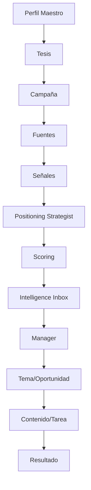
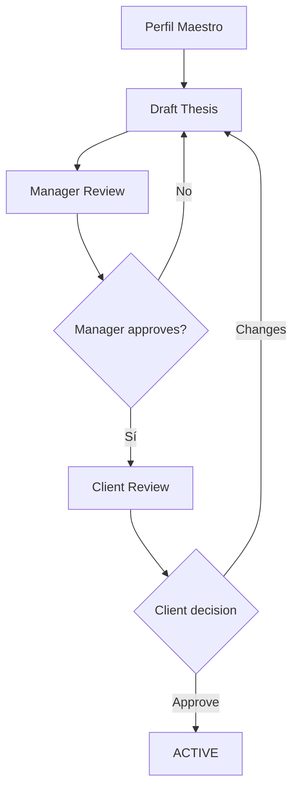
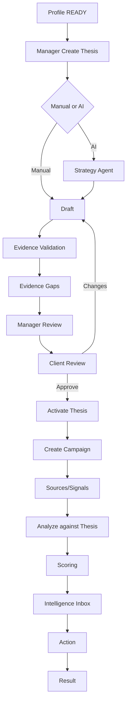

# POSTURA — FASE 8
## Documento 08 de 16 — Tesis de Posicionamiento y Campañas

**Código:** POSTURA-F8-D08  
**Versión:** 1.0  
**Estado:** Especificación estratégica y funcional para implementación  
**Tipo de documento:** Tesis de Posicionamiento, Campañas, Scoring y Gobierno Estratégico  
**Proyecto:** Postura — Positioning Intelligence & Management System  
**Formato:** Markdown  
**Ámbito:** MVP web-first + Electron, Managed SaaS, Manager + Cliente, Firebase, OpenAI/Claude

---

# 1. Propósito del documento

Este documento define cómo Postura construirá, aprobará, utilizará y mantendrá la **Tesis de Posicionamiento** de cada Cliente.

La Tesis de Posicionamiento será el principal filtro estratégico del sistema.

Su función será convertir el conocimiento del Perfil Maestro en una dirección de posicionamiento concreta y utilizable por:

- el Manager;
- el Positioning Strategist Agent;
- el sistema de scoring;
- el Intelligence Inbox;
- los módulos de Temas;
- Oportunidades;
- Contenido;
- Tareas;
- Resultados.

La Tesis responde a una pregunta central:

> ¿Qué queremos que una audiencia determinada llegue a reconocer, asociar y recordar sobre este Cliente, y con qué objetivo?

---

# 2. Diferencia entre Perfil Maestro y Tesis

El Perfil Maestro responde:

```text
¿QUIÉN ES EL CLIENTE?
```

La Tesis responde:

```text
¿CÓMO QUEREMOS POSICIONARLO?
```

No deben confundirse.

---

# 3. Ejemplo

## Perfil Maestro

```text
Abogado con experiencia en propiedad intelectual,
patentes, inteligencia artificial y asesoría empresarial.
```

## Tesis

```text
Posicionar a Juan Vasquez como una autoridad
en gobernanza de IA y riesgo jurídico para empresas
que están adoptando inteligencia artificial.
```

---

# 4. Principio central

Ninguna Señal debe considerarse estratégicamente importante únicamente porque sea tendencia.

Debe responder:

```text
¿Esta información ayuda a avanzar una Tesis activa?
```

---

# 5. Función de la Tesis dentro de Postura



---

# 6. Componentes obligatorios de una Tesis

Toda Tesis deberá definir al menos:

1. Cliente.
2. Identidad profesional objetivo.
3. Audiencia principal.
4. Dominio temático.
5. Objetivo estratégico.
6. Evidencia disponible.
7. Diferenciador.
8. Límites.
9. Mercados.
10. Horizonte.
11. Indicadores.
12. Estado.
13. Aprobación.

---

# 7. Fórmula conceptual

Una Tesis puede representarse como:

```text
POSICIONAR A [CLIENTE]

COMO [IDENTIDAD / AUTORIDAD]

ANTE [AUDIENCIA]

EN [DOMINIO]

PARA [OBJETIVO]

RESPALDADO POR [EVIDENCIA]

DIFERENCIADO POR [PERSPECTIVA / EXPERIENCIA]

DENTRO DE [LÍMITES]
```

---

# 8. TH-01 — Cliente

Debe existir:

```text
clientId
```

La Tesis pertenece siempre a un Cliente.

---

# 9. TH-02 — Expert Identity

Representa la identidad profesional que se desea construir.

Ejemplos:

```text
Autoridad en gobernanza de IA
Especialista en regulación tecnológica
Referente en propiedad intelectual
Experto en transformación digital
Voz técnica en ciberseguridad empresarial
```

---

# 10. Regla de honestidad

La identidad objetivo puede aspirar a una posición superior a la reputación actual, pero no debe convertirse en una afirmación falsa.

Incorrecto:

```text
"El principal experto mundial..."
```

sin respaldo.

Correcto:

```text
"Posicionarlo progresivamente como una autoridad..."
```

---

# 11. TH-03 — Audiencia

Toda Tesis deberá tener:

```text
primaryAudience
```

Opcionalmente:

```text
secondaryAudiences
```

---

# 12. Audiencia primaria

La audiencia que realmente importa para el objetivo.

Ejemplo:

```text
General Counsel y ejecutivos de empresas que adoptan IA.
```

---

# 13. Audiencia secundaria

Audiencias que pueden amplificar autoridad.

Ejemplo:

```text
periodistas
académicos
asociaciones
otros abogados
startups
```

---

# 14. Audience fit

Una Señal será más valiosa cuando la audiencia interesada en ella coincida con la audiencia de la Tesis.

---

# 15. TH-04 — Domain

Representa el dominio de conocimiento.

Puede tener:

```text
primaryDomain
supportingDomains
```

---

# 16. Ejemplo

```text
Primary:
AI Governance

Supporting:
AI Regulation
Cybersecurity
Privacy
Enterprise AI Adoption
```

---

# 17. Regla de foco

Una Tesis no debe abarcar demasiados dominios.

Una tesis demasiado amplia:

```text
IA + derecho + negocios + tecnología + innovación + liderazgo
```

pierde utilidad como filtro.

---

# 18. TH-05 — Objective

Objetivos posibles:

```text
BUSINESS_DEVELOPMENT
THOUGHT_LEADERSHIP
PUBLIC_AUTHORITY
CAREER_POSITIONING
BOARD_POSITIONING
ACADEMIC_POSITIONING
POLICY_INFLUENCE
MEDIA_VISIBILITY
NETWORK_EXPANSION
OTHER
```

---

# 19. Primary Objective

Cada Tesis tendrá:

```text
primaryObjective
```

y opcionalmente objetivos secundarios.

---

# 20. Ejemplo

```text
Primary:
BUSINESS_DEVELOPMENT

Secondary:
MEDIA_VISIBILITY
THOUGHT_LEADERSHIP
```

---

# 21. TH-06 — Evidence

La Tesis deberá indicar qué elementos del Perfil Maestro respaldan la posición.

---

# 22. Tipos de soporte

```text
experiencia
publicaciones
cargos
proyectos
certificaciones
patentes
casos
conferencias
investigaciones
empresas
emprendimientos
```

---

# 23. Evidence references

La Tesis podrá guardar:

```text
evidenceIds
```

en número controlado.

Si crece demasiado, se utilizará relación separada posteriormente.

---

# 24. Evidence Gap

Postura deberá poder identificar:

```text
desiredIdentity > currentEvidence
```

---

# 25. Ejemplo de gap

Objetivo:

```text
Autoridad en AI Cybersecurity Law
```

Evidencia actual:

```text
Alta en AI Governance
Baja en Cybersecurity
```

Resultado:

```text
POSITIONING GAP
```

---

# 26. Uso del gap

El sistema puede recomendar:

```text
escribir sobre ciberseguridad
realizar investigación
participar en eventos
desarrollar evidencia
colaborar con especialistas
```

No debe fingir que la autoridad ya existe.

---

# 27. TH-07 — Differentiator

La Tesis deberá definir qué hace diferente al Cliente.

Ejemplos:

```text
experiencia jurídica + comprensión técnica
experiencia ejecutiva + aplicación práctica
experiencia académica + casos reales
perspectiva internacional
experiencia en empresas reguladas
```

---

# 28. Regla de diferenciación

No utilizar frases genéricas:

```text
"apasionado"
"innovador"
"experto"
"líder"
```

como diferenciador principal.

---

# 29. TH-08 — Boundaries

La Tesis heredará límites del Perfil y podrá añadir límites específicos.

---

# 30. Ejemplos

```text
No comentar litigios activos
No opinar sobre política partidista
No afirmar resultados garantizados
No revelar clientes
No dar asesoría individual
```

---

# 31. TH-09 — Markets

Puede definir:

```text
primaryMarkets
secondaryMarkets
languages
```

---

# 32. Ejemplo

```text
Global
English
Spanish
```

o:

```text
United States
Mexico
Colombia
```

según estrategia.

---

# 33. TH-10 — Time Horizon

Opciones conceptuales:

```text
3_MONTHS
6_MONTHS
12_MONTHS
OPEN_ENDED
```

---

# 34. No promesa de resultado

El horizonte representa periodo de estrategia.

No garantiza alcanzar la posición en ese tiempo.

---

# 35. TH-11 — Indicators

Indicadores de Tesis pueden incluir:

```text
publications
high-quality opportunities
speaking invitations
media mentions
qualified leads
engagement from target audience
authority assets
search visibility
```

---

# 36. Indicadores no vanity

Priorizar:

```text
audiencia relevante
oportunidades
leads
invitaciones
autoridad
```

sobre:

```text
likes totales
followers sin relevancia
```

---

# 37. TH-12 — Estado

Estados oficiales:

```text
DRAFT
UNDER_REVIEW
ACTIVE
PAUSED
ARCHIVED
```

---

# 38. DRAFT

Tesis en construcción.

No debe utilizarse automáticamente para scoring principal.

---

# 39. UNDER_REVIEW

Lista para revisión Cliente/Manager.

---

# 40. ACTIVE

Puede utilizarse para:

- scoring;
- fuentes;
- señales;
- contenido;
- estrategia.

---

# 41. PAUSED

Conserva historial pero deja de dirigir nuevas recomendaciones.

---

# 42. ARCHIVED

Tesis histórica.

No participa en operaciones activas.

---

# 43. TH-13 — Aprobación

La Tesis deberá ser revisada por:

```text
Manager
Cliente
```

---

# 44. Flujo de aprobación



---

# 45. Aprobación del Cliente

El Cliente no necesita editar toda la estructura técnica.

Debe poder responder:

```text
APROBAR
SOLICITAR CAMBIOS
```

---

# 46. Manager final control

La activación técnica podrá ser ejecutada por Manager después de aceptación del Cliente.

---

# 47. Varias Tesis por Cliente

Un Cliente podrá tener varias Tesis.

---

# 48. Ejemplo

```text
Juan
│
├── Thesis A
│   AI Governance
│
└── Thesis B
    Patent Prosecution
```

---

# 49. Regla de separación

Cada Tesis tendrá:

- audiencia;
- dominio;
- objetivos;
- contenido;
- señales;
- campañas;

independientes cuando sea necesario.

---

# 50. Problema que evita

Sin separación:

```text
un día patentes
otro día ciberseguridad
otro día IA
otro día liderazgo
```

puede producir una identidad pública confusa.

---

# 51. Compatible Thesis

Dos Tesis pueden compartir:

- audiencia;
- temas;
- evidencia.

Pero no deben fusionarse automáticamente.

---

# 52. Thesis Conflict

Postura deberá detectar cuando dos Tesis:

- compiten por la misma audiencia;
- proyectan identidades contradictorias;
- producen mensajes incompatibles.

---

# 53. Conflict severity

```text
LOW
MEDIUM
HIGH
```

---

# 54. Ejemplo conflictivo

Tesis A:

```text
Autoridad técnica neutral
```

Tesis B:

```text
Influencer altamente promocional
```

puede requerir revisión.

---

# 55. Thesis Compatibility Review

No será un algoritmo sofisticado en MVP.

El Strategy Agent puede emitir warning.

---

# 56. Campañas

Una Campaña será la unidad operativa de ejecución de una Tesis.

---

# 57. Diferencia Tesis vs Campaña

```text
TESIS:
Qué posición queremos construir.

CAMPAÑA:
Cómo organizamos acciones durante un periodo.
```

---

# 58. Ejemplo

Tesis:

```text
Autoridad en AI Governance
```

Campaña:

```text
AI Governance — Q4 2026
```

---

# 59. Componentes de Campaña

```text
campaignId
clientId
thesisId
name
description
startAt
endAt
status
themes
targetAudiences
targetMarkets
sourceIds
contentGoals
opportunityGoals
```

---

# 60. Estados Campaña

```text
DRAFT
ACTIVE
PAUSED
COMPLETED
ARCHIVED
```

---

# 61. Campaña DRAFT

Configuración.

---

# 62. Campaña ACTIVE

Recibe:

- señales;
- análisis;
- temas;
- contenido;
- tareas.

---

# 63. Campaña PAUSED

Detiene operaciones automáticas específicas.

---

# 64. Campaña COMPLETED

Periodo terminado.

Resultados disponibles.

---

# 65. Campaign themes

Las campañas pueden seleccionar subtemas.

Ejemplo:

```text
AI governance frameworks
AI risk
AI compliance
AI cybersecurity
```

---

# 66. Campaign goals

Metas operativas simples.

Ejemplo:

```text
2 artículos al mes
4 videos cortos
1 oportunidad de conferencia
```

No son obligaciones rígidas del sistema.

---

# 67. No content calendar pesado

El MVP no requiere un calendario editorial complejo.

La Campaña organiza prioridades.

---

# 68. Tesis sin Campaña

Una Tesis puede existir sin Campaña.

---

# 69. Campaña siempre con Tesis

Toda Campaña debe tener:

```text
thesisId
```

---

# 70. Strategy Agent

El Positioning Strategist Agent será el principal consumidor de la Tesis.

---

# 71. Funciones del Strategy Agent

Podrá:

- proponer Tesis;
- evaluar coherencia;
- detectar gaps;
- relacionar Señales;
- calcular factores de scoring;
- sugerir ángulos;
- detectar oportunidades;
- identificar riesgo;
- sugerir acciones.

---

# 72. No autoridad autónoma

El Strategy Agent:

```text
SUGIERE
```

El Manager:

```text
DECIDE
```

---

# 73. Input del Strategy Agent para Tesis

```text
Confirmed Profile
Evidence
Goals
Audience
Markets
Voice
Boundaries
Manager Notes relevant
```

---

# 74. Output de generación de Tesis

Debe ser estructurado.

Ejemplo:

```json
{
  "positioningStatement": "...",
  "expertIdentity": "...",
  "primaryAudience": [],
  "domains": [],
  "primaryObjective": "...",
  "differentiators": [],
  "evidenceRefs": [],
  "evidenceGaps": [],
  "boundaries": [],
  "recommendedMarkets": [],
  "warnings": []
}
```

---

# 75. Prompt rule

El Strategy Agent no puede inventar credenciales.

---

# 76. Prompt rule — aspiración

Debe distinguir:

```text
CURRENT AUTHORITY
DESIRED POSITIONING
```

---

# 77. Prompt rule — evidence gap

Si la Tesis deseada supera la evidencia:

debe indicarlo.

---

# 78. Prompt rule — focus

Evitar Tesis excesivamente amplia.

---

# 79. Prompt rule — audience

Debe identificar audiencia específica.

Incorrecto:

```text
todo el mundo
```

---

# 80. Prompt rule — objective

Debe vincular la Tesis con una finalidad concreta.

---

# 81. Tesis manual

El Manager puede crear Tesis completamente manual.

---

# 82. Tesis asistida

El Manager puede solicitar:

```text
Generate Thesis Proposal
```

---

# 83. Draft generation flow

```text
Profile
   ↓
Strategy Agent
   ↓
Draft Thesis
   ↓
Manager edits
   ↓
Client review
   ↓
Active
```

---

# 84. No automatic activation

La IA nunca activa una Tesis.

---

# 85. Tesis versioning

MVP:

```text
current document + audit events
```

---

# 86. Significant changes

Si cambia:

- identity;
- audience;
- objective;
- domain;

se recomienda:

```text
return to UNDER_REVIEW
```

---

# 87. Minor changes

Correcciones menores pueden no requerir re-aprobación completa.

---

# 88. Rule classification

La implementación puede definir:

```text
materialChange = true/false
```

en backend.

---

# 89. Thesis History future

Puede añadirse:

```text
thesisVersions
```

posteriormente.

---

# 90. Relación Tesis ↔ Señales

Cada análisis estratégico deberá poder identificar:

```text
thesisId
```

---

# 91. Señal sin Tesis

Puede existir.

Ejemplo:

fuente automática genera señal antes de asignación estratégica.

---

# 92. Señal analizada contra múltiples Tesis

Puede ocurrir.

Ejemplo:

una regulación IA puede ser relevante para:

```text
AI Governance
AI Cybersecurity Law
```

---

# 93. MVP approach

No duplicar Signal por cada Tesis si ya pertenece al mismo Cliente.

Crear múltiples:

```text
signalAnalyses
```

con diferente `thesisId`.

---

# 94. Active Analysis

Para Intelligence Inbox por campaña:

el sistema seleccionará análisis correspondiente.

---

# 95. Scoring estratégico

El score principal deberá reflejar:

```text
THESIS FIT
```

no popularidad general.

---

# 96. Factores

Propuesta inicial:

| Factor | Peso conceptual |
|---|---:|
| Thesis Match | 25 |
| Audience Match | 20 |
| Timeliness | 15 |
| Authority Fit | 15 |
| Differentiation | 10 |
| Commercial/Strategic Potential | 10 |
| Source Quality | 5 |
| Risk Penalty | variable |
| Total base | 100 |

---

# 97. No fórmula rígida inicial

Los pesos son una guía MVP.

Podrán ajustarse con piloto.

---

# 98. Thesis Match

Pregunta:

> ¿La Señal pertenece realmente al dominio y narrativa de esta Tesis?

---

# 99. Audience Match

> ¿A la audiencia de la Tesis le importa este tema?

---

# 100. Timeliness

> ¿Existe una razón para hablar ahora?

---

# 101. Authority Fit

> ¿El Cliente tiene legitimidad para hablar?

---

# 102. Differentiation

> ¿Puede aportar algo distinto?

---

# 103. Strategic Potential

> ¿Puede producir autoridad, negocio, visibilidad u oportunidad?

---

# 104. Source Quality

> ¿La fuente es suficientemente confiable?

---

# 105. Risk Penalty

Reduce score cuando:

- evidencia insuficiente;
- tema sensible;
- conflicto profesional;
- afirmaciones débiles;
- riesgo reputacional.

---

# 106. Score bands

```text
0–39 LOW
40–69 MEDIUM
70–84 HIGH
85–100 CRITICAL
```

`CRITICAL` significa alta prioridad estratégica, no emergencia.

---

# 107. Scoring explainable

La UI debe mostrar:

```text
¿Por qué?
```

---

# 108. Ejemplo

```text
Score: 91

+ Muy alineado con AI Governance
+ Audiencia objetivo afectada directamente
+ Alta actualidad
+ Cliente tiene experiencia relevante
+ Buen potencial de artículo
- Evidencia limitada en ciberseguridad
```

---

# 109. Manager override

El Manager puede:

```text
UPRANK
DOWNRANK
DISCARD
```

conceptualmente.

---

# 110. Override reason

Opcionalmente registrar:

```text
managerReason
```

para aprendizaje futuro.

---

# 111. No machine-learning ranking in MVP

El ranking será:

```text
rules + LLM analysis + human judgment
```

---

# 112. Campaign Scoring

Una Campaña puede añadir prioridad.

Ejemplo:

Campaña actual:

```text
AI Risk Governance
```

Una señal sobre AI Risk puede recibir boost.

---

# 113. No hidden boost

Debe poder explicarse.

---

# 114. Sources by Thesis

El Manager podrá asociar fuentes preferidas a Campaña/Tesis.

---

# 115. Example

AI Governance:

```text
NIST
EU Commission
OECD
Federal Register
major AI companies
```

Patent Prosecution:

```text
USPTO
WIPO
EPO
patent courts
```

---

# 116. Global sources

También pueden alimentar todas las Tesis.

---

# 117. Topics by Thesis

Todo Tema estratégico debe poder relacionarse con:

```text
thesisId
campaignId
```

---

# 118. Content by Thesis

Todo Content relevante deberá poder rastrear:

```text
thesisId
```

cuando exista.

---

# 119. Opportunity by Thesis

También.

---

# 120. Result by Campaign

Permite posteriormente preguntar:

> ¿Qué Tesis está generando mejores oportunidades?

---

# 121. Result attribution

No debe presentarse como causalidad perfecta.

Solo asociación operativa.

---

# 122. Thesis Dashboard

El Manager deberá ver:

```text
Statement
Status
Audience
Domains
Objective
Evidence
Gaps
Campaigns
Signals
Opportunities
Content
Results
```

---

# 123. Cliente Thesis View

Más simple:

```text
Cómo queremos posicionarte
Ante quién
En qué temas
Con qué objetivo
Qué evitaremos
```

---

# 124. Thesis Card

Ejemplo:

```text
AI Governance & Enterprise Risk

Status: ACTIVE

Audience:
General Counsel / Executives

Goal:
Business Development

Markets:
Global

Evidence:
Strong

Open gaps:
AI Cybersecurity evidence
```

---

# 125. Thesis Readiness

Antes de activar:

```text
DRAFT
BASIC
READY
```

---

# 126. READY requiere

```text
expert identity
primary audience
domain
primary objective
supporting evidence
boundaries reviewed
client approval
```

---

# 127. BASIC

Puede existir borrador útil pero faltan elementos.

---

# 128. DRAFT

Incompleta.

---

# 129. Thesis Quality Checklist

Debe evaluar:

```text
Specific
Credible
Relevant
Differentiated
Audience-focused
Evidence-backed
Actionable
Bounded
```

---

# 130. Specific

No demasiado amplia.

---

# 131. Credible

No contradice evidencia.

---

# 132. Relevant

Conecta con objetivos reales.

---

# 133. Differentiated

Tiene punto distintivo.

---

# 134. Audience-focused

Define ante quién.

---

# 135. Evidence-backed

Tiene soporte suficiente o gaps explícitos.

---

# 136. Actionable

Permite seleccionar temas y oportunidades.

---

# 137. Bounded

Sabe qué no hacer.

---

# 138. Thesis Quality Score

No obligatorio en MVP como número.

Puede mostrarse:

```text
Incomplete
Needs Review
Ready
```

---

# 139. Campaign Dashboard

Mostrar:

```text
status
dates
themes
signals
high-priority signals
opportunities
content
tasks
results
```

---

# 140. Campaign timeframe

Puede ser abierto.

---

# 141. Campaign pause

Debe detener:

- automatización específica;
- nuevos análisis asociados;

según configuración.

No elimina datos.

---

# 142. Campaign completion

No impide consultar historial.

---

# 143. Campaign cloning future

No necesario MVP.

---

# 144. Campaign templates future

No necesario MVP.

---

# 145. Thesis Builder UX

Se recomienda wizard de 7 pasos.

---

# 146. Paso 1 — Identity

```text
¿Como qué quieres que esta persona sea reconocida?
```

---

# 147. Paso 2 — Audience

```text
¿Quién necesita reconocerlo así?
```

---

# 148. Paso 3 — Domain

```text
¿Sobre qué áreas?
```

---

# 149. Paso 4 — Objective

```text
¿Para qué?
```

---

# 150. Paso 5 — Evidence

```text
¿Qué respalda esta posición?
```

---

# 151. Paso 6 — Differentiator

```text
¿Qué hace distinta su perspectiva?
```

---

# 152. Paso 7 — Boundaries

```text
¿Qué no debe hacer o decir esta estrategia?
```

---

# 153. Generated Statement

Después:

```text
Generate Positioning Statement
```

---

# 154. Manager editing

Editable.

---

# 155. Client approval UI

Debe mostrar lenguaje sencillo.

---

# 156. Example client screen

```text
Queremos posicionarte como:

[statement]

Principal audiencia:
[...]

Temas:
[...]

Objetivo:
[...]

¿Esto representa correctamente
la posición que quieres construir?

[Solicitar cambios] [Aprobar]
```

---

# 157. Thesis no marketing slogan

La Tesis es una herramienta estratégica interna.

No tiene que convertirse literalmente en tagline.

---

# 158. Public Bio vs Thesis

No copiar Tesis directamente a Bio.

---

# 159. Thesis confidentiality

Puede contener estrategia interna.

No publicarla por defecto.

---

# 160. Manager Notes

Puede tener notas privadas.

---

# 161. Data Model — Thesis extensions

Se recomienda ampliar `PositioningThesis`:

```typescript
interface PositioningThesis {
  organizationId: string;
  clientId: string;

  name: string;

  expertIdentity: string;

  primaryAudience: string[];
  secondaryAudiences?: string[];

  primaryDomain: string[];
  supportingDomains?: string[];

  primaryObjective: string;
  secondaryObjectives?: string[];

  positioningStatement: string;

  differentiators?: string[];

  evidenceIds?: string[];
  evidenceGaps?: string[];

  boundaries?: string[];

  primaryMarkets?: string[];
  secondaryMarkets?: string[];

  languages?: string[];

  timeHorizon?: string;

  readiness:
    | "DRAFT"
    | "BASIC"
    | "READY";

  status:
    | "DRAFT"
    | "UNDER_REVIEW"
    | "ACTIVE"
    | "PAUSED"
    | "ARCHIVED";

  clientApprovalStatus:
    | "NOT_REQUESTED"
    | "PENDING"
    | "APPROVED"
    | "CHANGES_REQUESTED";

  clientApprovedAt?: Timestamp | null;
  clientApprovedBy?: string | null;

  activatedAt?: Timestamp | null;

  createdAt: Timestamp;
  createdBy: string;
  updatedAt: Timestamp;
  updatedBy: string;

  archivedAt?: Timestamp | null;
}
```

---

# 162. Campaign extensions

```typescript
interface Campaign {
  organizationId: string;
  clientId: string;
  thesisId: string;

  name: string;
  description?: string;

  themes?: string[];

  targetAudiences?: string[];
  targetMarkets?: string[];

  sourceIds?: string[];

  contentGoals?: {
    shortPosts?: number;
    articles?: number;
    shortVideos?: number;
    longVideos?: number;
  };

  opportunityGoals?: string[];

  status:
    | "DRAFT"
    | "ACTIVE"
    | "PAUSED"
    | "COMPLETED"
    | "ARCHIVED";

  startAt?: Timestamp | null;
  endAt?: Timestamp | null;

  createdAt: Timestamp;
  createdBy: string;
  updatedAt: Timestamp;
  updatedBy: string;
}
```

---

# 163. ThesisApproval

Puede utilizar colección `approvals`.

```text
entityType = THESIS
```

---

# 164. Material changes

Cuando se produzca cambio material:

crear nueva Approval Request.

---

# 165. Thesis Audit Events

Eventos:

```text
THESIS_CREATED
THESIS_GENERATED
THESIS_UPDATED
THESIS_REVIEW_REQUESTED
THESIS_CLIENT_APPROVED
THESIS_CHANGES_REQUESTED
THESIS_ACTIVATED
THESIS_PAUSED
THESIS_ARCHIVED
CAMPAIGN_CREATED
CAMPAIGN_ACTIVATED
CAMPAIGN_PAUSED
CAMPAIGN_COMPLETED
```

---

# 166. Campaign Source linking

MVP puede utilizar:

```text
sourceIds[]
```

si el número es pequeño.

---

# 167. Future campaignSources

Si crece:

```text
campaignSources
```

No necesario inicialmente.

---

# 168. Thesis-to-Signal analysis

`signalAnalyses` ya incluye:

```text
thesisId
campaignId
```

Esto se mantiene.

---

# 169. Multiple analyses

Una Signal puede tener:

```text
Analysis for Thesis A
Analysis for Thesis B
```

---

# 170. Intelligence Inbox filter

Filtros:

```text
Client
Thesis
Campaign
Score
Risk
Date
Status
```

---

# 171. Campaign-specific Inbox

```text
/manager/clients/:clientId/campaigns/:campaignId/intelligence
```

puede ser vista futura o filtro.

No requiere ruta separada MVP.

---

# 172. Thesis status and automation

Solo:

```text
ACTIVE
```

debe dirigir automatización estándar.

---

# 173. Paused thesis

No nuevos análisis automáticos salvo decisión manual.

---

# 174. Archived thesis

Histórica.

---

# 175. Active thesis limit

No imponer número fijo desde backend inicialmente.

Pero UX deberá advertir si hay demasiadas Tesis activas.

---

# 176. Recommended MVP

```text
1–3 active theses per client
```

dependiendo del Cliente.

---

# 177. Reason

Demasiadas Tesis reducen foco y aumentan costos de análisis.

---

# 178. Thesis priority

Agregar:

```text
priority
```

opcional:

```text
PRIMARY
SECONDARY
EXPERIMENTAL
```

---

# 179. PRIMARY

Principal posicionamiento.

---

# 180. SECONDARY

Línea complementaria.

---

# 181. EXPERIMENTAL

Hipótesis en prueba.

---

# 182. Data extension

```typescript
priority?: "PRIMARY" | "SECONDARY" | "EXPERIMENTAL";
```

---

# 183. Experimental thesis

Puede analizar Señales manualmente sin alimentar toda automatización.

---

# 184. Thesis hierarchy

No implementar jerarquía padre-hijo compleja.

---

# 185. Thesis merge

No automático.

Manager decide.

---

# 186. Thesis split

Puede crear dos nuevas Tesis.

---

# 187. Historic attribution

Contenido antiguo conserva thesisId original.

---

# 188. No retroactive reassignment

No cambiar masivamente historial porque cambió estrategia.

---

# 189. Strategy refresh

Manager puede revisar Tesis cuando:

- cambia carrera;
- cambia mercado;
- cambia servicio;
- cambia objetivo;
- aparece nueva oportunidad.

---

# 190. Scheduled Thesis Review

No automático MVP.

Puede mostrar:

```text
Last reviewed
```

---

# 191. Review date

Campos opcionales:

```text
lastReviewedAt
nextReviewAt
```

---

# 192. Campaign review

Al finalizar Campaña:

Manager revisa:

- resultados;
- señales;
- oportunidades;
- contenido;
- aprendizaje.

---

# 193. Learning future

Posteriormente Postura podrá recomendar:

```text
Increase
Decrease
Pause
Refine
```

una Tesis.

No automático MVP.

---

# 194. Evidence gap tasks

El sistema puede crear tareas internas:

```text
Develop evidence in cybersecurity
Publish technical article
Document project
Obtain conference participation
```

---

# 195. These are positioning tasks

No necesariamente contenido.

---

# 196. Opportunity strategy

Postura puede recomendar:

```text
conference > social post
```

si fortalece mejor la Tesis.

---

# 197. Content strategy

El sistema no debe obligar a producir contenido cuando otra acción sea mejor.

---

# 198. Thesis-based content test

Antes de generar contenido:

```text
Does this advance the thesis?
```

---

# 199. If NO

Recomendar:

```text
do not publish
```

---

# 200. Strategic silence

Una salida válida de Postura es:

```text
NO ACTION
```

---

# 201. Strategy Agent output action enum

```text
NO_ACTION
MONITOR
RESEARCH
COMMENT
SHORT_POST
ARTICLE
VIDEO
OPPORTUNITY
NETWORKING
OTHER
```

---

# 202. No action explanation

Debe indicar razón.

---

# 203. Content timing

La Tesis ayuda a decidir:

```text
what
why
for whom
```

La Señal aporta:

```text
why now
```

---

# 204. Strategic equation conceptual

```text
PROFILE = credibility
THESIS = direction
SIGNAL = timing
MANAGER = judgment
CONTENT/ACTION = execution
```

---

# 205. Campaign sequencing

Puede organizar:

```text
Awareness
Depth
Authority
Opportunity
```

pero no se implementará funnel rígido.

---

# 206. Professional positioning maturity

MVP no necesita madurez sofisticada.

Puede registrar notas.

---

# 207. Thesis examples — Abogado IA

```text
Position Juan Vasquez as a trusted authority
on AI governance and enterprise AI legal risk
for general counsel and executives at organizations
adopting AI, with the objective of developing
high-value legal advisory opportunities.
```

---

# 208. Thesis examples — Médico

```text
Position Dr. X as a credible educator
on preventive cardiology for executives and adults
seeking evidence-based health guidance,
with the objective of building professional authority
and qualified patient demand.
```

---

# 209. Thesis examples — Ingeniero

```text
Position Engineer X as an authority
on industrial AI implementation for manufacturing leaders,
with the objective of generating consulting opportunities
and speaking invitations.
```

---

# 210. Examples are templates, not hardcoded profiles

The system must work across professions.

---

# 211. Thesis Review Questions

Manager checklist:

```text
¿Es específica?
¿Es creíble?
¿Existe evidencia?
¿La audiencia importa?
¿El objetivo es claro?
¿El Cliente puede aportar algo diferente?
¿Las fuentes pueden monitorearse?
¿Puede convertirse en acciones?
¿Tiene límites?
```

---

# 212. Client Review Questions

Simplified:

```text
¿Esto representa cómo quieres ser reconocido?
¿Esta es la audiencia correcta?
¿Estos temas te representan?
¿Este objetivo es correcto?
¿Hay algo que no quieras tratar?
```

---

# 213. Strategy Agent confidence

No mostrar precisión artificial.

Use:

```text
Strong fit
Moderate fit
Weak fit
```

cuando sea útil.

---

# 214. Thesis creation without AI

Debe funcionar manualmente.

---

# 215. No API Key

Manager puede crear/editar Tesis sin IA.

---

# 216. AI enhancement

Con API:

```text
Generate
Refine
Challenge
Compare
```

---

# 217. Challenge Thesis

Función recomendada:

```text
Challenge Thesis
```

IA intenta encontrar:

- vaguedad;
- falta de evidencia;
- audiencia incorrecta;
- contradicciones;
- riesgos.

---

# 218. MVP recommendation

Sí incluir `Challenge Thesis` si es sencillo.

Puede aumentar calidad estratégica.

---

# 219. Comparative AI for Thesis

Puede ser útil.

Modo:

```text
OpenAI analysis
Claude analysis
Synthesis
```

solo manual.

---

# 220. No comparative by default

Costo.

---

# 221. Thesis AI Run

`aiRuns.agent`:

```text
POSITIONING_STRATEGIST
```

---

# 222. Thesis prompt version

Guardar:

```text
thesis-generator-v1
thesis-challenge-v1
```

---

# 223. Thesis output schema validation

Obligatoria cuando sea generado por IA.

---

# 224. Data security

Tesis es privada dentro del workspace.

---

# 225. Client access

Cliente puede ver propias Tesis.

---

# 226. Manager notes field

No mostrar al Cliente si se marca interno.

Se recomienda eventualmente colección separada.

---

# 227. Thesis deletion

Soft delete.

---

# 228. Campaign deletion

Soft delete.

---

# 229. Campaign source jobs

Scheduled Functions podrán filtrar:

```text
campaign.status == ACTIVE
```

---

# 230. Automatic analysis

Con credencial persistente:

solo Tesis/Campañas activas.

---

# 231. Temporary API mode

Signals pueden quedar:

```text
PENDING_AI
```

y luego procesarse por Tesis activa.

---

# 232. Batch selection

Manager podrá seleccionar:

```text
Analyze pending signals for this thesis
```

---

# 233. Cross-thesis cost control

No analizar automáticamente cada Signal contra todas las Tesis.

Pre-filter básico antes.

---

# 234. Pre-filter

Puede usar:

- source;
- themes;
- keywords;
- campaign;
- domain.

---

# 235. Then LLM

Solo candidatos razonables.

---

# 236. This reduces cost

Important architectural rule.

---

# 237. Thesis domain keywords

Optional:

```text
domainKeywords
```

para pre-filtrado.

---

# 238. Keyword limitations

Keywords no sustituyen análisis semántico.

---

# 239. Campaign source filters

Optional:

```text
includeTopics
excludeTopics
regions
languages
```

---

# 240. No massive rules engine

MVP simple.

---

# 241. Campaign priority

Optional:

```text
priority
```

---

# 242. Content allocation

Campaign may define desired mix.

Not mandatory.

---

# 243. Strategic opportunity score

Opportunity may inherit relevance but Manager can modify.

---

# 244. Thesis result summary

At campaign end:

```text
Signals reviewed
Opportunities created
Actions completed
Content published
Qualified outcomes
```

---

# 245. No ROI overclaim

Unless business data is linked, Postura cannot claim exact causation.

---

# 246. Positioning assets

Results can include:

```text
article published
conference appearance
podcast
media citation
award
```

These strengthen authority.

---

# 247. Evidence feedback loop

A completed opportunity may create new Evidence.

Example:

```text
Conference completed
↓
Evidence: speaking engagement
```

---

# 248. Important loop

```text
THESIS
 ↓
ACTION
 ↓
RESULT
 ↓
NEW EVIDENCE
 ↓
STRONGER PROFILE
```

---

# 249. Postura compounding model

This loop is central to long-term value.

---

# 250. Implementation recommendation

When result qualifies as professional evidence:

Manager can click:

```text
Add to Evidence Vault
```

---

# 251. Not automatic

Human confirms.

---

# 252. New Evidence may strengthen Thesis

Future analyses benefit.

---

# 253. Thesis metrics future

Possible:

```text
authorityAssetCount
qualifiedOpportunityCount
targetAudienceEngagement
```

Not required as automated scoring MVP.

---

# 254. Campaign closeout

Manager can add:

```text
summary
lessons
nextSteps
```

---

# 255. Data model Campaign extension optional

```typescript
closeoutSummary?: string;
completedAt?: Timestamp | null;
```

---

# 256. Thesis index queries

Recommended:

```text
theses:
organizationId + clientId + status + priority

campaigns:
organizationId + clientId + thesisId + status
```

---

# 257. Intelligence queries

```text
signalAnalyses:
organizationId + clientId + thesisId + relevanceScore
```

may require index.

---

# 258. Campaign Signals

Signals already contain campaignId optional.

---

# 259. Signal analysis by thesis

If Signal belongs broadly to Client but analyzed against Thesis:

analysis is source of strategic relation.

---

# 260. Do not overwrite Signal campaign blindly

One Signal may support multiple campaigns.

---

# 261. Future linking table

If cross-campaign relations grow:

```text
signalCampaignLinks
```

Not MVP.

---

# 262. MVP simplification

Use:

```text
signal.campaignId
```

for primary campaign when captured specifically.

Use Analysis for additional thesis relations.

---

# 263. Campaign content

Content has campaignId.

---

# 264. Campaign tasks

Task has campaignId.

---

# 265. Campaign results

Result has campaignId.

---

# 266. Security rules conceptual

Client:

```text
read own theses/campaigns
comment/approval through allowed flow
```

Manager:

```text
create/update within organization/client scope
```

---

# 267. Backend-only activation

Recommended:

```text
activateThesis()
```

Callable Function.

---

# 268. Activation validation

Function verifies:

```text
status
readiness
client approval
manager authorization
same organization
```

---

# 269. Campaign activation

Similarly backend.

---

# 270. Thesis creation may be direct or backend

Recommended backend if AI-generated.

Manual draft can use controlled write.

---

# 271. Strategy Agent Function recommendations

```text
generateThesisProposal
challengeThesis
refineThesis
analyzeSignalAgainstThesis
generateCampaignProposal
activateThesis
pauseThesis
activateCampaign
completeCampaign
```

---

# 272. No direct provider calls from UI

Maintain architecture.

---

# 273. AI temporary key flow

Same as Document 05.

---

# 274. Thesis Generation without saved key

Temporary key can be used.

---

# 275. Persistent key

Allows automated thesis-based analysis.

---

# 276. AI provider choice

Thesis creation may use:

```text
OpenAI
Claude
Automatic
Comparative
```

---

# 277. Recommendation

Default:

```text
Automatic or selected single provider
```

Comparative only for strategic review.

---

# 278. Manager editing authority

Manager may override AI language.

---

# 279. Client identity authority

Client may reject Thesis.

---

# 280. No forced activation

If Cliente rejects:

```text
CHANGES_REQUESTED
```

---

# 281. Client no technical scoring access required

Can be hidden or simplified.

---

# 282. Manager scoring access

Full.

---

# 283. Thesis explanation

AI should explain:

```text
Why this thesis?
Why this audience?
Why this domain?
Why this objective?
```

---

# 284. Evidence gap explanation

Visible to Manager.

---

# 285. Ethical boundary

Postura should not manipulate audiences deceptively.

Positioning should be grounded in genuine expertise and perspective.

---

# 286. No fabricated authority

Core rule.

---

# 287. No fake social proof

Do not invent:

- clients;
- awards;
- media;
- results.

---

# 288. No false scarcity

Not part of thesis.

---

# 289. Professional rules

Boundaries may include profession-specific constraints.

---

# 290. External legal verification

Not automatically guaranteed.

Manager responsible for appropriate compliance.

---

# 291. Thesis Quality Risks

Common failure modes:

```text
too broad
too generic
unsupported
wrong audience
unclear objective
too many domains
no differentiation
contradictory boundaries
unrealistic authority
```

---

# 292. System warnings

Example:

```text
WARNING:
This thesis names 8 unrelated domains.
Consider splitting it.
```

---

# 293. Another warning

```text
WARNING:
Desired identity has limited confirmed evidence.
```

---

# 294. Another warning

```text
WARNING:
Audience is too broad to guide signal selection.
```

---

# 295. Strategy review outcome

```text
READY
REFINE
SPLIT
PAUSE
REJECT
```

for Manager consideration.

---

# 296. No AI auto-reject

Manager decides.

---

# 297. MVP Included

```text
Multiple theses
Thesis builder
AI proposal
Manager review
Client approval
Evidence gaps
Boundaries
Campaigns
Thesis scoring context
Campaign filters
Status lifecycle
Audit
```

---

# 298. MVP Excluded

```text
Automatic thesis optimization
Predictive market positioning
Full competitor graph
Automated brand perception measurement
Market-wide social listening
Automatic thesis split/merge
Complex multi-touch attribution
AI autonomous campaign management
```

---

# 299. Reglas funcionales

## TH-RN-001

Toda Tesis pertenece a un Cliente.

## TH-RN-002

Perfil y Tesis son entidades diferentes.

## TH-RN-003

Una Tesis debe tener audiencia.

## TH-RN-004

Una Tesis debe tener objetivo.

## TH-RN-005

Una Tesis activa debe tener dominio.

## TH-RN-006

Una Tesis activa debe tener evidencia o gaps explícitos.

## TH-RN-007

La IA no activa Tesis.

## TH-RN-008

Cliente debe aprobar Tesis antes de activación.

## TH-RN-009

Manager conserva control estratégico.

## TH-RN-010

Tesis DRAFT no dirige automatización estándar.

## TH-RN-011

Tesis PAUSED no dirige nuevos análisis automáticos.

## TH-RN-012

Campaña siempre referencia Tesis.

## TH-RN-013

Una Campaña no puede pertenecer a otro Cliente distinto de su Tesis.

## TH-RN-014

Una Signal puede analizarse contra varias Tesis.

## TH-RN-015

Los análisis se almacenan separadamente.

## TH-RN-016

El score debe ser explicable.

## TH-RN-017

Manager puede descartar señal de score alto.

## TH-RN-018

No toda señal produce contenido.

## TH-RN-019

NO_ACTION es salida válida.

## TH-RN-020

Una Tesis aspiracional no puede expresarse como hecho no respaldado.

## TH-RN-021

Evidence Gap debe mostrarse, no ocultarse.

## TH-RN-022

Cambios materiales requieren nueva revisión.

## TH-RN-023

Historial antiguo conserva su thesisId original.

## TH-RN-024

Campañas completadas mantienen resultados.

## TH-RN-025

Tesis y Campañas se archivan mediante soft delete.

---

# 300. Historias de usuario

## TH-HU-001 — Crear Tesis

**Como** Manager  
**quiero** construir una Tesis para un Cliente  
**para** orientar todo su posicionamiento.

---

## TH-HU-002 — Generar propuesta IA

**Como** Manager  
**quiero** generar una propuesta basada en el Perfil  
**para** acelerar la estrategia.

---

## TH-HU-003 — Revisar evidencia

**Como** Manager  
**quiero** conocer qué respalda la Tesis  
**para** evitar posicionamiento artificial.

---

## TH-HU-004 — Detectar gaps

**Como** Manager  
**quiero** ver diferencias entre autoridad deseada y evidencia actual  
**para** diseñar acciones que fortalezcan el Perfil.

---

## TH-HU-005 — Aprobar Tesis

**Como** Cliente  
**quiero** revisar cómo Postura pretende posicionarme  
**para** mantener control de mi identidad.

---

## TH-HU-006 — Varias Tesis

**Como** Manager  
**quiero** separar líneas de posicionamiento  
**para** no mezclar audiencias y objetivos.

---

## TH-HU-007 — Crear Campaña

**Como** Manager  
**quiero** crear una Campaña basada en una Tesis  
**para** organizar una etapa de ejecución.

---

## TH-HU-008 — Analizar Señal

**Como** Manager  
**quiero** evaluar una Señal contra una Tesis  
**para** saber si realmente importa.

---

## TH-HU-009 — Explicar score

**Como** Manager  
**quiero** entender el score  
**para** no depender ciegamente de IA.

---

## TH-HU-010 — Pausar Tesis

**Como** Manager  
**quiero** pausar una Tesis  
**para** detener temporalmente su operación sin perder historial.

---

## TH-HU-011 — Challenge Thesis

**Como** Manager  
**quiero** someter una Tesis a crítica IA  
**para** detectar debilidades antes de activarla.

---

## TH-HU-012 — Registrar resultado

**Como** Manager  
**quiero** relacionar resultados con Campaña/Tesis  
**para** comprender qué estrategia produce mejores señales de autoridad.

---

# 301. Criterios de aceptación

## TH-CA-001

Cliente puede tener múltiples Tesis.

## TH-CA-002

Cada Tesis tiene expertIdentity.

## TH-CA-003

Cada Tesis tiene audiencia primaria.

## TH-CA-004

Cada Tesis tiene dominio.

## TH-CA-005

Cada Tesis tiene objetivo.

## TH-CA-006

Cada Tesis puede relacionar evidencia.

## TH-CA-007

Cada Tesis puede registrar gaps.

## TH-CA-008

Cada Tesis puede registrar límites.

## TH-CA-009

Existe readiness.

## TH-CA-010

Existe lifecycle DRAFT → ACTIVE.

## TH-CA-011

Cliente puede aprobar o pedir cambios.

## TH-CA-012

Manager activa Tesis.

## TH-CA-013

AI puede generar propuesta estructurada.

## TH-CA-014

AI no inventa evidencia.

## TH-CA-015

Existe Challenge Thesis.

## TH-CA-016

Campaña referencia thesisId.

## TH-CA-017

Campaña tiene lifecycle.

## TH-CA-018

SignalAnalysis puede indicar thesisId.

## TH-CA-019

Una Signal puede tener múltiples análisis.

## TH-CA-020

Scoring incluye Thesis Match.

## TH-CA-021

Scoring es explicable.

## TH-CA-022

Manager puede ignorar scoring.

## TH-CA-023

NO_ACTION es posible.

## TH-CA-024

Tesis PAUSED no dirige automatización.

## TH-CA-025

Tesis ARCHIVED conserva historial.

## TH-CA-026

Contenido conserva thesisId/campaignId cuando aplica.

## TH-CA-027

Resultados conservan campaignId cuando aplica.

## TH-CA-028

Evidence Gap puede producir tareas.

## TH-CA-029

Campaña puede usar fuentes específicas.

## TH-CA-030

La arquitectura evita mezclar líneas de posicionamiento.

---

# 302. Orden recomendado de implementación

```text
T1 — Extend Thesis schema
T2 — Thesis Builder UI
T3 — Manual Thesis creation
T4 — Strategy Agent thesis proposal
T5 — Evidence linking
T6 — Evidence Gap
T7 — Readiness validation
T8 — Manager review
T9 — Client approval
T10 — Activation Function
T11 — Campaign schema/UI
T12 — Campaign activation
T13 — Signal ↔ Thesis analysis
T14 — Scoring
T15 — Explainability
T16 — Challenge Thesis
T17 — Audit
T18 — Security tests
```

---

# 303. Flujo técnico resumido



---

# 304. Resultado esperado de la Fase 8

Al implementar esta fase, Postura deberá poder:

```text
1. Tomar un Perfil Maestro.
2. Crear una Tesis manual o asistida.
3. Definir identidad objetivo.
4. Definir audiencia.
5. Definir dominio.
6. Definir objetivo.
7. Vincular evidencia.
8. Detectar Evidence Gaps.
9. Definir límites.
10. Revisar calidad.
11. Solicitar aprobación al Cliente.
12. Activar Tesis.
13. Crear Campaña.
14. Asociar fuentes.
15. Analizar Señales contra Tesis.
16. Producir scoring explicable.
17. Convertir inteligencia en acciones.
18. Registrar resultados por Campaña.
```

---

# 305. Decisiones cerradas al finalizar la Fase 8

1. La Tesis es el filtro estratégico central.
2. Perfil y Tesis se mantienen separados.
3. Toda Tesis define identidad objetivo.
4. Toda Tesis define audiencia.
5. Toda Tesis define dominio.
6. Toda Tesis define objetivo.
7. Toda Tesis incorpora evidencia o gaps.
8. Toda Tesis incorpora límites.
9. Cliente puede tener múltiples Tesis.
10. Se recomienda 1–3 Tesis activas por Cliente durante MVP.
11. Las Tesis pueden tener prioridad.
12. Las Campañas dependen de una Tesis.
13. Campaña es ejecución, no estrategia raíz.
14. La IA puede proponer Tesis.
15. La IA no puede activarlas.
16. Cliente aprueba identidad estratégica.
17. Manager activa y controla.
18. Existe Evidence Gap.
19. Existe Challenge Thesis.
20. Una Signal puede analizarse contra múltiples Tesis.
21. Los análisis se guardan por separado.
22. El scoring se basa en fit estratégico.
23. El scoring debe ser explicable.
24. Manager puede ignorar recomendación.
25. NO_ACTION es una salida válida.
26. Campañas activas pueden definir fuentes/temas.
27. Resultados conservan atribución operativa.
28. Resultados pueden convertirse en nueva evidencia.
29. El ciclo de Postura fortalece progresivamente el Perfil.
30. La siguiente fase definirá Fuentes, Señales e Inteligencia de Ingesta.

---

# 306. Siguiente fase

## FASE 9 — Documento 09 de 16
### Fuentes, Señales e Inteligencia de Ingesta

El siguiente documento deberá definir:

- Source Registry;
- fuentes globales;
- fuentes por Cliente;
- fuentes por Campaña;
- entrada manual;
- entrada automática;
- RSS;
- páginas web;
- APIs;
- documentos;
- redes cuando sea posible;
- frecuencia;
- normalización;
- canonicalización;
- deduplicación;
- Signal lifecycle;
- Signal types;
- calidad de fuente;
- trust levels;
- ingestion jobs;
- source runs;
- errores;
- PENDING_AI;
- filtros previos;
- costo;
- copyright;
- seguridad;
- criterios de aceptación.

---

# 307. Estado de documentación

```text
FASE 1
✅ Documento 01 — Documento Maestro

FASE 2
✅ Documento 02 — Especificación Funcional del MVP

FASE 3
✅ Documento 03 — Roles, Usuarios y Modelo Operativo

FASE 4
✅ Documento 04 — Arquitectura Funcional Integral

FASE 5
✅ Documento 05 — Arquitectura Técnica del MVP

FASE 6
✅ Documento 06 — Modelo de Datos Firebase

FASE 7
✅ Documento 07 — Perfil Maestro y Onboarding Inteligente

FASE 8
✅ Documento 08 — Tesis de Posicionamiento y Campañas

FASE 9
⬜ Documento 09 — Fuentes, Señales e Inteligencia de Ingesta
```

---

**FIN DEL DOCUMENTO — POSTURA-F8-D08 v1.0**
