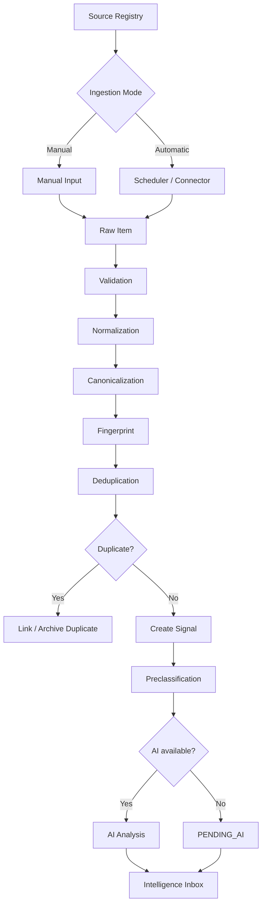
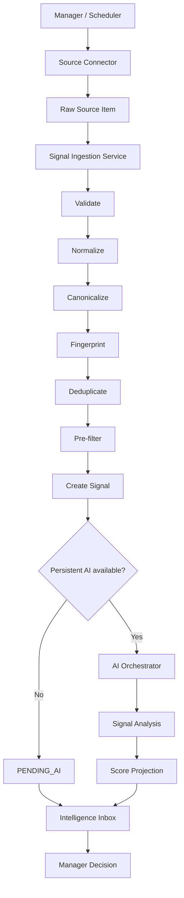

# POSTURA — FASE 9
## Documento 09 de 16 — Fuentes, Señales e Inteligencia de Ingesta

**Código:** POSTURA-F9-D09  
**Versión:** 1.0  
**Estado:** Especificación funcional y técnica para implementación  
**Tipo de documento:** Source Registry, Ingesta, Señales, Normalización, Deduplicación y Preclasificación  
**Proyecto:** Postura — Positioning Intelligence & Management System  
**Formato:** Markdown  
**Ámbito:** MVP web-first + Electron, Firebase, Cloud Functions, OpenAI/Claude, Manager + Cliente

---

# 1. Propósito del documento

Este documento define cómo Postura descubrirá, recibirá, procesará y almacenará información potencialmente relevante para el posicionamiento de sus Clientes.

El sistema de ingesta deberá permitir dos vías paralelas:

```text
MANUAL
AUTOMÁTICA
```

Ambas deberán converger en una misma entidad funcional:

```text
SIGNAL
```

Una Señal será la unidad común de inteligencia entrante de Postura.

La finalidad del sistema no será acumular noticias.

La finalidad será transformar información dispersa en señales potencialmente útiles para una Tesis de Posicionamiento.

---

# 2. Principio central

Postura no debe preguntar:

> ¿Qué noticias existen hoy?

Debe preguntar:

> ¿Qué información disponible hoy puede ser relevante para alguno de los Clientes y sus Tesis?

Por tanto, el pipeline de ingesta debe priorizar:

```text
CALIDAD
RELEVANCIA
TRAZABILIDAD
CONTROL
```

sobre:

```text
VOLUMEN
```

---

# 3. Diferencia entre Fuente, Señal, Tema y Oportunidad

## Fuente

Lugar donde Postura obtiene información.

Ejemplos:

- RSS;
- medio;
- blog;
- organismo regulador;
- sitio web;
- API;
- repositorio académico.

---

## Señal

Unidad concreta capturada desde una Fuente.

Ejemplo:

```text
La Unión Europea publica una actualización regulatoria sobre IA.
```

---

## Tema

Interpretación estratégica.

Ejemplo:

```text
Cómo deben prepararse las empresas para nuevas obligaciones de gobernanza de IA.
```

---

## Oportunidad

Acción posible.

Ejemplo:

```text
Crear un artículo ejecutivo sobre preparación empresarial.
```

---

# 4. Arquitectura general de ingesta



---

# 5. Objetivos del módulo

El sistema deberá poder:

1. Registrar fuentes.
2. Clasificar fuentes.
3. Asignar fuentes a Cliente/Tesis/Campaña.
4. Capturar contenido manualmente.
5. Capturar contenido automáticamente.
6. Registrar ejecuciones.
7. Normalizar información.
8. Canonicalizar URLs.
9. Detectar duplicados.
10. Crear Señales.
11. Clasificar Señales.
12. Relacionarlas con Cliente.
13. Relacionarlas con Tesis.
14. Dejar Señales pendientes de IA.
15. Procesar Señales con IA cuando exista credencial.
16. Identificar errores.
17. Mantener trazabilidad.
18. Reducir ruido.
19. Controlar costos.
20. Evitar ingesta masiva sin propósito.

---

# 6. Source Registry

El **Source Registry** será el catálogo central de fuentes configuradas en Postura.

---

# 7. Tipos de Source

El MVP deberá soportar:

```text
RSS
WEB
API
REGULATORY
ACADEMIC
BLOG
MEDIA
MANUAL
OTHER
```

---

# 8. RSS

Será uno de los métodos automáticos preferidos para MVP.

Ventajas:

- estructurado;
- bajo costo;
- fácil de procesar;
- menor fragilidad;
- contiene fechas;
- contiene URLs;
- ideal para monitoreo periódico.

---

# 9. WEB

Representa una página web configurada.

MVP:

```text
extracción limitada
```

No crawler masivo.

---

# 10. API

Representa integración estructurada con una API externa.

Solo se implementará cuando:

- exista API disponible;
- sea útil;
- el acceso esté autorizado;
- el costo sea aceptable.

---

# 11. REGULATORY

Categoría especial para:

- reguladores;
- organismos públicos;
- autoridades;
- legislación;
- normas;
- decisiones.

Técnicamente puede usar RSS, Web o API.

---

# 12. ACADEMIC

Fuentes:

- revistas;
- repositorios;
- bases académicas;
- universidades;
- papers.

---

# 13. BLOG

Blogs profesionales o especializados.

---

# 14. MEDIA

Medios periodísticos.

---

# 15. MANUAL

Fuente creada por intervención humana.

---

# 16. Scope de Source

Toda Source tendrá:

```text
GLOBAL
CLIENT
```

---

# 17. GLOBAL

Puede servir a varios Clientes.

Ejemplo:

```text
NIST
OECD
WIPO
Reuters Technology
```

---

# 18. CLIENT

Creada específicamente para un Cliente.

Ejemplo:

```text
Asociación profesional de su sector
Competidor específico
Organismo local
```

---

# 19. Source ligada a Campaña

Una fuente podrá tener:

```text
campaignId
```

si se utiliza principalmente dentro de una Campaña.

---

# 20. Source properties

Campos principales:

```text
name
type
url
scope
clientId
campaignId
language
region
topics
trustLevel
ingestionMode
frequency
status
```

---

# 21. Trust Level

Estados:

```text
HIGH
MEDIUM
LOW
UNASSESSED
```

---

# 22. HIGH

Ejemplos:

- fuente oficial;
- regulador;
- organismo institucional;
- publicación primaria.

---

# 23. MEDIUM

Fuente generalmente confiable, pero secundaria.

---

# 24. LOW

Fuente que puede aportar señales pero requiere validación fuerte.

---

# 25. UNASSESSED

No evaluada.

---

# 26. Trust Level no es Truth Score

`trustLevel` es una clasificación operativa.

No significa:

> todo lo que publica esta fuente es verdadero.

---

# 27. Ingestion Mode

```text
MANUAL
AUTOMATIC
```

---

# 28. Frequency

MVP:

```text
HOURLY
DAILY
WEEKLY
MANUAL
```

---

# 29. Recomendación de frecuencia

No todas las fuentes necesitan revisión cada hora.

Ejemplo:

```text
Breaking tech news → HOURLY
Regulator → DAILY
Academic journal → WEEKLY
Manual source → MANUAL
```

---

# 30. Source Status

```text
ACTIVE
PAUSED
ERROR
ARCHIVED
```

---

# 31. ACTIVE

Participa en ingesta.

---

# 32. PAUSED

No se consulta automáticamente.

---

# 33. ERROR

Última ejecución presentó problema.

---

# 34. ARCHIVED

Conserva historial.

---

# 35. Source creation manual

Manager podrá crear:

```text
+ Add Source
```

Campos mínimos:

```text
Name
Type
URL
Scope
Frequency
Client/Campaign
```

---

# 36. Source validation

Antes de activar:

- URL válida;
- protocolo permitido;
- no loopback;
- no IP privada no autorizada;
- tipo reconocido;
- frecuencia válida.

---

# 37. SSRF Protection

Cualquier backend que recupere URLs debe impedir acceso arbitrario a:

```text
localhost
127.0.0.1
169.254.169.254
private networks
internal cloud metadata
```

salvo mecanismos expresamente autorizados.

---

# 38. URL Scheme

Permitir:

```text
https
```

y `http` únicamente cuando sea indispensable y controlado.

---

# 39. Manual Ingestion

El Manager podrá crear una Señal manual desde:

```text
URL
TEXT
FILE
IDEA
EVENT
REGULATION
NEWS
SOCIAL_POST_REFERENCE
OTHER
```

---

# 40. Manual URL

Flujo:

```text
Manager enters URL
 ↓
Backend validates
 ↓
Fetch metadata/content
 ↓
Normalize
 ↓
Create Signal
```

---

# 41. Manual Text

Manager pega texto.

Se conserva como:

```text
rawText
```

con:

```text
ingestionMode = MANUAL
```

---

# 42. Manual File

Puede subir:

- PDF;
- DOCX;
- TXT;
- otros soportados.

El archivo irá a Storage.

La Signal tendrá referencia.

---

# 43. Manual Idea

El Manager puede crear:

```text
type = IDEA
```

sin fuente externa.

---

# 44. Manual Event

Ejemplo:

```text
Conferencia AI Governance Summit abre convocatoria.
```

---

# 45. Manual Social Reference

El Manager puede añadir URL a post social.

La extracción dependerá de lo permitido.

---

# 46. Manual ingestion must be first-class

La entrada manual no debe tratarse como parche.

Es parte esencial del producto.

---

# 47. Automatic Ingestion

La ingesta automática será coordinada mediante:

```text
Scheduled Cloud Functions
```

---

# 48. Scheduler

Ejecutará jobs según frecuencia.

---

# 49. Job flow

```text
Scheduler
 ↓
Find active sources
 ↓
Determine due sources
 ↓
Create SourceRun
 ↓
Connector fetch
 ↓
Normalize
 ↓
Dedup
 ↓
Create Signals
 ↓
Complete SourceRun
```

---

# 50. SourceRun

Cada ejecución registra:

```text
startedAt
finishedAt
status
itemsFetched
signalsCreated
duplicatesDetected
errorCode
correlationId
```

---

# 51. Idempotencia

Un job repetido no deberá crear Signals duplicadas indefinidamente.

---

# 52. Connectors

Interfaz conceptual:

```typescript
interface SourceConnector {
  supports(source: Source): boolean;
  fetch(source: Source): Promise<RawSourceItem[]>;
}
```

---

# 53. Initial connectors

MVP recomendado:

```text
ManualConnector
RssConnector
HttpPageConnector
```

---

# 54. ManualConnector

Normaliza entrada humana.

---

# 55. RssConnector

Procesa RSS/Atom.

---

# 56. HttpPageConnector

Uso limitado para páginas simples.

---

# 57. API Connector

Se agrega únicamente cuando haya una API concreta.

No crear `GenericApiConnector` inseguro para cualquier endpoint.

---

# 58. RawSourceItem

Formato intermedio:

```typescript
interface RawSourceItem {
  externalId?: string;
  title?: string;
  url?: string;
  publishedAt?: Date;
  author?: string;
  rawText?: string;
  summary?: string;
  metadata?: Record<string, unknown>;
}
```

---

# 59. Normalizer

Transformará cada RawSourceItem al modelo Signal.

---

# 60. Signal required fields

Mínimo:

```text
organizationId
clientId
title
type
capturedAt
ingestionMode
status
aiStatus
```

---

# 61. Client materialization

Una fuente GLOBAL no genera Signal sin contexto de Cliente.

Debe existir un mecanismo para decidir qué Clientes reciben la Signal.

---

# 62. Estrategia MVP para Global Sources

No fan-out indiscriminado.

Una Global Source puede estar vinculada a:

```text
campaignIds
clientIds
```

mediante configuración lógica.

---

# 63. Source assignments

MVP puede manejar:

```text
source.clientId
campaignId
```

para fuentes específicas.

Para verdaderamente globales se podrá definir:

```text
system scope + assignment config
```

---

# 64. Recomendación MVP

Evitar empezar con decenas de fuentes globales compartidas entre todos.

Configurar Sources principalmente:

```text
por Cliente/Campaña
```

durante piloto.

---

# 65. Source Assignment futuro

Puede crearse:

```text
sourceAssignments
```

si aumenta escala.

No obligatorio MVP.

---

# 66. Signal Type

Enums:

```text
NEWS
REGULATION
COURT_DECISION
ARTICLE
BLOG_POST
SOCIAL_POST
EVENT
RESEARCH
TREND
IDEA
OPPORTUNITY
DOCUMENT
OTHER
```

---

# 67. Type classification

Puede venir:

- por Source;
- por reglas;
- por Manager;
- por IA.

---

# 68. Type correction

Manager puede corregir.

---

# 69. Canonicalization

Objetivo:

reducir URLs equivalentes.

---

# 70. Canonical URL processing

Puede:

- eliminar fragmentos;
- normalizar host;
- retirar tracking params conocidos;
- conservar parámetros funcionales.

---

# 71. Ejemplo

Entrada:

```text
https://example.com/article?utm_source=x&utm_campaign=y
```

Canonical:

```text
https://example.com/article
```

---

# 72. No aggressive canonicalization

No borrar parámetros que cambien contenido.

---

# 73. Fingerprint

Utilizado para deduplicación.

Componentes posibles:

```text
canonicalUrl
normalizedTitle
sourceId
publishedDate
contentHash
```

---

# 74. Hash

Se puede usar SHA-256 para contenido/fingerprint.

---

# 75. Deduplication Levels

MVP tendrá 3 niveles:

```text
EXACT
LIKELY
NONE
```

---

# 76. EXACT

Misma canonical URL o hash.

---

# 77. LIKELY

Título muy similar, misma fuente/fecha o evento similar.

---

# 78. NONE

Sin coincidencia relevante.

---

# 79. Dedup rules

Primera fase:

```text
1. canonical URL exact match
2. external ID match
3. content hash
4. normalized title heuristic
```

---

# 80. No semantic dedup mandatory

Embeddings no serán requisito.

---

# 81. Duplicate handling

Si EXACT:

```text
do not create new independent Signal
```

Puede:

- relacionar SourceRun;
- actualizar metadata;
- incrementar occurrence count futuro.

---

# 82. LIKELY Duplicate

Puede crear Signal con:

```text
duplicateOfSignalId
```

para revisión.

---

# 83. Multiple sources same event

Esto no siempre es duplicado inútil.

Puede aportar:

- confirmación;
- perspectivas;
- fuentes primarias/secundarias.

---

# 84. Event clustering future

Agrupar automáticamente múltiples fuentes del mismo acontecimiento será fase futura.

MVP:

```text
dedup básico
```

---

# 85. Signal status initial

Entrada nueva:

```text
status = NEW
```

---

# 86. aiStatus initial

Con análisis no ejecutado:

```text
PENDING_AI
```

o:

```text
NOT_REQUIRED
```

---

# 87. Preclassification

Antes de IA avanzada, aplicar filtros baratos.

---

# 88. Preclassification goals

Descartar:

- basura;
- duplicados;
- idioma irrelevante;
- fuente pausada;
- contenido demasiado antiguo;
- formato inválido.

---

# 89. Rule-based prefilter

Puede utilizar:

```text
campaign themes
domain keywords
languages
regions
source trust
date
```

---

# 90. No keyword-only decision

Keywords sirven para reducir candidatos.

No deciden relevancia final.

---

# 91. Pre-filter result

```text
PASS
LOW_PRIORITY
REJECT
```

---

# 92. REJECT

Ejemplo:

- contenido vacío;
- URL inválida;
- duplicado exacto;
- idioma no permitido.

---

# 93. LOW_PRIORITY

Se almacena pero no entra primero a análisis IA.

---

# 94. PASS

Candidato para IA.

---

# 95. Automatic AI availability

Si existe clave persistente:

```text
PASS → AI PROCESSING
```

---

# 96. Temporary BYOK mode

Si no existe clave persistente:

```text
PASS → PENDING_AI
```

---

# 97. Batch processing on login

Manager podrá:

```text
Analyze Pending Signals
```

---

# 98. Batch size

Debe limitarse.

Ejemplo inicial:

```text
10–25 Signals por lote
```

ajustable.

---

# 99. No massive all-at-once

Evita:

- costos;
- timeouts;
- rate limits;
- mala UX.

---

# 100. AI Analysis Stages

MVP puede dividir:

```text
RELEVANCE
STRATEGIC
RISK
```

o ejecutar `FULL`.

---

# 101. Relevance

Pregunta:

> ¿Tiene sentido esta Signal para el Cliente/Tesis?

---

# 102. Strategic

Pregunta:

> ¿Qué significa y qué acción podría producir?

---

# 103. Risk

Pregunta:

> ¿Qué riesgos o limitaciones existen?

---

# 104. Full

Combina los anteriores.

---

# 105. Analysis provider modes

```text
OPENAI
CLAUDE
AUTOMATIC
COMPARATIVE
```

---

# 106. Comparative

No usar para todas las Signals.

---

# 107. High-value trigger

Puede reservarse para:

```text
score alto
tema crítico
Manager request
```

---

# 108. Signal → Thesis matching

Antes de análisis LLM completo:

usar contextos de Tesis activas.

---

# 109. Candidate Thesis

Para un Cliente con varias Tesis:

pre-filtrar por:

- Campaign;
- Source assignment;
- themes;
- domain keywords.

---

# 110. Limit thesis fan-out

No analizar cada Signal contra cada Tesis automáticamente.

---

# 111. Signal Analysis output

Debe contener:

```text
relevanceScore
whyItMatters
thesisMatch
audienceMatch
timeliness
authorityFit
differentiation
strategicPotential
sourceQuality
riskLevel
recommendedAction
warnings
```

---

# 112. Signal projection

La Signal podrá guardar resumen de análisis activo:

```text
activeAnalysisId
relevanceScore
relevanceBand
riskLevel
```

---

# 113. Source Quality

Debe considerar:

- trustLevel;
- original vs secondary source;
- metadata;
- recency.

---

# 114. Primary source detection

Cuando sea posible:

la IA puede señalar:

```text
possiblePrimarySource
```

Pero Manager decide.

---

# 115. Source hierarchy

Ejemplo:

```text
Official regulation
 ↓
Official agency summary
 ↓
Major media coverage
 ↓
Opinion blog
```

---

# 116. Evidence preservation

Signal deberá conservar:

```text
sourceUrl
sourceName
publishedAt
capturedAt
```

---

# 117. Raw Content

Guardar solo lo necesario.

---

# 118. Copyright principle

Postura no debe convertirse en repositorio de copias completas de medios.

---

# 119. Recommended storage

Para web content:

```text
metadata
short normalized text
summary
source URL
```

---

# 120. Long documents

Storage.

---

# 121. Quote handling

Si contenido generado usa una cita:

deberá conservar referencia de origen.

---

# 122. No auto-plagiarism

El Content Agent no debe simplemente parafrasear una noticia completa.

---

# 123. Signal vs Source Content

Signal representa contexto para análisis.

No licencia para republicar.

---

# 124. Freshness

Toda Signal debe considerar:

```text
publishedAt
capturedAt
```

---

# 125. Stale signal

Puede marcarse `LOW_PRIORITY` si demasiado antigua para Tesis temporal.

---

# 126. Evergreen signal

Contenido antiguo puede seguir siendo valioso.

No descartar solo por fecha si:

- es regulación vigente;
- documento base;
- investigación importante.

---

# 127. Freshness policy by source

Puede variar.

---

# 128. SourceRun error types

Enums conceptuales:

```text
FETCH_FAILED
TIMEOUT
INVALID_FEED
UNAUTHORIZED
RATE_LIMITED
PARSING_FAILED
EMPTY_RESULT
BLOCKED
UNKNOWN
```

---

# 129. Error Status

Source:

```text
ERROR
```

solo cuando corresponda.

Un error temporal no necesita archivar fuente.

---

# 130. Consecutive failure count

Agregar opcional:

```text
consecutiveFailures
```

a Source.

---

# 131. Auto pause

MVP puede:

```text
3–5 failures → notify Manager
```

No necesariamente pausar automáticamente.

---

# 132. Manager source diagnostics

Ver:

```text
last checked
last success
last error
signals created
```

---

# 133. Health Card

Ejemplo:

```text
NIST AI
ACTIVE
Last success: 2h ago
Signals this week: 8
Errors: 0
```

---

# 134. Source Testing

Botón:

```text
Test Source
```

---

# 135. Test result

Mostrar:

```text
Connected
Items found
Latest item
Warnings
```

---

# 136. Test must not create signals by default

Puede ofrecer:

```text
Save + Activate
```

después.

---

# 137. Source ownership

Manager controla Sources.

Cliente no administra Sources en MVP.

---

# 138. Suggested Sources

IA puede sugerir Sources.

No agregarlas automáticamente.

---

# 139. Source Recommendation

Ejemplo:

> Esta Tesis utiliza AI Governance. Considera agregar NIST AI RMF updates.

Manager decide.

---

# 140. Source Discovery future

Automático avanzado no MVP.

---

# 141. Social Networks

Las redes sociales son un caso especial.

---

# 142. Social limitation

No diseñar bajo supuesto de:

```text
scrape everything
```

---

# 143. Social input MVP

Permitido:

```text
manual URLs
public APIs where available
user-provided links
authorized connectors future
```

---

# 144. Social listening massive

Fuera de MVP.

---

# 145. Forums

Mismo principio.

---

# 146. Reddit / forums

Puede incorporarse mediante:

- API permitida;
- web source controlada;
- manual URL.

---

# 147. LinkedIn

No scraping general automático como requisito.

---

# 148. X / Instagram / TikTok

Integración depende de APIs/permissions.

---

# 149. Source Category metadata

Para UI:

```text
REGULATORY
NEWS
ACADEMIC
COMPANY
SOCIAL
FORUM
PROFESSIONAL
OTHER
```

Puede coexistir con technical `type`.

---

# 150. Source Tags

Ejemplos:

```text
AI
LAW
PATENTS
CYBERSECURITY
```

---

# 151. Signal Tags

Pueden generarse por:

- reglas;
- IA;
- Manager.

---

# 152. Tag normalization

Lowercase interno o enum consistente.

---

# 153. Source language

Permite filtrar.

---

# 154. Signal language

Detectado o heredado.

---

# 155. Translation

Postura puede traducir resumen para Manager.

No debe reemplazar texto original.

---

# 156. Region

Source region y Signal region pueden ser diferentes.

---

# 157. Global Signal

`region = GLOBAL`

cuando corresponda.

---

# 158. Signal priority

Separar:

```text
relevanceScore
```

de:

```text
managerPriority
```

---

# 159. Manager Priority

Opcional:

```text
NORMAL
HIGH
URGENT
```

---

# 160. Why urgent

Ejemplo:

- deadline cercano;
- breaking regulation;
- event call.

---

# 161. Deadline

Signal tipo EVENT/OPPORTUNITY puede tener:

```text
deadlineAt
```

---

# 162. Signal extension recommended

```typescript
deadlineAt?: Timestamp | null;
managerPriority?: "NORMAL" | "HIGH" | "URGENT";
```

---

# 163. Signal relationships

Puede relacionarse con:

```text
sourceId
sourceRunId
campaignId
activeAnalysisId
duplicateOfSignalId
```

---

# 164. Signal retention

Durante piloto conservar.

---

# 165. Low relevance retention

Puede archivarse posteriormente.

---

# 166. No immediate delete

Low relevance puede ser útil para revisar precisión del sistema.

---

# 167. Learning dataset future

Guardar:

```text
AI score
Manager decision
```

permite evaluar calidad.

---

# 168. Signal Manager Decision

```text
UNREVIEWED
DISCARDED
SAVED
RESEARCH
CONVERTED
```

---

# 169. Decision capture

Guardar:

```text
managerDecisionAt
managerDecisionBy
managerReason optional
```

---

# 170. Important for future learning

Manager feedback is training signal.

---

# 171. Intelligence Inbox input

Inbox mostrará principalmente:

```text
Signals ANALYZED
Signals PENDING_AI
High relevance
Urgent deadlines
Errors requiring review
```

---

# 172. Inbox filters

```text
Client
Thesis
Campaign
Date
Source
Score
Risk
Type
Status
AI Status
```

---

# 173. Inbox sorting

Default:

```text
priority
relevanceScore
recency
```

---

# 174. No chronological-only feed

Important.

---

# 175. Signal Card

Debe mostrar:

```text
Title
Source
Date
Type
Score
Thesis
Why it matters
Recommended action
Risk
```

---

# 176. Pending Signal Card

Sin IA:

```text
AI analysis pending
```

---

# 177. Actions

Manager:

```text
ANALYZE
DISCARD
SAVE
RESEARCH
CREATE TOPIC
CREATE OPPORTUNITY
CREATE CONTENT
CREATE TASK
```

---

# 178. Research action

Puede ejecutar análisis más profundo.

---

# 179. No automatic deep research every Signal

Costo.

---

# 180. Signal research state

Puede usar:

```text
managerDecision = RESEARCH
```

y una nueva AiRun.

---

# 181. Topic creation

Manager puede combinar varias Signals.

---

# 182. Multi-select

Inbox puede permitir seleccionar:

```text
3 Signals → Create Topic
```

---

# 183. Topic Generation Agent

Puede sintetizar:

```text
common theme
tension
trend
strategic angle
```

---

# 184. Important

Esto refleja la visión de Postura:

varias noticias pueden convertirse en un solo tema relevante.

---

# 185. Trend detection MVP

No se construirá un motor estadístico sofisticado.

Puede surgir de:

```text
multiple related signals + AI synthesis
```

---

# 186. Trend candidate

Manager can mark:

```text
TREND
```

---

# 187. Trend strength

No metric required.

---

# 188. Automatic Trend future

Post-MVP.

---

# 189. Signal Quality

Además de relevance:

```text
contentQuality
sourceQuality
```

no necesariamente visibles como score numérico.

---

# 190. Garbage detection

Pre-filter can identify:

- empty;
- spam;
- duplicate;
- malformed;
- irrelevant language.

---

# 191. AI garbage filtering

Can classify:

```text
LOW_VALUE
```

---

# 192. But Manager may review

Important if AI false negatives.

---

# 193. Discard reasons

Optional enum:

```text
IRRELEVANT
DUPLICATE
LOW_QUALITY
OUT_OF_SCOPE
OLD
UNTRUSTED
OTHER
```

---

# 194. Save discard reason

Useful later.

---

# 195. Source usefulness metrics future

Can measure:

```text
signals created
signals converted
discard rate
```

---

# 196. Manager source evaluation

Source with 95% discard may be poor.

---

# 197. No auto-removal

Suggest pause.

---

# 198. Suggested source score future

Not MVP.

---

# 199. Batch signal actions

Manager can:

```text
Analyze selected
Discard selected
Save selected
```

---

# 200. Bulk operations must respect client scope

---

# 201. Automatic batches

Scheduler should limit:

```text
maxSourcesPerRun
maxItemsPerSource
```

---

# 202. Source item limits

Example initial:

```text
latest 20–50 items
```

not historical entire feed.

---

# 203. Initial source activation

When adding a source, avoid importing years of history.

---

# 204. Backfill

Optional manual action future.

---

# 205. Recency window

Source can define:

```text
lookbackHours
```

or global default.

---

# 206. RSS GUID

Use when available for dedup.

---

# 207. ETag / Last-Modified

Http connectors can use:

```text
ETag
Last-Modified
```

to reduce traffic when possible.

---

# 208. Source state metadata

Optional:

```text
lastEtag
lastModified
```

if useful.

---

# 209. HTTP cache

Can reduce calls.

Not required for first iteration.

---

# 210. robots.txt / terms

A Source connector should operate within permitted access.

---

# 211. User-Agent

HTTP requests should identify Postura appropriately when applicable.

---

# 212. Rate limits external

Connectors must respect rate limits.

---

# 213. API credentials external

If a source API requires credentials:

use backend secrets.

Never frontend.

---

# 214. Source API secrets

Use Secret Manager.

Separate from OpenAI/Claude metadata.

---

# 215. Source secret metadata future

Can extend credentials subsystem.

Not mandatory unless an API source requires it.

---

# 216. Fetch Size Limits

Backend should limit response size.

---

# 217. HTML Extraction

MVP extraction:

- title;
- meta description;
- main text when possible.

---

# 218. No full browser automation by default

Headless browsers add complexity.

Only if required by a critical Source later.

---

# 219. RSS first strategy

Preferred.

---

# 220. Regulatory sources

Where structured feeds are unavailable:

manual Source or lightweight web connector.

---

# 221. Document Sources

A Source can represent a page listing PDFs.

MVP may require custom connector later.

Do not overgeneralize.

---

# 222. Connector architecture extensible

New connectors should implement same contract.

---

# 223. Connector-specific config

Avoid putting arbitrary executable config in Firestore.

Use typed config.

---

# 224. Source Config example

```typescript
type SourceConfig =
  | { kind: "RSS"; feedUrl: string }
  | { kind: "WEB"; url: string }
  | { kind: "MANUAL" };
```

---

# 225. Security validation

Backend chooses connector based on allowed enum.

Never user-supplied class/function.

---

# 226. Job locking

Prevent same Source processing concurrently.

---

# 227. SourceRun status

```text
RUNNING
COMPLETED
FAILED
```

---

# 228. Lock approach

Can check last running SourceRun / atomic flag.

---

# 229. Stale lock recovery

If run exceeds threshold:

mark failed/recover.

---

# 230. Correlation IDs

Every SourceRun has:

```text
correlationId
```

Signals created can inherit correlation metadata if useful.

---

# 231. Observability

Log:

```text
sourceId
duration
itemsFetched
signalsCreated
duplicates
errors
```

---

# 232. No raw secrets in logs

---

# 233. No raw full page in logs

---

# 234. Signal creation service

All ingest paths should converge on:

```text
SignalIngestionService
```

---

# 235. Benefits

Ensures same:

- validation;
- normalization;
- dedup;
- audit;
- status.

---

# 236. Manual and automatic same pipeline

Important architecture rule.

---

# 237. Manual exceptions

Manual Idea may skip URL/canonicalization.

Still creates Signal.

---

# 238. AI pre-summarization

Could create short summary when AI available.

---

# 239. No AI summary dependency

Signal can exist without summary.

---

# 240. Fallback summary

Use source description/excerpt.

---

# 241. Signal title missing

If no title:

Manager input or generated safe title.

---

# 242. AI-generated title

Must be marked as system-generated if not source title.

---

# 243. sourceTitle vs displayTitle

Optional future distinction.

Not mandatory.

---

# 244. Signal source attribution

Always preserve source identity.

---

# 245. Multiple Signal URLs

MVP uses primary `sourceUrl`.

Topic can combine multiple Signals.

---

# 246. Source trust defaults

New Source:

```text
UNASSESSED
```

unless Manager classifies.

---

# 247. Official source shortcut

Manager can mark:

```text
HIGH
```

---

# 248. Source trust editing

Manager only.

---

# 249. Automatic trust changes

Not MVP.

---

# 250. Signal risk

Risk determined during AI analysis.

---

# 251. Raw source storage duration

During MVP can store normalized excerpts.

Long-term policy later.

---

# 252. Sensitive source content

If manually uploaded private docs:

Signal/access must remain client-scoped.

---

# 253. Public vs Private Source

Add optional:

```text
visibility = PUBLIC_SOURCE | PRIVATE_SOURCE
```

---

# 254. Private Source

Examples:

- internal report;
- private client document;
- unpublished research.

---

# 255. Private Source must never be treated as publicly citable

---

# 256. Recommended Source schema extension

```typescript
visibility?: "PUBLIC_SOURCE" | "PRIVATE_SOURCE";
```

---

# 257. Signal sourceVisibility

Can inherit if relevant.

---

# 258. Context Builder

Should know whether information is publicly usable.

---

# 259. Private insight

May inform strategy without public attribution.

---

# 260. Source legal/usage notes

Optional:

```text
usageNotes
```

Manager can record restrictions.

---

# 261. AI context boundaries

Do not send full private docs unless needed.

---

# 262. Source ingestion without Client

For MVP avoid orphan automatic Signals.

---

# 263. Manual global research

Manager can create Signal directly for chosen Client.

---

# 264. Global Intelligence future

A centralized global signal pool can come later.

---

# 265. Why not MVP

Would increase:

- complexity;
- fan-out;
- costs;
- authorization;
- dedup challenges.

---

# 266. MVP source count guidance

Pilot:

```text
10–30 high-value Sources per active Thesis/Campaign
```

not hard limit.

---

# 267. Source curation is part of Manager value

---

# 268. Source presets future

Postura may offer:

```text
AI Governance Pack
Patent Law Pack
Healthcare Pack
```

Not MVP.

---

# 269. Source lifecycle

```text
DRAFT optional
ACTIVE
PAUSED
ERROR
ARCHIVED
```

Current model excludes DRAFT; creation can remain inactive until validation.

---

# 270. Recommended activation flow

```text
Create
 ↓
Test
 ↓
Activate
```

---

# 271. Source editing

Changing URL may require reset of:

- ETag;
- last state;
- validation.

---

# 272. Source archive

No delete historical Source if Signals depend on it.

---

# 273. Signal archive

Can use status/archivedAt.

---

# 274. SourceRun retention

Can be summarized later.

---

# 275. AI Runs retention

Separate.

---

# 276. Ingestion Audit Events

Events:

```text
SOURCE_CREATED
SOURCE_TESTED
SOURCE_ACTIVATED
SOURCE_PAUSED
SOURCE_ERROR
SOURCE_ARCHIVED
SOURCE_RUN_STARTED
SOURCE_RUN_COMPLETED
SIGNAL_CREATED
SIGNAL_DUPLICATE_DETECTED
SIGNAL_ANALYSIS_STARTED
SIGNAL_ANALYZED
SIGNAL_DISCARDED
SIGNAL_CONVERTED
```

---

# 277. SourceRun not user-facing audit substitute

Technical history separate from Audit.

---

# 278. Cost estimates

Track:

```text
source runs
items
AI analyses
```

No need exact per-source infrastructure cost MVP.

---

# 279. AI cost control

Settings:

```text
maxAutomaticAiPerRun
maxPendingBatch
enableComparativeAi
```

---

# 280. Comparative AI limit

Default low.

---

# 281. AI routing for Signal

Default:

```text
single provider
```

---

# 282. Deep Analysis

Manager may trigger:

```text
Strategic Analysis
```

with advanced model.

---

# 283. Signal analysis modes

UI:

```text
Quick
Professional
Strategic
Comparative
```

Could be introduced later; backend should allow modes.

---

# 284. MVP simpler modes

Recommend:

```text
STANDARD
STRATEGIC
COMPARATIVE
```

---

# 285. STANDARD

Relevance + summary.

---

# 286. STRATEGIC

Full Thesis analysis.

---

# 287. COMPARATIVE

Two providers + synthesis.

---

# 288. Data extension AiRun

`operation` can encode mode.

---

# 289. Intelligence without AI

Rule-based fields still available:

- Source;
- Date;
- Type;
- Client;
- Campaign;
- keywords;
- trust.

---

# 290. Manual manager review without AI

Must remain possible.

---

# 291. Offline no-ai flow

```text
Signal
 ↓
Manager reads
 ↓
Save/Discard/Create Opportunity manually
```

---

# 292. Core system resilience

Postura cannot stop because API key unavailable.

---

# 293. AI processing errors

Signal:

```text
aiStatus = FAILED
```

---

# 294. Retry

Manager can:

```text
Retry Analysis
```

---

# 295. Error count

Optional.

---

# 296. Provider fallback

Automatic mode:

if provider unavailable and alternative configured:

fallback allowed.

---

# 297. Comparative partial failure

If one provider fails:

do not pretend comparative succeeded.

Return:

```text
PARTIAL
```

or fail comparative gracefully.

---

# 298. AiRun status extension

Current enum may use FAILED with warnings.

A future:

```text
PARTIAL
```

can be added if needed.

---

# 299. Signal Quality Review

Manager can flag bad extraction.

---

# 300. Extraction feedback

Optional reason:

```text
BAD_TITLE
BAD_TEXT
WRONG_TYPE
WRONG_SOURCE
```

---

# 301. Connector improvement future

Feedback useful.

---

# 302. Source-specific parsing

MVP should avoid custom parser for every website unless critical.

---

# 303. Generic parsing first

---

# 304. High-value custom connectors later

---

# 305. Search engine integration

Not required for initial Source Registry.

Could be added later as research action.

---

# 306. Search results are not automatically trusted

---

# 307. Research Agent

May use external search in future.

---

# 308. MVP ingestion focus

```text
known sources + manual input
```

---

# 309. Why

Higher precision.

---

# 310. Ingestion KPIs

Track:

```text
sources active
source run success rate
signals created
duplicate rate
pending AI
analyzed
high relevance
manager conversion rate
```

---

# 311. Important KPI

```text
High-value Signals per Source
```

---

# 312. Noise KPI

```text
Discard rate
```

---

# 313. AI precision proxy

```text
Manager agrees with high-score recommendation
```

---

# 314. Do not optimize vanity metrics

Signal count alone not success.

---

# 315. Example Pipeline

```text
Source: NIST
 ↓
RSS update
 ↓
Signal:
"New AI risk framework update"
 ↓
Pre-filter:
AI Governance theme match
 ↓
AI:
Score 93
 ↓
Manager:
Convert to Topic
 ↓
Opportunity:
Executive LinkedIn article
```

---

# 316. Example Manual Pipeline

```text
Manager sees important LinkedIn post
 ↓
Paste URL
 ↓
Signal
 ↓
AI analysis
 ↓
Manager decides:
Research
 ↓
Topic
```

---

# 317. Example no-AI Pipeline

```text
RSS Signal
 ↓
PENDING_AI
 ↓
Manager opens Inbox
 ↓
Reads source
 ↓
Creates Opportunity manually
```

---

# 318. Example Multiple Signals

```text
Signal 1: regulation
Signal 2: company reaction
Signal 3: academic analysis
        ↓
Manager selects all
        ↓
Create Topic
        ↓
"What companies are misunderstanding about AI governance"
```

---

# 319. This is key differentiation

Postura transforms fragmented signals into strategic themes.

---

# 320. Recommended Firestore additions

Consider adding:

```text
discardReason
managerPriority
deadlineAt
visibility
```

to Signal/Source as defined.

---

# 321. Recommended Source fields extension

```typescript
interface Source {
  ...
  visibility?: "PUBLIC_SOURCE" | "PRIVATE_SOURCE";
  category?: string;
  consecutiveFailures?: number;
  usageNotes?: string;
}
```

---

# 322. Recommended Signal fields extension

```typescript
interface Signal {
  ...
  deadlineAt?: Timestamp | null;
  managerPriority?: "NORMAL" | "HIGH" | "URGENT";
  discardReason?: string | null;
  managerReason?: string | null;
  sourceVisibility?: "PUBLIC_SOURCE" | "PRIVATE_SOURCE";
}
```

---

# 323. Index additions

Potential:

```text
signals:
organizationId + clientId + managerPriority + capturedAt
organizationId + clientId + aiStatus + managerPriority + capturedAt

sources:
organizationId + status + frequency + lastCheckedAt
```

---

# 324. SourceRun indexes

```text
organizationId + sourceId + startedAt
```

---

# 325. Security rules

Manager:

```text
manage Sources
manage Signals
```

within scope.

Client:

```text
no Sources
no raw Signals
```

in MVP.

---

# 326. Why Client does not see raw Inbox

Reduce complexity and noise.

---

# 327. Client sees outcome

- Task;
- Content;
- Opportunity.

---

# 328. Backend source writes

Automatic SourceRun/Signal writes:

backend-only.

---

# 329. Manual Signal writes

Recommended through Callable Function.

---

# 330. Source fetch Function

Backend only.

---

# 331. Scheduled Function

Backend only.

---

# 332. AI Function

Backend only.

---

# 333. Proposed Functions

```text
createSource
testSource
activateSource
pauseSource
archiveSource

createManualSignal
ingestSourcesScheduled
runSourceNow
retrySource

analyzeSignal
analyzeSignalBatch
retrySignalAnalysis

discardSignal
saveSignal
convertSignalToTopic
convertSignalToOpportunity
```

---

# 334. `runSourceNow`

Manager manual trigger.

---

# 335. Permission

Admin only.

---

# 336. Avoid denial-of-wallet

Rate limit manual runs.

---

# 337. Source test limits

No unlimited repeated tests.

---

# 338. Scheduler safety

Only due Sources.

---

# 339. Timezone

Scheduler stores times UTC.

---

# 340. Frequency calculation

Backend.

---

# 341. Source lastCheckedAt

Update every attempt.

---

# 342. lastSuccessAt

Only success.

---

# 343. Source error message

Sanitized.

---

# 344. Retryable flag

Could be part of SourceRun error logic.

---

# 345. External API status

No need status dashboard per provider beyond errors.

---

# 346. Ingestion QA

Need test cases.

---

# 347. Test — RSS valid

Expected:

- fetch;
- normalize;
- create Signals.

---

# 348. Test — duplicate RSS item

Expected:

- no duplicate Signal.

---

# 349. Test — invalid URL

Expected:

- rejected.

---

# 350. Test — private IP

Expected:

- blocked.

---

# 351. Test — huge response

Expected:

- abort.

---

# 352. Test — timeout

Expected:

- SourceRun FAILED.

---

# 353. Test — missing AI key

Expected:

- Signal PENDING_AI.

---

# 354. Test — persistent AI key

Expected:

- analyze automatically when enabled.

---

# 355. Test — provider failure

Expected:

- aiStatus FAILED or fallback.

---

# 356. Test — Client isolation

Expected:

- Manager scoped;
- Client no raw Signal.

---

# 357. Test — manual idea

Expected:

- Signal created without URL.

---

# 358. Test — duplicate manual URL

Expected:

- warn/merge logic.

---

# 359. Test — campaign paused

Expected:

- no scheduled processing for campaign-specific Source.

---

# 360. Test — Source paused

Expected:

- scheduler skips.

---

# 361. Test — archived Source

Expected:

- never scheduled.

---

# 362. Functional rules

## ING-RN-001

Manual and automatic ingestions converge into Signal.

## ING-RN-002

Every Signal belongs to a Client.

## ING-RN-003

Automatic Source must be ACTIVE.

## ING-RN-004

Paused Source is not fetched automatically.

## ING-RN-005

Archived Source is never fetched.

## ING-RN-006

SourceRun records automatic execution.

## ING-RN-007

Duplicate exact item does not become independent duplicate Signal.

## ING-RN-008

Raw source content is never overwritten by AI analysis.

## ING-RN-009

Signal can exist without AI analysis.

## ING-RN-010

No persistent AI key means automatic Signals remain PENDING_AI.

## ING-RN-011

AI analysis can be triggered manually.

## ING-RN-012

Comparative AI is not default.

## ING-RN-013

Manager controls Source trust.

## ING-RN-014

Client does not manage Sources in MVP.

## ING-RN-015

Client does not see raw Intelligence Inbox in MVP.

## ING-RN-016

URLs are validated server-side.

## ING-RN-017

Server-side fetch must prevent SSRF.

## ING-RN-018

Source credentials are backend secrets.

## ING-RN-019

Source URL and attribution must be preserved.

## ING-RN-020

Private Source cannot be treated automatically as public citation.

## ING-RN-021

Low score does not force permanent deletion.

## ING-RN-022

Manager decision is recorded.

## ING-RN-023

No crawler massive in MVP.

## ING-RN-024

No social scraping massive in MVP.

## ING-RN-025

Source count does not define product success.

---

# 363. User Stories

## ING-HU-001 — Add Source

**Como** Manager  
**quiero** agregar una Source  
**para** monitorear información relevante.

---

## ING-HU-002 — Test Source

**Como** Manager  
**quiero** probar una Source  
**para** confirmar que funciona antes de activarla.

---

## ING-HU-003 — Manual Signal

**Como** Manager  
**quiero** pegar una URL o texto  
**para** analizar información que encontré personalmente.

---

## ING-HU-004 — Automatic Signals

**Como** Manager  
**quiero** recibir Signals automáticamente  
**para** no buscar manualmente todo el tiempo.

---

## ING-HU-005 — Dedup

**Como** Manager  
**quiero** evitar duplicados  
**para** reducir ruido.

---

## ING-HU-006 — Pending AI

**Como** Manager  
**quiero** que las Signals se almacenen aunque no tenga API Key activa  
**para** analizarlas después.

---

## ING-HU-007 — Batch Analysis

**Como** Manager  
**quiero** analizar varias Signals pendientes  
**para** procesar mi Inbox eficientemente.

---

## ING-HU-008 — Explain Source

**Como** Manager  
**quiero** saber de dónde viene cada Signal  
**para** revisar su confiabilidad.

---

## ING-HU-009 — Pause Source

**Como** Manager  
**quiero** pausar una Source ruidosa  
**para** detener ingestión sin perder historial.

---

## ING-HU-010 — Convert Signal

**Como** Manager  
**quiero** transformar una Signal relevante en Tema/Oportunidad  
**para** convertir información en acción.

---

## ING-HU-011 — Private Source

**Como** Manager  
**quiero** marcar una Source como privada  
**para** usarla estratégicamente sin tratarla como fuente pública.

---

## ING-HU-012 — Multiple Signals

**Como** Manager  
**quiero** combinar varias Signals  
**para** crear un tema más sólido.

---

# 364. Acceptance Criteria

## ING-CA-001

Existe Source Registry.

## ING-CA-002

Manager puede crear Source.

## ING-CA-003

Manager puede probar Source.

## ING-CA-004

Manager puede activar/pausar Source.

## ING-CA-005

Existe RSS Connector.

## ING-CA-006

Existe Manual Connector.

## ING-CA-007

Existe HTTP connector limitado.

## ING-CA-008

Automatic jobs create SourceRuns.

## ING-CA-009

Manual and automatic items normalize to Signal.

## ING-CA-010

Signals contain clientId.

## ING-CA-011

Signals preserve source URL.

## ING-CA-012

Canonicalization exists.

## ING-CA-013

Exact dedup exists.

## ING-CA-014

Likely duplicate can be flagged.

## ING-CA-015

Signals can remain PENDING_AI.

## ING-CA-016

Batch analysis exists.

## ING-CA-017

AI results are stored separately.

## ING-CA-018

Signal projections are updated.

## ING-CA-019

Manager decision is stored.

## ING-CA-020

Intelligence Inbox supports filters.

## ING-CA-021

Manager can discard/save/research/convert.

## ING-CA-022

Source errors are visible.

## ING-CA-023

Scheduler skips paused Sources.

## ING-CA-024

Scheduler skips archived Sources.

## ING-CA-025

URL fetch blocks private/internal network targets.

## ING-CA-026

Source secret credentials never reach frontend.

## ING-CA-027

Private Source is distinguishable.

## ING-CA-028

Social scraping massive is absent.

## ING-CA-029

No crawler massive is implemented.

## ING-CA-030

Several Signals can be converted into one Topic.

---

# 365. Recommended implementation order

```text
I1 — Source schema refinements
I2 — Source Registry UI
I3 — Manual Source/Signal
I4 — URL validation
I5 — Manual Connector
I6 — RSS Connector
I7 — HTTP Connector limited
I8 — SourceRun
I9 — Scheduler
I10 — Normalizer
I11 — Canonicalizer
I12 — Fingerprint
I13 — Dedup
I14 — Signal create service
I15 — Pre-filter
I16 — PENDING_AI
I17 — Batch AI
I18 — Inbox
I19 — Manager decision
I20 — Multi-select Topic
I21 — Error diagnostics
I22 — Security tests
```

---

# 366. Technical flow summary



---

# 367. Result expected from Phase 9

After implementation, Postura must be able to:

```text
1. Register Sources.
2. Test Sources.
3. Schedule Sources.
4. Fetch RSS.
5. Receive manual URLs/text.
6. Normalize items.
7. Canonicalize URLs.
8. Detect exact duplicates.
9. Create client-scoped Signals.
10. Store SourceRuns.
11. Leave Signals PENDING_AI.
12. Analyze with OpenAI/Claude when available.
13. Show Intelligence Inbox.
14. Filter and sort Signals.
15. Record Manager decisions.
16. Convert Signal into Topic/Opportunity.
17. Combine multiple Signals into one Topic.
18. Preserve source attribution and privacy.
```

---

# 368. Decisions closed at the end of Phase 9

1. Source Registry is an official module.
2. Manual ingestion is first-class.
3. Automatic ingestion is first-class.
4. Both converge into Signal.
5. RSS is the preferred automatic connector for MVP.
6. Web extraction is limited.
7. No mass crawler.
8. No mass social scraping.
9. Source has trust level.
10. Source may be public or private.
11. Source may be Client/Campaign scoped.
12. SourceRun records execution.
13. Signal always belongs to Client.
14. Global pool of Signals is not required in MVP.
15. URL canonicalization is implemented.
16. Exact dedup is implemented.
17. Semantic dedup is not mandatory.
18. Signal can exist without IA.
19. Without persistent key, automatic Signals remain PENDING_AI.
20. Manager can batch-analyze when key is present.
21. AI analysis is stored separately.
22. Signal keeps active analysis projection.
23. Client does not see raw Intelligence Inbox.
24. Manager controls source trust and decisions.
25. Source attribution is preserved.
26. Private sources are not automatically public citations.
27. Cost control limits batch sizes.
28. Multiple Signals can become one Topic.
29. Signal count is not success metric.
30. The next document will define AI Architecture in depth.

---

# 369. Siguiente fase

## FASE 10 — Documento 10 de 16
### Arquitectura de Inteligencia Artificial, Agentes y AI Router

El siguiente documento deberá definir:

- AI Orchestrator;
- AI Router;
- OpenAI Provider;
- Anthropic Provider;
- provider abstraction;
- agents;
- context builder;
- prompt templates;
- structured outputs;
- routing modes;
- model classes;
- analysis modes;
- comparative mode;
- synthesis;
- retries;
- timeouts;
- AI Runs;
- budget controls;
- privacy;
- evidence/risk;
- prompt injection defense;
- tool boundaries;
- hallucination control;
- agent responsibilities;
- rules for professional argumentation;
- criteria for professional-quality writing;
- evaluation;
- tests;
- acceptance criteria.

---

# 370. Estado de documentación

```text
FASE 1
✅ Documento 01 — Documento Maestro

FASE 2
✅ Documento 02 — Especificación Funcional del MVP

FASE 3
✅ Documento 03 — Roles, Usuarios y Modelo Operativo

FASE 4
✅ Documento 04 — Arquitectura Funcional Integral

FASE 5
✅ Documento 05 — Arquitectura Técnica del MVP

FASE 6
✅ Documento 06 — Modelo de Datos Firebase

FASE 7
✅ Documento 07 — Perfil Maestro y Onboarding Inteligente

FASE 8
✅ Documento 08 — Tesis de Posicionamiento y Campañas

FASE 9
✅ Documento 09 — Fuentes, Señales e Inteligencia de Ingesta

FASE 10
⬜ Documento 10 — Arquitectura de Inteligencia Artificial, Agentes y AI Router
```

---

**FIN DEL DOCUMENTO — POSTURA-F9-D09 v1.0**
